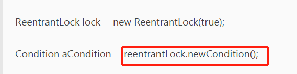

## JUC


#### 互斥锁、自旋锁、读写锁、悲观锁、乐观锁的应用场景

https://mp.weixin.qq.com/s/6QrQ0TZVqSQq26Rms0_mvA


> **sleep() VS wait()**

两者主要的区别：

1. sleep()方法是Thread的静态方法，而wait是Object实例方法
2. wait()方法必须要在同步方法或者同步块中调用，也就是必须已经获得对象锁。而sleep()方法没有这个限制可以在任何地方使用。另外，wait()方法会释放占有的对象锁，使得该线程进入等待池中，等待下一次获取资源。而sleep()方法只是会让出CPU并不会释放掉对象锁；
3. sleep()方法在休眠时间达到后，如果再次获得CPU时间片就会继续执行，而wait()方法必须等待Object.notift/Object.notifyAll通知后，才会离开等待池，并且再次获得CPU时间片才会继续执行。


### join

join方法可以看做是线程间协作的一种方式，很多时候，一个线程的输入可能非常依赖于另一个线程的输出，如果一个线程实例A执行了threadB.join()，其含义是：当前线程A会等待threadB线程终止后threadA才会继续执行。

### yield

public static native void yield()这是一个静态方法，一旦执行，它会是当前线程让出CPU

### sleep

public static native void sleep(long millis)方法显然是Thread的静态方法，很显然它是让当前线程按照指定的时间休眠，其休眠时间的精度取决于处理器的计时器和调度器。需要注意的是如果当前线程获得了锁，sleep方法并不会失去锁

### interrupted

中断可以理解为线程的一个标志位，它表示了一个运行中的线程是否被其他线程进行了中断操作。


### 进程与线程的区别总结

线程具有许多传统进程所具有的特征，故又称为轻型进程(Light—Weight Process)或进程元；而把传统的进程称为重型进程(Heavy—Weight Process)，它相当于只有一个线程的任务。在引入了线程的操作系统中，通常一个进程都有若干个线程，至少包含一个线程。

**根本区别**：**进程是操作系统资源分配的基本单位，而线程是处理器任务调度和执行的基本单位**

**资源开销**：每个进程都有独立的代码和数据空间（程序上下文），程序之间的切换会有较大的开销；线程可以看做轻量级的进程，同一类线程共享代码和数据空间，每个线程都有自己独立的运行栈和程序计数器（PC），线程之间切换的开销小。

**包含关系**：如果一个进程内有多个线程，则执行过程不是一条线的，而是多条线（线程）共同完成的；线程是进程的一部分，所以线程也被称为轻权进程或者轻量级进程。

**内存分配**：同一进程的线程共享本进程的地址空间和资源，而进程之间的地址空间和资源是相互独立的

**影响关系**：一个进程崩溃后，在保护模式下不会对其他进程产生影响，但是一个线程崩溃整个进程都死掉。所以多进程要比多线程健壮。

**执行过程**：每个独立的进程有程序运行的入口、顺序执行序列和程序出口。但是线程不能独立执行，必须依存在应用程序中，由应用程序提供多个线程执行控制，两者均可并发执行


## 从 JVM 角度说进程和线程之间的关系（重要）

### 图解进程和线程的关系

下图是 Java 内存区域，通过下图我们从 JVM 的角度来说一下线程和进程之间的关系。


从上图可以看出：一个进程中可以有多个线程，多个线程共享进程的**堆**和**方法区 (JDK1.8 之后的元空间)资源，但是每个线程有自己的程序计数器**、**虚拟机栈** 和 **本地方法栈**。

### 程序计数器为什么是私有的?

程序计数器主要有下面两个作用：

1. 字节码解释器通过改变程序计数器来依次读取指令，从而实现代码的流程控制，如：顺序执行、选择、循环、异常处理。
2. 在多线程的情况下，程序计数器用于记录当前线程执行的位置，从而当线程被切换回来的时候能够知道该线程上次运行到哪儿了。

需要注意的是，如果执行的是 native 方法，那么程序计数器记录的是 undefined 地址，只有执行的是 Java 代码时程序计数器记录的才是下一条指令的地址。

所以，程序计数器私有主要是为了**线程切换后能恢复到正确的执行位置**。

### 虚拟机栈和本地方法栈为什么是私有的?

- **虚拟机栈**：每个 Java 方法在执行的同时会创建一个栈帧用于存储局部变量表、操作数栈、常量池引用等信息。从方法调用直至执行完成的过程，就对应着一个栈帧在 Java 虚拟机栈中入栈和出栈的过程。
- **本地方法栈**：和虚拟机栈所发挥的作用非常相似，区别是： **虚拟机栈为虚拟机执行 Java 方法 （也就是字节码）服务，而本地方法栈则为虚拟机使用到的 Native 方法服务。** 在 HotSpot 虚拟机中和 Java 虚拟机栈合二为一。

所以，为了**保证线程中的局部变量不被别的线程访问到**，虚拟机栈和本地方法栈是线程私有的。

### 一句话简单了解堆和方法区

堆和方法区是所有线程共享的资源，其中堆是进程中最大的一块内存，主要用于存放新创建的对象 (所有对象都在这里分配内存)，方法区主要用于存放已被加载的类信息、常量、静态变量、即时编译器编译后的代码等数据。


### 创建线程的四种方式

- [继承Thread类]
- [实现Runnable接口]
- [使用Callable和Future创建线程]
- [使用Executor框架创建线程池]


## 守护线程和用户线程

**守护线程和用户线程简介:**

- **用户 (User) 线程**：运行在前台，执行具体的任务，如程序的主线程、连接网络的子线程等都是用户线程
- **守护 (Daemon) 线程**：运行在后台，为其他前台线程服务。也可以说守护线程是 JVM 中非守护线程的 **“佣人”**。一旦所有用户线程都结束运行，守护线程会随 JVM 一起结束工作

main 函数所在的线程就是一个用户线程啊，main 函数启动的同时在 JVM 内部同时还启动了好多守护线程，比如垃圾回收线程。

**那么守护线程和用户线程有什么区别呢？**

比较明显的区别之一是用户线程结束，JVM 退出，不管这个时候有没有守护线程运行。而守护线程不会影响 JVM 的退出。

**注意事项：**

1. `setDaemon(true)`必须在`start()`方法前执行，否则会抛出 `IllegalThreadStateException` 异常
2. 在守护线程中产生的新线程也是守护线程
3. 不是所有的任务都可以分配给守护线程来执行，比如读写操作或者计算逻辑
4. 守护 (Daemon) 线程中不能依靠 finally 块的内容来确保执行关闭或清理资源的逻辑。因为我们上面也说过了一旦所有用户线程都结束运行，守护线程会随 JVM 一起结束工作，所以守护 (Daemon) 线程中的 finally 语句块可能无法被执行。


## Java内存模型（JMM）的介绍

**什么是线程安全？**在<<深入理解Java虚拟机>>中看到的定义。原文如下：
当多个线程访问同一个对象时，如果不用考虑这些线程在运行时环境下的调度和交替运行，也不需要进行额外的同步，或者在调用方进行任何其他的协调操作，调用这个对象的行为都可以获取正确的结果，那这个对象是线程安全的。

关于定义的理解是一个仁者见仁智者见智的事情。出现线程安全的问题一般是因为**主内存和工作内存数据不一致性**和**重排序**导致的

在并发编程中主要需要解决两个问题：**1. 线程之间如何通信；2.线程之间如何完成同步**（这里的线程指的是并发执行的活动实体）。**通信是指线程之间以何种机制来交换信息，主要有两种：共享内存和消息传递**。**Java内存模型是共享内存的并发模型，线程之间主要通过读-写共享变量来完成隐式通信**。

### 哪些是共享变量

在Java程序中所有**实例域，静态域和数组元素**都是放在堆内存中（所有线程均可访问到，是可以共享的），而局部变量，方法定义参数和异常处理器参数不会在线程间共享。共享数据会出现线程安全的问题，而非共享数据不会出现线程安全的问题。


**volatile关键字**使得每次volatile变量都能够强制刷新到主存，从而对每个线程都是可见的。


## 内存模型三大特性

### 1. 原子性

**一个操作或者多个操作，要么全部执行并且执行的过程不会被任何因素打断，要么就都不执行。**

 **volatile并不能保证原子性**，如果让volatile保证原子性，必须符合以下两条规则：

1. **运算结果并不依赖于变量的当前值，或者能够确保只有一个线程修改变量的值；**
2. **变量不需要与其他的状态变量共同参与不变约束**

### 2. 可见性

##### 可见性是指当一个线程修改了共享变量的值，其他线程能够立即得知这个修改。

可见性指当一个线程修改了共享变量的值，其它线程能够立即得知这个修改。Java 内存模型是通过在变量修改后将新值同步回主内存，在变量读取前从主内存刷新变量值来实现可见性的。

主要有三种实现可见性的方式：

- volatile，通过在指令中添加**lock指令**，以实现内存可见性。
- synchronized，当线程获取锁时会从主内存中获取共享变量的最新值，释放锁的时候会将共享变量同步到主内存中。
- final，被 final 关键字修饰的字段在构造器中一旦初始化完成，并且没有发生 this 逃逸（其它线程通过 this 引用访问到初始化了一半的对象），那么其它线程就能看见 final 字段的值。

对前面的线程不安全示例中的 cnt 变量使用 volatile 修饰，不能解决线程不安全问题，因为 volatile 并不能保证操作的原子性。

### 3. 有序性  

 **一个线程中的所有操作必须按照程序的顺序来执行。**

有序性是指：在本线程内观察，所有操作都是有序的。在一个线程观察另一个线程，所有操作都是无序的，无序是因为发生了指令重排序。在 Java 内存模型中，允许编译器和处理器对指令进行重排序，**重排序过程不会影响到单线程程序的执行，却会影响到多线程并发执行的正确性。**

volatile 关键字通过添加内存屏障的方式来禁止指令重排，即重排序时不能把后面的指令放到内存屏障之前。

synchronized 关键字同样可以保证有序性，它保证每个时刻只有一个线程执行同步代码，相当于是让线程顺序执行同步代码。

### 总结

**synchronized：具有原子性，有序性和可见性**；

**volatile：具有有序性和可见性**；

**final：具有可见性**


### volatile的使用场景

1.状态标记量
使用volatile来修饰状态标记量，使得状态标记量对所有线程是实时可见的，从而保证所有线程都能实时获取到最新的状态标记量，进一步决定是否进行操作。例如常见的促销活动“秒杀”，可以用volatile来修饰“是否售罄”字段，从而保证在并发下，能正确的处理商品是否售罄。

2.双重检测机制实现单例

普通的双重检测机制在极端情况，由于指令重排序会出现问题，通过使用volatile来修饰instance，禁止指令重排序，从而可以正确的实现单例。


实际使用场景：

volatile。使用websocket的时候，管理员控制是否能发送通知。使用volatile去定义一个静态成员变量flag。

```java
private static volatile boolean flag = true;
```

发送socket通知的时候，会先判断这个flag是否为true，是的话就发送，不是的话就不发送。使用了volatile的可见性

总结：
每个线程有自己的工作内存，工作内存中的数据并不会实时刷新回主内存，因此在并发情况下，有可能线程A已经修改了成员变量k的值，但是线程B并不能读取到线程A修改后的值，这是因为线程A的工作内存还没有被刷新回主内存，导致线程B无法读取到最新的值。
在工作内存中，每次使用volatile修饰的变量前都必须先从主内存刷新最新的值，这保证了当前线程能看见其他线程对volatile修饰的变量所做的修改后的值。
在工作内存中，每次修改volatile修饰的变量后都必须立刻同步回主内存中，这保证了其他线程可以看到自己对volatile修饰的变量所做的修改。
volatile修饰的变量不会被指令重排序优化，保证代码的执行顺序与程序的顺序相同。
volatile保证可见性，不保证原子性，部分保证有序性（仅保证被volatile修饰的变量）。
指令重排序的目的是为了提高性能，指令重排序仅保证在单线程下不会改变最终的执行结果，但无法保证在多线程下的执行结果。
为了实现volatile的内存语义，编译器在生成字节码时，会在指令序列中插入内存屏障来禁止重排序。


### 什么是指令重排序？

重排序是指编译器和处理器为了优化程序性能而对指令序列进行重新排序的一种手段。

### 为什么要重排序？

为了提高性能。

### 重排序会导致不正确的结果吗？

重排序保证在单线程下不会改变执行结果，但在多线程下可能会改变执行结果。

### 怎么禁止重排序？

可以通过插入内存屏障指令来禁止特定类型的处理器重排序。例如本文将提到的volatile关键字就有这种功能。


### 认识线程死锁

**死锁是指两个或两个以上的进程（线程）在执行过程中，由于竞争资源或者由于彼此通信而造成的一种阻塞的现象，若无外力作用，它们都将无法推进下去。**此时称系统处于死锁状态或系统产生了死锁，这些永远在互相等待的进程（线程）称为死锁进程（线程）。

### 形成死锁的四个必要条件：

1. 互斥条件：线程(进程)对于所分配到的资源具有排它性，即一个资源只能被一个线程(进程)占用，直到被该线程(进程)释放
2. 请求与保持条件：一个线程(进程)因请求被占用资源而发生阻塞时，对已获得的资源保持不放。
3. 不剥夺条件：线程(进程)已获得的资源在末使用完之前不能被其他线程强行剥夺，只有自己使用完毕后才释放资源。
4. 循环等待条件：当发生死锁时，所等待的线程(进程)必定会形成一个环路（类似于死循环），造成永久阻塞

### 如何避免线程死锁

我们只要破坏产生死锁的四个条件中的其中一个就可以了。

**破坏互斥条件**

这个条件我们没有办法破坏，因为我们用锁本来就是想让他们互斥的（临界资源需要互斥访问）。

**破坏请求与保持条件**

一次性申请所有的资源。

**破坏不剥夺条件**

占用部分资源的线程进一步申请其他资源时，如果申请不到，可以主动释放它占有的资源。

**破坏循环等待条件**

靠按序申请资源来预防。按某一顺序申请资源，释放资源则反序释放。破坏循环等待条件。

## synchronized实现原理

在Java代码中，synchronized可使用在代码块和方法中，根据synchronized用的位置可以有这些使用场景：


如图，synchronized可以用在**方法**上也可以使用在**代码块**中，其中方法是实例方法和静态方法分别锁的是该类的实例对象和该类的对象。而使用在代码块中也可以分为三种，具体的可以看上面的表格。这里的需要注意的是：**如果锁的是类对象的话，尽管new多个实例对象，但他们仍然是属于同一个类依然会被锁住，即线程之间保证同步关系**。

**锁的重入性**，即**在同一锁程中，线程不需要再次获取同一把锁。synchronized先天具有重入性**。**每个对象拥有一个计数器，当线程获取该对象锁后，计数器就会加一，释放锁后就会将计数器减一**。

**任意一个对象都拥有自己的监视器，当这个对象由同步块或者这个对象的同步方法调用时，执行方法的线程必须先获取该对象的监视器才能进入同步块和同步方法**，如果没有获取到监视器的线程将会被阻塞在同步块和同步方法的入口处，进入到BLOCKED状态。


### CAS操作

#### 什么是CAS?

使用锁时，线程获取锁是一种**悲观锁策略**，即假设每一次执行临界区代码都会产生冲突，所以当前线程获取到锁的时候同时也会阻塞其他线程获取该锁。而CAS操作（又称为无锁操作）是一种**乐观锁策略**，它假设所有线程访问共享资源的时候不会出现冲突，既然不会出现冲突自然而然就不会阻塞其他线程的操作。因此，线程就不会出现阻塞停顿的状态。那么，如果出现冲突了怎么办？**无锁操作是使用CAS(compare and swap)又叫做比较交换来鉴别线程是否出现冲突，出现冲突就重试当前操作直到没有冲突为止**。

#### CAS的操作过程

CAS比较交换的过程可以通俗的理解为CAS(V,O,N)，包含三个值分别为：**V 内存地址存放的实际值；O 预期的值（旧值）；N 更新的新值**。当V和O相同时，也就是说旧值和内存中实际的值相同表明该值没有被其他线程更改过，即该旧值O就是目前来说最新的值了，自然而然可以将新值N赋值给V。反之，V和O不相同，表明该值已经被其他线程改过了则该旧值O不是最新版本的值了，所以不能将新值N赋给V，返回V即可。当多个线程使用CAS操作一个变量时，只有一个线程会成功，并成功更新，其余会失败。失败的线程会重新尝试，当然也可以选择挂起线程

#### CAS的问题

**1. ABA问题**
因为CAS会检查旧值有没有变化，这里存在这样一个有意思的问题。比如一个旧值A变为了成B，然后再变成A，刚好在做CAS时检查发现旧值并没有变化依然为A，但是实际上的确发生了变化。解决方案可以沿袭数据库中常用的乐观锁方式，添加一个版本号可以解决。原来的变化路径A->B->A就变成了1A->2B->3C。Java这么优秀的语言，当然在Java 1.5后的atomic包中提供了AtomicStampedReference来解决ABA问题，解决思路就是这样的。

**2. 自旋时间过长**

使用CAS时非阻塞同步，也就是说不会将线程挂起，会自旋（无非就是一个死循环）进行下一次尝试，如果这里自旋时间过长对性能是很大的消耗。如果JVM能支持处理器提供的pause指令，那么在效率上会有一定的提升。

**3. 只能保证一个共享变量的原子操作**

当对一个共享变量执行操作时CAS能保证其原子性，如果对多个共享变量进行操作，CAS就不能保证其原子性。有一个解决方案是利用对象整合多个共享变量，即一个类中的成员变量就是这几个共享变量。然后将这个对象做CAS操作就可以保证其原子性。atomic中提供了AtomicReference来保证引用对象之间的原子性。

### Java对象头

在同步的时候是获取对象的monitor，即获取到对象的锁。那么对象的锁怎么理解？无非就是类似对对象的一个标志，那么这个标志就是存放在Java对象的对象头。Java对象头里的Mark Word里默认的存放的对象的hashcode，对象分代年龄和锁标记位。32为JVM Mark Word默认存储结构为：


如图在Mark Word会默认存放hasdcode，年龄值以及锁标志位等信息。

Java SE 1.6中，锁一共有4种状态，级别从低到高依次是：**无锁状态、偏向锁状态、轻量级锁状态和重量级锁状态**，这几个状态会随着竞争情况逐渐升级。**锁可以升级但不能降级**，意味着偏向锁升级成轻量级锁后不能降级成偏向锁。**这种锁升级却不能降级的策略，目的是为了提高获得锁和释放锁的效率**。对象的MarkWord变化为下图：


### 偏向锁

偏向锁使用了一种**等到竞争出现才释放锁**的机制，所以当其他线程尝试竞争偏向锁时，持有偏向锁的线程才会释放锁。


如图，偏向锁的撤销，需要等待**全局安全点**（在这个时间点上没有正在执行的字节码）。它会首先暂停拥有偏向锁的线程，然后检查持有偏向锁的线程是否活着，如果线程不处于活动状态，则将对象头设置成无锁状态；如果线程仍然活着，拥有偏向锁的栈会被执行，遍历偏向对象的锁记录，栈中的锁记录和对象头的Mark Word**要么**重新偏向于其他线程，**要么**恢复到无锁或者标记对象不适合作为偏向锁，最后唤醒暂停的线程。

### 各种锁的比较


> **公平锁 VS 非公平锁**

1. 公平锁每次获取到锁为同步队列中的第一个节点，**保证请求资源时间上的绝对顺序**，而非公平锁有可能刚释放锁的线程下次继续获取该锁，则有可能导致其他线程永远无法获取到锁，**造成“饥饿”现象**。

2. 公平锁为了保证时间上的绝对顺序，需要频繁的上下文切换，而非公平锁会降低一定的上下文切换，降低性能开销。因此，ReentrantLock默认选择的是非公平锁，则是为了减少一部分上下文切换，**保证了系统更大的吞吐量**。

   

## [线程池提交任务时submit()和execute()的区别](https://www.cnblogs.com/sunweiye/p/11172028.html)

**他们的区别：**

1、execute()可以添加一个Runable任务,submit()不仅可以添加Runable任务还可以添加Callable任务。

2、execute()没有返回值,而submit()在添加Callable任务时会有返回值(再添加Runable任务时也有,不过无意义),可以通过返回值来查看线程执行的情况。

3、如果发生异常submit()可以通过捕获Future.get抛出的异常,而execute()会终止这个线程。


## 并发工具之CountDownLatch与CyclicBarrier

### 倒计时器CountDownLatch

先从CountDownLatch的构造方法看起：

```java
public CountDownLatch(int count)
```

构造方法会传入一个整型数N，之后调用CountDownLatch的`countDown`方法会对N减一，直到N减到0的时候，当前调用`await`方法的线程继续执行。

CountDownLatch的方法不是很多，将它们一个个列举出来：

1. await() throws InterruptedException：调用该方法的线程等到构造方法传入的N减到0的时候，才能继续往下执行；
2. **await(long timeout, TimeUnit unit)**：与上面的await方法功能一致，只不过这里有了时间限制，调用该方法的线程等到指定的timeout时间后，不管N是否减至为0，都会继续往下执行；
3. **countDown()**：使CountDownLatch初始值N减1；
4. long **getCount()**：获取当前CountDownLatch维护的值；

### 循环栅栏CyclicBarrier

CyclicBarrier也是一种多线程并发控制的实用工具，和CountDownLatch一样具有等待计数的功能，但是相比于CountDownLatch功能更加强大。

**CyclicBarrier在使用一次后，下面依然有效，可以继续当做计数器使用，这是与CountDownLatch的区别之一**。

CyclicBarrier的主要方法：

```java
//等到所有的线程都到达指定的临界点
await() throws InterruptedException, BrokenBarrierException 

//与上面的await方法功能基本一致，只不过这里有超时限制，阻塞等待直至到达超时时间为止
await(long timeout, TimeUnit unit) throws InterruptedException, 
BrokenBarrierException, TimeoutException 

//获取当前有多少个线程阻塞等待在临界点上
int getNumberWaiting()

//用于查询阻塞等待的线程是否被中断
boolean isBroken()
```


```java
//将屏障重置为初始状态。如果当前有线程正在临界点等待的话，将抛出BrokenBarrierException。
void reset()
```

另外需要注意的是，CyclicBarrier提供了这样的构造方法：

```java
public CyclicBarrier(int parties, Runnable barrierAction)
```

可以用来，当指定的线程都到达了指定的临界点的时，接下来执行的操作可以由barrierAction传入即可。

### CyclicBarrier与CountDownLatch的区别

1.**CyclicBarrier的计数器由自己控制，而CountDownLatch的计数器则由使用者来控制**，在CyclicBarrier中线程调用await方法不仅会将自己阻塞还会将计数器减1，而在CountDownLatch中线程调用await方法只是将自己阻塞而不会减少计数器的值。

2.**CountDownLatch只能拦截一轮，而CyclicBarrier可以实现循环拦截**。一般来说用CyclicBarrier可以实现CountDownLatch的功能，而反之则不能

3.调用CountDownLatch的countDown方法后，当前线程并不会阻塞，会继续往下执行；而调用CyclicBarrier的await方法，会阻塞当前线程，直到CyclicBarrier指定的线程全部都到达了指定点的时候，才能继续往下执行

4.**CyclicBarrier的构造方法可以传入barrierAction**，指定当所有线程都到达时执行的业务功能；

除此之外，CyclicBarrier还提供了：resert()、getNumberWaiting()、isBroken()等比较有用的方法


### 控制资源并发访问Semaphore

Semaphore可以理解为**信号量**，用于控制资源能够被并发访问的线程数量，以保证多个线程能够合理的使用特定资源。Semaphore就相当于一个许可证，线程需要先通过acquire方法获取该许可证，该线程才能继续往下执行，否则只能在该方法出阻塞等待。当执行完业务功能后，需要通过`release()`方法将许可证归还，以便其他线程能够获得许可证继续执行。

Semaphore可以用于做流量控制，特别是**公共资源有限的应用场景**，比如数据库连接。假如有多个线程读取数据后，需要将数据保存在数据库中，而可用的最大数据库连接只有10个，这时候就需要使用Semaphore来控制能够并发访问到数据库连接资源的线程个数最多只有10个。在限制资源使用的应用场景下，Semaphore是特别合适的。

主要方法：

```java
//获取许可，如果无法获取到，则阻塞等待直至能够获取为止

void acquire() throws InterruptedException 

//释放许可

void release()
```

另外，在Semaphore的构造方法中还支持指定是否具有公平性，默认的是非公平性，这样也是为了保证吞吐量。

**Semaphore用来做特殊资源的并发访问控制是相当合适的，如果有业务场景需要进行流量控制，可以优先考虑Semaphore。**


### 线程间交换数据的工具Exchanger

Exchanger是一个用于线程间协作的工具类，用于两个线程间交换数据。它提供了一个交换的同步点，在这个同步点两个线程能够交换数据。交换数据是通过exchange方法来实现的，如果一个线程先执行exchange方法，那么它会同步等待另一个线程也执行exchange方法，这个时候两个线程就都达到了同步点，两个线程就可以交换数据。

```java
//当一个线程执行该方法的时候，会等待另一个线程也执行该方法，因此两个线程就都达到了同步点
//将数据交换给另一个线程，同时返回获取的数据
V exchange(V x) throws InterruptedException
```

当两个线程都到达调用exchange方法的同步点的时候，两个线程就能交换彼此的数据。


###### notify、notifyAll会释放锁吗？跟wait有什么不同？

wait、notify和notifyAll都会释放锁，但是虽然都是释放锁，他们之间会有所不同，我们的 wait 方法执行后会立即释放锁，等待被唤醒的时候会重新持有锁。而notify和notifyAll也会释放锁，但是不是立即释放锁，执行完notify/notifyAll方法后会立即通知其它正在等待的线程，但不是立即释放锁，而是会等到其synchronized内中的代码全部执行完之后，才会释放锁。所以我们一般都时在我们synchronized内的最后才会调用 notify/notifyAll。


###### 为什么wait(),notify(),notifyAll()必须在同步方法/代码块中调用？以及为什么使用在while循环里？

**wait()在同步方法/代码块中调用原因：**

   wait()属于Object方法，调用之后会强制**释放当前对象锁**，所以在 ***调用某对象的wait()方法之前，当前线程必须先获得该对象的锁***。因此，wait()方法在同步方法/代码块中调用。

**notify()/notifyAll()在同步方法/代码块中调用原因：**

   调用wait()后，释放了对象锁，并将线程放入这个对象的等待队列（池），当**执行notify()/notifyAll()后，等待队列的线程就会竞争该对象锁**，最终获得锁的线程继续执行。所以调用notify()/notifyAll()前， ***必须先获取该对象的锁***。
   如果不加同步方法/代码块，线程获取不到该对象锁，然后等待队列的线程也就竞争不到该对象锁，这样调用notify()/notifyAll()是没有效果的，其他wait()了的线程并不能唤醒去执行。

**wait()为什么使用在while循环里：**

```java
synchronized (this) {
    if(queue.isEmpty()) {
    
       this.wait();
    }
   if(jedis.decr("key")<0){
   		//库存不足，异常。
   }
}
```

   队列中没有数据，A、B两个线程都进入if判断，然后都线程等待了；此时C线程往队列里推了一条订单数据，然后执行notify()/notifyAll()，A线程被唤醒了，库存减一；然后线程B也被唤醒了，库存也减一，就可能出现库存<0的情况。（也就是一条订单数据消费了两次）
   如果采用while循环，当A线程消费完，B线程继续while循环，就会继续等待，（不会出现重复消费的情况）。
   所以，**最好都在while循环里面调用。**


### 实现生产者消费者的三种方式

所谓生产者-消费者问题，实际上主要是包含了两类线程，一种是生产者线程用于生产数据，另一种是消费者线程用于消费数据，为了解耦生产者和消费者的关系，通常会有一个共享的数据区域，就像是一个仓库，生产者生产数据之后直接放置在共享数据区中，并不需要关心消费者的行为；而消费者只需要从共享数据区中去获取数据，就不再需要关心生产者的行为。但是，这个共享数据区域中应该具备这样的线程间并发协作的功能：

1. **如果共享数据区已满的话，阻塞生产者继续生产数据放置入内；**
2. **如果共享数据区为空的话，阻塞消费者继续消费数据；**

在实现生产者消费者问题时，可以采用三种方式：

- 使用Object的wait/notify的消息通知机制；

- 使用Lock的Condition的await/signal的消息通知机制；

- 使用BlockingQueue实现。

  #### wait/notify的消息通知机制

  #### 预备知识

  Java 中，可以通过配合调用 Object 对象的 wait() 方法和 notify()方法或 notifyAll() 方法来实现线程间的通信。在线程中调用 wait() 方法，将阻塞当前线程，直至等到其他线程调用了 notify() 方法或 notifyAll() 方法进行通知之后，当前线程才能从wait()方法出返回，继续执行下面的操作。

  1. **wait**

     该方法用来将当前线程置入休眠状态，直到接到通知或被中断为止。在调用 wait()之前，线程必须要获得该对象的对象监视器锁，即只能在**同步方法或同步块**中调用 wait()方法。调用wait()方法之后，当前线程会释放锁。如果调用wait()方法时，线程并未获取到锁的话，则会**抛出IllegalMonitorStateException**异常，这是以个RuntimeException。如果再次获取到锁的话，当前线程才能从wait()方法处成功返回。

  2. **notify**

     该方法也要在同步方法或同步块中调用，即在调用前，线程也必须要获得该对象的对象级别锁，如果调用 notify()时没有持有适当的锁，也会抛出 **IllegalMonitorStateException**。
     该方法任意从WAITTING状态的线程中挑选一个进行通知，使得调用wait()方法的线程从等待队列移入到同步队列中，等待有机会再一次获取到锁，从而使得调用wait()方法的线程能够从wait()方法处退出。调用notify后，当前线程不会马上释放该对象锁，要等到程序退出同步块后，当前线程才会释放锁。

  3. **notifyAll**
     该方法与 notify ()方法的工作方式相同，重要的一点差异是：
     notifyAll 使所有原来在该对象上 wait 的线程统统退出WAITTING状态，使得他们全部从等待队列中移入到同步队列中去，等待下一次能够有机会获取到对象监视器锁。

     

     #### wait/notify消息通知潜在的一些问题

     #### notify过早通知

     notify 通知的遗漏很容易理解，即 threadA 还没开始 wait 的时候，threadB 已经 notify 了，这样，threadB 通知是没有任何响应的，当 threadB 退出 synchronized 代码块后，threadA 再开始 wait，便会一直阻塞等待，直到被别的线程打断。

     **一个是WaitThread，另一个是NotifyThread。NotifyThread会先启动，先调用notify方法。然后WaitThread线程才启动，调用wait方法，但是由于通知过了，wait方法就无法再获取到相应的通知，因此WaitThread会一直在wait方法出阻塞，这种现象就是通知过早的现象**。针对这种现象，解决方法，一般是添加一个状态标志，让waitThread调用wait方法前先判断状态是否已经改变了没，如果通知早已发出的话，WaitThread就不再去wait。

     **总结：在使用线程的等待/通知机制时，一般都要配合一个 boolean 变量值（或者其他能够判断真假的条件），在 notify 之前改变该 boolean 变量的值，让 wait 返回后能够退出 while 循环（一般都要在 wait 方法外围加一层 while 循环，以防止早期通知），或在通知被遗漏后，不会被阻塞在 wait 方法处。这样便保证了程序的正确性**

     #### 等待wait的条件发生变化

     如果线程在等待时接受到了通知，但是之后等待的条件发生了变化，并没有再次对等待条件进行判断，也会导致程序出现错误。

     **总结：在使用线程的等待/通知机制时，一般都要在 while 循环中调用 wait()方法，因此配合使用一个 boolean 变量（或其他能判断真假的条件，如本文中的 list.isEmpty()），满足 while 循环的条件时，进入 while 循环，执行 wait()方法，不满足 while 循环的条件时，跳出循环，执行后面的代码。**

     #### 假死状态

     **现象**：如果是多消费者和多生产者情况，如果使用notify方法可能会出现“假死”的情况，即唤醒的是同类线程。

     **原因分析**：假设当前多个生产者线程会调用wait方法阻塞等待，当其中的生产者线程获取到对象锁之后使用notify通知处于WAITTING状态的线程，如果唤醒的仍然是生产者线程，就会造成所有的生产者线程都处于等待状态。

     **解决办法**：将notify方法替换成notifyAll方法，如果使用的是lock的话，就将signal方法替换成signalAll方法。

> ### 总结

在Object提供的消息通知机制应该遵循如下这些条件：

1. 永远在while循环中对条件进行判断而不是if语句中进行wait条件的判断；
2. 使用NotifyAll而不是使用notify。

```java
// The standard idiom for calling the wait method in Java 
synchronized (sharedObject) { 
    while (condition) { 
    sharedObject.wait(); 
        // (Releases lock, and reacquires on wakeup) 
    } 
    // do action based upon condition e.g. take or put into queue 
}
```

### 使用Lock中Condition的await/signalAll实现生产者-消费者

void await() throws InterruptedException：当前线程进入等待状态，如果其他线程调用condition的signal或者signalAll方法并且当前线程获取Lock从await方法返回，如果在等待状态中被中断会抛出被中断异常；

void signalAll()：与signal的区别在于能够唤醒所有等待在condition上的线程

也就是说wait—>await，notify---->Signal。

### 使用BlockingQueue实现生产者-消费者

BlockingQueue具有的特殊操作：

> **插入数据：**

1. **put**：当阻塞队列容量已经满时，往阻塞队列插入数据的线程会被阻塞，直至阻塞队列已经有空余的容量可供使用；
2. **offer(E e, long timeout, TimeUnit unit)**：若阻塞队列已经满时，同样会阻塞插入数据的线程，直至阻塞队列已经有空余的地方，与put方法不同的是，该方法会有一个超时时间，若超过当前给定的超时时间，插入数据的线程会退出；

> **删除数据**

1. **take**()：当阻塞队列为空时，获取队头数据的线程会被阻塞；

2. **poll(long timeout, TimeUnit unit)**：当阻塞队列为空时，获取数据的线程会被阻塞，另外，如果被阻塞的线程超过了给定的时长，该线程会退出

   

   使用BlockingQueue来实现生产者-消费者很简洁，这正是利用了BlockingQueue插入和获取数据附加阻塞操作的特性。


## 并发容器之ThreadLocal

在多线程编程中通常解决线程安全的问题我们会利用synchronzed或者lock控制线程对临界区资源的同步顺序从而解决线程安全的问题，但是这种加锁的方式会让未获取到锁的线程进行阻塞等待，很显然这种方式的时间效率并不是很好。**线程安全问题的核心在于多个线程会对同一个临界区共享资源进行操作**，那么，如果每个线程都使用自己的“共享资源”，各自使用各自的，又互相不影响到彼此即让多个线程间达到隔离的状态，这样就不会出现线程安全的问题。事实上，这就是一种“**空间换时间**”的方案，每个线程都会都拥有自己的“共享资源”无疑内存会大很多，但是由于不需要同步也就减少了线程可能存在的阻塞等待的情况从而提高的时间效率。

虽然ThreadLocal并不在java.util.concurrent包中而在java.lang包中，但我更倾向于把它当作是一种并发容器（虽然真正存放数据的是ThreadLocalMap）进行归类。从**ThreadLocal这个类名可以顾名思义的进行理解，表示线程的“本地变量”，即每个线程都拥有该变量副本，达到人手一份的效果，各用各的这样就可以避免共享资源的竞争**。

### ThreadLocal的实现原理

> **void set(T value)**

**set方法设置在当前线程中threadLocal变量的值**

通过源码我们知道value是存放在了ThreadLocalMap里了，当前先把它理解为一个普普通通的map即可，也就是说，**数据value是真正的存放在了ThreadLocalMap这个容器中了，并且是以当前threadLocal实例为key**。

也就是说**ThreadLocalMap的引用是作为Thread的一个成员变量，被Thread进行维护的**。回过头再来看看set方法，当map为Null的时候会通过`createMap(t，value)`方法：

```java
void createMap(Thread t, T firstValue) {
    t.threadLocals = new ThreadLocalMap(this, firstValue);
}
```

该方法就是**new一个ThreadLocalMap实例对象，然后同样以当前threadLocal实例作为key,值为value存放到threadLocalMap中，然后将当前线程对象的threadLocals赋值为threadLocalMap**。

set方法进行总结一下：
**通过当前线程对象thread获取该thread所维护的threadLocalMap,若threadLocalMap不为null,则以threadLocal实例为key,值为value的键值对存入threadLocalMap,若threadLocalMap为null的话，就新建threadLocalMap然后在以threadLocal为键，值为value的键值对存入即可**

> T get()

**get方法是获取当前线程中threadLocal变量的值**

get方法来总结一下：

**通过当前线程thread实例获取到它所维护的threadLocalMap，然后以当前threadLocal实例为key获取该map中的键值对（Entry），若Entry不为null则返回Entry的value。如果获取threadLocalMap为null或者Entry为null的话，就以当前threadLocal为Key，value为null存入map后，并返回null**

### ThreadLocalMap

ThreadLocalMap是threadLocal一个静态内部类，和大多数容器一样内部维护了一个数组，同样的threadLocalMap内部维护了一个Entry类型的table数组。Entry是一个以ThreadLocal为key，Object为value的键值对，另外需要注意的是这里的**threadLocal是弱引用，因为Entry继承了WeakReference，在Entry的构造方法中，调用了super(k)方法就会将threadLocal实例包装成一个WeakReferenece**。到这里我们可以用一个图来理解下thread，threadLocal，threadLocalMap，Entry之间的关系：


注意上图中的实线表示强引用，虚线表示弱引用。如图所示，每个线程实例中可以通过threadLocals获取到threadLocalMap，而threadLocalMap实际上就是一个以threadLocal实例为key，任意对象为value的Entry数组。当我们为threadLocal变量赋值，实际上就是以当前threadLocal实例为key，值为value的Entry往这个threadLocalMap中存放。需要注意的是**Entry中的key是弱引用，当threadLocal外部强引用被置为null(`threadLocalInstance=null`),那么系统 GC 的时候，根据可达性分析，这个threadLocal实例就没有任何一条链路能够引用到它，这个ThreadLocal势必会被回收，这样一来，ThreadLocalMap中就会出现key为null的Entry，就没有办法访问这些key为null的Entry的value，如果当前线程再迟迟不结束的话，这些key为null的Entry的value就会一直存在一条强引用链：Thread Ref -> Thread -> ThreaLocalMap -> Entry -> value永远无法回收，造成内存泄漏。**当然，如果当前thread运行结束，threadLocal，threadLocalMap,Entry没有引用链可达，在垃圾回收的时候都会被系统进行回收。在实际开发中，会使用线程池去维护线程的创建和复用，比如固定大小的线程池，线程为了复用是不会主动结束的，所以，threadLocal的内存泄漏问题，是应该值得我们思考和注意的问题。

为了解决散列冲突，主要采用下面两种方式： **分离链表法**（separate chaining）和**开放定址法**（open addressing）

- 分离链表法

分散链表法使用链表解决冲突，将散列值相同的元素都保存到一个链表中。当查询的时候，首先找到元素所在的链表，然后遍历链表查找对应的元素，典型实现为hashMap，concurrentHashMap的拉链法。下面是一个示意图：


- 开放定址法

开放定址法不会创建链表，当关键字散列到的数组单元已经被另外一个关键字占用的时候，就会尝试在数组中寻找其他的单元，直到找到一个空的单元。探测数组空单元的方式有很多，这里介绍一种最简单的 – 线性探测法。线性探测法就是从冲突的数组单元开始，依次往后搜索空单元，如果到数组尾部，再从头开始搜索（环形查找）。如下图所示：


**拉链法与开放定址法比较**

与开放定址法相比，拉链法有如下几个优点：

1. 拉链法处理冲突简单，且无堆积现象，即非同义词决不会发生冲突，因此平均查找长度较短；
2. 由于拉链法中各链表上的结点空间是动态申请的，故它更适合于造表前无法确定表长的情况；
3. 开放定址法为减少冲突，要求装填因子α较小，故当结点规模较大时会浪费很多空间。而拉链法中可取α≥1，且结点较大时，拉链法中增加的指针域可忽略不计，因此节省空间；
4. 在用拉链法构造的散列表中，删除结点的操作易于实现。只要简单地删去链表上相应的结点即可。而对开放地址法构造的散列表，删除结点不能简单地将被删结 点的空间置为空，否则将截断在它之后填人散列表的同义词结点的查找路径。这是因为各种开放地址法中，空地址单元（即开放地址）都是查找失败的条件。因此在用开放地址法处理冲突的散列表上执行删除操作，只能在被删结点上做删除标记，而不能真正删除结点。

拉链法的缺点：指针需要额外的空间，故当结点规模较小时，开放定址法较为节省空间，而若将节省的指针空间用来扩大散列表的规模，可使装填因子变小，这又减少了开放定址法中的冲突，从而提高平均查找速度。

**ThreadLocalMap 中使用开放地址法来处理散列冲突**，而 HashMap 中使用的分离链表法。之所以采用不同的方式主要是因为：**在 ThreadLocalMap 中的散列值分散的十分均匀，很少会出现冲突。并且 ThreadLocalMap 经常需要清除无用的对象，使用纯数组更加方便。**

1.threadLocal的hashcode?

threadLocal实例的hashCode是通过nextHashCode()方法实现的，该方法实际上总是用一个AtomicInteger加上0x61c88647来实现的。0x61c88647这个数是有特殊意义的，它能够保证hash表的每个散列桶能够均匀的分布，这是`Fibonacci Hashing`（斐波那契哈希）。也正是能够均匀分布，所以threadLocal选择使用开放地址法来解决hash冲突的问题。

2.怎样确定新值插入到哈希表中的位置？

该操作源码为：`key.threadLocalHashCode & (len-1)`，同hashMap和ConcurrentHashMap等容器的方式一样，利用当前key(即threadLocal实例)的hashcode与哈希表大小相与，因为哈希表大小总是为2的幂次方，所以相与等同于一个取模的过程，这样就可以通过Key分配到具体的哈希桶中去。而至于为什么取模要通过位与运算的原因就是位运算的执行效率远远高于了取模运算。

3.怎样解决hash冲突？

源码中通过`nextIndex(i, len)`方法解决hash冲突的问题，该方法为`((i + 1 < len) ? i + 1 : 0);`，也就是不断往后线性探测，当到哈希表末尾的时候再从0开始，成环形。

4.怎样解决“脏”Entry？

在分析threadLocal,threadLocalMap以及Entry的关系的时候，我们已经知道使用threadLocal有可能存在内存泄漏（对象创建出来后，在之后的逻辑一直没有使用该对象，但是垃圾回收器无法回收这个部分的内存），在源码中针对这种key为null的Entry称之为“stale entry”，直译为不新鲜的entry，我把它理解为“脏entry”，自然而然，Josh Bloch and Doug Lea大师考虑到了这种情况,在set方法的for循环中寻找和当前Key相同的可覆盖entry的过程中通过**replaceStaleEntry**方法解决脏entry的问题。如果当前table[i]为null的话，直接插入新entry后也会通过**cleanSomeSlots**来解决脏entry的问题

5.如何进行扩容？

> threshold的确定

根据源码可知，在第一次为threadLocal进行赋值的时候会创建初始大小为16的threadLocalMap,并且通过setThreshold方法设置threshold，其值为当前哈希数组长度乘以（2/3），也就是说加载因子为2/3(**加载因子是衡量哈希表密集程度的一个参数，如果加载因子越大的话，说明哈希表被装载的越多，出现hash冲突的可能性越大，反之，则被装载的越少，出现hash冲突的可能性越小。同时如果过小，很显然内存使用率不高，该值取值应该考虑到内存使用率和hash冲突概率的一个平衡，如hashMap,concurrentHashMap的加载因子都为0.75**)。这里**threadLocalMap初始大小为16**，**加载因子为2/3**，所以哈希表可用大小为：16*2/3=10，即哈希表可用容量为10。

新建一个大小为原来数组长度的两倍的数组，然后遍历旧数组中的entry并将其插入到新的hash数组中，主要注意的是，**在扩容的过程中针对脏entry的话会令value为null，以便能够被垃圾回收器能够回收，解决隐藏的内存泄漏的问题**。

**为了解决潜在的内存泄漏的问题，在set，resize,getEntry这些地方都会对这些脏entry进行处理，可见为了尽可能解决这个问题几乎无时无刻都在做出努力**。

### ThreadLocal的使用场景

**ThreadLocal 不是用来解决共享对象的多线程访问问题的**，数据实质上是放在每个thread实例引用的threadLocalMap，也就是说**每个不同的线程都拥有专属于自己的数据容器（threadLocalMap），彼此不影响**。因此threadLocal只适用于 **共享对象会造成线程安全** 的业务场景。

threadLocal有可能存在内存泄漏，在使用完之后，最好使用remove方法将这个变量移除，就像在使用数据库连接一样，及时关闭连接。

**Entry节点的K并不是线程，而是ThreadLocal对象实例，V是这个ThreadLocal对象实例的值。并且这个ThreadLocalMap并不是ThreadLocal在维护，而是Thread在维护，即每个线程都有一个ThreadLocalMap**。

### 为什么使用弱引用？

从文章开头通过threadLocal,threadLocalMap,entry的引用关系看起来threadLocal存在内存泄漏的问题似乎是因为threadLocal是被弱引用修饰的。那为什么要使用弱引用呢？

> 如果使用强引用

假设threadLocal使用的是强引用，在业务代码中执行`threadLocalInstance==null`操作，以清理掉threadLocal实例的目的，但是因为threadLocalMap的Entry强引用threadLocal，因此**在gc的时候进行可达性分析，threadLocal依然可达，对threadLocal并不会进行垃圾回收**，这样就无法真正达到业务逻辑的目的，出现逻辑错误

> 如果使用弱引用

假设Entry弱引用threadLocal，尽管会出现内存泄漏的问题，但是在threadLocal的生命周期里（set,getEntry,remove）里，都会针对key为null的脏entry进行处理。

从以上的分析可以看出，使用弱引用的话在threadLocal生命周期里会尽可能的保证不出现内存泄漏的问题，达到安全的状态

### ThreadLocal最佳实践

我们可以完全理解threadLocal内存泄漏的前因后果，那么实践中我们应该怎么做？

1. 每次使用完ThreadLocal，都调用它的remove()方法，清除数据。
2. 在使用线程池的情况下，没有及时清理ThreadLocal，不仅是内存泄漏的问题，更严重的是可能导致业务逻辑出现问题。所以，使用ThreadLocal就跟加锁完要解锁一样，用完就清理。


### CopyOnWriteArrayList

CopyOnWriteArrayList容器可以保证线程安全，保证读写之间在任何时候都不会被阻塞，CopyOnWriteArrayList也被广泛应用于很多业务场景之中，适用于**读多写少**的场景。

#### COW的设计思想

回到上面所说的，如果简单的使用读写锁的话，在写锁被获取之后，读写线程被阻塞，只有当写锁被释放后读线程才有机会获取到锁从而读到最新的数据，站在**读线程的角度来看，即读线程任何时候都是获取到最新的数据，满足数据实时性**。既然我们说到要进行优化，必然有trade-off，我们就可以**牺牲数据实时性满足数据的最终一致性即可**。而**CopyOnWriteArrayList就是通过Copy-On-Write(COW)，即写时复制的思想来通过延时更新的策略来实现数据的最终一致性，并且能够保证读线程间不阻塞**。

COW通俗的理解是**当我们往一个容器添加元素的时候，不直接往当前容器添加，而是先将当前容器进行Copy，复制出一个新的容器，然后新的容器里添加元素，添加完元素之后，再将原容器的引用指向新的容器**。对CopyOnWrite容器进行并发的读的时候，不需要加锁，因为当前容器不会添加任何元素。所以CopyOnWrite容器也是**一种读写分离的思想**，**延时更新的策略是通过在写的时候针对的是不同的数据容器来实现的，放弃数据实时性达到数据的最终一致性**。

实际上CopyOnWriteArrayList内部维护的就是一个数组

```java
/** The array, accessed only via getArray/setArray. */
private transient volatile Object[] array;
```

并且该数组引用是被volatile修饰，注意这里**仅仅是修饰的是数组引用**。关于volatile很重要的一条性质是它能够够保证可见性，

#### 总结

我们知道COW和读写锁都是通过读写分离的思想实现的，但两者还是有些不同，可以进行比较：

> **COW vs 读写锁**

相同点：1. 两者都是通过读写分离的思想实现；2.读线程间是互不阻塞的

不同点：**对读线程而言，为了实现数据实时性，在写锁被获取后，读线程会等待或者当读锁被获取后，写线程会等待，从而解决“脏读”等问题。也就是说如果使用读写锁依然会出现读线程阻塞等待的情况。而COW则完全放开了牺牲数据实时性而保证数据最终一致性，即读线程对数据的更新是延时感知的，因此读线程不会存在等待的情况**。

这里还有这样一个问题： **为什么需要复制呢？ 如果将array 数组设定为volitile的， 对volatile变量写happens-before读，读线程不是能够感知到volatile变量的变化**。

原因是，这里volatile的修饰的**仅仅**只是**数组引用**，**数组中的元素的修改是不能保证可见性的**。因此COW采用的是新旧两个数据容器，通过将数组引用指向新的数组。这也是为什么concurrentHashMap只具有弱一致性的原因。

> **COW的缺点**

CopyOnWrite容器有很多优点，但是同时也存在两个问题，即内存占用问题和数据一致性问题。所以在开发的时候需要注意一下。

1. **内存占用问题**：因为CopyOnWrite的写时复制机制，所以在进行写操作的时候，内存里会同时驻扎两个对 象的内存，旧的对象和新写入的对象（注意:在复制的时候只是复制容器里的引用，只是在写的时候会创建新对 象添加到新容器里，而旧容器的对象还在使用，所以有两份对象内存）。如果这些对象占用的内存比较大，比 如说200M左右，那么再写入100M数据进去，内存就会占用300M，那么这个时候很有可能造成频繁的minor GC和major GC。
2. **数据一致性问题**：CopyOnWrite容器只能保证数据的最终一致性，不能保证数据的实时一致性。所以如果你希望写入的的数据，马上能读到，请不要使用CopyOnWrite容器。

### LockSupport

> **阻塞线程**

1. void park()：阻塞当前线程，如果调用unpark方法或者当前线程被中断，从能从park()方法中返回

> **唤醒线程**

1. void unpark(Thread thread)：唤醒处于阻塞状态的指定线程

**synchronzed致使线程阻塞，线程会进入到BLOCKED状态，而调用LockSupport方法阻塞线程会致使线程进入到WAITING状态**

**LockSupport.unpark(thread)可以指定线程对象唤醒指定的线程**。


重入锁使得同一个线程可以对同一把锁，在不释放的前提下，反复加锁，而不会导致线程卡死。

对于重入锁，我们需要特别知道几点：

1. 对于同一个线程，重入锁允许你反复获得通一把锁，但是，申请和释放锁的次数必须一致。
2. 默认情况下，重入锁是非公平的，公平的重入锁性能差于非公平锁
3. 重入锁的内部实现是基于CAS操作的。
4. 重入锁的伴生对象Condition提供了await()和singal()的功能，可以用于线程间消息通信。


#### CountDownLatch的两种常用场景

##### **场景1 让多个线程等待：模拟并发，让并发线程一起执行**

##### **场景2 让单个线程等待：多个线程(任务)完成后，进行汇总合并**


LinkedList类实现了Queue接口，因此我们可以把LinkedList当成Queue来用。


是线程安全的


sleep/yield/join wait/notify/notifyAll

前三个是Thread方法，后三个是Object方法

Yield直接运行到就绪，sleep和wait会阻塞


Join强行插队，yield让出当前线程


A,B,C三个线程,B先唤醒A线程还没操作完剩下的，C又使得A线程进入等到状态。此时对于A来说就是丢失唤醒。加了syn等B操作完C才能让A等待，此时才不会出现


Semaphore信号量，主要用于限流


JAVA本身保证了先⾏发⽣原则，happens-before，使得指令重拍不会乱排序


线程C不会排到A,B之间


协同式是线程一个一个来，一个个处理

抢占式线程调度不是来个线程处理一个，而是cpu决定先执行哪一个


公平锁

获取lock失败，进入等待队列


 

非公平锁一进来就去竞争锁了


 


 


https://www.jianshu.com/p/4b45f9a1f7d2


读写锁


 

锁升级，大家都可以对共享数据进行修改，会导致数据乱了，所以不支持锁升级




Lock的condition和syn的wait区别是wait只能随机唤醒一个线程而condition可以new出多个实例分别赋予到线程中，方便控制,唤醒特定的线程

他们的使用基本一样

https://www.jianshu.com/p/b476df2f6d08