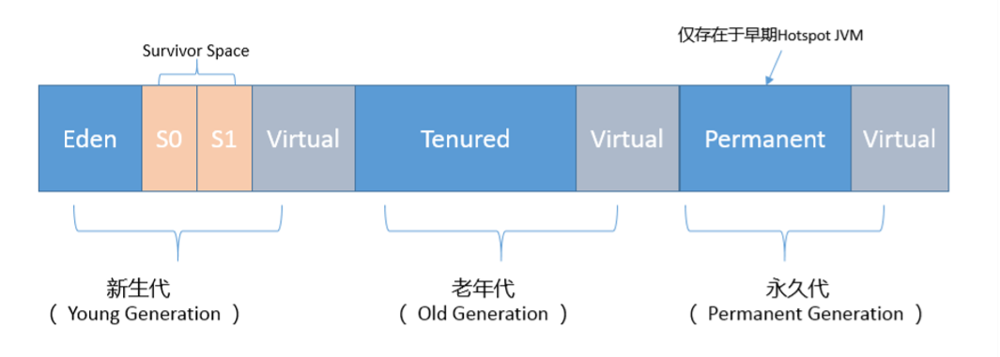
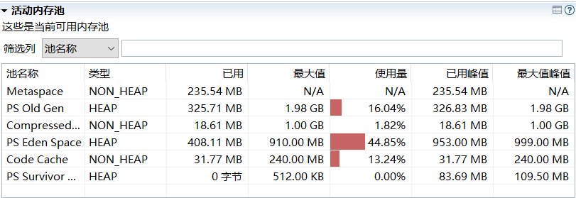
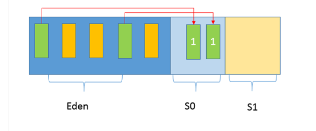
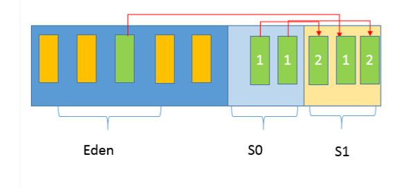
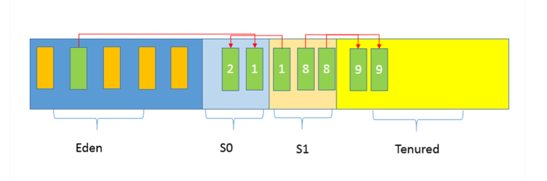
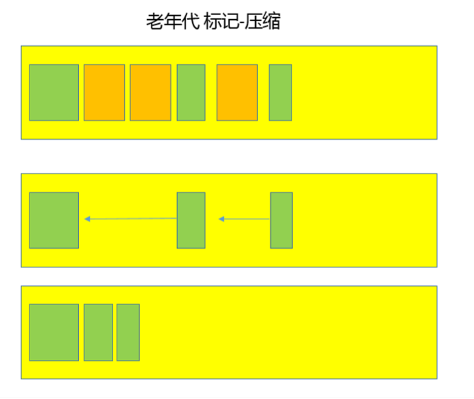
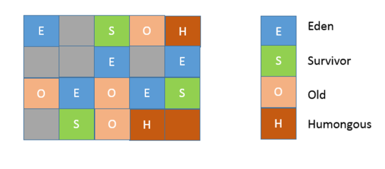
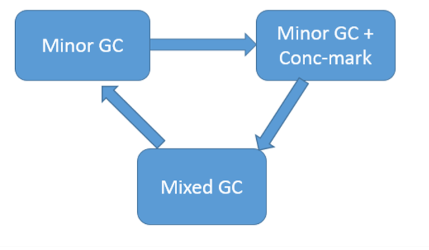
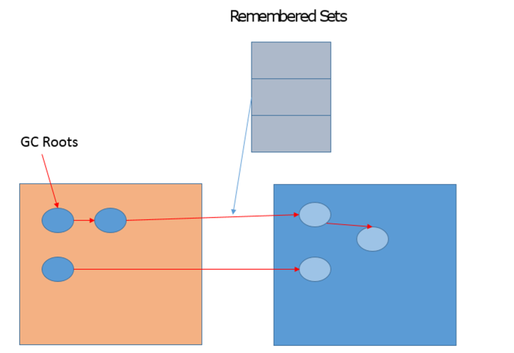

# JVM


## 运行时数据区域

Java虚拟机在执行Java程序的过程中会把它管理的内存划分为若干个不同的数据区域。这些区域都有各自的用途，以及创建和销毁的时间，有的区域随着虚拟机进程的启动而存在，有些区域则依赖用户线程的启动和结束而建立和销毁。根据《Java虚拟机规范（Java SE 7版）》的规定，Java虚拟机所管理的内存将会包括以下几个运行时数据区域：**程序计数器，Java虚拟机栈，本地方法栈，Java堆，方法区**。

下图为各个区域以及进一步细化图：


### 程序计数器

**程序计数器（Program Counter Register）是一块较小的内存空间，可以看做当前线程所执行的字节码的行号指示器。字节码解释器工作时就是通过改变这个计数器的值来选取下一条需要执行的字节码指令，分支、循环、跳转、异常处理、线程恢复等基础功能都需要依赖这个计数器来完成。**

由于Java虚拟机的多线程是通过线程轮流切换并分配处理器执行时间的方式来实现的，在任何一个确定的时刻，一个处理器都只会执行一条线程中的指令。因此，为了线程切换后能恢复到正确的执行位置，每条线程都需要有一个独立的程序计数器，每个线程之间计数器互不影响，独立存储。

备注：

（a）如果线程正在执行的是一个Java方法，这个计数器记录的是正在执行的虚拟机字节码指令的地址；如果正在执行的是Native方法，这个计数器的值则为空。

（b）此内存区域是唯一在Java虚拟机规范中没有规定任何OOM情况的区域。

### **Java虚拟机栈**

Java Virtual Machine Stacks，也是线程私有的，它的生命周期与线程相同。

虚拟机栈描述的是**Java方法执行的内存模型（非native方法）**。

每个方法在执行的同时都会创建一个栈帧用于存储局部变量表，操作数栈，动态链接，方法出口等信息。

每一个方法从调用直至执行完成的过程，就对应着一个栈帧在虚拟机栈中入栈到出栈的过程，当方法被调用则入栈，一旦完成调用则出栈。所有的栈帧都出栈后，线程就结束了。

局部变量表存放了编译器可知的各种**基本数据类型、对象引用、returnAddress类型。**局部变量表所需的内存空间在编译器完成分配。当进入一个方法时，这个方法需要在帧中分配多大的局部变量空间是完全确定的，在方法运行期间不会改变局部变量表的大小。

**基本类型**：boolean, byte, char, short, int, float, long, double，其中long和double占用2个局部变量空间slot其余的占用1个；

**对象引用**：reference类型，它不等同于对象本身，可能是一个指向对象起始地址的引用指针，也可能是指向一个代表对象的句柄或其他与此对象相关的位置；

**returnAddress类型**：指向了一条字节码指令的地址；

在Java虚拟机规范中，对这个区域规定了两种异常：线程请求的栈深度大于虚拟机所允许的深度，抛出StackOverflowError异常；如果虚拟机栈可以动态扩展（目前大部分的Java虚拟机都可动态扩展，只不过Java虚拟机规范中也允许固定长度的虚拟机栈），如果扩展时无法申请到足够的内存，抛出OutOfMemoryError异常。

### **本地方法栈**

Native Method Stack与虚拟机栈的作用非常相似，区别是：虚拟机栈为虚拟机执行Java方法（也就是字节码）服务，而本地方法栈则为虚拟机使用到的Native方法。

备注：HotSpot直接把本地方法栈和虚拟机栈合二为一。本地方法栈区域也会抛出StackOverflowError和OutOfMemoryError异常。

### **Java堆**

Java Heap是Java虚拟机所管理的内存中最大的一块。Java堆是被所有线程共享的一块内存区域，在虚拟机启动时创建。此区域的唯一目的就是存放对象实例（Java虚拟机规范中的描述时：所有的对象实例以及数组都要在堆上分配）。

Java堆是GC的主要区域，因此很多时候也被称为GC堆。

**从内存分配的角度来看**，线程共享的Java堆中可能划分出多个线程私有的分配缓冲区（Thread Local Allocation Buffer, TLAB）

**从内存回收的角度来看**，由于现在收集器基本都采用分代收集算法，所以Java堆中还可以细分为：新生代和老年代，在细致一点的有Eden空间，From Survivor空间，To Survivor空间等。

备注：有OOM异常

### **方法区**

主要用于存储已被虚拟机加载的类信息，常量，静态变量，即时编译器编译后的代码等数据。

Method Area是各个线程共享内存区域，用于存储已被虚拟机加载的类信息，常量，静态变量，即时编译器编译后的代码等数据。这个区域的内存回收目标主要是针对常量池的回收和对类型的卸载。

在HtoSpot虚拟机中该区域叫永久代，即方法区是虚拟机规范，而永久代是HotSpot实现的方法区。

### 直接内存

它不属于运行时数据区的一部分，也不是Java虚拟机规范中定义的内存区域，但是这部分频繁使用也可能导致OutOfMemoryError异常。**NIO可以使用Native函数库直接分配堆外内存空间**。


## 对象的访问定位

Java程序需要通过 JVM 栈上的引用访问堆中的具体对象。**对象的访问方式取决于 JVM 虚拟机的实现。目前主流的访问方式有 句柄 和 直接指针 两种方式。**

**指针**： 指向对象，代表一个对象在内存中的起始地址。

**句柄**： 可以理解为**指向指针的指针，维护着对象的指针**。句柄不直接指向对象，而是指向对象的指针（句柄不发生变化，指向固定内存地址），再由对象的指针指向对象的真实内存地址。

句柄访问
Java堆中划分出一块内存来作为句柄池，引用中存储对象的句柄地址，而句柄中包含了对象实例数据与对象类型数据各自的具体地址信息，具体构造如下图所示：


优势：**引用中存储的是稳定的句柄地址，在对象被移动（垃圾收集时移动对象是非常普遍的行为）时只会改变句柄中的实例数据指针，而引用本身不需要修改。**

直接指针
如果使用直接指针访问，引用 中存储的直接就是对象地址，那么Java堆对象内部的布局中就必须考虑如何放置访问类型数据的相关信息。


优势：**速度更快，节省了一次指针定位的时间开销。由于对象的访问在Java中非常频繁，因此这类开销积少成多后也是非常可观的执行成本。HotSpot 中采用的就是这种方式。**


## 对象的创建

说到对象的创建，首先让我们看看 Java 中提供的几种对象创建方式：

| Header                             | 解释             |
| ---------------------------------- | ---------------- |
| 使用new关键字                      | 调用了构造函数   |
| 使用Class的newInstance方法         | 调用了构造函数   |
| 使用Constructor类的newInstance方法 | 调用了构造函数   |
| 使用clone方法                      | 没有调用构造函数 |
| 使用反序列化                       | 没有调用构造函数 |

下面是对象创建的主要流程:


虚拟机遇到一条new指令时，先检查常量池是否已经加载相应的类，如果没有，必须先执行相应的类加载。类加载通过后，接下来分配内存。若Java堆中内存是绝对规整的，使用“指针碰撞“方式分配内存；如果不是规整的，就从空闲列表中分配，叫做”空闲列表“方式。划分内存时还需要考虑一个问题-并发，也有两种方式: CAS同步处理，或者本地线程分配缓冲(Thread Local Allocation Buffer, TLAB)。然后内存空间初始化操作，接着是做一些必要的对象设置(元信息、哈希码…)，最后执行<init>方法。

**1.判断对象对应的类是否加载、链接、初始化**
虚拟机接收到一条new指令时，首先会去检查这个指定的参数是否能在常量池中定位到一个类的符号引用，并且检查这个符号引用代表的类是否已被类加载器加载、链接和初始化过。如果没有则先执行相应的类加载过程。


**2.为对象分配内存**
类加载完成后，接着会在Java堆中划分一块内存分配给对象。内存分配根据Java堆是否规整，有两种方式：

指针碰撞：如果Java堆的内存是规整，即所有用过的内存放在一边，而空闲的的放在另一边。分配内存时将位于中间的指针指示器向空闲的内存移动一段与对象大小相等的距离，这样便完成分配内存工作。
空闲列表：如果Java堆的内存不是规整的，则需要由虚拟机维护一个列表来记录那些内存是可用的，这样在分配的时候可以从列表中查询到足够大的内存分配给对象，并在分配后更新列表记录。
选择哪种分配方式是由 Java 堆是否规整来决定的，而 Java 堆是否规整又由所采用的垃圾收集器是否带有压缩整理功能决定。

**3.处理并发安全问题**
对象的创建在虚拟机中是一个非常频繁的行为，哪怕只是修改一个指针所指向的位置，在并发情况下也是不安全的，可能出现正在给对象 A 分配内存，指针还没来得及修改，对象 B 又同时使用了原来的指针来分配内存的情况。解决这个问题有两种方案：

对分配内存空间的动作进行同步处理（采用 CAS + 失败重试来保障更新操作的原子性）；
把内存分配的动作按照线程划分在不同的空间之中进行，即每个线程在 Java 堆中预先分配一小块内存，称为本地线程分配缓冲（Thread Local Allocation Buffer, TLAB）。哪个线程要分配内存，就在哪个线程的 TLAB 上分配。只有 TLAB 用完并分配新的 TLAB 时，才需要同步锁。通过-XX:+/-UserTLAB参数来设定虚拟机是否使用TLAB。


**4.初始化分配到的内存空间**
内存分配完后，虚拟机要将分配到的内存空间初始化为零值（不包括对象头）。如果使用了 TLAB，这一步会提前到 TLAB 分配时进行。这一步保证了对象的实例字段在 Java 代码中可以不赋初始值就直接使用。


**5.设置对象的对象头**
接下来设置对象头（Object Header）信息，包括对象的所属类、对象的HashCode和对象的GC分代年龄等数据存储在对象的对象头中。

**6.执行init方法进行初始化**
执行init方法，初始化对象的成员变量、调用类的构造方法，这样一个对象就被创建了出来。


## HotSpot虚拟机

####  内存划分

根据JVM规范，内存可分为：**虚拟机栈，本地方法栈，堆，方法区，程序计数器**五个部分。

但是各种虚拟机HotSpot，JRockit实现却与JVM不尽相同。

HotSpot主要有：**虚拟机栈，堆，程序计数器，Metaspace，直接内存**四个部分。


其中，元空间（Metaspace）的本质和永久代类似，都是对JVM规范中方法区的实现。

不过元空间与永久代之间最大的区别在于：元空间并不在虚拟机中，而是使用本地内存。

因此，默认情况下，元空间的大小仅受本地内存限制，但可以通过以下参数来指定元空间的大小：

-XX:MetaspaceSize，初始空间大小，达到该值就会触发垃圾收集进行类型卸载，同时GC会对该值进行调整：如果释放了大量的空间，就适当降低该值；如果释放了很少的空间，那么在不超过MaxMetaspaceSize时，适当提高该值。
-XX:MaxMetaspaceSize，最大空间，默认是没有限制的。


### 对象的内存布局

在HotSpot虚拟机中，对象在内存中存储的布局可以分为3块区域：对象头、实例数据、对齐填充。

如图：


### OOM

OOM：OutOfMemoryError异常

在Java虚拟机规范中，除了程序计数器外，虚拟机内存的其他几个运行时区域都有发生OOM异常的可能。

**OOM如果通俗点儿说，就是JVM内存不够用了，javadoc中对OutOfMemoryError的解释是，没有空闲内存，并且垃圾收集器也无法提供更多内存。**
**这里面隐含着一层意思是，在抛出OutOfMemoryError之前，通常垃圾收集器会被触发，尽其所能去清理出空间**，例如：
我在专栏第4讲的**引用机制分析中，已经提到了JVM会去尝试回收软引用指向的对象等**。
在java.nio.BIts.reserveMemory() 方法中，我们能清楚的看到，System.gc()会被调用，以清理空间，这也是为什么在大量使用NIO的Direct Bufer之类时，通常建议不要加 下面的参数，毕竟是个最后的尝试，有可能避免一定的内存不足问题。
-XX:+DisableExplictGC
当然，**也不是在任何情况下垃圾收集器都会被触发的，比如，我们去分配一个超大对象，类似一个超大数组超过堆的最大值，JVM可以判断出垃圾收集并不能解决这个问题，所以直 接抛出OutOfMemoryError**。

从我前面分析的数据区的角度，除了程序计数器，其他区域都有可能会因为可能的空间不足发生OutOfMemoryError，简单总结如下：
堆内存不足是最常见的OOM原因之一，抛出的错误信息是“java.lang.OutOfMemoryError:Java heap space”，原因可能千奇百怪，例如，**可能存在内存泄漏问题；也很有可能就是堆的大小不合理**，比如我们要处理比较可观的数据量，但是没有显式指定JVM堆大小或者指定数值偏小；或者出现**JVM处理引用不及时，导致堆积起来，内存无法释放**等。
而对于Java虚拟机栈和本地方法栈，这里要稍微复杂一点。如果我们写一段程序不断的**进行递归调用，而且没有退出条件，就会导致不断地进行压栈。类似这种情况，JVM实际会 抛出StackOverFlowError；当然，如果JVM试图去扩展栈空间的的时候失败，则会抛出OutOfMemoryError。**
对于老版本的Oracle JDK，因为永久代的大小是有限的，并且**JVM对永久代垃圾回收（如，常量池回收、卸载不再需要的类型）非常不积极，所以当我们不断添加新类型的时 候，永久代出现OutOfMemoryError也非常多见**，尤其是在运行时存在大量动态类型生成的场合；类似Intern字符串缓存占用太多空间，也会导致OOM问题。对应的异常信息， 会标记出来和永久代关：“java.lang.OutOfMemoryError: PermGen space”。**随着元数据区的引入，方法区内存已经不再那么窘迫，所以相应的OOM有所改观**，出现OOM，异常信息则变成了：“java.lang.OutOfMemoryError: Metaspace”。
**直接内存不足，也会导致OOM**，这个已经专栏第11讲介绍过。


**内存泄露**：代码中的某个对象本应该被虚拟机回收，但因为拥有GCRoot引用而没有被回收。

**内存溢出**：虚拟机由于堆中拥有太多不可回收对象没有回收，导致无法继续创建新对象。


#### 谈谈JVM内存区域的划分？

通常可以把JVM内存区域分为下面几个方面，其中，有的区域是以线程为单位，而有的区域则是整个JVM进程唯一的。
首先，**程序计数器**（PC，Program Counter Register）。在JVM规范中**，每个线程都有它自己的程序计数器，并且任何时间一个线程都只有一个方法在执行，也就是所谓的当前方法。**程序计数器会存储当前线程正在执行的Java方法的JVM指令地址；或者，如果是在执行本地方法，则是未指定值（undefned）。
第二，**Java虚拟机栈**（Java Virtual Machine Stack），早期也叫Java栈。每个线程在创建时都会创建一个虚拟机栈，其内部保存一个个的栈帧（Stack Frame），对应着一次次 的Java方法调用。
前面谈程序计数器时，提到了当前方法；同理，在一个时间点，对应的只会有一个活动的栈帧，通常叫作当前帧，方法所在的类叫作当前类。如果在该方法中调用了其他方法，对应 的新的栈帧会被创建出来，成为新的当前帧，一直到它返回结果或者执行结束。JVM直接对Java栈的操作只有两个，就是对栈帧的压栈和出栈。
栈帧中存储着局部变量表、操作数（operand）栈、动态链接、方法正常退出或者异常退出的定义等。
第三，**堆**（Heap），它是Java内存管理的核心区域，用来放置Java对象实例，几乎所有创建的Java对象实例都是被直接分配在堆上。堆被所有的线程共享，在虚拟机启动时，我们 指定的“Xmx”之类参数就是用来指定最大堆空间等指标。
理所当然，堆也是垃圾收集器重点照顾的区域，所以堆内空间还会被不同的垃圾收集器进行进一步的细分，最有名的就是新生代、老年代的划分。
第四，**方法区**（Method Area）。这也是所有线程共享的一块内存区域，用于存储所谓的元（Meta）数据，例如类结构信息，以及对应的运行时常量池、字段、方法代码等。
由于早期的Hotspot JVM实现，很多人习惯于将方法区称为永久代（Permanent Generation）。Oracle **JDK 8中将永久代移除，同时增加了元数据区（Metaspace）。**
第五，运**行时常量池（Run-Time Constant Pool），这是方法区的一部分**。
第六，**本地方法栈**（Native Method Stack）。它和Java虚拟机栈是非常相似的，支持对本地方法的调用，也是每个线程都会创建一个。在Oracle Hotspot JVM中，**本地方法栈 和Java虚拟机栈是在同一块儿区域**，这完全取决于技术实现的决定，并未在规范中强制。


个人理解：

在java中：

1.程序计数器，每个线程私有。唯一不会OOM。

2.栈：栈包括两部分，一部分是本地方法栈，一部分虚拟机栈。也是每个线程私有的。

3.堆：JVM中占比最大的一块。所有创建的对象都放在堆里面。分为新生代和老年代两个部分。所有线程共用。

4.方法区+运行时常量池，在JDK8的时候取消了方法区。新增了元数据区，常量池被划分到了堆里面。所有线程共用。


#### Java对象是不是都创建在堆上的呢？

有一些观点，认为通过逃逸分析，JVM会在栈上分配那些不会逃逸的对象，这在理论上是可行的，但是取决于JVM设计者的选择。据我所知，Oracle Hotspot JVM中并未 这么做，这一点在逃逸分析相关的文档里已经说明，所以可以明确**所有的对象实例都是创建在堆上**。


今天的思考题是，我在试图分配一个100M bytes大数组的时候发生了OOME，但是GC日志显示，明明堆上还有远不止100M的空 间，你觉得可能问题的原因是什么？想要弄清楚这个问题，还需要什么信息呢？

如果仅从jvm的角度来看，要看下新生代和老年代的垃圾回收机制是什么。如果新生代是serial，会默认使用copying算法，利用两块eden和survivor来进行处理。但是默认当遇到超大对象 时，会直接将超大对象放置到老年代中，而不用走正常对象的存活次数记录。因为要放置的是一个byte数组，那么必然需要申请连续的空间，当空间不足时，会进行gc操作。这里又需要看老年代的gc机制是哪一种。如果是serial old，那么会采用mark compat，会进行整理，从而整理出连续空间，如果还不够，说明是老年代的空间不够，所谓的堆内存大于100m是新+老共同的结 果。如果采用的是cms(concurrent mark sweep)，那么只会标记清理，并不会压缩，所以内存会碎片化，同时可能出现浮游垃圾。如果是cms的话，即使老年代的空间大于100m，也会出现 没有连续的空间供该对象使用。


**默认的，新生代 ( Young ) 与老年代 ( Old ) 的比例的值为 1:2** 。


#### 如何监控和诊断JVM堆内和堆外内存使用？

了解JVM内存的方法有很多，具体能力范围也有区别，简单总结如下：
可以使用综合性的图形化工具，如**JConsole**、**VisualVM**等。**这些工具具体使用起来相对比较直观，直接连接到Java进程，然后就可以在图形化界面里掌握内存使用情况。**
以JConsole为例，其内存页面可以显示常见的堆内存和各种堆外部分使用状态。
也可以使用命令行工具进行运行时查询，如jstat和jmap等工具都提供了一些选项，可以查看堆、方法区等使用数据。
或者，**也可以使用jmap等提供的命令，生成堆转储（Heap Dump）文件，然后利用jhat或Eclipse MAT等堆转储分析工具进行详细分析。**
如果你使用的是**Tomcat、Weblogic等Java EE服务器，这些服务器同样提供了内存管理相关的功能。**
另外，从某种程度上来说，GC日志等输出，同样包含着丰富的信息。
这里有一个相对特殊的部分，就是是堆外内存中的直接内存，前面的工具基本不适用，可以使用JDK自带的Native Memory Tracking（NMT）特性，它会从JVM本地内存分配的角 度进行解读。

推荐**Java Mission Control（JMC）**，这是一个非常强 大的工具，不仅仅**能够使用JMX进行普通的管理、监控任务，还可以配合Java Flight Recorder（JFR）技术，以非常低的开销，收集和分析JVM底层的Profling和事件等信息。目前， Oracle已经将其开源**


按照通常的GC年代方式划分，Java堆内分为：
1.新生代
**新生代是大部分对象创建和销毁的区域，在通常的Java应用中，绝大部分对象生命周期都是很短暂的**。**其内部又分为Eden区域，作为对象初始分配的区域；两个Survivor，有时候 也叫from、to区域，被用来放置从Minor GC中保留下来的对象**。
**JVM会随意选取一个Survivor区域作为“to”，然后会在GC过程中进行区域间拷贝，也就是将Eden中存活下来的对象和from区域的对象，拷贝到这个“to”区域**。**这种设计主要是为 了防止内存的碎片化，并进一步清理无用对象**。

2.老年代
**放置长生命周期的对象，通常都是从Survivor区域拷贝过来的对象**。当然，也有特殊情况，我们知道普通的对象会被分配在TLAB上；如果对象较大，JVM会试图直接分配在Eden其 他位置上；**如果对象太大，完全无法在新生代找到足够长的连续空闲空间，JVM就会直接分配到老年代**。

3.永久代
这部分就是早期Hotspot JVM的方法区实现方式了，储存Java类元数据、常量池、Intern字符串缓存，在JDK 8之后就不存在永久代这块儿了。

那么，我们如何利用JVM参数，直接影响堆和内部区域的大小呢？我来简单总结一下：
最大堆体积
-Xmx value
初始的最小堆体积
-Xms value
老年代和新生代的比例
-XX:NewRatio=value



不知道你有没有注意到，我在年代视角的堆结构示意图也就是第一张图中，**还标记出了Virtual区域，这是块儿什么区域呢**？
**在JVM内部，如果Xms小于Xmx，堆的大小并不会直接扩展到其上限**，也就是说保留的空间（reserved）大于实际能够使用的空间（committed）。**当内存需求不断增长的时 候，JVM会逐渐扩展新生代等区域的大小，所以Virtual区域代表的就是暂时不可用（uncommitted）的空间**。


#### JVM堆外内存到底包括什么？

在JMC或JConsole的内存管理界面，会统计部分非堆内存，但提供的信息相对有限，下图就是JMC活动内存池的截图。



JVM问题千奇百怪，如果你能快速将问题缩小，大致就能清楚问题可能出在哪里，例如如果定位到问题可能是堆内存泄漏，往往就已经有非常清晰的思路和工具可以去解决 了。


垃圾收集机制是Java的招牌能力，极大地提高了开发效率。

#### Java常见的垃圾收集器有哪些？

实际上，垃圾收集器（GC，Garbage Collector）是和具体JVM实现紧密相关的，不同厂商（IBM、Oracle），不同版本的JVM，提供的选择也不同。接下来，我来谈谈最主流 的Oracle JDK。
**Serial GC      /ˈsɪriəl/，它是最古老的垃圾收集器，“Serial”体现在其收集工作是单线程的，并且在进行垃圾收集过程中，会进入臭名昭著的“Stop-The-World”状态。**当然，其**单线程设计也 意味着精简的GC实现，无需维护复杂的数据结构，初始化也简单**，所以一直是Client模式下JVM的默认选项。 从年代的角度，通常将其老年代实现单独称作Serial Old，它采用了标记-整理（Mark-Compact）算法，区别于新生代的复制算法。 Serial GC的对应JVM参数是：
-XX:+UseSerialGC

**ParNew GC，很明显是个新生代GC实现，它实际是Serial GC的多线程版本，最常见的应用场景是配合老年代的CMS GC工作**，下面是对应参数
-XX:+UseConcMarkSweepGC -XX:+UseParNewGC

**CMS（Concurrent Mark Sweep  /swiːp/） GC，基于标记-清除（Mark-Sweep）算法，设计目标是尽量减少停顿时间**，这一点对于Web等反应时间敏感的应用非常重要，一直到今天，仍然有很多系统使用CMS GC。**但是，CMS采用的标记-清除算法，存在着内存碎片化问题，所以难以避免在长时间运行等情况下发生full GC，导致恶劣的停顿。另外，既然 强调了并发（Concurrent），CMS会占用更多CPU资源，并和用户线程争抢。**

**Parrallel GC  /ˈpærəlel/，在早期JDK 8等版本中，它是server模式JVM的默认GC选择，也被称作是吞吐量优先的GC。它的算法和Serial GC比较相似，尽管实现要复杂的多，其特点是新 生代和老年代GC都是并行进行的，在常见的服务器环境中更加高效。** 开启选项是：
-XX:+UseParallelGC
另外，Parallel GC引入了开发者友好的配置项，我们可以直接设置暂停时间或吞吐量等目标，JVM会自动进行适应性调整，例如下面参数：
-XX:MaxGCPauseMillis=value -XX:GCTimeRatio=N // GC时间和用户时间比例 = 1 / (N+1)

**G1 GC这是一种兼顾吞吐量和停顿时间的GC实现，是Oracle JDK 9以后的默认GC选项。**G1可以直观的设定停顿时间的目标，相比于CMS GC，G1未必能做到CMS在最好情况 下的延时停顿，但是最差情况要好很多。 **G1 GC仍然存在着年代的概念，但是其内存结构并不是简单的条带式划分，而是类似棋盘的一个个region。Region  /ˈriːdʒən/  之间是复制算法，但整体上实际可看作是标记-整理（MarkCompact）算法，可以有效地避免内存碎片，尤其是当Java堆非常大的时候，G1的优势更加明显。** G1吞吐量和停顿表现都非常不错，并且仍然在不断地完善，与此同时**CMS已经在JDK 9中被标记为废弃**（deprecated），所以G1 GC值得你深入掌握。


JVM提供的收集器较多，特征不一，适用于不同的业务场景： 

**Serial收集器**：串行运行；作用于新生代；复制算法；响应速度优先；适用于单CPU环境下的client模式。 

**ParNew**收集器：并行运行；作用于新生代；复制算法；响应速度优先；多CPU环境Server模式下与CMS配合使用。 

Parallel Scavenge收集器：并行运行；作用于新生代；复制算法；吞吐量优先；适用于后台运算而不需要太多交互的场景。 

Serial Old收集器：串行运行；作用于老年代；标记-整理算法；响应速度优先；单CPU环境下的Client模式。 

Parallel Old收集器：并行运行；作用于老年代；标记-整理算法；吞吐量优先；适用于后台运算而不需要太多交互的场景。 

**CMS收集器**：并发运行；作用于老年代；标记-清除算法；响应速度优先；适用于互联网或B/S业务。 

**G1收集器**：并发运行；可作用于新生代或老年代；标记-整理算法+复制算法；响应速度优先；面向服务端应用。


在垃圾收集的过程，对应到Eden、Survivor、Tenured等区域会发生什么变化呢？

这实际上取决于具体的GC方式，先来熟悉一下通常的垃圾收集流程，我画了一系列示意图，希望能有助于你理解清楚这个过程。
第一，Java应用不断创建对象，通常都是分配在Eden区域，当其空间占用达到一定阈值时，触发minor GC。仍然被引用的对象（绿色方块）存活下来，被复制到JVM选择 的Survivor区域，而没有被引用的对象（黄色方块）则被回收。注意，我给存活对象标记了“数字1”，这是为了表明对象的存活时间。



第二， 经过一次Minor  /ˈmaɪnər/  GC，Eden就会空闲下来，直到再次达到Minor GC触发条件，这时候，另外一个Survivor区域则会成为to区域，Eden区域的存活对象和From区域对象，都 会被复制到to区域，并且存活的年龄计数会被加1。



第三， 类似第二步的过程会发生很多次，直到有对象年龄计数达到阈值，这时候就会发生所谓的晋升（Promotion）过程，如下图所示，超过阈值的对象会被晋升到老年代。这个阈 值是可以通过参数指定：
-XX:MaxTenuringThreshold=<N>

默认为15，即对象在经历15次minor gc后会晋升到老年代。



后面就是老年代GC，具体取决于选择的GC选项，对应不同的算法。下面是一个简单**标记-整理算法**过程示意图，老年代中的无用对象被清除后， GC会将对象进行整理，以防止内存 碎片化。



通常我们把老年代GC叫作Major /ˈmeɪdʒər/  GC，将对整个堆进行的清理叫作Full GC，但是这个也没有那么绝对，因为不同的老年代GC算法其实表现差异很大，例如CMS，“concurrent”就 体现在清理工作是与工作线程一起并发运行的。


#### 垃圾收集的原理和基础概念

第一，**自动垃圾收集的前提是清楚哪些内存可以被释放**。这一点可以结合我前面对Java类加载和内存结构的分析，来思考一下。
主要就是两个方面，最主要部分就是对象实例，都是存储在堆上的；还有就是方法区中的元数据等信息，例如类型不再使用，卸载该Java类似乎是很合理的。
对于对象实例收集，主要是两种基本算法，**引用计数**和**可达性分析**。
**引用计数算法，顾名思义，就是为对象添加一个引用计数，用于记录对象被引用的情况，如果计数为0，即表示对象可回收。**这是很多语言的资源回收选择，例如因人工智能而更 加火热的Python，它更是同时支持引用计数和垃圾收集机制。具体哪种最优是要看场景的，业界有大规模实践中仅保留引用计数机制，以提高吞吐量的尝试。 **Java并没有选择引用计数，是因为其存在一个基本的难题，也就是很难处理循环引用关系。**
**另外就是Java选择的可达性分析**，Java的各种引用关系，在某种程度上，将可达性问题还进一步复杂化，具体请参考专栏第4讲，**这种类型的垃圾收集通常叫作追踪性垃圾收集 （Tracing Garbage Collection）。其原理简单来说，就是将对象及其引用关系看作一个图，选定活动的对象作为 GC Roots，然后跟踪引用链条，如果一个对象和GC Roots之 间不可达，也就是不存在引用链条，那么即可认为是可回收对象。**JVM会把虚拟机栈和本地方法栈中正在引用的对象、静态属性引用的对象和常量，作为GC Roots。


第二，**常见的垃圾收集算法**，我认为总体上有个了解，理解相应的原理和优缺点，就已经足够了，其主要分为三类：

**复制（Copying）算法，我前面讲到的新生代GC，基本都是基于复制算法**，过程就如专栏上一讲所介绍的，**将活着的对象复制到to区域，拷贝过程中将对象顺序放置，就可以避 免内存碎片化。** 这么做的代价是，既然要进行复制，既要提前预留内存空间，有一定的浪费；另外，对于G1这种分拆成为大量region的GC，复制而不是移动，意味着GC需要维护region之间对 象引用关系，这个开销也不小，不管是内存占用或者时间开销。

**标记-清除（Mark-Sweep）算法，首先进行标记工作，标识出所有要回收的对象，然后进行清除。**这么做除了标记、清除过程效率有限，另外就是**不可避免的出现碎片化问题， 这就导致其不适合特别大的堆**；否则，**一旦出现Full GC，暂停时间可能根本无法接受**。

**标记-整理（Mark-Compact），类似于标记-清除，但为避免内存碎片化，它会在清理过程中将对象移动，以确保移动后的对象占用连续的内存空间。**
注意，这些只是基本的算法思路，实际GC实现过程要复杂的多，目前还在发展中的前沿GC都是复合算法，并且并行和并发兼备。


#### 谈谈你的GC调优思路？

**谈到调优，这一定是针对特定场景、特定目的的事情， 对于GC调优来说，首先就需要清楚调优的目标是什么**？从**性能的角度看，通常关注三个方面，内存占用（footprint）、延时 （latency）和吞吐量（throughput）**，大多数情况下调优会侧重于其中一个或者两个方面的目标，很少有情况可以兼顾三个不同的角度。当然，除了上面通常的三个方面，也可能 需要考虑其他GC相关的场景，例如，OOM也可能与不合理的GC相关参数有关；或者，应用启动速度方面的需求，GC也会是个考虑的方面。
基本的调优思路可以总结为：
**理解应用需求和问题，确定调优目标。**假设，我们开发了一个应用服务，但发现偶尔会出现性能抖动，出现较长的服务停顿。评估用户可接受的响应时间和业务量，将目标简化 为，希望GC暂停尽量控制在200ms以内，并且保证一定标准的吞吐量。
**掌握JVM和GC的状态，定位具体的问题，确定真的有GC调优的必要。**具体有很多方法，比如，通过jstat等工具查看GC等相关状态，可以开启GC日志，或者是利用操作系统提供 的诊断工具等。例如，通过追踪GC日志，就可以查找是不是GC在特定时间发生了长时间的暂停，进而导致了应用响应不及时。
这里需要思考，选择的GC类型是否符合我们的应用特征，如果是，具体问题表现在哪里，是Minor GC过长，还是Mixed GC等出现异常停顿情况；如果不是，考虑切换到什么类 型，如CMS和G1都是更侧重于低延迟的GC选项。
**通过分析确定具体调整的参数或者软硬件配置。**
**验证是否达到调优目标，如果达到目标，即可以考虑结束调优；否则，重复完成分析、调整、验证这个过程。**

很多JVM调优需求，最终都会落实在GC调优上或者与其相关，我提供的是一个常见的思路。
真正快速定位和解决具体问题，还是需要对JVM和GC知识的掌握，以及实际调优经验的总结，有的时候甚至是源自经验积累的直觉判断。面试官可能会继续问项目中遇到的真实问 题，如果你能清楚、简要地介绍其上下文，然后将诊断思路和调优实践过程表述出来，会是个很好的加分项。


#### 首先，先来整体了解一下G1 GC的内部结构和主要机制。

从内存区域的角度，G1同样存在着年代的概念，但是与我前面介绍的内存结构很不一样，其内部是类似棋盘状的一个个region组成，请参考下面的示意图。



  Humongous     /hjuːˈmʌŋɡəs/

**region的大小是一致的，数值是在1M到32M字节之间的一个2的幂值数，JVM会尽量划分2048个左右、同等大小的region**，这点可以从源码heapRegionBounds.hpp中看到。当 然这个数字既可以手动调整，G1也会根据堆大小自动进行调整。
**在G1实现中，年代是个逻辑概念**，具体体现在，一部分region是作为Eden，一部分作为Survivor，除了意料之中的Old region，G1会将超过region 50%大小的对象（在应用 中，通常是byte或char数组）归类为Humongous对象，并放置在相应的region中。**逻辑上，Humongous region算是老年代的一部分，因为复制这样的大对象是很昂贵的操作， 并不适合新生代GC的复制算法。**

##### 你可以思考下region设计有什么副作用？

例如，region大小和大对象很难保证一致，这会导致空间的浪费。不知道你有没有注意到，我的示意图中有的区域是Humongous颜色，但没有用名称标记，这是为了表示，**特别大的对象是可能占用超过一个region的**。**并且，region太小不合适，会令你在分配大对象时更难找到连续空间，这是一个长久存在的情况。**这本质也可 以看作是JVM的bug，尽管解决办法也非常简单，直接设置较大的region大小，参数如下：
-XX:G1HeapRegionSize=<N, 例如16>M

从GC算法的角度，**G1选择的是复合算法**，可以简化理解为：
**在新生代，G1采用的仍然是并行的复制算法，所以同样会发生Stop-The-World的暂停。**
**在老年代，大部分情况下都是并发标记，而整理（Compact）则是和新生代GC时捎带进行，并且不是整体性的整理，而是增量进行的。**

对于G1来说：
Minor GC仍然存在，虽然具体过程会有区别，会涉及Remembered Set等相关处理。
老年代回收，则是依靠Mixed GC。并发标记结束后，JVM就有足够的信息进行垃圾收集，Mixed GC不仅同时会清理Eden、Survivor区域，而且还会清理部分Old区域。可以通 过设置下面的参数，指定触发阈值，并且设定最多被包含在一次Mixed GC中的region比例。
–XX:G1MixedGCLiveThresholdPercent –XX:G1OldCSetRegionThresholdPercent
从G1内部运行的角度，下面的示意图描述了G1正常运行时的状态流转变化，当然，**在发生逃逸失败等情况下，就会触发Full GC。**



G1相关概念非常多，有一个重点就是**Remembered Set，用于记录和维护region之间对象的引用关系**。为什么需要这么做呢？试想，新生代GC是复制算法，也就是说，类似对象 从Eden或者Survivor到to区域的“移动”，其实是“复制”，本质上是一个新的对象。在这个过程中，需要必须保证老年代到新生代的跨区引用仍然有效。下面的示意图说明了相关设计。



**G1的很多开销都是源自Remembered Set，例如，它通常约占用Heap大小的20%或更高，这可是非常可观的比例**。并且，我们进行对象复制的时候，因为需要扫描和更改Card Table的信息，这个速度影响了复制的速度，进而影响暂停时间。

需要注意的是，也要避免过度调优，**G1对大堆非常友好，其运行机制也需要浪费一定的空间，有时候稍微多给堆一些空间，比进行苛刻的调优更加实用。**


G1的类型卸载有什么改进吗？很多资料中都谈到，G1只有在发生Full GC时才进行类型卸载，但这显然不是我们想要的。你可以加上下面的参数查看类型卸载：
-XX:+TraceClassUnloading
幸好现代的G1已经不是如此了，**8u40以后**，G1增加并默认开启下面的选项：
-XX:+ClassUnloadingWithConcurrentMark
**也就是说，在并发标记阶段结束后，JVM即进行类型卸载**。
**我们知道老年代对象回收，基本要等待并发标记结束。这意味着，如果并发标记结束不及时，导致堆已满，但老年代空间还没完成回收，就会触发Full GC，所以触发并发标记的 时机很重要。**早期的G1调优中，通常会设置下面参数，但是很难给出一个普适的数值，往往要根据实际运行结果调整
-XX:InitiatingHeapOccupancyPercent
在JDK 9之后的G1实现中，这种调整需求会少很多，因为JVM只会将该参数作为初始值，会在运行时进行采样，获取统计数据，然后据此动态调整并发标记启动时机。对应的JVM参 数如下，默认已经开启：
-XX:+G1UseAdaptiveIHOP
在现有的资料中，大多指出G1的Full GC是最差劲的单线程串行GC。其实，如果采用的是最新的JDK，你会发现Full GC也是并行进行的了，在通用场景中的表现还优于Parallel GC的Full GC实现。
当然，还有很多其他的改变，比如更快的Card Table扫描等，这里不再展开介绍。

第二，掌握GC调优信息收集途径。掌握尽量全面、详细、准确的信息，是各种调优的基础，不仅仅是GC调优。我们来看看打开**GC日志**，这似乎是很简单的事情，可是你确定真的掌 握了吗？

除了常用的两个选项，
-XX:+PrintGCDetails -XX:+PrintGCDateStamps
还有一些非常有用的日志选项，很多特定问题的诊断都是要依赖这些选项：
-XX:+PrintAdaptiveSizePolicy // 打印G1 Ergonomics相关信息

我们知道GC内部一些行为是适应性的触发的，利用PrintAdaptiveSizePolicy，我们就可以知道为什么JVM做出了一些可能我们不希望发生的动作。例如，G1调优的一个基本建议就 是避免进行大量的Humongous对象分配，如果Ergonomics信息说明发生了这一点，那么就可以考虑要么增大堆的大小，要么直接将region大小提高。
如果是怀疑出现引用清理不及时的情况，则可以打开下面选项，掌握到底是哪里出现了堆积。
-XX:+PrintReferenceGC
另外，建议开启选项下面的选项进行并行引用处理。
-XX:+ParallelRefProcEnabled

最后，来看一些**通用实践**，理解了我前面介绍的内部结构和机制，很多结论就一目了然了，例如：
**如果发现Young GC非常耗时，这很可能就是因为新生代太大了，我们可以考虑减小新生代的最小比例。**
-XX:G1NewSizePercent
降低其最大值同样对降低Young GC延迟有帮助。
-XX:G1MaxNewSizePercent
如果我们直接为G1设置较小的延迟目标值，也会起到减小新生代的效果，虽然会影响吞吐量。
**如果是Mixed GC延迟较长，我们应该怎么做呢？**
**还记得前面说的，部分Old region会被包含进Mixed GC，减少一次处理的region个数，就是个直接的选择之一。** 我在上面已经介绍了G1OldCSetRegionThresholdPercent控制其最大值，还可以利用下面参数提高Mixed GC的个数，当前默认值是8，Mixed GC数量增多，意味着每次被包含 的region减少。
-XX:G1MixedGCCountTarget

今天我梳理了基本的GC调优思路，并对G1内部结构以及最新的行为变化进行了详解。总的来说，G1的调优相对简单、直观，因为可以直接设定暂停时间等目标，并且其内部引入了 各种智能的自适应机制，希望这一切的努力，能够让你在日常应用开发时更加高效。


针对HotSpot VM的实现，它里面的GC其实准确分类只有两大种： 

- Partial GC：并不收集整个GC堆的模式
  - **Young GC：只收集young gen的GC**
  - Old GC：只收集old gen的GC。只有CMS的concurrent collection是这个模式
  - **Mixed GC：收集整个young gen以及部分old gen的GC。只有G1有这个模式**
- **Full GC：收集整个堆，包括young gen、old gen、perm gen（如果存在的话）等所有部分的模式。**

**Major GC通常是跟full GC是等价的**，收集整个GC堆。但因为HotSpot VM发展了这么多年，外界对各种名词的解读已经完全混乱了，当有人说“major GC”的时候一定要问清楚他想要指的是上面的full GC还是old gen。 


### 杂记

#### 如何查看GC情况

jstat -gcutil pid interval(ms)

举例： jstat -gcutil 3184 1000

```
  S0     S1     E      O      M     CCS    YGC     YGCT    FGC    FGCT     GCT
  0.00  50.00  10.18  23.70  94.20  92.18    259    1.142     3    0.312    1.454
 43.75   0.00  60.19  23.71  94.20  92.18    260    1.145     3    0.312    1.457
 50.00   0.00  16.18  23.73  94.20  92.18    262    1.151     3    0.312    1.463
  0.00  50.00  73.30  23.73  94.20  92.18    263    1.154     3    0.312    1.466
  0.00  50.00  26.19  23.75  94.20  92.18    265    1.159     3    0.312    1.472
 43.75   0.00  83.33  23.76  94.20  92.18    266    1.162     3    0.312    1.475

```

**S0** : 新生代中Survivor space 0区已使用空间的百分比
**S1**: 新生代中Survivor space 1区已使用空间的百分比
**E**: 新生代已使用空间的百分比
**O**: 老年代已使用空间的百分比
**P**: 永久带已使用空间的百分比对象
**M**：元数据区使用比例
**CCS**：压缩使用比例
**YGC**: 从应用程序启动到当前，发生Yang GC 的次数
**YGCT**: 从应用程序启动到当前，Yang GC所用的时间【单位秒】
**FGC**: 从应用程序启动到当前，发生Full GC的次数
**FGCT**: 从应用程序启动到当前，Full GC所用的时间
**GCT**: 从应用程序启动到当前，用于垃圾回收的总时间【单位秒】io


#### 指标

如果各项参数设置合理，系统没有超时日志出现，GC频率不高，GC耗时不高，那么没有必要进行GC优化；如果GC时间超过1〜3 秒，或者频繁GC ,则必须优化。如果满足下面的指标，则一般不需要进行GC:

■ Minor GC执行时间不到50ms;

■ Minor GC执行不频繁，约10秒一次；

■ Full GC执行时间不到1s;

■ Full GC执行频率不算频繁，不低于10分钟1次。