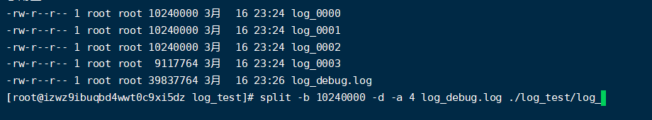
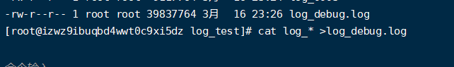

# Linux


## 常用指令

#### [linux常用命令（50个）](https://www.cnblogs.com/xuxinstyle/p/9609551.html)

**查看文件**

cat  filename

tail -50f  filename

vi  filename         查找关键字：     /关键字   或  ?关键字       , 用 N/n   上一个/下一个  

（在查看模式下，符号/后面跟关键字向下查找，符号?后面跟关键字向上查找，按n查找下一个，按N查找上一个）


**查找文件**

(例子) find  /  -name "*.log"


**查找端口**

lsof -i :8884

lsof -i |grep 8884 


**查看内存**

free -h


**查看磁盘**

df  -h


**查看进程的资源占用状况**

top


**对系统中进程进行监测控制**

ps -ef|grep XXXX

ps 是显示瞬间行程的状态，并不动态连续；如果想对进程运行时间监控，应该用 top 工具

-e 显示所有进程,环境变量

-f 全格式

-l 长格式

Linux grep 命令用于查找文件里符合条件的字符串


**解压压缩**

tar
 解包：tar zxvf filename.tar
 打包：tar czvf filename.tar dirname


**看和配置网络设备**

ifconfig


**linux处理大文件**

**切割文件**  （-b  文件byte大小   -d参数设置输出文件的后缀为数字，默认的为字符  -a 指定输出文件名的后缀，默认为2个）

示例：  split -b 10240000 -d -a  4 log_debug.log  ./log_test/log_

**合并文件**  cat log* > log_debug.log






# 

**删除**

**删除文件时，使用绝对路径或者进入到目标路径下后使用删除命令 –> 禁止使用rm –rf ./XXX文件【少个点就是根目录了】**

-r : 删除文件夹

-f : 强制删除文件

rm -rf log_test


#### 查找磁盘文件前N大的磁盘文件

find / -type f -print0 | xargs -0 du -h | sort -rh | head -n 10

```
find //在目录结构中搜索文件的命令
/ //在整个系统（从根目录开始）中查找
-type //指定文件类型
f //普通文件
-print0 //在标准输出显示完整的文件名，其后跟一个空字符（null）
| //控制操作符，将一条命令的输出传递给下一个命令以供进一步处理
xargs //将标准输入转换成命令行参数的命令
-0 //以空字符（null）而不是空白字符（LCTT 译者注：即空格、制表符和换行）来分割记录
du -h //以可读格式计算磁盘空间使用情况的命令
sort //对文本文件进行排序的命令
-r //反转结果
-h //用可读格式打印输出
head //输出文件开头部分的命令
n -10 //打印前 10 个文件
```


#### 批量kill掉所有匹配到名字的进程

如，要 kill 掉进程信息中匹配到 datastory相关的进程

ps -ef | grep datastory| awk '{print $2}' | xargs kill -9


grep

　　抓取包含 "datastory" 的行，注意不要抓取到包含用户名等信息的进程

awk '{print $2}'

　　获取进程 ID (PID， Process Identification)，我们想 kill 掉某一个进程的时候需要通过 PID 指定特定进程

　　（第二个参数为pid）

xargs 

　　将标准输入数据转换成命令行参数，xargs能够处理管道或者stdin并将其转换成特定命令的命令参数。

　　也就是将管道传递过来的每一个 PID 作为 kill -9 的参数

https://blog.csdn.net/weixin_30634661/article/details/101920265


#### 连接远程端口，判断端口是否可用

telnet 命令

检测可用：打开的dos命令行窗口中输入 telnet ，然后 回车，显示如下图那样的证明 telnet可以正常使用。

通过telnet查某个端口是否打开，可以这样做：如要查看 127.0.0.1 这个IP的 80 端口是否开启，可以在打开的dos命令行中输入  telnet 127.0.0.1 80，然后回车，若是出现以下这样，则证明这个端口开启了，也链接成功了。


退出：退出telnet ，可以输入quit，然后回车即可退出


#### linux常用端口

21是tcp FTP文件传输协议、22是tcp SSH安全登录


### linux下java 进程 cpu过高问题排查

1. 使用top命令定位异常进程。可以看见12836的CPU和内存占用率都非常高

此时可以再执行ps -ef | grep java，查看所有的java进程，在结果中找到进程号为12836的进程，即可查看是哪个应用占用的该进程。

2. 使用top -H -p 进程号 查看异常线程

3. 使用printf "%x\n" 线程号将异常线程号转化为16进制
4. 使用jstack 进程号|grep 16进制异常线程号 -A90来定位异常代码的位置（最后的-A90是日志行数，也可以输出为文本文件或使用其他数字）。可以看到异常代码的位置。


##### 个人理解：

 1.使用top查看异常进程PID

2.然后根据进程PID，使用top -H -p  PID 找到对应的线程。

3.使用printf "%x\n" 异常线程PID ，件线程号转化为16位进值

4.使用jstack 进程号 |grep 16进制异常线程号 -A90 来定位异常代码的位置