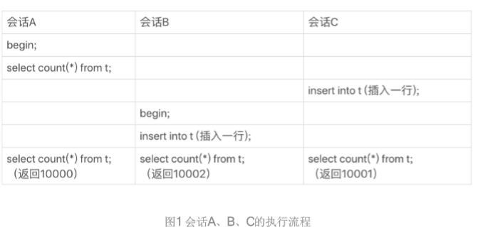
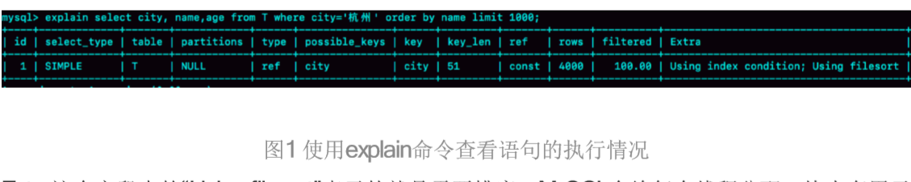
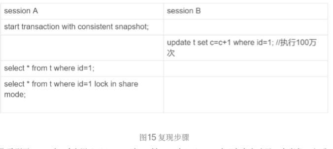
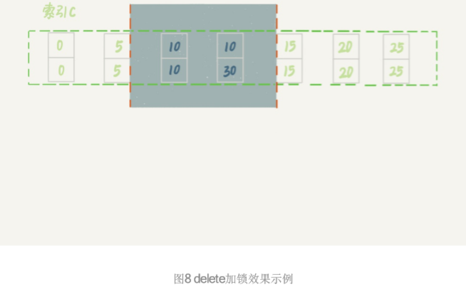
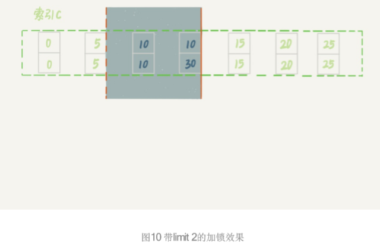

# MySQL


#### 指令

```mysql
-- 查看事务隔离级别
select @@global.tx_isolation;

-- 查看binlog日志格式
show variables like 'binlog_format';

-- 查看表字段及格式
show FULL COLUMNS FROM table

-- 查看数据库表大小
select table_schema,table_name, concat(round(sum(DATA_LENGTH/1024/1024),2),'MB') as data,sum(DATA_LENGTH/1024/1024) as 'MB',sum(DATA_LENGTH/1024/1024/1024) as 'GB' from information_schema.TABLES group by table_schema,table_name order by 4 desc limit 10;

-- 时间间隔
TIMESTAMPDIFF(SECOND,dtm_accept,dtm_crt) as aSecond,
TIMESTAMPDIFF(MINUTE,dtm_accept,dtm_crt) as bMinute,
TIMESTAMPDIFF(HOUR,dtm_accept,dtm_crt) as cHour
```


在mysql 的innodb引擎中，是允许在唯一索引的字段中出现多个null值的。

根据NULL的定义，NULL表示的是未知，因此两个NULL比较的结果既不相等，也不不等，结果仍然是未知。根据这个定义，多个NULL值的存在应该不违反唯一约束，所以是合理的，在oracel也是如此。


#### [MySQL事务与MVCC如何实现的隔离级别](https://mp.weixin.qq.com/s/CZHuGT4sKs_QHD_bv3BfAQ)


#### [聚集索引和非聚集索引（整理）](https://www.cnblogs.com/aspnethot/articles/1504082.html)

##### 聚集索引

　　一种索引，该索引中键值的逻辑顺序决定了表中相应行的物理顺序。

##### 非聚集索引

　　一种索引，该索引中索引的逻辑顺序与磁盘上行的物理存储顺序不同。

索引是通过二叉树的数据结构来描述的，我们可以这么理解聚簇索引：索引的叶节点就是数据节点。而非聚簇索引的叶节点仍然是索引节点，只不过有一个指针指向对应的数据块。如下图：

 

 

​                   （非聚集索引）

  

​                  （聚集索引）


### [维护不了就跑路，然后我被坑了！记一次采坑优化记录](https://juejin.cn/post/6906282808369643528?utm_source=gold_browser_extension#heading-0)

优化方案：

- 方案一：优化现有mysql数据库。优点：不影响现有业务，源程序不需要修改代码，成本最低。缺点：有优化瓶颈，数据量过亿就玩完了。

- 方案二：升级数据库类型，换一种100%兼容mysql的数据库。优点：不影响现有业务，源程序不需要修改代码，你几乎不需要做任何操作就能提升数据库性能，缺点：多花钱

- 方案三：一步到位，大数据解决方案，更换newsql/nosql数据库。优点：没有数据容量瓶颈，缺点：需要修改源程序代码，影响业务，总成本最高。

  

#### 方案一详细说明：优化现有mysql数据库

总结如下：

- 1.数据库设计和表创建时就要考虑性能
- 2.sql的编写需要注意优化
- 4.分区
- 4.分表
- 5.分库

**1.数据库设计和表创建时就要考虑性能**

mysql数据库本身高度灵活，造成性能不足，严重依赖开发人员能力。也就是说开发人员能力高，则mysql性能高。这也是很多关系型数据库的通病，所以公司的dba通常工资巨高。

**设计表时要注意：**

- 表字段避免null值出现，null值很难查询优化且占用额外的索引空间，推荐默认数字0代替null。
- 尽量使用INT而非BIGINT，如果非负则加上UNSIGNED（这样数值容量会扩大一倍），当然能使用TINYINT、SMALLINT、MEDIUM_INT更好。
- 使用枚举或整数代替字符串类型
- 尽量使用TIMESTAMP而非DATETIME
- 单表不要有太多字段，建议在20以内
- 用整型来存IP

### 索引

- 索引并不是越多越好，要根据查询有针对性的创建，考虑在WHERE和ORDER BY命令上涉及的列建立索引，可根据EXPLAIN来查看是否用了索引还是全表扫描
- 应尽量避免在WHERE子句中对字段进行NULL值判断，否则将导致引擎放弃使用索引而进行全表扫描
- 值分布很稀少的字段不适合建索引，例如"性别"这种只有两三个值的字段
- 字符字段只建前缀索引
- 字符字段最好不要做主键
- 不用外键，由程序保证约束
- 尽量不用UNIQUE，由程序保证约束
- 使用多列索引时主意顺序和查询条件保持一致，同时删除不必要的单列索引

简言之就是使用合适的数据类型，选择合适的索引

### 选择合适的数据类型

（1）使用可存下数据的最小的数据类型，整型 < date,time < char,varchar < blob （2）使用简单的数据类型，整型比字符处理开销更小，因为字符串的比较更复杂。如，int类型存储时间类型，bigint类型转ip函数 （3）使用合理的字段属性长度，固定长度的表会更快。使用enum、char而不是varchar （4）尽可能使用not null定义字段 （5）尽量少用text，非用不可最好分表

### 选择合适的索引列

（1）查询频繁的列，在where，group by，order by，on从句中出现的列 （2）where条件中<，<=，=，>，>=，between，in，以及like 字符串+通配符（%）出现的列 （3）长度小的列，索引字段越小越好，因为数据库的存储单位是页，一页中能存下的数据越多越好 （4）离散度大（不同的值多）的列，放在联合索引前面。查看离散度，通过统计不同的列值来实现，count越大，离散程度越高


### 2.sql的编写需要注意优化

- 使用limit对查询结果的记录进行限定

- 避免select *，将需要查找的字段列出来

- 使用连接（join）来代替子查询

- 拆分大的delete或insert语句

- 可通过开启慢查询日志来找出较慢的SQL

- 不做列运算：SELECT id WHERE age + 1 = 10，任何对列的操作都将导致表扫描，它包括数据库教程函数、计算表达式等等，查询时要尽可能将操作移至等号右边

- sql语句尽可能简单：一条sql只能在一个cpu运算；大语句拆小语句，减少锁时间；一条大sql可以堵死整个库

- OR改写成IN：OR的效率是n级别，IN的效率是log(n)级别，in的个数建议控制在200以内

- 不用函数和触发器，在应用程序实现

- 避免%xxx式查询

- 少用JOIN

- 使用同类型进行比较，比如用'123'和'123'比，123和123比

- 尽量避免在WHERE子句中使用!=或<>操作符，否则将引擎放弃使用索引而进- 行全表扫描

- 对于连续数值，使用BETWEEN不用IN：SELECT id FROM t WHERE num BETWEEN 1 AND 5

- 列表数据不要拿全表，要使用LIMIT来分页，每页数量也不要太大

  

### 引擎

**目前广泛使用的是MyISAM和InnoDB两种引擎：**

##### MyISAM

**MyISAM引擎是MySQL 5.1及之前版本的默认引擎，它的特点是：**

- 不支持行锁，读取时对需要读到的所有表加锁，写入时则对表加排它锁
- 不支持事务
- 不支持外键
- 不支持崩溃后的安全恢复
- 在表有读取查询的同时，支持往表中插入新纪录
- 支持BLOB和TEXT的前500个字符索引，支持全文索引
- 支持延迟更新索引，极大提升写入性能
- 对于不会进行修改的表，支持压缩表，极大减少磁盘空间占用

##### InnoDB

**InnoDB在MySQL 5.5后成为默认索引，它的特点是：**

- 支持行锁，采用MVCC来支持高并发
- 支持事务
- 支持外键
- 支持崩溃后的安全恢复
- 不支持全文索引

总体来讲，MyISAM适合SELECT密集型的表，而InnoDB适合INSERT和UPDATE密集型的表

### 3.分区

MySQL在5.1版引入的分区是一种简单的水平拆分，用户需要在建表的时候加上分区参数，对应用是透明的无需修改代码

对用户来说，分区表是一个独立的逻辑表，但是底层由多个物理子表组成，实现分区的代码实际上是通过对一组底层表的对象封装，但对SQL层来说是一个完全封装底层的黑盒子。MySQL实现分区的方式也意味着索引也是按照分区的子表定义，没有全局索引

用户的SQL语句是需要针对分区表做优化，SQL条件中要带上分区条件的列，从而使查询定位到少量的分区上，否则就会扫描全部分区，可以通过EXPLAIN PARTITIONS来查看某条SQL语句会落在那些分区上，从而进行SQL优化，我测试，查询时不带分区条件的列，也会提高速度，故该措施值得一试。

### 分区的好处是：

- 可以让单表存储更多的数据
- 分区表的数据更容易维护，可以通过清楚整个分区批量删除大量数据，也可以增加新的分区来支持新插入的数据。另外，还可以对一个独立分区进行优化、检查、修复等操作
- 部分查询能够从查询条件确定只落在少数分区上，速度会很快
- 分区表的数据还可以分布在不同的物理设备上，从而高效利用多个硬件设备
- 可以使用分区表赖避免某些特殊瓶颈，例如InnoDB单个索引的互斥访问、ext3文件系统的inode锁竞争
- 可以备份和恢复单个分区

**分区的限制和缺点：**

- 一个表最多只能有1024个分区
- 如果分区字段中有主键或者唯一索引的列，那么所有主键列和唯一索引列都必须包含进来
- 分区表无法使用外键约束
- NULL值会使分区过滤无效
- 所有分区必须使用相同的存储引擎

### 分区的类型：

- RANGE分区：基于属于一个给定连续区间的列值，把多行分配给分区
- LIST分区：类似于按RANGE分区，区别在于LIST分区是基于列值匹配一个离散值集合中的某个值来进行选择
- HASH分区：基于用户定义的表达式的返回值来进行选择的分区，该表达式使用将要插入到表中的这些行的列值进行计算。这个函数可以包含MySQL中有效的、产生非负整数值的任何表达式
- KEY分区：类似于按HASH分区，区别在于KEY分区只支持计算一列或多列，且MySQL服务器提供其自身的哈希函数。必须有一列或多列包含整数值

### 4.分表

分表就是把一张大表，按照如上过程都优化了，还是查询卡死，那就把这个表分成多张表，把一次查询分成多次查询，然后把结果组合返回给用户。

分表分为垂直拆分和水平拆分，通常以某个字段做拆分项。比如以id字段拆分为100张表： 表名为 tableName_id%100

但：分表需要修改源程序代码，会给开发带来大量工作，极大的增加了开发成本，故：只适合在开发初期就考虑到了大量数据存在，做好了分表处理，不适合应用上线了再做修改，成本太高！！！而且选择这个方案，都不如选择我提供的第二第三个方案的成本低！故不建议采用。

### 5.分库

把一个数据库分成多个，建议做个读写分离就行了，真正的做分库也会带来大量的开发成本，得不偿失！不推荐使用。

方案二详细说明：升级数据库，换一个100%兼容mysql的数据库 mysql性能不行，那就换个。为保证源程序代码不修改，保证现有业务平稳迁移，故需要换一个100%兼容mysql的数据库。


### 方案三详细说明：去掉mysql，换大数据引擎处理数据

##### 开源解决方案

hadoop家族。hbase/hive怼上就是了。但是有很高的运维成本，没十万投入是不会有很好的产出的

##### 云解决方案

阿里云等。。。


### MySQL插入语句解决唯一键约束

insert into,重复则报错，不重复则插入

insert ignore into,重复则忽略，不重复则插入

insert into ... on duplicate key update, 重复则更新指定字段，不重复则插入

replace into  重复则先删除再插入新记录，不重复则插入


### 删除数据

delete 与 delete from 区别

如果只针对一张表进行删除，则效果一样；如果需要联合其他表，则需要使用from

```sql
delete tb1 from tb1 m where id in (select id from tb2);
```

#### 用法总结

- 希望删除表结构时，用 drop;
- 希望保留表结构，但要删除所有记录时， 用 truncate;
- 希望保留表结构，但要删除部分记录时， 用 delete。


### MySQL中count(字段) ，count(主键 id) ，count(1)和count(*)的区别

**注：下面的讨论和结论是基于 InnoDB 引擎的。**

首先要弄清楚 count() 的语义**。count() 是一个聚合函数，对于返回的结果集，一行行地判断，如果 count 函数的参数不是 NULL，累计值就加 1，否则不加。最后返回累计值。**

所以，count(*)、count(1)和count(主键 id) 都表示返回满足条件的结果集的总行数；而 count(字段），则表示返回满足条件的数据行里面，参数“字段”不为 NULL 的总个数。

至于分析性能差别的时候，记住这么几个原则：

- server 层要什么就给什么；
- InnoDB 只给必要的值；
- 现在的优化器只优化了 count(*) 的语义为“取行数”，其他“显而易见”的优化并没有做。

#### count(可空字段)

扫描全表，读到server层，判断字段可空，拿出该字段所有值，判断每一个值是否为空，不为空则累加

#### count(非空字段)与count(主键 id)

扫描全表，读到server层，判断字段不可空，按行累加。

#### count(1)

扫描全表，但不取值，server层收到的每一行都是1，判断不可能是null，按值累加。

**注意**：count(1)执行速度比count(主键 id)快的原因：从引擎返回 id 会涉及到解析数据行，以及拷贝字段值的操作。

#### count(*)

MySQL 执行count(\*)在优化器做了专门优化。因为count(*)返回的行一定不是空。扫描全表，但是不取值，按行累加。


#### 性能对比结论

> **count(可空字段) < count(非空字段) = count(主键 id) < count(1) ≈ count(\*)**


### [关系型数据库设计：三大范式的通俗理解](https://www.cnblogs.com/wsg25/p/9615100.html)

简单说，第一范式的关键词是**列的原子性**》第二范式的关键词是**不能包含部分依赖**》第三范式的关键词是**不能包含传递依赖**。


**第一范式（1NF）：要求数据库表的每一列都是不可分割的原子数据项。**

**第二范式需要确保数据库表中的每一列都和主键相关，而不能只与主键的某一部分相关（主要针对联合主键而言）**

**第三范式需要确保数据表中的每一列数据都和主键直接相关，而不能间接相关。**


### 01一条SQL查询语句是如何执行的？

 		**首先是通过连接器进行身份的验证和权限的验证，然后去取缓存，取缓存失败后开始进入分析器，对sql语句进行分析，分析完成之后进入优化器，优化完成之后进入执行器。**

大体来说，MySQL可以分为**Server层**和**存储引擎层**两部分。
**Server层包括连接器、查询缓存、分析器、优化器、执行器等，涵盖MySQL的大多数核心服务功能**，以及所有的内置函数（如日期、时间、数学和加密函数等），所有跨存储引擎的功能都在这一层实现，比如存储过程、触发器、视图等。
而**存储引擎层负责数据的存储和提取**。其架构模式是插件式的，支持InnoDB、MyISAM、 Memory等多个存储引擎。现在最常用的存储引擎是InnoDB，它从MySQL 5.5.5版本开始成为了 默认存储引擎。

连接器
**第一步，你会先连接到这个数据库上，这时候接待你的就是连接器。连接器负责跟客户端建立连接、获取权限、维持和管理连接。**

查询缓存

**连接建立完成后，你就可以执行select语句了。执行逻辑就会来到第二步：查询缓存。**

但是大多数情况下我会建议你不要使用查询缓存，为什么呢？

因为查询缓存往往弊大于 但是大多数情况下我会建议你不要使用查询缓存，为什么呢？因为查询缓存往往弊大于利。
查询缓存的失效非常频繁，只要有对一个表的更新，这个表上所有的查询缓存都会被清空。因此很可能你费劲地把结果存起来，还没使用呢，就被一个更新全清空了。对于更新压力大的数据库来说，查询缓存的命中率会非常低。除非你的业务就是有一张静态表，很长时间才会更新一次。

分析器 

**如果没有命中查询缓存，就要开始真正执行语句了**。首先，MySQL需要知道你要做什么，因此 需要对SQL语句做解析。

优化器 

**经过了分析器，MySQL就知道你要做什么了。在开始执行之前，还要先经过优化器的处理。**
优化器是在表里面有多个索引的时候，决定使用哪个索引；或者在一个语句有多表关联（join） 的时候，决定各个表的连接顺序。

执行器 

**MySQL通过分析器知道了你要做什么，通过优化器知道了该怎么做，于是就进入了执行器阶段，开始执行语句。**


#### 02日志系统：一条SQL更新语句是如何执行的？

与查询流程不一样的是，更新流程还涉及两个重要的日志模块，它们正是我们今天要讨论的主 角：redo log（重做日志）和 binlog（归档日志）。

**重要的日志模块：redo log**

如果每一次的更新操作都需要写进磁盘，然后磁盘也要找到 对应的那条记录，然后再更新，整个过程IO成本、查找成本都很高。为了解决这个问 题，MySQL的设计者就用了类似酒店掌柜粉板的思路来提升更新效率。
而粉板和账本配合的整个过程，其实就是MySQL里经常说到的WAL技术，WAL的全称是WriteAhead Logging，它的关键点就是**先写日志，再写磁盘**，也就是先写粉板，等不忙的时候再写账本。
具体来说，**当有一条记录需要更新的时候，InnoDB引擎就会先把记录写到redo log（粉板）里 面，并更新内存，这个时候更新就算完成了。同时，InnoDB引擎会在适当的时候，将这个操作 记录更新到磁盘里面，而这个更新往往是在系统比较空闲的时候做**。

**有了redo log，InnoDB就可以保证即使数据库发生异常重启，之前提交的记录都不会丢失，这个 能力称为crash-safe。**

##### 重要的日志模块：binlog

MySQL整体来看，其实就有两块：一块是Server层，它主要做的是MySQL功能 层面的事情；还有一块是引擎层，负责存储相关的具体事宜。上面我们聊到的粉板**redo log是 InnoDB引擎特有的日志**，而**Server层也有自己的日志，称为binlog（归档日志）**。

因为最开始MySQL里并没有InnoDB引擎。MySQL自带的引擎是MyISAM，但是MyISAM没有 crash-safe的能力，binlog日志只能用于归档。而InnoDB是另一个公司以插件形式引入MySQL 的，既然**只依靠binlog是没有crash-safe能力的，所以InnoDB使用另外一套日志系统——也就是redo log来实现crash-safe能力。**
这两种日志有以下三点不同。

1. **redo log是InnoDB引擎特有的；binlog是MySQL的Server层实现的，所有引擎都可以使用。**

2. **redo log是物理日志，记录的是“在某个数据页上做了什么修改”；binlog是逻辑日志，记录的 是这个语句的原始逻辑，比如“给ID=2这一行的c字段加1 ”。**

3. **redo log是循环写的，空间固定会用完；binlog是可以追加写入的。“追加写”是指binlog文件 写到一定大小后会切换到下一个，并不会覆盖以前的日志。**

   这里我给出这个update语句的执行流程图，图中浅色框表示是在InnoDB内部执行的，深色框表 示是在执行器中执行的。


你可能注意到了，最后三步看上去有点“绕”，将**redo log的写入拆成了两个步骤：prepare和 commit，这就是"两阶段提交"。**

#### 两阶段提交 

 为什么必须有“两阶段提交”呢？这是为了让两份日志之间的逻辑一致。要说明这个问题，我们得 从文章开头的那个问题说起：怎样让数据库恢复到半个月内任意一秒的状态？ 怎样让数据库恢复到半个月内任意一秒的状态？
前面我们说过了，binlog会记录所有的逻辑操作，并且是采用“追加写”的形式。如果你的DBA承 诺说半个月内可以恢复，那么备份系统中一定会保存最近半个月的所有binlog，同时系统会定期 做整库备份。这里的“定期”取决于系统的重要性，可以是一天一备，也可以是一周一备。
当需要恢复到指定的某一秒时，比如某天下午两点发现中午十二点有一次**误删表**，需要找回数据，那你可以这么做：
**1.首先，找到最近的一次全量备份，如果你运气好，可能就是昨天晚上的一个备份，从这个备份恢复到临时库； 	**

**2.然后，从备份的时间点开始，将备份的binlog依次取出来，重放到中午误删表之前的那个时刻。	**

**3.这样你的临时库就跟误删之前的线上库一样了，然后你可以把表数据从临时库取出来，按需要恢复到线上库去。**

**如果不使用“两阶段提交”，那么数据库的状态就有可能和用它的日志恢复出来的库的 状态不一致。**
你可能会说，这个概率是不是很低，平时也没有什么动不动就需要恢复临时库的场景呀？
其实不是的，不只是误操作后需要用这个过程来恢复数据。当你需要扩容的时候，也就是需要再 多搭建一些备库来增加系统的读能力的时候，现在常见的做法也是用全量备份加上应用binlog来 实现的，这个“不一致”就会导致你的线上出现主从数据库不一致的情况。
简单说**，redo log和binlog都可以用于表示事务的提交状态，而两阶段提交就是让这两个状态保 持逻辑上的一致。**

#### 总结

MySQL里面最重要的两个日志，即物理日志redo log和逻辑日志binlog。
redo log用于保证crash-safe能力。innodb_flush_log_at_trx_commit这个参数设置成1的时候， 表示每次事务的redo log都直接持久化到磁盘。这个参数我建议你设置成1，这样可以保证 MySQL异常重启之后数据不丢失。
sync_binlog这个参数设置成1的时候，表示每次事务的binlog都持久化到磁盘。这个参数我也建 议你设置成1，这样可以保证MySQL异常重启之后binlog不丢失。

### 03 | 事务隔离：为什么你改了我还看不见

**简单来说，事务就是要保证一组数据库操作，要么全部成功，要么全部失败。**在**MySQL中，事务支持是在引擎层实现的**。你现在知道，MySQL是一个支持多引擎的系统，但并不是所有的引 擎都支持事务。比如MySQL原生的MyISAM引擎就不支持事务，这也是MyISAM被InnoDB取代 的重要原因之一。

#### 隔离性与隔离级别 

提到事务，你肯定会想到**ACID（Atomicity、Consistency、Isolation、Durability，即原子性、一 致性、隔离性、持久性）**，今天我们就来说说其中I，也就是“隔离性”。
当数据库上有多个事务同时执行的时候，就可能出现**脏读（dirty read）、不可重复读（nonrepeatable read）、幻读（phantom read）**的问题，为了解决这些问题，就有了“隔离级别”的概念。
在谈隔离级别之前，你首先要知道，你**隔离得越严实，效率就会越低**。因此很多时候，我们都要 在二者之间寻找一个平衡点。**SQL标准的事务隔离级别包括：读未提交（read uncommitted）、 读提交（read committed）、可重复读（repeatable read）和串行化（serializable ）**。下面我逐 一为你解释：

**读未提交是指，一个事务还没提交时，它做的变更就能被别的事务看到。**

**读提交是指，一个事务提交之后，它做的变更才会被其他事务看到。**

**可重复读是指，一个事务执行过程中看到的数据，总是跟这个事务在启动时看到的数据是一致的。当然在可重复读隔离级别下，未提交变更对其他事务也是不可见的。**

**串行化，顾名思义是对于同一行记录，“写”会加“写锁”，“读”会加“读锁”。当出现读写锁冲突 的时候，后访问的事务必须等前一个事务执行完成，才能继续执行。**


在实现上，数据库里面会创建一个视图，访问的时候以视图的逻辑结果为准。**在“可重复读”隔离 级别下，这个视图是在事务启动时创建的，整个事务存在期间都用这个视图。在“读提交”隔离级 别下，这个视图是在每个SQL语句开始执行的时候创建的。**这里需要注意的是，**“读未提交”隔离 级别下直接返回记录上的最新值，没有视图概念**；**而“串行化”隔离级别下直接用加锁的方式来避 免并行访问**。

#### 事务隔离的实现 

理解了事务的隔离级别，我们再来看看事务隔离具体是怎么实现的。这里我们展开说明“可重复 读”。
**在MySQL中，实际上每条记录在更新的时候都会同时记录一条回滚操作。记录上的最新值，通 过回滚操作，都可以得到前一个状态的值**。
假设一个值从1被按顺序改成了2、3、4，在回滚日志里面就会有类似下面的记录。


当前值是4，但是在查询这条记录的时候，不同时刻启动的事务会有不同的read-view。如图中看 到的，在视图A、B、C里面，这一个记录的值分别是1、2、4，同一条记录在系统中可以存在多个版本，就是数据库的多版本并发控制（MVCC）。对于read-view A，要得到1，就必须将当前 值依次执行图中所有的回滚操作得到。
同时你会发现，即使现在有另外一个事务正在将4改成5，这个事务跟read-view A、B、C对应的 事务是不会冲突的。
你一定会问，**回滚日志总不能一直保留吧，什么时候删除呢？答案是，在不需要的时候才删除**。
也就是说，系统会判断，当没有事务再需要用到这些回滚日志时，回滚日志会被删除。
**什么时候才不需要了呢？就是当系统里没有比这个回滚日志更早的read-view的时候。**
基于上面的说明，我们来讨论一下为什么建议你尽量不要使用长事务。
**长事务意味着系统里面会存在很老的事务视图。由于这些事务随时可能访问数据库里面的任何数据，所以这个事务提交之前，数据库里面它可能用到的回滚记录都必须保留，这就会导致大量占用存储空间。**
在MySQL 5.5及以前的版本，回滚日志是跟数据字典一起放在ibdata文件里的，即使长事务最终 提交，回滚段被清理，文件也不会变小。我见过数据只有20GB，而回滚段有200GB的库。最终 只好为了清理回滚段，重建整个库。
除了对回滚段的影响，长事务还占用锁资源，也可能拖垮整个库。

### 04 | 深入浅出索引（上）

一句话简单来说，**索引的出现其实就是为了提高数据查询的效率，就像书的目录一样**。一本500 页的书，如果你想快速找到其中的某一个知识点，在不借助目录的情况下，那我估计你可得找一 会儿。同样，**对于数据库的表而言，索引其实就是它的“目录”**。

#### 索引的常见模型

索引的出现是为了提高查询效率，但是实现索引的方式却有很多种，所以这里也就引入了索引模型的概念。可以用于提高读写效率的数据结构很多，这里我先给你介绍三种常见、也比较简单的数据结构，它们分别是**哈希表**、**有序数组**和**搜索树**。。

哈希表是一种以键-值（key-value）存储数据的结构，我们只要输入待查找的值即key，就可以找 到其对应的值即Value。哈希的思路很简单，把值放在数组里，用一个哈希函数把key换算成一个确定的位置，然后把value放在数组的这个位置。不可避免地，**多个key值经过哈希函数的换算，会出现同一个值的情况。处理这种情况的一种方法是，拉出一个链表。**


​																							图1 哈希表示意图 

图中，User2和User4根据身份证号算出来的值都是N，但没关系，后面还跟了一个链表。假设， 这时候你要查ID_card_n2对应的名字是什么，处理步骤就是：首先，将ID_card_n2通过哈希函 数算出N；然后，按顺序遍历，找到User2。
需要注意的是，图中四个ID_card_n的值并不是递增的，这样做的好处是增加新的User时速度会 很快，只需要往后追加。但**缺点是，因为不是有序的，所以哈希索引做区间查询的速度是很慢的。**
你可以设想下，如果你现在要找身份证号在[ID_card_X, ID_card_Y]这个区间的所有用户，就必 须全部扫描一遍了。
所以，**哈希表这种结构适用于只有等值查询的场景**，比如Memcached及其他一些NoSQL引擎。

而**有序数组在等值查询和范围查询场景中的性能就都非常优秀**。还是上面这个根据身份证号查名字的例子，如果我们使用有序数组来实现的话，示意图如下所示：


​																			图2 有序数组示意图
这里我们假设身份证号没有重复，这个数组就是按照身份证号递增的顺序保存的。这时候如果你 要查ID_card_n2对应的名字，用二分法就可以快速得到，这个时间复杂度是O(log(N))。
同时很显然，这个索引结构支持范围查询。你要查身份证号在[ID_card_X, ID_card_Y]区间的 User，可以先用二分法找到ID_card_X（如果不存在ID_card_X，就找到大于ID_card_X的第一 个User），然后向右遍历，直到查到第一个大于ID_card_Y的身份证号，退出循环。
**如果仅仅看查询效率，有序数组就是最好的数据结构了。但是，在需要更新数据的时候就麻烦了，你往中间插入一个记录就必须得挪动后面所有的记录，成本太高。**
**所以，有序数组索引只适用于静态存储引擎**，比如你要保存的是2017年某个城市的所有人口 信息，这类不会再修改的数据。

二叉搜索树也是课本里的经典数据结构了。还是上面根据身份证号查名字的例子，如果我们用二叉搜索树来实现的话，示意图如下所示：

																	图3 二叉搜索树示意图
**二叉搜索树的特点是：每个节点的左儿子小于父节点，父节点又小于右儿子。**这样如果你要查 ID_card_n2的话，按照图中的**搜索**顺序就是按照UserA -> UserC -> UserF -> User2这个路径得 到。这个**时间复杂度是O(log(N))**。
当然为了维持O(log(N))的查询复杂度，你就需要保持这棵树是平衡二叉树。为了做这个保证，**更新的时间复杂度也是O(log(N))**。
树可以有二叉，也可以有多叉。多叉树就是每个节点有多个儿子，儿子之间的大小保证从左到右递增。**二叉树是搜索效率最高的，但是实际上大多数的数据库存储却并不使用二叉树。其原因是，索引不止存在内存中，还要写到磁盘上。**
你可以想象一下一棵100万节点的平衡二叉树，树高20。一次查询可能需要访问20个数据块。在 机械硬盘时代，从**磁盘随机读**一个数据块需要10 ms左右的寻址时间。也就是说，对于一个100 万行的表，如果使用二叉树来存储，单独访问一个行可能需要20个10 ms的时间，这个查询可真 够慢的。
**为了让一个查询尽量少地读磁盘，就必须让查询过程访问尽量少的数据块。那么，我们就不应该使用二叉树，而是要使用“N叉”树。这里，“N叉”树中的“N”取决于数据块的大小。**
以InnoDB的一个整数字段索引为例，这个N差不多是1200。这棵树高是4的时候，就可以存 1200的3次方个值，这已经17亿了。考虑到树根的数据块总是在内存中的，一个10亿行的表上一 个整数字段的索引，查找一个值最多只需要访问3次磁盘。**其实，树的第二层也有很大概率在内 存中，那么访问磁盘的平均次数就更少了。**
N叉树由于在读写上的性能优点，以及适配磁盘的访问模式，已经被广泛应用在数据库引擎中 了。

#### InnoDB 的索引模型  

**在InnoDB中，表都是根据主键顺序以索引的形式存放的，这种存储方式的表称为索引组织表**。 又因为前面我们提到的，**InnoDB使用了B+树索引模型，所以数据都是存储在B+树中的**。
**每一个索引在InnoDB里面对应一棵B+树**。

**根据叶子节点的内容，索引类型分为主键索引和非主键索引**。
**主键索引的叶子节点存的是整行数据**。在InnoDB里，主键索引也被称为聚簇索引（clustered index）。
**非主键索引的叶子节点内容是主键的值**。在InnoDB里，非主键索引也被称为二级索引 （secondary index）、非聚簇索引。
根据上面的索引结构说明，我们来讨论一个问题：基于主键索引和普通索引的查询有什么区别？

**如果语句是select * from T where ID=500，即主键查询方式，则只需要搜索ID这棵B+树；**

**如果语句是select * from T where k=5，即普通索引查询方式，则需要先搜索k索引树，得到ID 的值为500，再到ID索引树搜索一次。**这个过程称为**回表**。
**也就是说，基于非主键索引的查询需要多扫描一棵索引树**。因此，我们在应用中应该尽量使用主键查询。


#### 索引维护

B+树为了维护索引有序性，在插入新值的时候需要做必要的维护。以上面这个图为例，**如果插入新的行ID值为700，则只需要在R5的记录后面插入一个新记录。如果新插入的ID值为400，就 相对麻烦了，需要逻辑上挪动后面的数据，空出位置。**
**而更糟的情况是，如果R5所在的数据页已经满了，根据B+树的算法，这时候需要申请一个新的数据页，然后挪动部分数据过去。这个过程称为页分裂。在这种情况下，性能自然会受影响。除了性能外，页分裂操作还影响数据页的利用率。**原本放在一个页的数据，现在分到两个页中， 整体空间利用率降低大约50%。
当然有分裂就有合并。当相邻两个页由于删除了数据，利用率很低之后，会将数据页做合并。合并的过程，可以认为是分裂过程的逆过程。
基于上面的索引维护过程说明，我们来讨论一个案例：

你可能在一些建表规范里面见到过类似的描述，要求建表语句里一定要有自增主键。当然事无绝对，我们来分析一下哪些场景下应该使用自增主键，而哪些场景下不应该？

自增主键是指自增列上定义的主键，在建表语句中一般是这么定义的： NOT NULL PRIMARY KEY AUTO_INCREMENT。
插入新记录的时候可以不指定ID的值，系统会获取当前ID最大值加1作为下一条记录的ID值。
也就是说，**自增主键的插入数据模式，正符合了我们前面提到的递增插入的场景。每次插入一条新记录，都是追加操作，都不涉及到挪动其他记录，也不会触发叶子节点的分裂。**
而有业务逻辑的字段做主键，则往往不容易保证有序插入，这样写数据成本相对较高。

除了考虑性能外，我们还可以从存储空间的角度来看。假设你的表中确实有一个唯一字段，比如字符串类型的身份证号，那应该用身份证号做主键，还是用自增字段做主键呢？

由于**每个非主键索引的叶子节点上都是主键的值**。如果用身份证号做主键，那么每个二级索引的 叶子节点占用约20个字节，而如果用整型做主键，则只要4个字节，如果是长整型（bigint）则是8个字节。
 **显然，主键长度越小，普通索引的叶子节点就越小，普通索引占用的空间也就越小。**
所以，**从性能和存储空间方面考量，自增主键往往是更合理的选择**。

有没有什么场景适合用业务字段直接做主键的呢？还是有的。比如，有些业务的场景需求是这样的：
1. 只有一个索引；

2. 该索引必须是唯一索引。

  你一定看出来了，这就是典型的KV场景。

  由于没有其他索引，所以也就不用考虑其他索引的叶子节点大小的问题。
  这时候我们就要优先考虑上一段提到的“尽量使用主键查询”原则，直接将这个索引设置为主键， 可以避免每次查询需要搜索两棵树。

  #### **小结** 

  今天，我跟你分析了数据库引擎可用的数据结构，介绍了InnoDB采用的B+树结构，以及为什么 InnoDB要这么选择。B+树能够很好地配合磁盘的读写特性，减少单次查询的磁盘访问次数。
  由于InnoDB是索引组织表，一般情况下我会建议你创建一个自增主键，这样非主键索引占用的 空间最小。但事无绝对，我也跟你讨论了使用业务逻辑字段做主键的应用场景。

  

### 05 | 深入浅出索引（下）

在开始这篇文章之前，我们先来看一下这个问题：
在下面这个表T中，如果我执行 select * from T where k between 3 and 5，需要执行几次树的搜索操作，会扫描多少行？


现在，我们一起来看看这条SQL查询语句的执行流程：
1. 在k索引树上找到k=3的记录，取得 ID = 300；

2. 再到ID索引树查到ID=300对应的R3；

3. 在k索引树取下一个值k=5，取得ID=500；

4. 再回到ID索引树查到ID=500对应的R4；

5. 在k索引树取下一个值k=6，不满足条件，循环结束。  

  在这个过程中，回到主键索引树搜索的过程，我们称为回表 回到主键索引树搜索的过程，我们称为回表。可以看到，这个查询过程读了k 索引树的3条记录（步骤1、3和5），回表了两次（步骤2和4）。
  在这个例子中，由于查询结果所需要的数据只在主键索引上有，所以不得不回表。那么，有没有可能经过索引优化，避免回表过程呢？

  #### 覆盖索引

  如果执行的语句是select ID from T where k between 3 and 5，这时只需要查ID的值，而ID的值已经在k索引树上了，因此可以直接提供查询结果，不需要回表。也就是说，在这个查询里面， 索引k已经“覆盖了”我们的查询需求，我们称为覆盖索引。
  由于**覆盖索引可以减少树的搜索次数，显著提升查询性能，所以使用覆盖索引是一个常用的性能优化手段**。 
  **需要注意的是，在引擎内部使用覆盖索引在索引k上其实读了三个记录，R3~R5（对应的索引k 上的记录项），但是对于MySQL的Server层来说，它就是找引擎拿到了两条记录，因此MySQL 认为扫描行数是2**。

  #### 最左前缀原则

  **B+树这种索引结构，可以利用索引的“ “最左前缀” ”，来定位记录。**

  我们来讨论一个问题：在建立联合索引的时候，如何安排索 在建立联合索引的时候，如何安排索引内的字段顺序。 引内的字段顺序。
  这里我们的评估标准是，**索引的复用能力**。因为可以支持最左前缀，所以当已经有了(a,b)这个联 合索引后，一般就不需要单独在a上建立索引了。因此，**第一原则是，如果通过调整顺序，可以少维护一个索引，那么这个顺序往往就是需要优先考虑采用的**。 

  那么，如果既有联合查询，又有基于a、b各自的查询呢？查询条件里面只有b的语句，是无法使 用(a,b)这个联合索引的，这时候你不得不维护另外一个索引，也就是说你需要同时维护(a,b)、 (b) 这两个索引。
  这时候，我们**要考虑的原则就是空间**了。比如上面这个市民表的情况，**name字段是比age字段大的 ，那我就建议你创建一个（name,age)的联合索引和一个(age)的单字段索引**。

  

  MySQL 的查询优化器会自动调整 where 子句的条件顺序以使用适合的索引，所以 MySQL 不存在 where 子句的顺序问题而造成索引失效。
  
  
  
  #### 索引下推
  

我们还是以市民表的联合索引（name, age）为例。如果现在有一个需求：检索出表中“名字第一 个字是张，而且年龄是10岁的所有男孩”。那么，SQL语句是这么写的：
  你已经知道了前缀索引规则，所以这个语句在搜索索引树的时候，只能用 “张”，找到第一个满足 条件的记录ID3。当然，这还不错，总比全表扫描要好。
然后呢？
  当然是判断其他条件是否满足。
  在MySQL 5.6之前，只能从ID3开始一个个回表。到主键索引上找出数据行，再对比字段值。
  **而MySQL 5.6 引入的索引下推优化（index condition pushdown)， 可以在索引遍历过程中，对索引中包含的字段先做判断，直接过滤掉不满足条件的记录，减少回表次数。**

  

  

#### 小结

今天这篇文章，我和你继续讨论了数据库索引的概念，包括了覆盖索引、前缀索引、索引下推。 你可以看到，在满足语句需求的情况下， 尽量少地访问资源是数据库设计的重要原则之一。我 们在使用数据库的时候，尤其是在设计表结构时，也要以减少资源消耗作为目标。


### 06 | 全局锁和表锁 ：给表加个字段怎么有这么多阻碍？

根据加锁的范围， 根据加锁的范围，MySQL MySQL里面的锁大致可以分成**全局锁、表级锁和行锁**三类。

#### 全局锁

顾名思义，全局锁就是对整个数据库实例加锁。MySQL提供了一个加全局读锁的方法，命令是 **Flush tables with read lock (FTWRL)**。当你需要让**整个库处于只读状态**的时候，可以使用这个命令，之后其他线程的以下语句会被阻塞：**数据更新语句（数据的增删改）、数据定义语句（包括建表、修改表结构等）和更新类事务的提交语句**。
**全局锁的典型使用场景是，做全库逻辑备份**。也就是把整库每个表都select出来存成文本。
以前有一种做法，是通过FTWRL确保不会有其他线程对数据库做更新，然后对整个库做备份。 注意，在备份过程中整个库完全处于只读状态。
但是让整库都只读，听上去就很危险：
如果你在主库上备份，那么在备份期间都不能执行更新，业务基本上就得停摆；

如果你在从库上备份，那么备份期间从库不能执行主库同步过来的binlog，会导致主从延迟。

不加锁的话，备份系统备份的得到的库不是一个逻辑时间点，这个视图是逻辑不一致的。
说到视图你肯定想起来了，我们在前面讲事务隔离的时候，其实是有一个方法能够拿到一致性视图的，对吧？
是的，就是在可重复读隔离级别下开启一个事务。

官方自带的**逻辑备份工具是mysqldump**。**当mysqldump使用参数–single-transaction的时候，导 数据之前就会启动一个事务，来确保拿到一致性视图。而由于MVCC的支持，这个过程中数据是 可以正常更新的。**
你一定在疑惑，有了这个功能，为什么还需要FTWRL呢？**一致性读是好，但前提是引擎要支持这个隔离级别。**比如，对于MyISAM这种不支持事务的引擎，如果备份过程中有更新，总是 只能取到最新的数据，那么就破坏了备份的一致性。这时，我们就需要使用FTWRL命令了。
所以，single-transaction single-transaction方法只适用于所有的表使用事务引擎的库。 方法只适用于所有的表使用事务引擎的库。如果有的表使用了不 支持事务的引擎，那么备份就只能通过FTWRL方法。这往往是DBA要求业务开发人员使用 InnoDB替代MyISAM的原因之一。
你也许会问，既然要全库只读，为什么不使用 既然要全库只读，为什么不使用set global readonly=true set global readonly=true的方式呢 的方式呢？**确实 readonly方式也可以让全库进入只读状态，但我还是会建议你用FTWRL方式**，主要有两个原 因：
**一是，在有些系统中，readonly的值会被用来做其他逻辑**，比如用来判断一个库是主库还是备 库。因此，修改global变量的方式影响面更大，我不建议你使用。 **二是，在异常处理机制上有差异。**如果执行FTWRL命令之后由于客户端发生异常断开，那么 MySQL会自动释放这个全局锁，整个库回到可以正常更新的状态。而将整个库设置为 readonly之后，如果客户端发生异常，则数据库就会一直保持readonly状态，这样会导致整个 库长时间处于不可写状态，风险较高。
业务的更新不只是增删改数据（DML)，还有可能是加字段等修改表结构的操作（DDL）。不论 是哪种方法，一个库被全局锁上以后，你要对里面任何一个表做加字段操作，都是会被锁住的。
但是，即使没有被全局锁住，加字段也不是就能一帆风顺的，因为你还会碰到接下来我们要介绍的表级锁。

#### 表级锁

MySQL里面**表级别的锁**有两种：一种是**表锁**，一种是**元数据锁**（meta data lock，**MDL**)。

表锁的语法是 **lock tables … read/write** 。与FTWRL类似，**可以用unlock tables主动释放锁， 也可以在客户端断开的时候自动释放**。需要注意，lock tables语法除了会限制别的线程的读写 外，也限定了本线程接下来的操作对象。

在还没有出现更细粒度的锁的时候，表锁是最常用的处理并发的方式。而对于InnoDB这种支持 行锁的引擎，一般不使用lock tables命令来控制并发，毕竟锁住整个表的影响面还是太大。

**另一类表级的锁是MDL MDL（metadata lock)**。**MDL不需要显式使用，在访问一个表的时候会被 自动加上**。**MDL的作用是，保证读写的正确性**。你可以想象一下，如果一个查询正在遍历一个 表中的数据，而执行期间另一个线程对这个表结构做变更，删了一列，那么查询线程拿到的结果
跟表结构对不上，肯定是不行的。
因此，在MySQL 5.5版本中引入了MDL，**当对一个表做增删改查操作的时候，加MDL读锁**；**当要对表做结构变更操作的时候，加MDL写锁。**
**读锁之间不互斥，因此你可以有多个线程同时对一张表增删改查。**
**读写锁之间、写锁之间是互斥的，用来保证变更表结构操作的安全性。因此，如果有两个线程要同时给一个表加字段，其中一个要等另一个执行完才能开始执行**。
虽然MDL锁是系统默认会加的，但却是你不能忽略的一个机制。

**事务中的MDL锁，在语句执行开始时申请，但是语句结束后并不会马上释 放，而会等到整个事务提交后再释放。**

我们来讨论一个问题，**如何安全地给小表加字段**？
**首先我们要解决长事务，事务不提交，就会一直占着MDL锁**。在MySQL的information_schema 库的 innodb_trx 表中，你可以查到当前执行中的事务。如果你要做DDL变更的表刚好有长事务 在执行，要考虑先暂停DDL，或者kill掉这个长事务。
但考虑一下这个场景。如果你要变更的表是一个热点表，虽然数据量不大，但是上面的请求很频繁，而你不得不加个字段，你该怎么做呢？
这时候kill可能未必管用，因为新的请求马上就来了。**比较理想的机制是，在alter table语句里面 设定等待时间**，如果在这个指定的等待时间里面能够拿到MDL写锁最好，拿不到也不要阻塞后 面的业务语句，先放弃。之后开发人员或者DBA再通过重试命令重复这个过程。
MariaDB已经合并了AliSQL的这个功能，所以这两个开源分支目前都支持DDL NOWAIT/WAIT n 这个语法。

ALTER TABLE tbl_name NOWAIT add column ... 

ALTER TABLE tbl_name WAIT N add column ..

#### 小结 

今天，我跟你介绍了MySQL的全局锁和表级锁。

全局锁主要用在逻辑备份过程中。对于全部是InnoDB引擎的库，我建议你选择使用-singletransaction参数，对应用会更友好。
表锁一般是在数据库引擎不支持行锁的时候才会被用到的。如果你发现你的应用程序里有lock tables这样的语句，你需要追查一下，比较可能的情况是：
要么是你的系统现在还在用MyISAM这类不支持事务的引擎，那要安排升级换引擎； 要么是你的引擎升级了，但是代码还没升级。我见过这样的情况，最后业务开发就是把lock tables 和 unlock tables 改成 begin 和 commit，问题就解决了。
**MDL会直到事务提交才释放，在做表结构变更的时候，你一定要小心不要导致锁住线上查询和更新**。


#### 07 | 行锁功过：怎么减少行锁对性能的影响？

**MySQL的行锁是在引擎层由各个引擎自己实现的**。但并不是所有的引擎都支持行锁，比如 MyISAM引擎就不支持行锁。不支持行锁意味着并发控制只能使用表锁，对于这种引擎的表，同 一张表上任何时刻只能有一个更新在执行，这就会影响到业务并发度。InnoDB是支持行锁的， 这也是MyISAM被InnoDB替代的重要原因之一。

当然，数据库中还有一些没那么一目了然的概念和设计，这些概念如果理解和使用不当，容易导致程序出现非预期行为，比如两阶段锁。
**从两阶段锁说起**

我先给你举个例子。在下面的操作序列中，事务B的update语句执行时会是什么现象呢？假设字 段id是表t的主键。


这个问题的结论取决于事务A在执行完两条update语句后，持有哪些锁，以及在什么时候释放。 你可以验证一下：**实际上事务B的update语句会被阻塞，直到事务A执行commit之后，事务B才能继续执行。**
知道了这个答案，你一定知道了事务A持有的两个记录的行锁，都是在commit的时候才释放的。
也就是说， **在InnoDB事务中，行锁是在需要的时候才加上的，但并不是不需要了就立刻释 ，而是要等到事务结束时才释放**。**这个就是两阶段锁协议**。
知道了这个设定，对我们使用事务有什么帮助呢？那就是，**如果你的事务中需要锁多个行，要把最可能造成锁冲突、最可能影响并发度的锁尽量往后放**。

如果这个影院做活动，可以低价预售一年内所有的电影票，而且这个活动只做一天。于是在活动 时间开始的时候，你的MySQL就挂了。你登上服务器一看，CPU消耗接近100%，但整个数据库 每秒就执行不到100个事务。这是什么原因呢？
这里，我就要说到死锁和死锁检测了。

#### 死锁和死锁检测 

**当并发系统中不同线程出现循环资源依赖，涉及的线程都在等待别的线程释放资源时，就会导致这几个线程都进入无限等待的状态，称为死锁**。这里我用数据库中的行锁举个例子


这时候，事务A在等待事务B释放id=2的行锁，而事务B在等待事务A释放id=1的行锁。 事务A和 事务B在互相等待对方的资源释放，就是进入了死锁状态。当出现死锁以后，有两种策略：

一种策略是，直接进入等待，直到超时。这个超时时间可以通过参数 innodb_lock_wait_timeout来设置。

 另一种策略是，发起死锁检测，发现死锁后，主动回滚死锁链条中的某一个事务，让其他事 务得以继续执行。将参数innodb_deadlock_detect设置为on，表示开启这个逻辑。

正常情况下我们还是要采用第二种策略，即：主动死锁检测，而且 innodb_deadlock_detect的默认值本身就是on。**主动死锁检测在发生死锁的时候，是能够快速发 现并进行处理的，但是它也是有额外负担的。**
**你可以想象一下这个过程：每当一个事务被锁的时候，就要看看它所依赖的线程有没有被别人锁住，如此循环，最后判断是否出现了循环等待，也就是死锁。**
那如果是我们上面说到的所有事务都要更新同一行的场景呢？
每个新来的被堵住的线程，都要判断会不会由于自己的加入导致了死锁，这是一个时间复杂度是 O(n)的操作。假设有1000个并发线程要同时更新同一行，那么死锁检测操作就是100万这个量级 的。虽然最终检测的结果是没有死锁，但是这期间要消耗大量的CPU资源。因此，你就会看到 CPU利用率很高，但是每秒却执行不了几个事务。

**怎么解决由这种热点行更新导致的性能问题呢**？问题的症结 在于，死锁检测要耗费大量的CPU资源。
一种头痛医头的方法，就是如果你能确保这个业务一定不会出现死锁，可以临时把死锁检 一种头痛医头的方法，就是如果你能确保这个业务一定不会出现死锁，可以临时把死锁检测关掉。

**另一个思路是控制并发度。**，这个并发控制要做在数据库服务端。如果你有中间件，可以考虑在中间件实现；如果你的 团队有能修改MySQL源码的人，也可以做在MySQL里面。基本思路就是，对于相同行的更新， 在进入引擎之前排队。

#### 小结 

今天，我和你介绍了MySQL的行锁，涉及了两阶段锁协议、死锁和死锁检测这两大部分内容。

其中，我以两阶段协议为起点，和你一起讨论了在开发的时候如何安排正确的事务语句。这里的 原则/我给你的建议是：如果你的事务中需要锁多个行，要把最可能造成锁冲突、最可能影响并 发度的锁的申请时机尽量往后放。
但是，调整语句顺序并不能完全避免死锁。所以我们引入了死锁和死锁检测的概念，以及提供了三个方案，来减少死锁对数据库的影响。减少死锁的主要方向，就是控制访问相同资源的并发事务量。


### 08 | 事务到底是隔离的还是不隔离的？

我在第3篇文章和你讲事务隔离级别的时候提到过，如果是可重复读隔离级别，事务T启动的时 候会创建一个视图read-view，之后事务T执行期间，即使有其他事务修改了数据，事务T看到的 仍然跟在启动时看到的一样。也就是说，一个在可重复读隔离级别下执行的事务，好像与世无争，不受外界影响。（可重复读，查看是不会看到修改的数据的）
但是，我在上一篇文章中，和你分享行锁的时候又提到，一个事务要更新一行，如果刚好有另外一个事务拥有这一行的行锁，它又不能这么超然了，会被锁住，进入等待状态。问题是，既然进入了等待状态，那么等到这个事务自己获取到行锁要更新数据的时候，它读到的值又是什么呢？

在MySQL里，有两个“视图”的概念：
**一个是view**。它是一个用查询语句定义的虚拟表，在调用的时候执行查询语句并生成结果。 创建视图的语法是create view … ，而它的查询方法与表一样。 **另一个是InnoDB在实现MVCC时用到的一致性读视图**，即consistent read view，用于支持RC（Read Committed，读提交）和RR（Repeatable Read，可重复读）隔离级别的实现。它没有物理结构，作用是事务执行期间用来定义“我能看到什么数据”。
在第3篇文章《事务隔离：为什么你改了我还看不见？》中，我跟你解释过一遍MVCC的实现逻辑。今天为了说明查询和更新的区别，我换一个方式来说明，把read view拆开。你可以结合这 两篇文章的说明来更深一步地理解MVCC。

#### “快照 ” 在MVCC里是怎么工作的？ 

在可重复读隔离级别下，事务在启动的时候就“拍了个快照”。注意，这个快照是基于整库的。

我们先来看看这个快照是怎么实现的。
InnoDB里面每个事务有一个唯一的事务ID，叫作transaction id。它是在事务开始的时候向 InnoDB的事务系统申请的，是按申请顺序严格递增的。
而每行数据也都是有多个版本的。每次事务更新数据的时候，都会生成一个新的数据版本，并且 把transaction id赋值给这个数据版本的事务ID，记为row trx_id。同时，旧的数据版本要保留， 并且在新的数据版本中，能够有信息可以直接拿到它。
也就是说，数据表中的一行记录，其实可能有多个版本(row)，每个版本有自己的row trx_id。
如图2所示，就是一个记录被多个事务连续更新后的状态。


图中虚线框里是同一行数据的4个版本，当前最新版本是V4，k的值是22，它是被transaction id 为25的事务更新的，因此它的row trx_id也是25。
你可能会问，前面的文章不是说，语句更新会生成undo log（回滚日志）吗？那么，undo log undo log 在哪呢？
实际上，图2中的三个虚线箭头，就是undo log；而V1、V2、V3并不是物理上真实存在的，而 是每次需要的时候根据当前版本和undo log计算出来的。比如，需要V2的时候，就是通过V4依 次执行U3、U2算出来。

按照可重复读的定义，一个事务启动的时候，能够看到所有已经提交的事务结果。但是之后，这个事务执行期间，其他事务的更新对它不可见。
因此，一个事务只需要在启动的时候声明说，“以我启动的时刻为准，如果一个数据版本是在我 启动之前生成的，就认；如果是我启动以后才生成的，我就不认，我必须要找到它的上一个版 本”。
当然，如果“上一个版本”也不可见，那就得继续往前找。还有，如果是这个事务自己更新的数 据，它自己还是要认的。
**在实现上， InnoDB为每个事务构造了一个数组，用来保存这个事务启动瞬间，当前正在“活跃”的所有事务ID。“活跃”指的就是，启动了但还没提交。**
**数组里面事务ID的最小值记为低水位，当前系统里面已经创建过的事务ID的最大值加1记为高水位。**
**这个视图数组和高水位，就组成了当前事务的一致性视图（read-view）。**
而数据版本的可见性规则，就是基于数据的row trx_id和这个一致性视图的对比结果得到的。
这个视图数组把所有的row trx_id 分成了几种不同的情况。


一个数据版本，对于一个事务视图来说，除了自己的更新总是可见以外，有三种情况：
1. 版本未提交，不可见；
2. 版本已提交，但是是在视图创建后提交的，不可见；
3. 版本已提交，而且是在视图创建前提交的，可见。

#### 更新逻辑

细心的同学可能有疑问了：事务B的 的update update语句，如果按照一致性读，好像结果不对哦？ 
你看图5中，事务B的视图数组是先生成的，之后事务C才提交，不是应该看不见(1,2)吗，怎么能 算出(1,3)来？


是的，如果事务B在更新之前查询一次数据，这个查询返回的k的值确实是1。
但是，**当它要去更新数据的时候，就不能再在历史版本上更新了，否则事务C的更新就丢失了**。 因此，事务B此时的set k=k+1是在（1,2）的基础上进行的操作。
所以，这里就用到了这样一条规则：**更新数据都是先读后写的，而这个读，只能读当前的值，称为“ “当前读 ”（current read current read）**。
因此，在更新的时候，当前读拿到的数据是(1,2)，更新后生成了新版本的数据(1,3)，这个新版本 的row trx_id是101。
所以，在执行事务B查询语句的时候，一看自己的版本号是101，最新数据的版本号也是101，是 自己的更新，可以直接使用，所以查询得到的k的值是3。
**这里我们提到了一个概念，叫作当前读**。**其实，除了update语句外，select语句如果加锁，也是 当前读**。
所以，如果把事务A的查询语句select * from t where id=1修改一下，**加上lock in share mode 或 for update，也都可以读到版本号是101的数据，返回的k的值是3**。下面这两个select语句，就是分别加了读锁（S锁，共享锁）和写锁（X锁，排他锁）。

```mysql
mysql> select k from t where id=1 lock in share mode; 
mysql> select k from t where id=1 for update;
```

再往前一步，假设事务C不是马上提交的，而是变成了下面的事务C’，会怎么样呢？


事务C’的不同是，更新后并没有马上提交，在它提交前，事务B的更新语句先发起了。前面说过 了，虽然事务C’还没提交，但是(1,2)这个版本也已经生成了，并且是当前的最新版本。那么，事 务B的更新语句会怎么处理呢？
这时候，我们在上一篇文章中提到的“两阶段锁协议”就要上场了。**事务C’没提交，也就是说(1,2) 这个版本上的写锁还没释放。而事务B是当前读，必须要读最新版本，而且必须加锁，因此就被 锁住了，必须等到事务C’释放这个锁，才能继续它的当前读。**

到这里，我们把一致性读、当前读和行锁就串起来了。

现在，我们再回到文章开头的问题：**事务的可重复读的能力是怎么实现的？**
**可重复读的核心就是一致性读（consistent read）；而事务更新数据的时候，只能用当前读。如 果当前的记录的行锁被其他事务占用的话，就需要进入锁等待。**
而读提交的逻辑和可重复读的逻辑类似，它们最主要的区别是：
**在可重复读隔离级别下，只需要在事务开始的时候创建一致性视图**，之后事务里的其他查询都共用这个一致性视图；
**在读提交隔离级别下，每一个语句执行前都会重新算出一个新的视图。**

#### 小结 

 InnoDB的行数据有多个版本，每个数据版本有自己的row trx_id，每个事务或者语句有自己的一 致性视图。普通查询语句是一致性读，一致性读会根据row trx_id和一致性视图确定数据版本的 可见性。

**对于可重复读，查询只承认在事务启动前就已经提交完成的数据；**
**对于读提交，查询只承认在语句启动前就已经提交完成的数据；**
**而当前读，总是读取已经提交完成的最新版本。**
你也可以想一下，为什么表结构不支持“可重复读”？这是因为表结构没有对应的行数据，也没有 row trx_id，因此只能遵循当前读的逻辑。


### 09 | 普通索引和唯一索引，应该怎么选择？

如果业务代码已经保证了不会写入重复的身份证号，那么这两个选择逻辑上都是正确的。
现在我要问你的是，从**性能**的角度考虑，你选择唯一索引还是普通索引呢？选择的依据是什么呢？


接下来，我们就从这两种索引对查询语句和更新语句的性能影响来进行分析。
**查询过程**
select name from CUser where id_card = 'xxxxxxxyyyyyyzzzzz';
假设，执行查询的语句是 select id from T where k=5。这个查询语句在索引树上查找的过程，先 是通过B+树从树根开始，按层搜索到叶子节点，也就是图中右下角的这个数据页，然后可以认 为数据页内部通过二分法来定位记录。
对于普通索引来说，查找到满足条件的第一个记录(5,500)后，需要查找下一个记录，直到碰 到第一个不满足k=5条件的记录。 对于唯一索引来说，由于索引定义了唯一性，查找到第一个满足条件的记录后，就会停止继续检索。
那么，**这个不同带来的性能差距会有多少呢？答案是，微乎其微。**
你知道的，**InnoDB的数据是按数据页为单位来读写的。也就是说，当需要读一条记录的时候， 并不是将这个记录本身从磁盘读出来，而是以页为单位，将其整体读入内存。在InnoDB中，每个数据页的大小默认是16KB**。
**因为引擎是按页读写的，所以说，当找到k=5的记录的时候，它所在的数据页就都在内存里了。 那么，对于普通索引来说，要多做的那一次“查找和判断下一条记录”的操作，就只需要一次指针寻找和一次计算。**
当然，如果k=5这个记录刚好是这个数据页的最后一个记录，那么要取下一个记录，必须读取下 一个数据页，这个操作会稍微复杂一些。
但是，我们之前计算过，对于整型字段，一个数据页可以放近千个key，因此出现这种情况的概 率会很低。所以，我们计算平均性能差异时，仍可以认为这个操作成本对于现在的CPU来说可以 忽略不计。

**更新过程**

为了说明普通索引和唯一索引对更新语句性能的影响这个问题，我需要先跟你介绍一下**change buffer**。
**当需要更新一个数据页时，如果数据页在内存中就直接更新**，而**如果这个数据页还没有在内存中的话，在不影响数据一致性的前提下，InooDB会将这些更新操作缓存在change buffer中，这样 就不需要从磁盘中读入这个数据页了**。**在下次查询需要访问这个数据页的时候，将数据页读入内存，然后执行change buffer中与这个页有关的操作。通过这种方式就能保证这个数据逻辑的正确性**。
**需要说明的是，虽然名字叫作change buffer，实际上它是可以持久化的数据。也就是说，change buffer在内存中有拷贝，也会被写入到磁盘上**。
**将change buffer中的操作应用到原数据页，得到最新结果的过程称为merge**。除了**访问这个数据页会触发merge**外，**系统有后台线程会定期merge**。在**数据库正常关闭（shutdown）的过程中，也会执行merge操作**。
显然，**如果能够将更新操作先记录在change buffer减少读磁盘，语句的执行速度会得到明显的提升。而且，数据读入内存是需要占用buffer pool的，所以这种方式还能够避免占用内存，提高内存利用率。**


（InnoDB在Buffer Pool中开辟了一块内存，用来存储变更记录，为了防止异常宕机丢失缓存，当事务提交时会将变更记录持久化到磁盘（redo log），等待时机更新磁盘的数据文件（刷脏），用来缓存写操作的内存，就是Change Buffer)


那么，什么条件下可以使用 change buffer呢?

**对于唯一索引来说，所有的更新操作都要先判断这个操作是否违反唯一性约束**。比如，要插入 (4,400)这个记录，就要先判断现在表中是否已经存在k=4的记录，而这**必须要将数据页读入内存才能判断**。如果**都已经读入到内存了，那直接更新内存会更快，就没必要使用change buffer 了**。
**因此，唯一索引的更新就不能使用change buffer，实际上也只有普通索引可以使用**。

**change buffer用的是buffer pool里的内存**，因此不能无限增大。change buffer的大小，可以通 过参数innodb_change_buffer_max_size来动态设置。


**插入情况**

现在，你已经理解了change buffer的机制，那么我们再一起来看看如果要在这张表中插入一个 如果要在这张表中插入一个 新记录(4,400)的话，InnoDB的处理流程是怎样的。
第一种情况是，**这个记录要更新的目标页在内存中** 。这时，InnoDB的处理流程如下：
对于唯一索引来说，找到3和5之间的位置，判断到没有冲突，插入这个值，语句执行结束；

对于普通索引来说，找到3和5之间的位置，插入这个值，语句执行结束。
这样看来，**普通索引和唯一索引对更新语句性能影响的差别，只是一个判断，只会耗费微小的 CPU时间。**

但，这不是我们关注的重点。
第二种情况是，**这个记录要更新的目标页不在内存中**。这时，InnoDB的处理流程如下：
**对于唯一索引来说，需要将数据页读入内存，判断到没有冲突，插入这个值，语句执行结束**

 **对于普通索引来说，则是将更新记录在change buffer，语句执行就结束了。**
**将数据从磁盘读入内存涉及随机IO的访问，是数据库里面成本最高的操作之一。change buffer 因为减少了随机磁盘访问，所以对更新性能的提升是会很明显的。**

#### change buffer的使用场景

通过上面的分析，你已经清楚了使用change buffer对更新过程的加速作用，也清楚了change buffer只限于用在普通索引的场景下，而不适用于唯一索引。那么，现在有一个问题就是：**普通索引的所有场景，使用change buffer都可以起到加速作用吗？**
因为merge的时候是真正进行数据更新的时刻，而change buffer的主要目的就是将记录的变更动 作缓存下来，所以在一个数据页做merge之前，change buffer记录的变更越多（也就是这个页面 上要更新的次数越多），收益就越大。
因此，对于**写多读少**的业务来说，**页面在写完以后马上被访问到的概率比较小，此时change buffer的使用效果最好。**这种业务模型常见的就是账单类、日志类的系统。
反过来，假设一个业务的更新模式是写入之后马上会做查询，那么即使满足了条件，将更新先记 录在change buffer，但之后由于马上要访问这个数据页，会立即触发merge过程。这样随机访问 IO的次数不会减少，反而增加了change buffer的维护代价。所以，对于这种业务模式来 说，change buffer反而起到了副作用。

#### 索引选择和实践

回到我们文章开头的问题，普通索引和唯一索引应该怎么选择**。其实，这两类索引在查询能力上是没差别的，主要考虑的是对更新性能的影响。所以，我建议你尽量选择普通索引**。
如果所有的更新后面，都马上伴随着对这个记录的查询，那么你应该关闭change buffer。而在 其他情况下，change buffer都能提升更新性能。
在实际使用中，你会发现，普通索引和change buffer的配合使用，对于数据量大的表的更新优 化还是很明显的。
特别地，在使用机械硬盘时，change buffer这个机制的收效是非常显著的。所以，当你有一个 类似“历史数据”的库，并且出于成本考虑用的是机械硬盘时，那你应该特别关注这些表里的索 引，尽量使用普通索引，然后把change buffer 尽量开大，以确保这个“历史数据”表的数据写入 速度。

#### change buffer 和 和 redo log 

理解了change buffer的原理，你可能会联想到我在前面文章中和你介绍过的redo log和WAL。

WAL 提升性能的核心机 制，也的确是尽量减少随机读写，这两个概念确实容易混淆。所以，这里我把它们放到了同一个流程里来说明，便于你区分这两个概念。

现在，我们要在表上执行这个插入语句：

```
mysql> insert into t(id,k) values(id1,k1),(id2,k2);
```

这里，我们假设当前k索引树的状态，查找到位置后，k1所在的数据页在内存(InnoDB buffer pool)中，k2所在的数据页不在内存中。如图2所示是带change buffer的更新状态图。


分析这条更新语句，你会发现它涉及了四个部分：内存、redo log（ib_log_fileX）、 数据表空间 （t.ibd）、系统表空间（ibdata1）。
这条更新语句做了如下的操作（按照图中的数字顺序）：

1. Page 1在内存中，直接更新内存；

2. Page 2没有在内存中，就在内存的change buffer区域，记录下“我要往Page 2插入一行”这个 信息
备注：这里，你可以再回顾下第2篇文章《日志系统：一条SQL更新语句是如何执行的？》中 的相关内容。

3. 将上述两个动作记入redo log中（图中3和4）。
  做完上面这些，事务就可以完成了。所以，你会看到，执行这条更新语句的成本很低，就是写了两处内存，然后写了一处磁盘（两次操作合在一起写了一次磁盘），而且还是顺序写的。
  同时，图中的两个虚线箭头，是后台操作，不影响更新的响应时间。
  那在这之后的读请求，要怎么处理呢？
  比如，我们现在要执行 select * from t where k in (k1, k2)。这里，我画了这两个读请求的流程 图。
  如果读语句发生在更新语句后不久，内存中的数据都还在，那么此时的这两个读操作就与系统表 空间（ibdata1）和 redo log（ib_log_fileX）无关了。所以，我在图中就没画出这两部分。


从图中可以看到：
  1. 读Page 1的时候，直接从内存返回。你可以看一下图3的这个状态，虽然磁盘上还是之前的数据，但是这里直接从内存返回结果，结果是正确的。
  2. 要读Page 2的时候，需要把Page 2从磁盘读入内存中，然后应用change buffer里面的操作 日志，生成一个正确的版本并返回结果。
    可以看到，直到需要读Page 2的时候，这个数据页才会被读入内存。

**如果要简单地对比这两个机制在提升更新性能上的收益的话，redo log  主要节省的是随机写磁盘的IO 消耗（转成顺序写），而change buffer 主要节省的则是随机读磁盘的IO消耗。**

#### 小结 

今天，我从普通索引和唯一索引的选择开始，和你分享了数据的查询和更新过程，然后说明了 change buffer的机制以及应用场景，最后讲到了索引选择的实践。
由于唯一索引用不上change buffer的优化机制，因此如果业务可以接受，从性能角度出发我建议你优先考虑非唯一索引。如果业务不能保证，或者业务就是要求数据库来做约束，那么没得选，必须创建唯一索引。


### 10 | MySQL为什么有时候会选错索引？

平时写SQL语句的时候，并没有主动指定使用哪个索引。也就是说，使用哪个索引是由MySQL来确定的。

#### 优化器的逻辑 

在第一篇文章中，我们就提到过，选择索引是优化器的工作。
**而优化器选择索引的目的，是找到一个最优的执行方案，并用最小的代价去执行语句**。在数据库里面，**扫描行数是影响执行代价的因素之一**。扫描的行数越少，意味着访问磁盘数据的次数越 少，消耗的CPU资源越少。
**当然，扫描行数并不是唯一的判断标准，优化器还会结合是否使用临时表、是否排序等因素进行综合判断**。
我们这个简单的查询语句并没有涉及到临时表和排序，所以MySQL选错索引肯定是在判断扫描 行数的时候出问题了。
那么，问题就是：**扫描行数是怎么判断的？**
MySQL在真正开始执行语句之前，并不能精确地知道满足这个条件的记录有多少条，而只能根 据统计信息来估算记录数。
这个统计信息就是索引的“区分度”。显然，一个索引上不同的值越多，这个索引的区分度就越 好。而一个索引上不同的值的个数，我们称之为数”（cardinality）。也就是说，这个基数越大，索引的区分度越好。
我们可以使用**show index方法，看到一个索引的基数**。如图4所示，就是表t的show index 的结果 。虽然这个表的每一行的三个字段值都是一样的，但是在统计信息中，这三个索引的基数值并不同，而且其实都不准确。


那么，**MySQL是怎样得到索引的基数的呢**？这里，我给你简单介绍一下**MySQL采样统计**的方 法。
**为什么要采样统计呢？因为把整张表取出来一行行统计，虽然可以得到精确的结果，但是代价太高了，所以只能选择“采样统计”。**
**采样统计的时候，InnoDB默认会选择N个数据页，统计这些页面上的不同值，得到一个平均 值，然后乘以这个索引的页面数，就得到了这个索引的基数。**
而数据表是会持续更新的，索引统计信息也不会固定不变。所以，当变更的数据行数超过1/M的 时候，会自动触发重新做一次索引统计。
在MySQL中，有两种存储索引统计的方式，可以通过设置参数innodb_stats_persistent的值来选 择：
设置为on的时候，表示统计信息会持久化存储。这时，默认的N是20，M是10。 设置为off的时候，表示统计信息只存储在内存中。这时，默认的N是8，M是16。
由于是采样统计，所以不管N是20还是8，这个基数都是很容易不准的。

你可以从图4中看到，这次的索引统计值（cardinality列）虽然不够精确，但大体上还是差不多 的，选错索引一定还有别的原因。
**其实索引统计只是一个输入，对于一个具体的语句来说，优化器还要判断，执行这个语句本身要扫描多少行。**
接下来，我们再一起看看优化器预估的，这两个语句的扫描行数是多少。


到这里，可能你的第一个疑问不是为什么不准，而是优化器为什么放着扫描37000行的执行计划 不用，却选择了扫描行数是100000的执行计划呢？
这是因为，如果使用索引a，每次从索引a上拿到一个值，都要回到主键索引上查出整行数据， 这个代价优化器也要算进去的。
而如果选择扫描10万行，是直接在主键索引上扫描的，没有额外的代价。
**优化器会估算这两个选择的代价，从结果看来，优化器认为直接扫描主键索引更快。当然，从执行时间看来，这个选择并不是最优的**。

既然是统计信息不对，那就修正。**analyze table table_name 命令，可以用来重新统计索引信息**。

**所以在实践中，如果你发现explain的结果预估的rows值跟实际情况差距比较大，可以采用这个 方法来处理。**

依然是基于这个表t，我们看看另外一个语句：

select * from t   where (a between 1 and 1000)  and (b between 50000 and 100000) ORDER BY b LIMIT 1

你可以先设想一下，如果你来选择索引，会选择哪一个呢？
为了便于分析，我们先来看一下a、b这两个索引的结构图。


如果使用索引a进行查询，那么就是扫描索引a的前1000个值，然后取到对应的id，再到主键索 引上去查出每一行，然后根据字段b来过滤。显然这样需要扫描1000行。
如果使用索引b进行查询，那么就是扫描索引b的最后50001个值，与上面的执行过程相同，也是 需要回到主键索引上取值再判断，所以需要扫描50001行。
所以你一定会想，如果使用索引a的话，执行速度明显会快很多。那么，下面我们就来看看到底 是不是这么一回事儿。


从这个结果中，你可以得到两个结论：
1. 扫描行数的估计值依然不准确；
2. 这个例子里MySQL又选错了索引。

#### 索引选择异常和处理

其实大多数时候优化器都能找到正确的索引，但偶尔你还是会碰到我们上面举例的这两种情况： 原本可以执行得很快的SQL语句，执行速度却比你预期的慢很多，你应该怎么办呢？
一种方法是，像我们第一个例子一样，采用 一种方法是，像我们第一个例子一样，**采用 force index强行选择一个索引**。

不过很多程序员不喜欢使用force index，一来这么写不优美，二来如果索引改了名字，这个语句也得改，显得很麻烦。而且如果以后迁移到别的数据库的话，这个语法还可能会不兼容。但其实使用force index最主要的问题还是变更的及时性。等到线上出现问题的时候，你才会再去修 改SQL语句、加上force index。但是修改之后还要测试和发布，对于生产系统来说，这个过程不 够敏捷。所以，数据库的问题最好还是在数据库内部来解决。那么，在数据库里面该怎样解决呢？

既然优化器放弃了使用索引a，说明a还不够合适，所以第二种方法就是，**我们可以考虑修改 第二种方法就是，我们可以考虑修改 语句，引导 MySQL使用我们期望的索引**。 使用我们期望的索引。比如，在这个例子里，显然把“order by b limit 1” 改 成 “order by b,a limit 1” ，语义的逻辑是相同的。

其实是我们根据数据特征诱导了一下优化器，也不具备通用性。
**第三种方法是，在有些场景下，我们可以新建一个更合适的索引，来提供给优化器做选择或删掉误用的索引**。 

#### 小结

今天我们一起聊了聊索引统计的更新机制，并提到了优化器存在选错索引的可能性。
**对于由于索引统计信息不准确导致的问题，你可以用analyze table来解决。**
**而对于其他优化器误判的情况，你可以在应用端用force index来强行指定索引，也可以通过修改语句来引导优化器，还可以通过增加或者删除索引来绕过这个问题。**

#### 上期问题时间

如果某次写入使用了change buffer机制，之后主机异常 重启，是否会丢失change buffer和数据。
这个问题的答案是不会丢失，留言区的很多同学都回答对了。虽然是只更新内存，但是在事务提 交的时候，我们把change buffer的操作也记录到redo log里了，所以崩溃恢复的时候，change buffer也能找回来。
在评论区有同学问到，merge的过程是否会把数据直接写回磁盘，这是个好问题。这里，我再为 你分析一下。
merge的执行流程是这样的：

1. 从磁盘读入数据页到内存（老版本的数据页）；
2. 从change buffer里找出这个数据页的change buffer 记录(可能有多个），依次应用，得到新版数据页；
3. 写redo log。这个redo log包含了数据的变更和change buffer的变更。
到这里merge过程就结束了。这时候，数据页和内存中change buffer对应的磁盘位置都还没有修改，属于脏页，之后各自刷回自己的物理数据，就是另外一个过程了。


### 11 | 怎么给字符串字段加索引？

从第4和第5篇讲解索引的文章中，我们可以知道，如果字段上没有索引，那么这个语句就只能做全表扫描。

MySQL是支持前缀索引的，也就是说，你可以定义字符串的一部分作为索引。默认地，如果你创建索引的语句不指定前缀长度，那么索引就会包含整个字符串。

比如，这两个在email字段上创建索引的语句：

mysql> alter table SUser add index index1(email);

mysql> alter table SUser add index index2(email(6));

第一个语句创建的index1索引里面，包含了每个记录的整个字符串；而第二个语句创建的index2 索引里面，对于每个记录都是只取前6个字节。
那么，这两种不同的定义在数据结构和存储上有什么区别呢？如图2和3所示，就是这两个索引 的示意图。


从图中你可以看到，由于email(6)这个索引结构中每个邮箱字段都只取前6个字节（即： zhangs），所以占用的空间会更小，这就是使用前缀索引的优势。
但，这同时带来的损失是，可能会增加额外的记录扫描次数。
接下来，我们再看看下面这个语句，在这两个索引定义下分别是怎么执行的。
如果使用的是 如果使用的是index1 index1（即email整个字符串的索引结构），执行顺序是这样的：

1. 从index1索引树找到满足索引值是’zhangssxyz@xxx.com’的这条记录，取得ID2的值；
2. 到主键上查到主键值是ID2的行，判断email的值是正确的，将这行记录加入结果集；
3. 取index1索引树上刚刚查到的位置的下一条记录，发现已经不满足 email='zhangssxyz@xxx.com’的条件了，循环结束。
这个过程中，只需要回主键索引取一次数据，所以系统认为只扫描了一行。
select id,name,email from SUser where email='zhangssxyz@xxx.com';
如果使用的是 如果使用的是index2 index2（即email(6)索引结构），执行顺序是这样的：
1. 从index2索引树找到满足索引值是’zhangs’的记录，找到的第一个是ID1；
2. 到主键上查到主键值是ID1的行，判断出email的值不是’zhangssxyz@xxx.com’，这行记录丢 弃；
3. 取index2上刚刚查到的位置的下一条记录，发现仍然是’zhangs’，取出ID2，再到ID索引上取 整行然后判断，这次值对了，将这行记录加入结果集；
4. 重复上一步，直到在idxe2上取到的值不是’zhangs’时，循环结束。
在这个过程中，要回主键索引取4次数据，也就是扫描了4行。
通过这个对比，你很容易就可以发现，使用前缀索引后，可能会导致查询语句读数据的次数变多。
但是，对于这个查询语句来说，如果你定义的index2不是email(6)而是email(7），也就是说取 email字段的前7个字节来构建索引的话，即满足缀’zhangss’的记录只有一个，也能够直接查到 ID2，只扫描一行就结束了。
**也就是说使用前缀索引，定义好长度，就可以做到既节省空间，又不用额外增加太多的查询成本。**
于是，你就有个问题：当要给字符串创建前缀索引时，**有什么方法能够确定我应该使用多长的前缀呢？**
**实际上，我们在建立索引时关注的是区分度，区分度越高越好。因为区分度越高，意味着重复的键值越少。因此，我们可以通过统计索引上有多少个不同的值来判断要使用多长的前缀。**

#### 前缀索引对覆盖索引的影响

前面我们说了使用前缀索引可能会增加扫描行数，这会影响到性能。其实，前缀索引的影响不止如此，我们再看一下另外一个场景。

select id,email from SUser where email='zhangssxyz@xxx.com';

select id,name,email from SUser where email='zhangssxyz@xxx.com';

所以，如果使用index1（即email整个字符串的索引结构）的话，可以利用覆盖索引，从index1查 到结果后直接就返回了，不需要回到ID索引再去查一次。而如果使用index2（即email(6)索引结 构）的话，就不得不回到ID索引再去判断email字段的值。
即使你将index2的定义修改为email(18)的前缀索引，这时候虽然index2已经包含了所有的信息， 但InnoDB还是要回到id索引再查一下，因为系统并不确定前缀索引的定义是否截断了完整信 息。
**也就是说，使用前缀索引就用不上覆盖索引对查询性能的优化了，这也是你在选择是否使用前缀索引时需要考虑的一个因素**。

#### 其他方式

对于类似于邮箱这样的字段来说，使用前缀索引的效果可能还不错。但是，遇到前缀的区分度不够好的情况时，我们要怎么办呢？
比如，我们国家的身份证号，一共18位，其中前6位是地址码，所以同一个县的人的身份证号前 6位一般会是相同的。

假设你维护的数据库是一个市的公民信息系统，这时候如果对身份证号做长度为6的前缀索引的 话，这个索引的区分度就非常低了。
按照我们前面说的方法，可能你需要创建长度为12以上的前缀索引，才能够满足区分度要求。
但是，索引选取的越长，占用的磁盘空间就越大，相同的数据页能放下的索引值就越少，搜索的效率也就会越低。
那么，如果我们能够确定业务需求里面只有按照身份证进行等值查询的需求，还有没有别的处理方法呢？这种方法，既可以占用更小的空间，也能达到相同的查询效率。
答案是，有的。
**第一种方式是使用倒序存储**。如果你存储身份证号的时候把它倒过来存，每次查询的时候，你可以这么写：

mysql> select field_list from t where id_card = reverse('input_id_card_string');

**第二种方式是使用hash 字段**。你可以在表上再创建一个整数字段，来保存身份证的校验码， 同时在这个字段上创建索引。

mysql> alter table t add id_card_crc int unsigned, add index(id_card_crc);

然后每次插入新记录的时候，都同时用crc32()这个函数得到校验码填到这个新字段。由于校验码 可能存在冲突，也就是说两个不同的身份证号通过crc32()函数得到的结果可能是相同的，所以你 的查询语句where部分要判断id_card的值是否精确相同。

mysql> select field_list from t where id_card_crc=crc32('input_id_card_string') and id_card='id_card';

这样，索引的长度变成了4个字节，比原来小了很多。

接下来，我们再一起看看使用倒序存储和使用hash hash字段这两种方法的异同点。
首先，它们的**相同点是，都不支持范围查询**。倒序存储的字段上创建的索引是按照倒序字符串的 方式排序的，已经没有办法利用索引方式查出身份证号码在[ID_X, ID_Y]的所有市民了。同样 地，hash字段的方式也只能支持等值查询。
它们的**区别，主要体现在以下三个方面**：

1. 从占用的**额外空间**来看，倒序存储方式在主键索引上，不会消耗额外的存储空间，而hash字 段方法需要增加一个字段。当然，倒序存储方式使用4个字节的前缀长度应该是不够的，如 果再长一点，这个消耗跟额外这个hash字段也差不多抵消了。
2. 在**CPU消耗方面**，倒序方式每次写和读的时候，都需要额外调用一次reverse函数，而hash 字段的方式需要额外调用一次crc32()函数。如果只从这两个函数的计算复杂度来看的 话，reverse函数额外消耗的CPU资源会更小些。
3. 从**查询效率上**看，使用hash字段方式的查询性能相对更稳定一些。因为crc32算出来的值虽 然有冲突的概率，但是概率非常小，可以认为每次查询的平均扫描行数接近1。而倒序存储 方式毕竟还是用的前缀索引的方式，也就是说还是会增加扫描行数。

#### 小结

在今天这篇文章中，我跟你聊了聊字符串字段创建索引的场景。我们来回顾一下，你可以使用的方式有：

1. 直接创建完整索引，这样可能比较占用空间；

2. 创建前缀索引，节省空间，但会增加查询扫描次数，并且不能使用覆盖索引；

3. 倒序存储，再创建前缀索引，用于绕过字符串本身前缀的区分度不够的问题；

4. 创建hash字段索引，查询性能稳定，有额外的存储和计算消耗，跟第三种方式一样，都不支 持范围扫描。
  在实际应用中，你要根据业务字段的特点选择使用哪种方式。

  

### 12 | 为什么我的MySQL会“抖”一下？

平时的工作中，不知道你有没有遇到过这样的场景，一条SQL语句，正常执行的时候特别快，但 是有时也不知道怎么回事，它就会变得特别慢，并且这样的场景很难复现，它不只随机，而且持续时间还很短。看上去，这就像是数据库“抖”了一下。

#### 你的SQL语句为什么变  “慢”了 ？

在前面第2篇文章《日志系统：一条SQL更新语句是如何执行的？》中，我为你介绍了**WAL机 制**。现在你知道了，**InnoDB在处理更新语句的时候，只做了写日志这一个磁盘操作**。**这个日志 叫作redo log（重做日志）**，也就是《孔乙己》里咸亨酒店掌柜用来记账的粉板，**在更新内存写 完redo log后，就返回给客户端，本次更新成功。**

**当内存数据页跟磁盘数据页内容不一致的时候，我们称这个内存页为“脏页 ”。内存数据写入到磁盘后，内存和磁盘上的数据页的内容就一致了，称为“ “干净页”。**
**不论是脏页还是干净页，都在内存中。**

回到文章开头的问题，你不难想象，平时执行很快的更新操作，其实就是在写内存和日志，而 **MySQL偶尔“抖”一下的那个瞬间，可能就是在刷脏页（flush）。**
那么，**什么情况会引发数据库的flush过程呢？**
我们还是继续用咸亨酒店掌柜的这个例子，想一想：掌柜在什么情况下会把粉板上的赊账记录改到账本上？
**第一种场景是**，粉板满了，记不下了。这时候如果再有人来赊账，掌柜就只得放下手里的活儿，将粉板上的记录擦掉一些，留出空位以便继续记账。当然在擦掉之前，他必须先将正确的账目记录到账本中才行。 **这个场景，对应的就是InnoDB的redo log写满了**。**这时候系统会停止所有更新操作，把 checkpoint往前推进，redo log留出空间可以继续写**。我在第二讲画了一个redo log的示意 图，这里我改成环形，便于大家理解。


checkpoint可不是随便往前修改一下位置就可以的。比如图2中，把checkpoint位置从CP推进到 CP’，就需要将两个点之间的日志（浅绿色部分），对应的所有脏页都flush到磁盘上。之后，图 中从write pos到CP’之间就是可以再写入的redo log的区域。

**第二种场景是**，这一天生意太好，要记住的事情太多，掌柜发现自己快记不住了，赶紧找出账本把孔乙己这笔账先加进去。
**这种场景，对应的就是系统内存不足。当需要新的内存页，而内存不够用的时候，就要淘汰一些数据页，空出内存给别的数据页使用**。**如果淘汰的是“脏页”，就要先将脏页写到磁盘。** 你一定会说，这时候难道不能直接把内存淘汰掉，下次需要请求的时候，从磁盘读入数据 页，然后拿redo log出来应用不就行了？这里其实是从性能考虑的。如果刷脏页一定会写盘， 就保证了每个数据页有两种状态：
一种是内存里存在，内存里就肯定是正确的结果，直接返回；
另一种是内存里没有数据，就可以肯定数据文件上是正确的结果，读入内存后返回。这样的效率最高。

**第三种场景是**，生意不忙的时候，或者打烊之后。这时候柜台没事，掌柜闲着也是闲着，不如更新账本。 **这种场景，对应的就是MySQL认为系统“空闲”的时候。**当然，MySQL“这家酒店”的生意好起 来可是会很快就能把粉板记满的，所以“掌柜”要合理地安排时间，即使是“生意好”的时候，也 要见缝插针地找时间，只要有机会就刷一点“脏页”。

**第四种场景是**，年底了咸亨酒店要关门几天，需要把账结清一下。这时候掌柜要把所有账都记到账本上，这样过完年重新开张的时候，就能就着账本明确账目情况了。 **这种场景，对应的就是MySQL正常关闭的情况。**这时候，MySQL会把内存的脏页都flush到磁 盘上，这样下次MySQL启动的时候，就可以直接从磁盘上读数据，启动速度会很快。

其中，第三种情况是属于MySQL空闲时的操作，这时系统没什么压力，而第四种场景是数据库 本来就要关闭了。这两种情况下，你不会太关注“性能”问题。

**第一种是“redo log写满了，要flush脏页”，这种情况是InnoDB要尽量避免的。因为出现这种情况 的时候，整个系统就不能再接受更新了，所有的更新都必须堵住。如果你从监控上看，这时候更 新数会跌为0。**
**第二种是“内存不够用了，要先将脏页写到磁盘”，这种情况其实是常态**。InnoDB用缓冲池  （buffer pool）管理内存，缓冲池中的内存页有三种状态：
第一种是，还没有使用的；
第二种是，使用了并且是干净页；
第三种是，使用了并且是脏页。
InnoDB的策略是尽量使用内存，因此对于一个长时间运行的库来说，未被使用的页面很少。而当要读入的数据页没有在内存的时候，就必须到缓冲池中申请一个数据页。这时候只能把最久不使用的数据页从内存中淘汰掉：**如果要淘汰的是一个干净页，就直接释放出来复用；但如果是脏页呢，就必须将脏页先刷到磁盘，变成干净页后才能复用。**
所以，**刷脏页虽然是常态，但是出现以下这两种情况，都是会明显影响性能的：**

1. **一个查询要淘汰的脏页个数太多，会导致查询的响应时间明显变长；**
2. **日志写满，更新全部堵住，写性能跌为0，这种情况对敏感业务来说，是不能接受的。**
所以，InnoDB需要有控制脏页比例的机制，来尽量避免上面的这两种情况。

InnoDB会在后台刷脏页，而刷脏页的过程是要将内存页写入磁盘。所以，无论 是你的查询语句在需要内存的时候可能要求淘汰一个脏页，还是由于刷脏页的逻辑会占用IO资源 并可能影响到了你的更新语句，都可能是造成你从业务端感知到MySQL“抖”了一下的原因。
要尽量避免这种情况，你就要合理地设置innodb_io_capacity的值，并且平时要多关注脏页比例，不要让它经常接近 75%。

接下来，我们再看一个有趣的策略。（**刷脏页时的连坐策略**）
一旦一个查询请求需要在执行过程中先flush掉一个脏页时，这个查询就可能要比平时慢了。而 MySQL中的一个机制，可能让你的查询会更慢：在准备刷一个脏页的时候，如果这个数据页旁 边的数据页刚好是脏页，就会把这个“邻居”也带着一起刷掉；而且这个把“邻居”拖下水的逻辑还 可以继续蔓延，也就是对于每个邻居数据页，如果跟它相邻的数据页也还是脏页的话，也会被放到一起刷。
在InnoDB中，innodb_flush_neighbors 参数就是用来控制这个行为的，值为1的时候会有上述 的“连坐”机制，值为0时表示不找邻居，自己刷自己的。
**找“邻居”这个优化在机械硬盘时代是很有意义的，可以减少很多随机IO。**机械硬盘的随机IOPS 一般只有几百，相同的逻辑操作减少随机IO就意味着系统性能的大幅度提升。
而**如果使用的是SSD这类IOPS比较高的设备的话，我就建议你把innodb_flush_neighbors的值 设置成0。因为这时候IOPS往往不是瓶颈，而“只刷自己”，就能更快地执行完必要的刷脏页操作，减少SQL语句响应时间**。

#### **小结**

今天这篇文章，我延续第2篇中介绍的WAL的概念，和你解释了这个机制后续需要的刷脏页操作和执行时机。利用WAL技术，数据库将随机写转换成了顺序写，大大提升了数据库的性能。
但是，由此也带来了内存脏页的问题。脏页会被后台线程自动flush，也会由于数据页淘汰而触 发flush，而刷脏页的过程由于会占用资源，可能会让你的更新和查询语句的响应时间长一些。 在文章里，我也给你介绍了控制刷脏页的方法和对应的监控方式。


### 13 | 为什么表数据删掉一半，表文件大小不变？

这里，我们还是针对MySQL中应用最广泛的InnoDB引擎展开讨论。一个InnoDB表包含两部 分，即：表结构定义和数据。在MySQL 8.0版本以前，表结构是存在以.frm为后缀的文件里。而 MySQL 8.0版本，则已经允许把表结构定义放在系统数据表中了。因为表结构定义占用的空间很 小，所以我们今天主要讨论的是表数据。
接下来，我会先和你说明为什么简单地删除表数据达不到表空间回收的效果，然后再和你介绍正确回收空间的方法。

#### 参数 innodb_file_per_table

表数据既可以存在共享表空间里，也可以是单独的文件。这个行为是由参数 innodb_file_per_table控制的：

1. 这个参数设置为OFF表示的是，表的数据放在系统共享表空间，也就是跟数据字典放在一 起；
2. 这个参数设置为ON表示的是，每个InnoDB表数据存储在一个以 .ibd为后缀的文件中。
从MySQL 5.6.6版本开始，它的默认值就是ON了。
**我建议你不论使用MySQL的哪个版本，都将这个值设置为ON。因为，一个表单独存储为一个文 件更容易管理，而且在你不需要这个表的时候，通过drop table命令，系统就会直接删除这个文 件。而如果是放在共享表空间中，即使表删掉了，空间也是不会回收的。**

 将innodb_file_per_table innodb_file_per_table设置为 ON，是推荐做法，我们接下来的讨论都是基于这个设置展开的。

#### 数据删除流程

我们先再来看一下InnoDB中一个索引的示意图。在前面第4和第5篇文章中，我和你介绍索引时 曾经提到过，**InnoDB里的数据都是用B+树的结构组织的**。


**假设，我们要删掉R4这个记录，InnoDB引擎只会把R4这个记录标记为删除。**如果之后要再插入 一个ID在300和600之间的记录时，**可能会复用这个位置。但是，磁盘文件的大小并不会缩小。**
现在，你已经知道了**InnoDB的数据是按页存储的**，**那么如果我们删掉了一个数据页上的所有记 录，会怎么样？**
**答案是，整个数据页就可以被复用了。**
但是， **数据页的复用跟记录的复用是不同的**。
**记录的复用，只限于符合范围条件的数据。**比如上面的这个例子，R4这条记录被删除后，如果 插入一个ID是400的行，可以直接复用这个空间。但如果插入的是一个ID是800的行，就不能复 用这个位置了。
**而当整个页从B+树里面摘掉以后，可以复用到任何位置。**以图1为例，如果将数据页page A上的 所有记录删除以后，page A会被标记为可复用。这时候如果要插入一条ID=50的记录需要使用新 页的时候，page A是可以被复用的。
**如果相邻的两个数据页利用率都很小，系统就会把这两个页上的数据合到其中一个页上，另外一个数据页就被标记为可复用。**（页合并）
进一步地，**如果我们用delete命令把整个表的数据删除呢？结果就是，所有的数据页都会被标记 为可复用。但是磁盘上，文件不会变小。**
你现在知道了，**delete命令其实只是把记录的位置，或者数据页标记为了“可复用”，但磁盘文件 的大小是不会变的。也就是说，通过delete命令是不能回收表空间的。**这些可以复用，而没有被 使用的空间，看起来就像是“空洞”。
实际上，不止是删除数据会造成空洞，插入数据也会。 不止是删除数据会造成空洞，插入数据也会。
如果数据是按照索引递增顺序插入的，那么索引是紧凑的。但如果**数据是随机插入的，就可能造成索引的数据页分裂**。

假设图1中page A已经满了，这时我要再插入一行数据，会怎样呢？
图2 插入数据导致页分裂 可以看到，由于page A满了，再插入一个ID是550的数据时，就不得不再申请一个新的页面 page B来保存数据了。页分裂完成后，page A的末尾就留下了空洞（注意：实际上，可能不止1 个记录的位置是空洞）。


另外，**更新索引上的值，可以理解为删除一个旧的值，再插入一个新值。不难理解，这也是会造成空洞的。**
也就是说，**经过大量增删改的表，都是可能是存在空洞的。所以，如果能够把这些空洞去掉，就能达到收缩表空间的目的。**
而重建表，就可以达到这样的目的。

#### 重建表

你可以新建一个与表A结构相同的表B，然后按照主键ID递增的顺序，把数据一行一行地从表A 里读出来再插入到表B中。
由于表B是新建的表，所以表A主键索引上的空洞，在表B中就都不存在了。显然地，表B的主键 索引更紧凑，数据页的利用率也更高。如果我们把表B作为临时表，数据从表A导入表B的操作完 成后，用表B替换A，从效果上看，就起到了收缩表A空间的作用。

这里，你可以使用**alter table A engine=InnoDB命令来重建表**。在**MySQL 5.5版本之前**，这个命 令的执行流程跟我们前面描述的差不多，区别只是这个临时表B不需要你自己创建，MySQL会自 动完成转存数据、交换表名、删除旧表的操作。


显然，花时间最多的步骤是往临时表插入数据的过程，如果在这个过程中，**有新的数据要写入到 表A的话，就会造成数据丢失**。因此，在整个DDL过程中，表A中不能有更新。也就是说，这个 DDL不是Online的。
而在MySQL 5.6版本开始引入的Online DDL，对这个操作流程做了优化。 

我给你简单描述一下引入了Online DDL之后，重建表的流程：
1. 建立一个临时文件，扫描表A主键的所有数据页；
2. 用数据页中表A的记录生成B+树，存储到临时文件中；
3. 生成临时文件的过程中，将所有对A的操作记录在一个日志文件（row log）中，对应的是图 中state2的状态；
4. 临时文件生成后，将日志文件中的操作应用到临时文件，得到一个逻辑数据上与表A相同的 数据文件，对应的就是图中state3的状态；
5. 用临时文件替换表A的数据文件。


可以看到，与图3过程的不同之处在于，由于日志文件记录和重放操作这个功能的存在，这个方 案在重建表的过程中，允许对表A做增删改操作。这也就是Online DDL名字的来源。
我记得有同学在第6篇讲表锁的文章《全局锁和表锁 ：给表加个字段怎么索这么多阻碍？》的评 论区留言说，**DDL之前是要拿MDL写锁的**，这样还能叫Online DDL吗？
确实，**图4的流程中，alter语句在启动的时候需要获取MDL写锁，但是这个写锁在真正拷贝数据 之前就退化成读锁了**。
为什么要退化呢？为了实现Online，MDL读锁不会阻塞增删改操作。
那为什么不干脆直接解锁呢？为了保护自己，禁止其他线程对这个表同时做DDL。
而对于一个大表来说，Online DDL最耗时的过程就是拷贝数据到临时表的过程，这个步骤的执 行期间可以接受增删改操作。所以，相对于整个DDL过程来说，锁的时间非常短。对业务来说， 就可以认为是Online的。
需要补充说明的是，上述的这些重建方法都会扫描原表数据和构建临时文件。对于很大的表来 说，这个操作是很消耗IO和CPU资源的。因此，如果是线上服务，你要很小心地控制操作时
间。如果想要比较安全的操作的话，我推荐你使用GitHub开源的gh-ost来做。

最后，我们再延伸一下。
在第10篇文章《MySQL为什么有时候会选错索引》的评论区中，有同学问到使用optimize table、analyze table和alter table这三种方式重建表的区别。这里，我顺便再简单和你解释一 下。
从MySQL 5.6版本开始，

**alter table t engine = InnoDB（也就是recreate）默认的就是上面图4 的流程了；** 

**analyze table t 其实不是重建表，只是对表的索引信息做重新统计，没有修改数据，这个过程 中加了MDL读锁；** 

**optimize table t 等于recreate+analyze。**

#### 小结

今天这篇文章，我和你讨论了数据库中收缩表空间的方法。
现在你已经知道了，如果要收缩一个表，只是delete掉表里面不用的数据的话，表文件的大小是 不会变的，你还要通过alter table命令重建表，才能达到表文件变小的目的。我跟你介绍了重建 表的两种实现方式，Online DDL的方式是可以考虑在业务低峰期使用的，而MySQL 5.5及之前的 版本，这个命令是会阻塞DML的，这个你需要特别小心。


### 14 | count(*)这么慢，我该怎么办？

**count(*)的实现方式 的实现方式** 

你首先要明确的是，在不同的MySQL引擎中，count(\*)有不同的实现方式。
MyISAM引擎把一个表的总行数存在了磁盘上，因此执行count(*)的时候会直接返回这个数， 效率很高； 

而InnoDB引擎就麻烦了，它执行count(\*)的时候，需要把数据一行一行地从引擎里面读出 来，然后累积计数。
这里需要注意的是，我们在这篇文章里讨论的是没有过滤条件的count(*)，如果加了where 条件 的话，MyISAM表也是不能返回得这么快的。

在前面的文章中，我们一起分析了**为什么要使用InnoDB，因为不论是在事务支持、并发能力还 是在数据安全方面，InnoDB都优于MyISAM**。我猜你的表也一定是用了InnoDB引擎。这就是当 你的记录数越来越多的时候，计算一个表的总行数会越来越慢的原因。
那**为什么 为什么InnoDB 不跟MyISAM 一样，也把数字存起来呢？**
**这是因为即使是在同一个时刻的多个查询，由于多版本并发控制（MVCC）的原因，InnoDB 表“应该返回多少行”也是不确定的**。这里，我用一个算count(*)的例子来为你解释一下。

假设表t中现在有10000条记录，我们设计了三个用户并行的会话。
会话A先启动事务并查询一次表的总行数； 会话B启动事务，插入一行后记录后，查询表的总行数； 会话C先启动一个单独的语句，插入一行记录后，查询表的总行数。
我们假设从上到下是按照时间顺序执行的，同一行语句是在同一时刻执行的。



你会看到，**在最后一个时刻，三个会话A、B、C会同时查询表t的总行数，但拿到的结果却不同。**
**这和InnoDB的事务设计有关系，可重复读是它默认的隔离级别，在代码上就是通过多版本并发 控制，也就是MVCC来实现的。每一行记录都要判断自己是否对这个会话可见，因此对于 count(*)请求来说，InnoDB只好把数据一行一行地读出依次判断，可见的行才能够用于计算“基于这个查询”的表的总行数。**

当然，现在这个看上去笨笨的MySQL，**在执行count(\*)操作的时候还是做了优化的**。

你知道的，**InnoDB是索引组织表，主键索引树的叶子节点是数据，而普通索引树的叶子节点是主键值。所以，普通索引树比主键索引树小很多。对于count(*)这样的操作，遍历哪个索引树得 到的结果逻辑上都是一样的。因此，MySQL优化器会找到最小的那棵树来遍历**。**在保证逻辑正确的前提下，尽量减少扫描的数据量，是数据库系统设计的通用法则之一**。

到这里我们小结一下：
MyISAM表虽然count(\*)很快，但是不支持事务； 

show table status命令虽然返回很快，但是不准确；

 InnoDB表直接count(*)会遍历全表，虽然结果准确，但会导致性能问题。
那么，回到文章开头的问题，如果你现在有一个页面经常要显示交易系统的操作记录总数，到底应该怎么办呢？答案是，我们只能自己计数。
接下来，我们讨论一下，看看自己计数有哪些方法，以及每种方法的优缺点有哪些。
这里，我先和你说一下这些方法的基本思路：你需要自己找一个地方，把操作记录表的行数存起来。

#### 用缓存系统保存计数

对于更新很频繁的库来说，你可能会第一时间想到，用缓存系统来支持。

但实际上，将计数保存在缓存系统中的方式，还不只是丢失更新的问题。即使Redis正常工作，这个值还是逻辑上不精确的。在并发系统里面，我们是无法精确控制不同线程的执行时刻的，因为存在图中的这种操作序列， 所以，我们说即使Redis正常工作，这个计数值还是逻辑上不精确的。

#### 在数据库保存计数

根据上面的分析，用缓存系统保存计数有丢失数据和计数不精确的问题。那么，如果我们把这个计数直接放到数据库里单独的一张计数表C中，又会怎么样呢？ 

我们这篇文章要解决的问题，都是由于InnoDB要支持事务，从而导致InnoDB表不能把count(*) 直接存起来，然后查询的时候直接返回形成的。
所谓以子之矛攻子之盾，现在我们就利用“事务”这个特性，把问题解决掉。


我们来看下现在的执行结果。虽然会话B的读操作仍然是在T3执行的，但是因为这时候更新事务 还没有提交，所以计数值加1这个操作对会话B还不可见。
因此，会话B看到的结果里， 查计数值和“最近100条记录”看到的结果，逻辑上就是一致的。

#### 不同的count用法

需要注意的是，下面的讨论还是基于InnoDB引擎的。
这里，首先你要弄清楚count()的语义。**count()是一个聚合函数，对于返回的结果集，一行行地判断，如果count函数的参数不是NULL，累计值就加1，否则不加。最后返回累计值。**
所以**，count(*)、count(主键id)和count(1) 都表示返回满足条件的结果集的总行数**；**而count(字 段），则表示返回满足条件的数据行里面，参数“字段”不为NULL的总个数。**
**至于分析性能差别的时候，你可以记住这么几个原则：**

1. **server层要什么就给什么；**
2. **InnoDB只给必要的值；**
3. **现在的优化器只优化了count(*)的语义为“取行数”，其他“显而易见”的优化并没有做。**

但是 但是count(\*)是例外 是例外，并不会把全部字段取出来，而是专门做了优化，不取值。count(*)肯定不 是null，按行累加。

所以结论是：**按照效率排序的话，count(字段)<count(主键id)<count(1)≈count(*)，所以我建议 你，尽量使用count(\*)。**

#### 小结

今天，我和你聊了聊MySQL中获得表行数的两种方法。我们提到了在不同引擎中count(*)的实现 方式是不一样的，也分析了用缓存系统来存储计数值存在的问题。
其实，**把计数放在Redis里面，不能够保证计数和MySQL表里的数据精确一致的原因，是这两个不同的存储构成的系统，不支持分布式事务，无法拿到精确一致的视图**。**而把计数值也放在 MySQL中，就解决了一致性视图的问题**。InnoDB引擎支持事务，我们利用好事务的原子性和隔离性，就可以简化在业务开发时的逻辑。 这也是InnoDB引擎备受青睐的原因之一。


### 15 | 答疑文章（一）：日志和索引相关问题

#### 日志相关问题

在两阶段提交的不同瞬间，MySQL如果发生异常重启，是怎 么保证数据完整性的？


这里，我要先和你解释一个误会式的问题。有同学在评论区问到，这个图不是一个update语句 的执行流程吗，怎么还会调用commit语句？
他产生这个疑问的原因，是把两个“commit”的概念 的概念混淆了：
他说的“commit语句”，是指MySQL语法中，用于提交一个事务的命令。一般跟begin/start transaction 配对使用。 而我们图中用到的这个“commit步骤”，指的是事务提交过程中的一个小步骤，也是最后一 步。当这个步骤执行完成后，这个事务就提交完成了。 “commit语句”执行的时候，会包含“commit 步骤”。
而我们这个例子里面，没有显式地开启事务，因此这个update语句自己就是一个事务，在执行 完成后提交事务时，就会用到这个“commit步骤“。
接下来，我们就一起分析一下 在两阶段提交的不同时刻，MySQL异常重启会出现什么现象

如果在图中时刻A的地方，也就是**写入redo log 处于prepare阶段之后、写binlog之前，发生了崩溃（crash），由于此时binlog还没写，redo log也还没提交，所以崩溃恢复的时候，这个事务会回滚。这时候，binlog还没写，所以也不会传到备库。**到这里，大家都可以理解。
大家出现问题的地方，主要集中在时刻B，也就是binlog写完，redo log还没commit前发生 crash，那崩溃恢复的时候MySQL会怎么处理？

我们先来看一下**崩溃恢复时的判断规则**。
1. **如果redo log里面的事务是完整的，也就是已经有了commit标识，则直接提交；**

2. **如果redo log里面的事务只有完整的prepare，则判断对应的事务binlog是否存在并完整：** 

  **a. 如果是，则提交事务；** 

  **b. 否则，回滚事务。**
  这里，时刻B发生crash对应的就是2(a)的情况，崩溃恢复过程中事务会被提交。

现在，我们继续延展一下这个问题。


追问1： MySQL怎么知道 怎么知道binlog是完整的? 

回答：一个事务的**binlog是有完整格式的**，MySQL可以通过校验，验证事务binlog的完整性的。


追问2：redo log 和 和 binlog是怎么关联起来的?

 回答：**它们有一个共同的数据字段，叫XID**。崩溃恢复的时候，会按顺序扫描redo log：
如果碰到既有prepare、又有commit的redo log，就直接提交； 如果碰到只有parepare、而没有commit的redo log，就拿着XID去binlog找对应的事务。

追问3处于prepare阶段的redo log加上完整binlog，重启就能恢复，MySQL为什么要这么设计？

回答：其实，这个问题还是跟我们在反证法中说到的**数据与备份的一致性有关**。在时刻B，也就 是binlog写完以后MySQL发生崩溃，这时候binlog已经写入了，之后就会被从库（或者用这个 binlog恢复出来的库）使用。
**所以，在主库上也要提交这个事务。采用这个策略，主库和备库的数据就保证了一致性。**


追问4：如果这样的话，为什么还要两阶段提交呢？干脆先 ：如果这样的话，为什么还要两阶段提交呢？干脆先redo log写完，再写 写完，再写 binlog。崩溃恢复的时候，必须得两个日志都完整才可以。是不是一样的逻辑？ 

回答：其实，两阶段提交是经典的分布式系统问题，并不是MySQL独有的。两阶段提交就是为了给所有人一个机会，当每个人都说“我ok”的时候，再一起提交。


追问5：不引入两个日志，也就没有两阶段提交的必要了。只用 binlog来支持崩溃恢复，又能支持归档，不就可以了？


**binlog没有能力恢 复“数据页”。**
如果在图中标的位置，也就是binlog2写完了，但是整个事务还没有commit的时候，MySQL发生 了crash。
重启后，引擎内部事务2会回滚，然后应用binlog2可以补回来；但是对于事务1来说，系统已经 认为提交完成了，不会再应用一次binlog1。
但是，**InnoDB引擎使用的是WAL技术，执行事务的时候，写完内存和日志，事务就算完成了**。 如果之后崩溃，要依赖于日志来恢复数据页。
也就是说在图中这个位置发生崩溃的话，事务1也是可能丢失了的，而且是数据页级的丢失。此 时，binlog里面并没有记录数据页的更新细节，是补不回来的。


追问6：那能不能反过来，只用redo log，不要binlog？ 

回答：如果**只从崩溃恢复的角度来讲是可以的**。你可以把binlog关掉，这样就没有两阶段提交 了，但系统依然是crash-safe的。

但是，如果你了解一下业界各个公司的使用场景的话，就会发现在正式的生产库上，binlog都是 开着的。因为binlog有着redo log无法替代的功能。
一个是归档。redo log是循环写，写到末尾是要回到开头继续写的。这样**历史日志没法保留**，redo log也就起不到归档的作用。
一个就是**MySQL系统依赖于binlog**。binlog作为MySQL一开始就有的功能，被用在了很多地方。 其中，MySQL系统高可用的基础，就是binlog复制。
还有**很多公司有异构系统（比如一些数据分析系统（es）），这些系统就靠消费MySQL的binlog来更新 自己的数据**。关掉binlog的话，这些下游系统就没法输入了。
总之，由于现在包括MySQL高可用在内的很多系统机制都依赖于binlog，所以“鸠占鹊巢”redo log还做不到。你看，发展生态是多么重要。


追问7： ：redo log一般设置多大？

回答：redo log太小的话，会导致很快就被写满，然后不得不强行刷redo log，这样WAL机制的 能力就发挥不出来了。
所以，如果是现在常见的几个TB的磁盘的话，就不要太小气了，直接将redo log设置为4个文 件、每个文件1GB吧。


追问8：正常运行中的实例，数据写入后的最终落盘，是从redo log更新过来的 还是从buffer pool更新过来的呢？

回答：这个问题其实问得非常好。这里涉及到了，“redo log里面到底是什么”的问题。
**实际上，redo log并没有记录数据页的完整数据，所以它并没有能力自己去更新磁盘数据页，也就不存在“数据最终落盘，是由redo log更新过去”的情况。**

1. 如果是正常运行的实例的话，数据页被修改以后，跟磁盘的数据页不一致，称为脏页。最终 数据落盘，就是把内存中的数据页写盘。这个过程，甚至与redo log毫无关系。
2. 在崩溃恢复场景中，InnoDB如果判断到一个数据页可能在崩溃恢复的时候丢失了更新，就会将它读到内存，然后让redo log更新内存内容。更新完成后，内存页变成脏页，就回到了 第一种情况的状态。


追问9： ：redo log buffer是什么? 是先修改内存，还是先写redo log文件？

回答：这两个问题可以一起回答。
在一个事务的更新过程中，日志是要写多次的。比如下面这个事务：

```mysql
begin; 
insert into t1 ... 
insert into t2 ... 
commit
```

**这个事务要往两个表中插入记录，插入数据的过程中，生成的日志都得先保存起来，但又不能在 还没commit的时候就直接写到redo log文件里。**
**所以，redo log buffer就是一块内存，用来先存redo日志的。**也就是说，在执行第一个insert的时 候，数据的内存被修改了，redo log buffer也写入了日志。
**但是，真正把日志写到redo log文件（文件名是 ib_logfile+数字），是在执行commit语句的时候做的。**

单独执行一个更新语句的时候，InnoDB会自己启动一个事务，在语句执行完成的时候提交。过 程跟上面是一样的，只不过是“压缩”到了一个语句里面完成。

#### 上期问题时间

上期的问题是，用一个计数表记录一个业务表的总行数，在往业务表插入数据的时候，需要给计 数值加1。
逻辑实现上是启动一个事务，执行两个语句：

1. insert into 数据表；
2. update 计数表，计数值加1。
从系统并发能力的角度考虑，怎么安排这两个语句的顺序。

回答：**并发系统性能的角度考虑，应该先插入操作记录，再更新计数表。**
知识点在《行锁功过：怎么减少行锁对性能的影响？》
**因为更新计数表涉及到行锁的竞争，先插入再更新能最大程度地减少事务之间的锁等待，提升并发度。**


### 16 | “order by”是怎么工作的？

select city,name,age from t where city='杭州' order by name limit 1000  ;

#### 全字段排序 

前面我们介绍过索引，所以你现在就很清楚了，为避免全表扫描，我们需要在city字段加上索引。

在city字段上创建索引之后，我们用explain命令来看看这个语句的执行情况。



Extra这个字段中的“Using filesort”表示的就是需要排序，MySQL会给每个线程分配一块内存用于 排序，称为sort_buffer。


从图中可以看到，满足city='杭州’条件的行，是从ID_X到ID_(X+N)的这些记录。通常情况下，这个语句执行流程如下所示 ：
1. 初始化sort_buffer，确定放入name、city、age这三个字段；
2. 从索引city找到第一个满足city='杭州’条件的主键id，也就是图中的ID_X；
3. 到主键id索引取出整行，取name、city、age三个字段的值，存入sort_buffer中；
4. 从索引city取下一个记录的主键id；
5. 重复步骤3、4直到city的值不满足查询条件为止，对应的主键id也就是图中的ID_Y；
6. 对sort_buffer中的数据按照字段name做**快速排序**；
7. 按照排序结果取前1000行返回给客户端。
我们暂且把这个排序过程，称为全字段排序，


图中“按name排序”这个动作，**可能在内存中完成，也可能需要使用外部排序，这取决于排序所需的内存和参数sort_buffer_size**。
sort_buffer_size，就是MySQL为排序开辟的内存（sort_buffer）的大小。如果要排序的数据量 小于sort_buffer_size，排序就在内存中完成。但如果排序数据量太大，**内存放不下，则不得不利用磁盘临时文件辅助排序。**

内存放不下时，就需要使用外部排序，**外部排序一般使用归并排序算法**。可以这么简单理 解，**MySQL将需要排序的数据分成12份，每一份单独排序后存在这些临时文件中。然后把 每一份单独排序后存在这些临时文件中。然后把 这12个有序文件再合并成一个有序的大文件。** 
如果sort_buffer_size超过了需要排序的数据量的大小，number_of_tmp_files就是0，表示排序 可以直接在内存中完成。
否则就需要放在临时文件中排序。sort_buffer_size越小，需要分成的份数越 多，number_of_tmp_files的值就越大。

#### rowid排序

在**上面这个算法过程里面，只对原表的数据读了一遍，剩下的操作都是在sort_buffer和临时文件 中执行的**。但这个算法有一个问题，就是如果查询要返回的字段很多的话，那么sort_buffer里面 要放的字段数太多，这样内存里能够同时放下的行数很少，要分成很多个临时文件，排序的性能会很差。
所以如果单行很大，这个方法效率不够好。

那么，如果MySQL认为排序的单行长度太大会怎么做呢？

接下来，我来修改一个参数，让MySQL采用另外一种算法。
**max_length_for_sort_data**，是MySQL中**专门控制用于排序的行数据的长度的一个参数**。它的意思是，**如果单行的长度超过这个值，MySQL就认为单行太大，要换一个算法。**
city、name、age 这三个字段的定义总长度是36，我把max_length_for_sort_data设置为16，我 们再来看看计算过程有什么改变。
新的算法放入sort_buffer的字段，只有要排序的列（即name字段）和主键id。
但这时，排序的结果就因为少了city和age字段的值，不能直接返回了，整个执行流程就变成如下所示的样子：

1. 初始化sort_buffer，确定放入两个字段，即name和id；
2. 从索引city找到第一个满足city='杭州’条件的主键id，也就是图中的ID_X；
3. 到主键id索引取出整行，取name、id这两个字段，存入sort_buffer中；
4. 从索引city取下一个记录的主键id；
5. 重复步骤3、4直到不满足city='杭州’条件为止，也就是图中的ID_Y；
6. 对sort_buffer中的数据按照字段name进行排序；
7. 遍历排序结果，取前1000行，并按照id的值回到原表中取出city、name和age三个字段返回 给客户端。
这个执行流程的示意图如下，我把它称为rowid排序。


对比图3的全字段排序流程图你会发现，**rowid排序多访问了一次表t的主键索引**，就是步骤7。
需要说明的是，最后的“结果集”是一个逻辑概念，实际上MySQL服务端从排序后的sort_buffer中 依次取出id，然后到原表查到city、name和age这三个字段的结果，不需要在服务端再耗费内存 存储结果，是直接返回给客户端的。

#### 全字段排序  VS rowid排序

我们来分析一下，从这两个执行流程里，还能得出什么结论。
**如果MySQL实在是担心排序内存太小，会影响排序效率，才会采用rowid排序算法，这样排序过程中一次可以排序更多行，但是需要再回到原表去取数据。**
**如果MySQL认为内存足够大，会优先选择全字段排序，把需要的字段都放到sort_buffer中，这 样排序后就会直接从内存里面返回查询结果了，不用再回到原表去取数据。**
这也就体现了MySQL的一个**设计思想**：**如果内存够，就要多利用内存，尽量减少磁盘访问。**
对于InnoDB表来说，rowid排序会要求回表多造成磁盘读，因此不会被优先选择。

看到这里，你就了解了，**MySQL做排序是一个成本比较高的操作**。那么你会问，是不是所有的 order by都需要排序操作呢？如果不排序就能得到正确的结果，那对系统的消耗会小很多，语句 的执行时间也会变得更短。
其实，并不是所有的order by语句，都需要排序操作的。从上面分析的执行过程，我们可以看 到，MySQL之所以需要生成临时表，并且在临时表上做排序操作，其原因是原来的数据都是无序的。
你可以设想下，**如果能够保证从city这个索引上取出来的行，天然就是按照name递增排序的话， 是不是就可以不用再排序了**呢？
确实是这样的。

所以，我们可以在这个市民表上创建一个city和name的联合索引，对应的SQL语句是：
作为与city索引的对比，我们来看看这个索引的示意图。

在这个索引里面，我们依然可以用树搜索的方式定位到第一个满足city='杭州’的记录，并且额外 确保了，接下来按顺序取“下一条记录”的遍历过程中，只要city的值是杭州，name的值就一定是 有序的。
这样整个查询过程的流程就变成了：

1. 从索引(city,name)找到第一个满足city='杭州’条件的主键id；
2. 到主键id索引取出整行，取name、city、age三个字段的值，作为结果集的一部分直接返 回；
3. 从索引(city,name)取下一个记录主键id；
alter table t add index city_user(city, name);

4. 重复步骤2、3，直到查到第1000条记录，或者是不满足city='杭州’条件时循环结束。

这个语句的执行流程有没有可能进一步简化呢？ 不知道 你还记不记得，我在第5篇文章《 深入浅出索引（下）》中，和你介绍的覆盖索引。
这里我们可以再稍微复习一下。**覆盖索引是指，索引上的信息足够满足查询请求，不需要再回到主键索引上去取数据。** 

当然，这里并不是说要为了每个查询能用上覆盖索引，就要把语句中涉及的字段都建上联合索引，毕竟索引还是有维护代价的。这是一个需要权衡的决定。

#### 小结

今天这篇文章，我和你介绍了MySQL里面order by语句的几种算法流程。
在开发系统的时候，你总是不可避免地会使用到order by语句。你心里要清楚每个语句的排序逻 辑是怎么实现的，还要能够分析出在最坏情况下，每个语句的执行对系统资源的消耗，这样才能做到下笔如有神，不犯低级错误。


#### 上期问题时间

上期的问题是，当MySQL去更新一行，但是要修改的值跟原来的值是相同的，这时候MySQL会 真的去执行一次修改吗？还是看到值相同就直接返回呢？

所以，我们上期思考题的答案应该是选项3，即：**InnoDB认真执行了“把这个值修改成(1,2)"这个 操作，该加锁的加锁，该更新的更新。**
然后你会说，MySQL怎么这么笨，就不会更新前判断一下值是不是相同吗？如果判断一下，不 就不用浪费InnoDB操作，多去更新一次了？
其实MySQL是确认了的。只是在这个语句里面，MySQL认为读出来的值，只有一个确定的 (id=1), 而要写的是(a=3)，只从这两个信息是看不出来“不需要修改”的。

作为验证，你可以看一下下面这个例子。


1)**无条件查询如果只有order by create_time,即便create_time上有索引,也不会使用到**。 因为优化器认为走二级索引再去回表成本比全表扫描排序更高。 所以选择走全表扫描,然后根据老师讲的两种方式选择一种来排序 

2)**无条件查询但是是order by create_time limit m.如果m值较小,是可以走索引的**. 因为优化器认为根据索引有序性去回表查数据,然后得到m条数据,就可以终止循环,那么成本比全表扫描小,则选择走二级索引。 **即便没有二级索引,mysql针对order by limit也做了优化,采用堆排序**。

#### 笔记: 

1.MySQL会为每个线程分配一个内存（sort_buffer）用于排序该内存大小为sort_buffer_size 1>如果排序的数据量小于sort_buffer_size，排序将会在内存中完成 2>如果排序数据量很大，内存中无法存下这么多数据，则会使用磁盘临时文件来辅助排序，也 称外部排序 3>在使用外部排序时，MySQL会分成好几份单独的临时文件用来存放排序后的数据，然后在将 这些文件合并成一个大文件
2.mysql会通过遍历索引将满足条件的数据读取到sort_buffer，并且按照排序字段进行快速排序 1>如果查询的字段不包含在辅助索引中，需要按照辅助索引记录的主键返回聚集索引取出所需 字段 2>该方式会造成随机IO，在MySQL5.6提供了MRR的机制，会将辅助索引匹配记录的主键取出 来在内存中进行排序，然后在回表 3>按照情况建立联合索引来避免排序所带来的性能损耗，允许的情况下也可以建立覆盖索引来 避免回表
全字段排序
1.通过索引将所需的字段全部读取到sort_buffer中 2.按照排序字段进行排序 3.将结果集返回给客户端
缺点： 1.造成sort_buffer中存放不下很多数据，因为除了排序字段还存放其他字段，对sort_buffer的利 用效率不高 2.当所需排序数据量很大时，会有很多的临时文件，排序性能也会很差
优点：MySQL认为内存足够大时会优先选择全字段排序，因为这种方式比rowid 排序避免了一 次回表操作
rowid排序 1.通过控制排序的行数据的长度来让sort_buffer中尽可能多的存放数据，max_length_for_sort_ data 2.只将需要排序的字段和主键读取到sort_buffer中，并按照排序字段进行排序 3.按照排序后的顺序，取id进行回表取出想要获取的数据 4.将结果集返回给客户端
优点：更好的利用内存的sort_buffer进行排序操作，尽量减少对磁盘的访问
缺点：回表的操作是随机IO，会造成大量的随机读，不一定就比全字段排序减少对磁盘的访问
3.按照排序的结果返回客户所取行数

### 17 | 如何正确地显示随机消息？

今天这篇文章，我就从这个性能问题说起，和你说说MySQL 中的另外一种排序需求（随机排序），希望能够加深你对MySQL排序逻辑的理解。

#### 内存临时表

首先，你会想到用order by rand()来实现这个逻辑。

mysql> select word from words order by rand() limit 3;


这个语句的意思很直白，随机排序取前3个。虽然这个SQL语句写法很简单，但执行流程却有点 复杂的。
我们先用explain命令来看看这个语句的执行情况。


Extra字段显示**Using temporary，表示的是需要使用临时表**；**Using filesort，表示的是需要执行 排序操作。**
因此这个**Extra的意思就是，需要临时表，并且需要在临时表上排序。**

然后，我再问你一个问题，你觉得对于临时内存表的排序来说，它会选择哪一种算法呢？回顾一
下上一篇文章的一个结论：**对于 对于InnoDB表来说，执行全字段排序会减少磁盘访问，因此会被优先选择。**

我强调了“InnoDB表”，你肯定想到了，**对于内存表，回表过程只是简单地根据数据行的位置，直接访问内存得到数据，根本不会导致多访问磁盘。**优化器没有了这一层顾虑，那么它 会优先考虑的，就是用于排序的行越少越好了，**所以，MySQL这时就会选择rowid排序。**

理解了这个算法选择的逻辑，我们再来看看语句的执行流程。同时，通过今天的这个例子，我们来尝试分析一下语句的扫描行数。
这条语句的执行流程是这样的：

1. 创建一个临时表。这个**临时表使用的是memory引擎**，表里有两个字段，第一个字段是 double类型，为了后面描述方便，记为字段R，第二个字段是varchar(64)类型，记为字段 W。并且，这个表没有建索引。
2. 从words表中，按主键顺序取出所有的word值。对于每一个word值，调用rand()函数生成一 个大于0小于1的随机小数，并把这个随机小数和word分别存入临时表的R和W字段中，到此，扫描行数是10000。
3. 现在临时表有10000行数据了，接下来你要在这个没有索引的内存临时表上，按照字段R排 序。
4. 初始化 sort_buffer。sort_buffer中有两个字段，一个是double类型，另一个是整型。
5. 从内存临时表中一行一行地取出R值和位置信息（我后面会和你解释这里为什么是“位置信 息”），分别存入sort_buffer中的两个字段里。这个过程要对内存临时表做全表扫描，此时 扫描行数增加10000，变成了20000。
6. 在sort_buffer中根据R的值进行排序。注意，这个过程没有涉及到表操作，所以不会增加扫 描行数。
7. 排序完成后，取出前三个结果的位置信息，依次到内存临时表中取出word值，返回给客户 端。这个过程中，访问了表的三行数据，总扫描行数变成了20003。


图中的pos就是位置信息，你可能会觉得奇怪，这里的“位置信息”是个什么概念？在上一篇文章 中，我们对InnoDB表排序的时候，明明用的还是ID字段。
这时候，我们就要回到一个基本概念：MySQL的表是用什么方法来定位 的表是用什么方法来定位 “一行数据 一行数据” 的。
在前面第4和第5篇介绍索引的文章中，有几位同学问到，**如果把一个InnoDB表的主键删掉，是不是就没有主键，就没办法回表了？**
**其实不是的。如果你创建的表没有主键，或者把一个表的主键删掉了，那么InnoDB会自己生成 一个长度为6字节的rowid来作为主键。**
这也就是排序模式里面，rowid名字的来历。**实际上它表示的是：每个引擎用来唯一标识数据行的信息。**
**对于有主键的InnoDB表来说，这个rowid就是主键ID； 对于没有主键的InnoDB表来说，这个rowid就是由系统生成的； MEMORY引擎不是索引组织表。在这个例子里面，你可以认为它就是一个数组。因此，这个 rowid其实就是数组的下标。**
到这里，我来稍微小结一下：**order by rand()使用了内存临时表，内存临时表排序的时候使用了rowid排序方法。**

#### **磁盘临时表**

那么，是不是所有的临时表都是内存表呢？
其实不是的。**tmp_table_size这个配置限制了内存临时表的大小，默认值是16M**。**如果临时表大小超过了tmp_table_size，那么内存临时表就会转成磁盘临时表**。

磁盘临时表使用的引擎默认是InnoDB，是由参数internal_tmp_disk_storage_engine控制的。
当使用磁盘临时表的时候，对应的就是一个没有显式索引的InnoDB表的排序过程。

为了复现这个过程，我把tmp_table_size设置成1024，把sort_buffer_size设置成 32768, 把 max_length_for_sort_data 设置成16。


然后，我们来看一下这次OPTIMIZER_TRACE的结果。
因为将max_length_for_sort_data设置成16，小于word字段的长度定义，所以我们看到 sort_mode里面显示的是rowid排序，这个是符合预期的，参与排序的是随机值R字段和rowid字 段组成的行。
这时候你可能心算了一下，发现不对。R字段存放的随机值就8个字节，rowid是6个字节（至于 为什么是6字节，就留给你课后思考吧），数据总行数是10000，这样算出来就有140000字节， 超过了sort_buffer_size 定义的 32768字节了。但是，number_of_tmp_files的值居然是0，难道 不需要用临时文件吗？
这个SQL语句的排序确实没有用到临时文件，采用是MySQL 5.6版本引入的一个新的排序算法， 即：优先队列排序算法。**接下来，我们就看看为什么没有使用临时文件的算法，也就是归并排序算法，而是采用了优先队列排序算法。**
**其实，我们现在的SQL语句，只需要取R值最小的3个rowid。但是，如果使用归并排序算法的话，虽然最终也能得到前3个值，但是这个算法结束后，已经将10000行数据都排好序了。**
**也就是说，后面的9997行也是有序的了。但，我们的查询并不需要这些数据是有序的。所以， 想一下就明白了，这浪费了非常多的计算量。**
而优先队列算法，就可以精确地只得到三个最小值，执行流程如下：

1. 对于这10000个准备排序的(R,rowid)，先取前三行，构造成一个堆；
（对数据结构印象模糊的同学，可以先设想成这是一个由三个元素组成的数组）
1. 取下一个行(R’,rowid’)，跟当前堆里面最大的R比较，如果R’小于R，把这个(R,rowid)从堆中 去掉，换成(R’,rowid’)；
2. 重复第2步，直到第10000个(R’,rowid’)完成比较。
这里我简单画了一个优先队列排序过程的示意图。


图6是模拟6个(R,rowid)行，通过优先队列排序找到最小的三个R值的行的过程。整个排序过程 中，为了最快地拿到当前堆的最大值，总是保持最大值在堆顶，因此这是一个最大堆。

图5的OPTIMIZER_TRACE结果中，filesort_priority_queue_optimization这个部分的 chosen=true，就表示使用了优先队列排序算法，这个过程不需要临时文件，因此对应的 number_of_tmp_files是0。

这个流程结束后，我们构造的堆里面，就是这个10000行里面R值最小的三行。然后，依次把它们的rowid取出来，去临时表里面拿到word字段，这个过程就跟上一篇文章的rowid排序的过程一 样了。

我们再看一下上面一篇文章的SQL查询语句：

select city,name,age from t where city='杭州' order by name limit 1000  ;

你可能会问，这里也用到了limit，为什么没用优先队列排序算法呢？原因是，这条SQL语句是 limit 1000，如果使用优先队列算法的话，需要维护的堆的大小就是1000行的(name,rowid)，超 过了我设置的sort_buffer_size大小，所以只能使用归并排序算法。
总之，**不论是使用哪种类型的临时表，order by rand()这种写法都会让计算过程非常复杂，需要 大量的扫描行数，因此排序过程的资源消耗也会很大。**

再回到我们文章开头的问题，怎么正确地随机排序呢？

#### 随机排序方法 

我们先把问题简化一下，如果只随机选择1个word值，可以怎么做呢？思路上是这样的：
1. 取得这个表的主键id的最大值M和最小值N;

2. 用随机函数生成一个最大值到最小值之间的数 X = (M-N)*rand() + N;

3. 取不小于X的第一个ID的行。

  mysql> select max(id),min(id) into @M,@N from t ;

   set @X= floor((@M-@N+1)*rand() + @N); 

  select * from t where id >= @X limit 1;

  我们把这个算法，暂时称作随机算法1。这里，我直接给你贴一下执行语句的序列:
  这个方法效率很高，因为取max(id)和min(id)都是不需要扫描索引的，而第三步的select也可以用 索引快速定位，可以认为就只扫描了3行。但实际上，这个算法本身并不严格满足题目的随机要 求，因为ID中间可能有空洞，因此选择不同行的概率不一样，不是真正的随机

如果这四行的id分别是1、2、40000、40001呢？这个算法基本就能当bug来看待了。
所以，为了得到严格随机的结果，你可以用下面这个流程:

```mysql
mysql> select count(*) into @C from t; 

set @Y = floor(@C * rand()); 

set @sql = concat("select * from t limit ", @Y , ",1");

 prepare stmt from @sql; execute stmt;

 DEALLOCATE prepare stmt;
```

1. 取得整个表的行数，并记为C。
2. 取得 Y = floor(C * rand())。 floor函数在这里的作用，就是取整数部分。
3. 再用limit Y,1 取得一行。
我们把这个算法，称为随机算法2。下面这段代码，就是上面流程的执行语句的序列。

由于limit 后面的参数不能直接跟变量，所以我在上面的代码中使用了prepare+execute的方法。 你也可以把拼接SQL语句的方法写在应用程序中，会更简单些。
这个随机算法2，解决了算法1里面明显的概率不均匀问题。
MySQL处理limit Y,1 的做法就是按顺序一个一个地读出来，丢掉前Y个，然后把下一个记录作为 返回结果，因此这一步需要扫描Y+1行。再加上，第一步扫描的C行，总共需要扫描C+Y+1行， 执行代价比随机算法1的代价要高。
当然，随机算法2跟直接order by rand()比起来，执行代价还是小很多的。
你可能问了，如果按照这个表有10000行来计算的话，C=10000，要是随机到比较大的Y值，那 扫描行数也跟20000差不多了，接近order by rand()的扫描行数，为什么说随机算法2的代价要小很多呢？我就把这个问题留给你去课后思考吧。（**因为随机算法2进行limit获取数据的时候是根据主键排序获取的，主键天然索引排序。获取到第 9999条的数据也远比order by rand()方法的组成临时表R字段排序再获取rowid代价小的多**。）

现在，我们再看看，如果我们按照随机算法2的思路，要随机取3个word值呢？你可以这么做：
1. 取得整个表的行数，记为C；
2. 根据相同的随机方法得到Y1、Y2、Y3；
mysql> select count(*) into @C from t; set @Y = floor(@C * rand()); set @sql = concat("select * from t limit ", @Y , ",1"); prepare stmt from @sql; execute stmt; DEALLOCATE prepare stmt;
3. 再执行三个limit Y, 1语句得到三行数据。
我们把这个算法，称作随机算法3。下面这段代码，就是上面流程的执行语句的序列。

```mysql
mysql> select count(*) into @C from t; set @Y1 = floor(@C * rand());

 set @Y2 = floor(@C * rand()); set @Y3 = floor(@C * rand());

 select * from t limit @Y1，1； //在应用代码里面取Y1、Y2、Y3值，拼出SQL后执行 

select * from t limit @Y2，1；

 select * from t limit @Y3，1；
```

#### 小结 

今天这篇文章，我是借着随机排序的需求，跟你介绍了MySQL对临时表排序的执行过程。
**如果你直接使用order by rand()，这个语句需要Using temporary 和 Using filesort，查询的执行代 价往往是比较大的。所以，在设计的时候你要量避开这种写法。**
今天的例子里面，我们不是仅仅在数据库内部解决问题，还会让应用代码配合拼接SQL语句。在 实际应用的过程中，比较规范的用法就是：**尽量将业务逻辑写在业务代码中，让数据库只做“读 写数据”的事情。**因此，这类方法的应用还是比较广泛的。

### 18 | 为什么这些SQL语句逻辑相同，性能却差异巨大？

#### 案例一：条件字段函数操作 

mysql> select count(*) from tradelog where month(t_modified)=7;

**对索引字段做函数操作，可能会破坏索引值的有序性，因此优化器就决定放弃走树搜索功能。**

由于加了month()函数操作，MySQL无法再使用索引快速定位功能，而只 能使用全索引扫描。
不过优化器在个问题上确实有“偷懒”行为，即使是对于不改变有序性的函数，也不会考虑使用索 引。比如，对于select * from tradelog where id + 1 = 10000这个SQL语句，这个加1操作并不会 改变有序性，但是MySQL优化器还是不能用id索引快速定位到9999这一行。所以，需要你在写 SQL语句的时候，手动改写成 where id = 10000 -1才可以。

#### 案例二：隐式类型转换 

mysql> select * from tradelog where tradeid=110717;

交易编号tradeid这个字段上，本来就有索引，但是explain的结果却显示，这条语句需要走全表 扫描。你可能也发现了，tradeid的字段类型是varchar(32)，而输入的参数却是整型，所以需要做 类型转换。

那么，现在这里就有两个问题：

1. 数据类型转换的规则是什么？

2. 为什么有数据类型转换，就需要走全索引扫描？
  先来看第一个问题，你可能会说，数据库里面类型这么多，这种数据类型转换规则更多，我记不住，应该怎么办呢？
  这里有一个简单的方法，看 select “10” > 9的结果：
  
3. 如果规则是“将字符串转成数字”，那么就是做数字比较，结果应该是1；

4. 如果规则是“将数字转成字符串”，那么就是做字符串比较，结果应该是0。
  验证结果如图3所示。

  

  图3 MySQL中字符串和数字转换的效果示意图 从图中可知，select “10” > 9返回的是1，所以你就能确认MySQL里的转换规则了：**在MySQL 中，字符串和数字做比较的话，是将字符串转换成数字。**

这时，你再看这个全表扫描的语句：

mysql> select * from tradelog where tradeid=110717;
就知道对于优化器来说，这个语句相当于：

mysql> select * from tradelog where  CAST(tradid AS signed int) = 110717;

也就是说，这条语句触发了我们上面说到的规则：**对索引字段做函数操作，优化器会放弃走树搜索功能。**


#### 案例三：隐式字符编码转换

字符集不同只是条件之一，连接过程中要求在被驱动表的索引字段上加函数操作，是直接导致对被驱动表做全表扫描的原因。

参照前面的两个例子，你肯定就想到了，字符集utf8mb4是utf8的超集，所以当这两个类型的字 符串在做比较的时候，MySQL内部的操作是，先把utf8字符串转成utf8mb4字符集，再做比较。
因此， 在执行上面这个语句的时候，需要将被驱动数据表里的字段一个个地转换成utf8mb4，再 跟L2做比较。

也就是说，实际上这个语句等同于下面这个写法：

select * from trade_detail  where CONVERT(traideid USING utf8mb4)=$L2.tradeid.value;

**CONVERT()函数，在这里的意思是把输入的字符串转成utf8mb4字符集。**
这就再次触发了我们上面说到的原则：**对索引字段做函数操作，优化器会放弃走树搜索功能。**

select operator from tradelog  where traideid =CONVERT($R4.tradeid.value USING utf8mb4); 

你看，这里的CONVERT函数是加在输入参数上的，这样就可以用上被驱动表的traideid索引。**(索引字段不能进行函数操作，但是索引字段的参数可以玩函数)**
理解了原理以后，就可以用来指导操作了。如果要优化语句

select d.* from tradelog l, trade_detail d where d.tradeid=l.tradeid and l.id=2;

有两种做法：
比较常见的优化方法是，把trade_detail表上的tradeid字段的字符集也改成utf8mb4，这样就 没有字符集转换的问题了。
如果能够修改字段的字符集的话，是最好不过了。但如果数据量比较大， 或者业务上暂时不 能做这个DDL的话，那就只能采用修改SQL语句的方法了。

mysql> select d.* from tradelog l , trade_detail d where d.tradeid=CONVERT(l.tradeid USING utf8) and l.id=2; 

这里，我主动把 l.tradeid转成utf8，就避免了被驱动表上的字符编码转换，从explain结果可以看 到，这次索引走对了。

#### 小结

今天我给你举了三个例子，其实是在说同一件事儿，即：**对索引字段做函数操作，可能会破坏索引值的有序性，因此优化器就决定放弃走树搜索功能。** 
第二个例子是隐式类型转换，第三个例子是隐式字符编码转换，它们都跟第一个例子一样，因为要求在索引字段上做函数操作而导致了全索引扫描。
MySQL的优化器确实有“偷懒”的嫌疑，即使简单地把where id+1=1000改写成where id=1000-1就 能够用上索引快速查找，也不会主动做这个语句重写。
因此，每次你的业务代码升级时，把可能出现的、新的SQL语句explain一下，是一个很好的习惯。


### 19 | 为什么我只查一行的语句，也执行这么慢？

需要说明的是，如果MySQL数据库本身就有很大的压力，导致数据库服务器CPU占用率很高或 ioutil（IO利用率）很高，这种情况下所有语句的执行都有可能变慢，不属于我们今天的讨论范围。

#### 第一类：查询长时间不返回

如图1所示，在表t执行下面的SQL语句：

mysql> select * from t where id=1;

查询结果长时间不返回。
一般碰到这种情况的话，**大概率是表t被锁住**了。接下来分析原因的时候，一般都是首先执行一 下**show processlist**命令，看看当前语句处于什么状态。
然后我们再针对每种状态，去分析它们产生的原因、如何复现，以及如何处理。

##### 等MDL锁 （元数据锁meta data lock）

如图2所示，就是使用show processlist命令查看Waiting for table metadata lock的示意图。


出现这个状态表示的是，现在有一个线程正在表t上请求或者持有MDL写锁，把 select语句堵住了。

 

session A 通过lock table命令持有表t的MDL写锁，而session B的查询需要获取MDL读锁。所 以，session B进入等待状态。
这类问题的处理方式，就是找到谁持有MDL写锁，然后把它kill掉。

但是，由于在show processlist的结果里面，session A的Command列是“Sleep”，导致查找起来 很不方便。不过有了performance_schema和sys系统库以后，就方便多了。（MySQL启动时需 要设置performance_schema=on，相比于设置为off会有10%左右的性能损失)
通过查询sys.schema_table_lock_waits这张表，我们就可以直接找出造成阻塞的process id，把 这个连接用kill 命令断开即可。

```mysql
SELECT blocking_pid FROM sys.schema_table_lock_waits;
kill blocking_pid; 
```


##### 等flush

这个状态表示的是，现在有一个线程正要对表t做flush操作。MySQL里面对表做flush操作的用 法，一般有以下两个：

```mysql
flush tables t with read lock;
flush tables with read lock;
```

这两个flush语句，如果指定表t的话，代表的是只关闭表t；如果没有指定具体的表名，则表示关 闭MySQL里所有打开的表。
**但是正常这两个语句执行起来都很快，除非它们也被别的线程堵住了。**
**所以，出现Waiting for table flush状态的可能情况是：有一个flush tables命令被别的语句堵住了，然后它又堵住了我们的select语句**。

现在，我们一起来复现一下这种情况，复现步骤 复现步骤如图6所示：


在session A中，我故意每行都调用一次sleep(1)，这样这个语句默认要执行10万秒，在这期间表 t一直是被session A“打开”着。然后，session B的flush tables t命令再要去关闭表t，就需要等 session A的查询结束。这样，session C要再次查询的话，就会被flush 命令堵住了。

解决方案同第一个问题一样，show processlist找到阻塞的语句，然后kill掉它。

#### 等行锁

现在，经过了表级锁的考验，我们的select 语句终于来到引擎里了。

mysql> select * from t where id=1 lock in share mode; 

上面这条语句的用法你也很熟悉了，我们在第8篇《事务到底是隔离的还是不隔离的？》文章介 绍当前读时提到过。
由于访问id=1这个记录时要加读锁，如果这时候已经有一个事务在这行记录上持有一个写锁，我 们的select语句就会被堵住。

复现步骤和现场如下：


显然，session A启动了事务，占有写锁，还不提交，是导致session B被堵住的原因。
这个问题并不难分析，但问题是怎么查出是谁占着这个写锁。如果你用的是MySQL 5.7版本，可 以通过sys.innodb_lock_waits 表查到。
查询方法是：

```mysql
select * from  sys.innodb_lock_waits where locked_table = '`boot_crm`.`t`'
```


可以看到，这个信息很全，4号线程是造成堵塞的罪魁祸首。而干掉这个罪魁祸首的方式，就是 KILL QUERY 4或KILL 4。
不过，这里不应该显示“KILL QUERY 4”。这个命令表示停止4号线程当前正在执行的语句，而这 个方法其实是没有用的。因为占有行锁的是update语句，这个语句已经是之前执行完成了的， 现在执行KILL QUERY，无法让这个事务去掉id=1上的行锁。
**实际上，KILL 4才有效，也就是说直接断开这个连接。这里隐含的一个逻辑就是，连接被断开的时候，会自动回滚这个连接里面正在执行的线程，也就释放了id=1上的行锁。**

#### 第二类：查询慢

经过了重重封“锁”，我们再来看看一些查询慢的例子。
先来看一条你一定知道原因的SQL语句：
mysql> select * from t where c=50000 limit 1;
由于字段c上没有索引，这个语句只能走id主键顺序扫描，因此需要扫描5万行。
作为确认，你可以看一下慢查询日志。注意，这里为了把所有语句记录到slow log里，我在连接 后先执行了 set long_query_time=0，将慢查询日志的时间阈值设置为0。


 Rows_examined显示扫描了50000行。你可能会说，不是很慢呀，11.5毫秒就返回了，我们线上 一般都配置超过1秒才算慢查询。但你要记住：**坏查询不一定是慢查询。**我们这个例子里面只 有10万行记录，数据量大起来的话，执行时间就线性涨上去了。

扫描行数多，所以执行慢，这个很好理解。
但是接下来，我们再看一个只扫描一行，但是执行很慢的语句。
如图12所示，是这个例子的slow log。可以看到，执行的语句是

mysql> select * from t where id=1；

虽然扫描行数是1，但执行时间却长达800毫秒。

是不是有点奇怪呢，这些时间都花在哪里了？
如果我把这个slow log的截图再往下拉一点，你可以看到下一个语句，

select * from t where id=1 lock in share mode，执行时扫描行数也是1行，执行时间是0.2毫秒。


看上去是不是更奇怪了？按理说lock in share mode还要加锁，时间应该更长才对啊。
可能有的同学已经有答案了。如果你还没有答案的话，我再给你一个提示信息，图14是这两个语句的执行输出结果。


我先跟你说明一下复现步骤，再分析原因。



你看到了，session A先用start transaction with consistent snapshot命令启动了一个事务，之后 session B才开始执行update 语句。
session B执行完100万次update语句后，id=1这一行处于什么状态呢？你可以从图16中找到答案。


session B更新完100万次，生成了100万个回滚日志(undo log)。
带lock in share mode的SQL语句，是当前读，因此会直接读到1000001这个结果，所以速度很 快；而select * from t where id=1这个语句，是一致性读，因此需要从1000001开始，依次执行 undo log，执行了100万次以后，才将1这个结果返回。

注意，undo log里记录的其实是“把2改成1”，“把3改成2”这样的操作逻辑，画成减1的目的是方 便你看图

#### 小结 

今天我给你举了在一个简单的表上，执行“查一行”，可能会出现的被锁住和执行慢的例子。这其 中涉及到了表锁、行锁和一致性读的概念。
在实际使用中，碰到的场景会更复杂。但大同小异，你可以按照我在文章中介绍的定位方法，来定位并解决问题。

### 20 | 幻读是什么，幻读有什么问题？

#### 幻读是什么？

**幻读指的是一个事务在前后两次查询同一个范围的时候，后一次查询看到了前一次查询没有看到的行。**
这里，我需要对“幻读”做一个说明：

1. 在可重复读隔离级别下，普通的查询是快照读，是不会看到别的事务插入的数据的。因此， **幻读在“当前读”下才会出现**。
2. 上面session B的修改结果，被session A之后的select语句用“当前读”看到，不能称为幻读。 **幻读仅专指“新插入的行”**。

因为这三个查询都是加了for update，都是当前读。而当前读的规则，就是要能读到所有已经提 交的记录的最新值。并且，session B和sessionC的两条语句，执行后就会提交，所以Q2和Q3就 是应该看到这两个事务的操作效果，而且也看到了，这跟事务的可见性规则并不矛盾。
但是，这是不是真的没问题呢？
不，这里还真就有问题。

#### 幻读有什么问题？

```mysql
begin; 

select * from t where d=5 for update; 

commit;
```

假设,如果只在id=5这一行加锁，而其他行的不加锁的话

首先是语义上的。session A在T1时刻就声明了，“我要把所有d=5的行锁住，不准别的事务进行 读写操作”。而实际上，这个语义被破坏了。


其次，是数据一致性的问题。 其次，是数据一致性的问题。
我们知道，**锁的设计是为了保证数据的一致性。而这个一致性，不止是数据库内部数据状态在此刻的一致性，还包含了数据和日志在逻辑上的一致性。**


update的加锁语义和select … for update 是一致的，所以这时候加上这条update语句也很合理。 session A声明说“要给d=5的语句加上锁”，就是为了要更新数据，新加的这条update语句就是把 它认为加上了锁的这一行的d值修改成了100。
现在，我们来分析一下图3执行完成后，数据库里会是什么结果。
1. 经过T1时刻，id=5这一行变成 (5,5,100)，当然这个结果最终是在T6时刻正式提交的;
2. 经过T2时刻，id=0这一行变成(0,5,5);
3. 经过T4时刻，表里面多了一行(1,5,5);
4. 其他行跟这个执行序列无关，保持不变。
这样看，这些数据也没啥问题，但是我们再来看看这时候binlog里面的内容。
1. T2时刻，session B事务提交，写入了两条语句；
2. T4时刻，session C事务提交，写入了两条语句；
3. T6时刻，session A事务提交，写入了update t set d=100 where d=5 这条语句。
我统一放到一起的话，就是这样的：
好，你应该看出问题了。这个语句序列，不论是拿到备库去执行，还是以后用binlog来克隆一个 库，这三行的结果，都变成了 (0,5,100)、(1,5,100)和(5,5,100)。
也就是说，id=0和id=1这两行，发生了数据不一致。这个问题很严重，是不行的。
到这里，我们再回顾一下，这个数据不一致到底是怎么引入的？ 这个数据不一致到底是怎么引入的？
我们分析一下可以知道，这是我们假设“select * from t where d=5 for update这条语句只给d=5这 一行，也就是id=5的这一行加锁”导致的。
所以我们认为，上面的设定不合理，要改。

那怎么改呢？我们把扫描过程中碰到的行，也都加上写锁，再来看看执行效果。

可以看到，按照日志顺序执行，id=0这一行的最终结果也是(0,5,5)。所以，id=0这一行的问题解 决了。
但同时你也可以看到，id=1这一行，在数据库里面的结果是(1,5,5)，而根据binlog的执行结果是 (1,5,100)，也就是说幻读的问题还是没有解决。为什么我们已经这么“凶残”地，把所有的记录都 上了锁，还是阻止不了id=1这一行的插入和更新呢？
原因很简单。**在T3时刻，我们给所有行加锁的时候，id=1这一行还不存在，不存在也就加不上锁。
也就是说，即使把所有的记录都加上锁，还是阻止不了新插入的记录，这也是为什么“幻 读”会被单独拿出来解决的原因。**

接下来，我们再看看InnoDB怎么解决幻读的问题。

#### 如何解决幻读？

现在你知道了，**产生幻读的原因是，行锁只能锁住行，但是新插入记录这个动作，要更新的是记录之间的“间隙”。因此，为了解决幻读问题，InnoDB只好引入新的锁，也就是间隙锁(Gap Lock)。**
顾名思义，间隙锁，锁的就是两个值之间的空隙。比如文章开头的表t，初始化插入了6个记录， 这就产生了7个间隙。


这样，当你执行 select * from t where d=5 for update的时候，就不止是给数据库中已有的6个记 录加上了行锁，还同时加了7个间隙锁。这样就确保了无法再插入新的记录。
**也就是说这时候，在一行行扫描的过程中，不仅将给行加上了行锁，还给行两边的空隙，也加上了间隙锁。**
现在你知道了，数据行是可以加上锁的实体，数据行之间的间隙，也是可以加上锁的实体。但是**间隙锁跟我们之前碰到过的锁都不太一样**。
比如行锁，分成读锁和写锁。下图就是这两种类型行锁的冲突关系。


也就是说，**跟行锁有冲突关系的是“另外一个行锁”**。
**但是间隙锁不一样，跟间隙锁存在冲突关系的，是 “往这个间隙中插入一个记录往这个间隙中插入一个记录” ”这个操作。间隙锁之间都不存在冲突关系。**

这句话不太好理解，我给你举个例子：


这里session B并不会被堵住。因为表t里并没有c=7这个记录，因此session A加的是间隙锁 (5,10)。而session B也是在这个间隙加的间隙锁。它们有共同的目标，即：**保护这个间隙，不允许插入值。但，它们之间是不冲突的。**
**间隙锁和行锁合称next-key lock，每个next-key lock是前开后闭区间**。也就是说，我们的表t初始 化以后，**如果用select * from t for update要把整个表所有记录锁起来**，就形成了7个next-key lock，分别是 (-∞,0]、(0,5]、(5,10]、(10,15]、(15,20]、(20, 25]、(25, +supremum]。

备注：这篇文章中，如果没有特别说明，我们把间隙锁记为开区间，把next-key lock记为前开 后闭区间。

你可能会问说，这个supremum从哪儿来的呢？
这是因为+∞是开区间。实现上，InnoDB给每个索引加了一个不存在的最大值supremum，这样 才符合我们前面说的“都是前开后闭区间”。
**间隙锁和next-key lock的引入，帮我们解决了幻读的问题，但同时也带来了一些“困扰 ”。间隙锁的引入，可能会导致同样的语句锁住更大的范围，这其实是影响了并发度的。**

你可能会说，为了解决幻读的问题，我们引入了这么一大串内容，有没有更简单一点的处理方法呢。
我在文章一开始就说过，如果没有特别说明，今天和你分析的问题都是在可重复读隔离级别下的，**间隙锁是在可重复读隔离级别下才会生效的**。**所以，你如果把隔离级别设置为读提交的话， 就没有间隙锁了。但同时，你要解决可能出现的数据和日志不一致问题，需要把binlog格式设置 为row。这，也是现在不少公司使用的配置组合。**

#### 小结

今天我们从上一篇文章的课后问题说起，提到了全表扫描的加锁方式。我们发现即使给所有的行都加上行锁，仍然无法解决幻读问题，因此引入了间隙锁的概念。
我碰到过很多对数据库有一定了解的业务开发人员，他们在设计数据表结构和业务SQL语句的时 候，对行锁有很准确的认识，但却很少考虑到间隙锁。最后的结果，就是生产库上会经常出现由于间隙锁导致的死锁现象。
行锁确实比较直观，判断规则也相对简单，间隙锁的引入会影响系统的并发度，也增加了锁分析的复杂度，但也有章可循。


### 21 | 为什么我只改一行的语句，锁这么多？

在上一篇文章中，我和你介绍了间隙锁和next-key lock的概念，但是并没有说明加锁规则。间隙 锁的概念理解起来确实有点儿难，尤其在配合上行锁以后，很容易在判断是否会出现锁等待的问题上犯错。
所以今天，我们就先从这个加锁规则开始吧。

这个规则有以下两条前提说明： 这个规则有以下两条前提说明：
1. MySQL后面的版本可能会改变加锁策略，所以这个规则只限于截止到现在的最新版本，即 5.x系列<=5.7.24，8.0系列 <=8.0.13。
2. 如果大家在验证中有发现bad case的话，请提出来，我会再补充进这篇文章，使得一起学习 本专栏的所有同学都能受益。
因为间隙锁在可重复读隔离级别下才有效，所以本篇文章接下来的描述，若没有特殊说明，默认是可重复读隔离级别。

我总结的加锁规则里面，包含了两个 “原则”、两个“ 优化” ”和一个“bug”。 
1. **原则1：加锁的基本单位是next-key lock。希望你还记得，next-key lock是前开后闭区间。**
2. **原则2：查找过程中访问到的对象才会加锁。**
3. **优化1：索引上的等值查询，给唯一索引加锁的时候，next-key lock退化为行锁。**
4. **优化2：索引上的等值查询，向右遍历时且最后一个值不满足等值条件的时候，next-key lock退化为间隙锁。**
5. **一个bug：唯一索引上的范围查询会访问到不满足条件的第一个值为止。**

#### 案例一：等值查询间隙锁 

第一个例子是关于等值条件操作间隙：


由于表t中没有id=7的记录，所以用我们上面提到的加锁规则判断一下的话：
1. 根据原则1，加锁单位是next-key lock，session A加锁范围就是(5,10]；
2. 同时根据优化2，这是一个等值查询(id=7)，而id=10不满足查询条件，next-key lock退化成间 隙锁，因此最终加锁的范围是(5,10)。
所以，session B要往这个间隙里面插入id=8的记录会被锁住，但是session C修改id=10这行是可 以的。

#### 案例二：非唯一索引等值锁

第二个例子是关于覆盖索引上的锁：


看到这个例子，你是不是有一种“该锁的不锁，不该锁的乱锁”的感觉？我们来分析一下吧。
这里session A要给索引c上c=5的这一行加上读锁。
1. 根据原则1，加锁单位是next-key lock，因此会给(0,5]加上next-key lock。
2. 要注意c是普通索引，因此仅访问c=5这一条记录是不能马上停下来的，需要向右遍历，查到 c=10才放弃。根据原则2，访问到的都要加锁，因此要给(5,10]加next-key lock。
3. 但是同时这个符合优化2：等值判断，向右遍历，最后一个值不满足c=5这个等值条件，因此 退化成间隙锁(5,10)。
4. 根据原则2 ，**只有访问到的对象才会加锁**，这个查询使用覆盖索引，并不需要访问主键索引，所以主键索引上没有加任何锁，这就是为什么session B的update语句可以执行完成。
但session C要插入一个(7,7,7)的记录，就会被session A的间隙锁(5,10)锁住。

需要注意，**在这个例子中，lock in share mode只锁覆盖索引，但是如果是for update就不一样 了。 执行 for update时，系统会认为你接下来要更新数据，因此会顺便给主键索引上满足条件的行加上行锁。**
这个例子说明，锁是加在索引上的；同时，它给我们的指导是，如果你要用lock in share mode 来给行加读锁避免数据被更新的话，就必须得绕过覆盖索引的优化，在查询字段中加入索引中不 存在的字段。比如，将session A的查询语句改成select d from t where c=5 lock in share mode。 你可以自己验证一下效果。

#### 案例三：主键索引范围锁

第三个例子是关于范围查询的。

```mysql
mysql> select * from t where id=10 for update; 

mysql> select * from t where id>=10 and id<11 for update;
```

你可能会想，id定义为int类型，这两个语句就是等价的吧？其实，它们并不完全等价。
在逻辑上，这两条查语句肯定是等价的，但是它们的加锁规则不太一样。现在，我们就让 session A执行第二个查询语句，来看看加锁效果。


现在我们就用前面提到的加锁规则，来分析一下session A 会加什么锁呢？
1. 开始执行的时候，要找到第一个id=10的行，因此本该是next-key lock(5,10]。 根据优化1， 主键id上的等值条件，退化成行锁，只加了id=10这一行的行锁。
2. 范围查找就往后继续找，找到id=15这一行停下来，因此需要加next-key lock(10,15]。
所以，session A这时候锁的范围就是主键索引上，行锁id=10和next-key lock(10,15]。这 样，session B和session C的结果你就能理解了。
这里你需要注意一点，首次session A定位查找id=10的行的时候，是当做等值查询来判断的，而 向右扫描到id=15的时候，用的是范围查询判断。

#### 案例四：非唯一索引范围锁

接下来，我们再看两个范围查询加锁的例子，你可以对照着案例三来看。
需要注意的是，与案例三不同的是，案例四中查询语句的where部分用的是字段c。


这次session A用字段c来判断，加锁规则跟案例三唯一的不同是：在第一次用c=10定位记录的时 候，索引c上加了(5,10]这个next-key lock后，由于索引c是非唯一索引，没有优化规则，也就是 说不会蜕变为行锁，因此最终sesion A加的锁是，索引c上的(5,10] 和(10,15] 这两个next-key lock。
所以从结果上来看，sesson B要插入（8,8,8)的这个insert语句时就被堵住了。
这里需要扫描到c=15才停止扫描，是合理的，因为InnoDB要扫到c=15，才知道不需要继续往后 找了。

#### 案例五：唯一索引范围锁

前面的四个案例，我们已经用到了加锁规则中的两个原则和两个优化，接下来再看一个关于加锁规则中bug的案例。


session A是一个范围查询，按照原则1的话，应该是索引id上只加(10,15]这个next-key lock，并 且因为id是唯一键，所以循环判断到id=15这一行就应该停止了。
但是实现上，InnoDB会往前扫描到第一个不满足条件的行为止，也就是id=20。而且由于这是个 范围扫描，因此索引id上的(15,20]这个next-key lock也会被锁上。
所以你看到了，session B要更新id=20这一行，是会被锁住的。同样地，session C要插入id=16 的一行，也会被锁住。
照理说，这里锁住id=20这一行的行为，其实是没有必要的。因为扫描到id=15，就可以确定不用 往后再找了。但实现上还是这么做了，因此我认为这是个bug。
我也曾找社区的专家讨论过，官方bug系统上也有提到，但是并未被verified。所以，认为这是 bug这个事儿，也只能算我的一家之言，如果你有其他见解的话，也欢迎你提出来。

#### 案例六：非唯一索引上存在 "等值 "的例子

接下来的例子，是为了更好地说明“间隙”这个概念。这里，我给表t插入一条新记录。

mysql> insert into t values(30,10,30);

新插入的这一行c=10，也就是说现在表里有两个c=10的行。那么，这时候索引c上的间隙是什么 状态了呢？你要知道，由于非唯一索引上包含主键的值，所以是不可能存在“相同”的两行的。

现在，我们来看一下案例六。
这次我们用delete语句来验证。注意，delete语句加锁的逻辑，其实跟select ... for update 是类 似的，也就是我在文章开始总结的两个“原则”、两个“优化”和一个“bug”。


这时，session A在遍历的时候，先访问第一个c=10的记录。同样地，根据原则1，这里加的是 (c=5,id=5)到(c=10,id=10)这个next-key lock。
然后，session A向右查找，直到碰到(c=15,id=15)这一行，循环才结束。根据优化2，这是一个 等值查询，向右查找到了不满足条件的行，所以会退化成(c=10,id=10) 到 (c=15,id=15)的间隙 锁。
也就是说，这个delete语句在索引c上的加锁范围，就是下图中蓝色区域覆盖的部分。



这个蓝色区域左右两边都是虚线，表示开区间，即(c=5,id=5)和(c=15,id=15)这两行上都没有锁。

#### 案例七:limit 语句加锁 


这个例子里，session A的delete语句加了 limit 2。你知道表t里c=10的记录其实只有两条，因此 加不加limit 2，删除的效果都是一样的，但是加锁的效果却不同。可以看到，session B的insert
语句执行通过了，跟案例六的结果不同。

这是因为，案例七里的delete语句明确加了limit 2的限制，因此在遍历到(c=10, id=30)这一行之 后，满足条件的语句已经有两条，循环就结束了。
因此，索引c上的加锁范围就变成了从（c=5,id=5)到（c=10,id=30)这个前开后闭区间，如下图所 示：



这个例子对我们实践的指导意义就是，在删除数据的时候尽量加 在删除数据的时候尽量加limit limit。这样不仅可以控制删除 数据的条数，让操作更安全，还可以减小加锁的范围。

#### 案例八：一个死锁的例子

前面的例子中，我们在分析的时候，是按照next-key lock的逻辑来分析的，因为这样分析比较方便。最后我们再看一个案例，目的是说明：**next-key lock实际上是间隙锁和行锁加起来的结果。**


现在，我们按时间顺序来分析一下为什么是这样的结果。
1. session A 启动事务后执行查询语句加lock in share mode，在索引c上加了next-key lock(5,10] 和间隙锁(10,15)；
2. session B 的update语句也要在索引c上加next-key lock(5,10] ，进入锁等待；
3. 然后session A要再插入(8,8,8)这一行，被session B的间隙锁锁住。由于出现了死 锁，InnoDB让session B回滚。
你可能会问，session B的next-key lock不是还没申请成功吗？
其实是这样的，session B的“加next-key lock(5,10] ”操作，实际上分成了两步，先是加(5,10)的间 隙锁，加锁成功；然后加c=10的行锁，这时候才被锁住的。
也就是说，我们在分析加锁规则的时候可以用next-key lock来分析。但是要知道，具体执行的时 候，是要分成间隙锁和行锁两段来执行的。

#### 小结 

这里我再次说明一下，我们上面的所有案例都是在可重复读隔离级别(repeatable-read)下验证 的。同时，可重复读隔离级别遵守两阶段锁协议，所有加锁的资源，都是在事务提交或者回滚的时候才释放的。
在最后的案例中，你可以清楚地知道next-key lock实际上是由间隙锁加行锁实现的。如果切换到读提交隔离级别(read-committed)的话，就好理解了，过程中去掉间隙锁的部分，也就是只剩下行锁的部分。
其实读提交隔离级别在外键场景下还是有间隙锁，相对比较复杂，我们今天先不展开。
另外，在读提交隔离级别下还有一个优化，即：语句执行过程中加上的行锁，在语句执行完成后，就要把“不满足条件的行”上的行锁直接释放了，不需要等到事务提交。
也就是说，读提交隔离级别下，锁的范围更小，锁的时间更短，这也是不少业务都默认使用读提交隔离级别的原因。
不过，我希望你学过今天的课程以后，可以对next-key lock的概念有更清晰的认识，并且会用加锁规则去判断语句的加锁范围。
在业务需要使用可重复读隔离级别的时候，能够更细致地设计操作数据库的语句，解决幻读问题的同时，最大限度地提升系统并行处理事务的能力。


### 22 | MySQL有哪些“饮鸩止渴”提高性能的方法？

不知道你在实际运维过程中有没有碰到这样的情景：业务高峰期，生产环境的MySQL压力太 大，没法正常响应，需要短期内、临时性地提升一些性能。
我以前做业务护航的时候，就偶尔会碰上这种场景。用户的开发负责人说，不管你用什么方案，让业务先跑起来再说。
但，如果是无损方案的话，肯定不需要等到这个时候才上场。今天我们就来聊聊这些临时方案，并着重说一说它们可能存在的风险。

#### 短连接风暴

正常的短连接模式就是连接到数据库后，执行很少的SQL语句就断开，下次需要的时候再重连。 如果使用的是短连接，在业务高峰期的时候，就可能出现连接数突然暴涨的情况。
我在第1篇文章《基础架构：一条SQL查询语句是如何执行的？》中说过，**MySQL建立连接的过 程，成本是很高的。除了正常的网络连接三次握手外，还需要做登录权限判断和获得这个连接的数据读写权限**。
在数据库压力比较小的时候，这些额外的成本并不明显。
但是，短连接模型存在一个风险，就是一旦数据库处理得慢一些，连接数就会暴涨。 

max_connections参数，用来控制一个MySQL实例同时存在的连接数的上限，超过这个值，系统
就会拒绝接下来的连接请求，并报错提示“Too many connections”。对于被拒绝连接的请求来 说，从业务角度看就是数据库不可用。
在机器负载比较高的时候，处理现有请求的时间变长，每个连接保持的时间也更长。这时，再有 新建连接的话，就可能会超过max_connections的限制。
碰到这种情况时，一个比较自然的想法，就是调高max_connections的值。但这样做是有风险 的。因为设计max_connections这个参数的目的是想保护MySQL，如果我们把它改得太大，让更 多的连接都可以进来，那么系统的负载可能会进一步加大，大量的资源耗费在权限验证等逻辑 上，结果可能是适得其反，已经连接的线程拿不到CPU资源去执行业务的SQL请求。
那么这种情况下，你还有没有别的建议呢？我这里还有两种方法，但要注意，这些方法都是有损的。

**第一种方法：先处理掉那些占着连接但是不工作的线程**

max_connections的计算，不是看谁在running，是只要连着就占用一个计数位置。对于那些不需 要保持的连接，我们可以通过kill connection主动踢掉。这个行为跟事先设置wait_timeout的效果 是一样的。设置wait_timeout参数表示的是，一个线程空闲wait_timeout这么多秒之后，就会被 MySQL直接断开连接。

但是需要注意，在show processlist的结果里，踢掉显示为sleep的线程，可能是有损的。我们来 看下面这个例子。


在上面这个例子里，如果断开session A的连接，因为这时候session A还没有提交，所以MySQL 只能按照回滚事务来处理；而断开session B的连接，就没什么大影响。所以，如果按照优先级 来说，你应该优先断开像session B这样的事务外空闲的连接。
但是，怎么判断哪些是事务外空闲的呢？session C在T时刻之后的30秒执行show processlist， 看到的结果是这样的。


图中id=4和id=5的两个会话都是Sleep 状态。而要看事务具体状态的话，你可以查 information_schema库的innodb_trx表。


这个结果里，trx_mysql_thread_id=4，表示id=4的线程还处在事务中。
因此，如果是连接数过多，你可以优先断开事务外空闲太久的连接；如果这样还不够，再考虑断
开事务内空闲太久的连接。
从服务端断开连接使用的是kill connection + id的命令， 一个客户端处于sleep状态时，它的连接 被服务端主动断开后，这个客户端并不会马上知道。直到客户端在发起下一个请求的时候，才会 收到这样的报错“ERROR 2013 (HY000): Lost connection to MySQL server during query”。
从数据库端主动断开连接可能是有损的，尤其是有的应用端收到这个错误后，不重新连接，而是
直接用这个已经不能用的句柄重试查询。这会导致从应用端看上去，“MySQL一直没恢复”。

**第二种方法：减少连接过程的消耗。**

有的业务代码会在短时间内先大量申请数据库连接做备用，如果现在数据库确认是被连接行为打
挂了，那么一种可能的做法，是让数据库跳过权限验证阶段。
**跳过权限验证的方法是：重启数据库，并使用–skip-grant-tables参数启动。这样，整个MySQL会 跳过所有的权限验证阶段，包括连接过程和语句执行过程在内。**
但是，这种方法特别符合我们标题里说的“饮鸩止渴”，风险极高，是我特别不建议使用的方案。 尤其你的库外网可访问的话，就更不能这么做了。

#### 慢查询性能问题

在MySQL中，会引发性能问题的慢查询，大体有以下三种可能：
1. **索引没有设计好**；
2. **SQL语句没写好**；
3. **MySQL选错了索引**。
接下来，我们就具体分析一下这三种可能，以及对应的解决方案。

**导致慢查询的第一种可能是，索引没有设计好。**

这种场景一般就是通过紧急创建索引来解决。MySQL 5.6版本以后，创建索引都支持Online DDL 了，对于那种高峰期数据库已经被这个语句打挂了的情况，最高效的做法就是直接执行alter table 语句。
比较理想的是能够在备库先执行。假设你现在的服务是一主一备，主库A、备库B，这个方案的 大致流程是这样的：

1. 在备库B上执行 set sql_log_bin=off，也就是不写binlog，然后执行alter table 语句加上索 引；
2. 执行主备切换；
3. 这时候主库是B，备库是A。在A上执行 set sql_log_bin=off，然后执行alter table 语句加上 索引。
这是一个“古老”的DDL方案。平时在做变更的时候，你应该考虑类似gh-ost这样的方案，更加稳 妥。但是在需要紧急处理时，上面这个方案的效率是最高的。

**导致慢查询的第二种可能是，语句没写好**

这时，我们可以通过改写SQL语句来处理。MySQL 5.7提供了**query_rewrite**功能，可以把输入的 一种语句改写成另外一种模式。
比如，语句被错误地写成了 select * from t where id + 1 = 10000，你可以通过下面的方式，增加 一个语句改写规则。

1. insert into query_rewrite.rewrite_rules(pattern, replacement, pattern_database) values ("select * from t where id + 1 = ?", "select * from t where id = ? - 1", "db1");
2. call query_rewrite.flush_rewrite_rules();

这里，call query_rewrite.flush_rewrite_rules() 这个存储过程，是让插入的新规则生效，也就是我们说的“查询重写”。

导致慢查询的第三种可能，就是碰上了我们在第10篇文章《 《MySQL为什么有时候会选错索引？》中提到的情况， 中提到的情况，MySQL选错了索引。
这时候，**应急方案就是给这个语句加上force index。**
同样地，使用查询重写功能，给原来的语句加上force index，也可以解决这个问题。
上面我和你讨论的由慢查询导致性能问题的三种可能情况，实际上出现最多的是前两种，即：索引没设计好和语句没写好。而这两种情况，恰恰是完全可以避免的。比如，通过下面这个过程，我们就可以预先发现问题。

1. 上线前，在测试环境，把慢查询日志（slow log）打开，并且把long_query_time设置成0， 确保每个语句都会被记录入慢查询日志；
2. 在测试表里插入模拟线上的数据，做一遍回归测试；
3. 观察慢查询日志里每类语句的输出，特别留意Rows_examined字段是否与预期一致。

不要吝啬这段花在上线前的“额外”时间，因为这会帮你省下很多故障复盘的时间。
如果新增的SQL语句不多，手动跑一下就可以。而如果是新项目的话，或者是修改了原有项目的 表结构设计，全量回归测试都是必要的。这时候，你需要工具帮你检查所有的SQL语句的返回结 果。比如，你可以使用开源工具pt-query-digest(https://www.percona.com/doc/perconatoolkit/3.0/pt-query-digest.html)。

#### QPS突增问题 

有时候由于业务突然出现高峰，或者应用程序bug，导致某个语句的QPS突然暴涨，也可能导致 MySQL压力过大，影响服务。

我之前碰到过一类情况，是由一个新功能的bug导致的。当然，最理想的情况是让业务把这个功 能下掉，服务自然就会恢复。

而下掉一个功能，如果从数据库端处理的话，对应于不同的背景，有不同的方法可用。我这里再和你展开说明一下。
1. 一种是由全新业务的bug导致的。假设你的DB运维是比较规范的，也就是说白名单是一个个 加的。这种情况下，如果你能够确定业务方会下掉这个功能，只是时间上没那么快，那么就可以从数据库端直接把白名单去掉。
2. 如果这个新功能使用的是单独的数据库用户，可以用管理员账号把这个用户删掉，然后断开现有连接。这样，这个新功能的连接不成功，由它引发的QPS就会变成0。
3. 如果这个新增的功能跟主体功能是部署在一起的，那么我们只能通过处理语句来限制。这 时，我们可以使用上面提到的查询重写功能，把压力最大的SQL语句直接重写成"select 1"返 回。
当然，这个操作的风险很高，需要你特别细致。它可能存在两个副作用：
1. 如果别的功能里面也用到了这个SQL语句模板，会有误伤；
2. 很多业务并不是靠这一个语句就能完成逻辑的，所以如果单独把这一个语句以select 1的结 果返回的话，可能会导致后面的业务逻辑一起失败。
所以，方案3是用于止血的，跟前面提到的去掉权限验证一样，应该是你所有选项里优先级最低 的一个方案。
同时你会发现，其实方案1和2都要依赖于规范的运维体系：虚拟化、白名单机制、业务账号分 离。由此可见，更多的准备，往往意味着更稳定的系统。

#### 小结

今天这篇文章，我以业务高峰期的性能问题为背景，和你介绍了一些紧急处理的手段。
这些处理手段中，既包括了粗暴地拒绝连接和断开连接，也有通过重写语句来绕过一些坑的方法；既有临时的高危方案，也有未雨绸缪的、相对安全的预案。
在实际开发中，我们也要尽量避免一些低效的方法，比如避免大量地使用短连接。同时，如果你做业务开发的话，要知道，连接异常断开是常有的事，你的代码里要有正确地重连并重试的机制。
DBA虽然可以通过语句重写来暂时处理问题，但是这本身是一个风险高的操作，做好SQL审计 可以减少需要这类操作的机会。
其实，你可以看得出来，在这篇文章中我提到的解决方法主要集中在server层。在下一篇文章 中，我会继续和你讨论一些跟InnoDB有关的处理方法。


### 32 | 为什么还有kill不掉的语句？

在MySQL中有两个kill命令：**一个是kill query +线程id**，**表示终止这个线程中正在执行的语句**；一 个是k**ill connection +线程id，这里connection可缺省，表示断开这个线程的连接，当然如果这个 线程有语句正在执行，**也是要先停止正在执行的语句的。
不知道你在使用MySQL的时候，有没有遇到过这样的现象：使用了kill命令，却没能断开这个连 接。再执行show processlist命令，看到这条语句的Command列显示的是Killed。
你一定会奇怪，显示为Killed是什么意思，不是应该直接在show processlist的结果里看不到这个 线程了吗？

其实大多数情况下，kill query/connection命令是有效的。比如，执行一个查询的过程中，发现执 行时间太久，要放弃继续查询，这时我们就可以用kill query命令，终止这条查询语句。
还有一种情况是，语句处于锁等待的时候，直接使用kill命令也是有效的。

**kill并不是马上停止的意思，而是告诉执行线程说，这条语句已经不需要继续执行了， 可以开始“执行停止的逻辑了”**。其实，这跟Linux的kill命令类似，kill -N pid并不是让进程直接停止，而是给进程发一个信号， 然后进程处理这个信号，进入终止逻辑。只是对于MySQL的kill命令来说，不需要传信号量参 数，就只有“停止”这个命令。

实现上，当用户执行 实现上，当用户执行kill query thread_id_B 时，MySQL 里处理 kill命令的线程做了两件事：
1. 把session B的运行状态改成THD::KILL_QUERY(将变量killed赋值为THD::KILL_QUERY)；
2. 给session B的执行线程发一个信号。

为什么要发信号呢？
因为像图1的我们例子里面，session B处于锁等待状态，如果只是把session B的线程状态设置 THD::KILL_QUERY，线程B并不知道这个状态变化，还是会继续等待。发一个信号的目的，就 是让session B退出等待，来处理这个THD::KILL_QUERY状态。
其实，这跟Linux的kill命令类似，kill -N pid并不是让进程直接停止，而是给进程发一个信号， 然后进程处理这个信号，进入终止逻辑。只是对于MySQL的kill命令来说，不需要传信号量参 数，就只有“停止”这个命令。
上面的分析中，隐含了这么三层意思：

1. 一个语句执行过程中有多处“埋点”，在这些“埋点”的地方判断线程状态，如果发现线程状态 是THD::KILL_QUERY，才开始进入语句终止逻辑；
2. 如果处于等待状态，必须是一个可以被唤醒的等待，否则根本不会执行到“埋点”处；
3. 语句从开始进入终止逻辑，到终止逻辑完全完成，是有一个过程的。
到这里你就知道了，原来不是“说停就停的”。

这个例子是  **kill无效的第一类情况**，即：**线程没有执行到判断线程状态的逻辑**。 无效的第一类情况，即：线程没有执行到判断线程状态的逻辑。跟这种情况 相同的，还有由于IO压力过大，读写IO的函数一直无法返回，导致不能及时判断线程的状态。
如果一个线程的状态是KILL_CONNECTION，就把Command列显示成Killed。
另一类情况是，终止逻辑耗时较长。 另一类情况是，终止逻辑耗时较长。这时候，从show processlist结果上看也是 Command=Killed，需要等到终止逻辑完成，语句才算真正完成。这类情况，比较常见的场景有 以下几种：

1. **超大事务执行期间被kill**。这时候，回滚操作需要对事务执行期间生成的所有新数据版本做回 收操作，耗时很长。
2. 大查询回滚。如果查询过程中生成了比较大的临时文件，加上此时文件系统压力大，删除临 时文件可能需要等待IO资源，导致耗时较长。
3. **DDL命令执行到最后阶段，如果被kill，需要删除中间过程的临时文件，也可能受IO资源影响 耗时较久**。              


之前有人问过我，如果**直接在客户端通过Ctrl+C命令，是不是就可以直接终止线程呢**？
答案是，不可以。
这里有一个误解，其实在客户端的操作只能操作到客户端的线程，客户端和服务端只能通过网络交互，是不可能直接操作服务端线程的。
而由于**MySQL是停等协议，所以这个线程执行的语句还没有返回的时候，再往这个连接里面继续发命令也是没有用的**。实际上，执行Ctrl+C的时候，是MySQL客户端另外启动一个连接，然后 发送一个kill query 命令。
所以，你可别以为在客户端执行完Ctrl+C就万事大吉了。因为，要kill掉一个线程，还涉及到后端 的很多操作。


#### 另外两个关于客户端的误解

第一个误解是：如果库里面的表特别多，连接就会很慢。

有些线上的库，会包含很多表（我见过最多的一个库里有6万个表）。这时候，你就会发现，每 次用客户端连接都会卡在下面这个界面上。而如果db1这个库里表很少的话，连接起来就会很快，可以很快进入输入命令的状态。因此，有同学会认为是表的数目影响了连接性能。

从第一篇文章你就知道，每个客户端在和服务端建立连接的时候，需要做的事情就是TCP握手、 用户校验、获取权限。但这几个操作，显然跟库里面表的个数无关。
但实际上，正如图中的文字提示所说的，当使用默认参数连接的时候，MySQL客户端会提供一 个本地库名和表名补全的功能。为了实现这个功能，客户端在连接成功后，需要多做一些操作：
1. 执行show databases；
2. 切到db1库，执行show tables；
3. 把这两个命令的结果用于构建一个本地的哈希表。
在这些操作中，最花时间的就是第三步在本地构建哈希表的操作。所以，当一个库中的表个数非常多的时候，这一步就会花比较长的时间。
**也就是说，我们感知到的连接过程慢，其实并不是连接慢，也不是服务端慢，而是客户端慢**。
图中的提示也说了，如果在**连接命令中加上-A，就可以关掉这个自动补全的功能**，然后客户端就 可以快速返回了。
这里自动补全的效果就是，你在输入库名或者表名的时候，输入前缀，可以使用Tab键自动补全 表名或者显示提示。
实际使用中，如果你自动补全功能用得并不多，我建议你每次使用的时候都默认加-A。
其实提示里面没有说，**除了加-A以外，加–quick(或者简写为-q)参数，也可以跳过这个阶段。但是，这个–quick是一个更容易引起误会的参数，也是关于客户端常见的一个误解。** 

你看到这个参数，是不是觉得这应该是一个让服务端加速的参数？但实际上恰恰相反，设置了这个参数可能会降低服务端的性能。为什么这么说呢？
MySQL客户端发送请求后，接收服务端返回结果的方式有两种：

1. 一种是本地缓存，也就是在本地开一片内存，先把结果存起来。如果你用API开发，对应的 就是mysql_store_result 方法。
2. 另一种是不缓存，读一个处理一个。如果你用API开发，对应的就是mysql_use_result方 法。MySQL客户端默认采用第一种方式，而如果加上–quick参数，就会使用第二种不缓存的方式。采用不缓存的方式时，如果本地处理得慢，就会导致服务端发送结果被阻塞，因此会让服务端变慢。

那你会说，既然这样，为什么要给这个参数取名叫作quick呢？这是因为使用这个参数可以达到 以下三点效果：
第一点，就是前面提到的，跳过表名自动补全功能。 第二点，mysql_store_result需要申请本地内存来缓存查询结果，如果查询结果太大，会耗费 较多的本地内存，可能会影响客户端本地机器的性能；第三点，是不会把执行命令记录到本地的命令历史文件。
所以你看到了，**–quick参数的意思，是让客户端变得更快**。

#### 小结 

在今天这篇文章中，我首先和你介绍了MySQL中，有些语句和连接“kill不掉”的情况。
这些“kill不掉”的情况，其实是**因为发送kill命令的客户端，并没有强行停止目标线程的执行，而只 是设置了个状态，并唤醒对应的线程。而被kill的线程，需要执行到判断状态的“埋点”，才会开始 进入终止逻辑阶段。并且，终止逻辑本身也是需要耗费时间的。**
所以，如果你发现一个线程处于Killed状态，你可以做的事情就是，通过影响系统环境，让这个 Killed状态尽快结束。
比如，如果是第一个例子里InnoDB并发度的问题，你就可以临时调大 innodb_thread_concurrency的值，或者停掉别的线程，让出位子给这个线程执行。
而如果是回滚逻辑由于受到IO资源限制执行得比较慢，就通过减少系统压力让它加速。
做完这些操作后，其实你已经没有办法再对它做什么了，只能等待流程自己完成。


### 33 | 我查这么多数据，会不会把数据库内存打爆？

我的主机内存只有100G，现在要对一个200G的大表做全表扫 描，会不会把数据库主机的内存用光了？
这个问题确实值得担心，被系统OOM（out of memory）可不是闹着玩的。但是，反过来想想， 逻辑备份的时候，可不就是做整库扫描吗？如果这样就会把内存吃光，逻辑备份不是早就挂了？
所以说，对大表做全表扫描，看来应该是没问题的。但是，这个流程到底是怎么样的呢？

#### 全表扫描对server 层的影响

你已经知道了，InnoDB的数据是保存在主键索引上的，所以全表扫描实际上是直接扫描表t的主键索引。这条查询语句由于没有其他的判断条件，所以查到的每一行都可以直接放到结果集里面，然后返回给客户端。
那么，这个“结果集”存在哪里呢？
实际上，服务端并不需要保存一个完整的结果集。取数据和发数据的流程是这样的：

1. 获取一行，写到**net_buffer**中。这块内存的大小是由参数net_buffer_length定义的，默认是 16k。
2. 重复获取行，直到net_buffer写满，调用网络接口发出去。
3. 如果发送成功，就清空net_buffer，然后继续取下一行，并写入net_buffer。
4. 如果发送函数返回EAGAIN或WSAEWOULDBLOCK，就表示本地网络栈**（socket send buffer**）写满了，进入等待。直到网络栈重新可写，再继续发送。
这个过程对应的流程图如下所示。


这个流程中，你可以看到：
1. 一个查询在发送过程中，占用的MySQL内部的内存最大就是net_buffer_length这么大，并不 会达到200G；
2. socket send buffer 也不可能达到200G（默认定义/proc/sys/net/core/wmem_default），如
果socket send buffer被写满，就会暂停读数据的流程。
也就是说，MySQL 是“ **边读边发的** ”，这个概念很重要。**这就意味着，如果客户端接收得慢，会 导致MySQL服务端由于结果发不出去，这个事务的执行时间变长。**


如果你看到State的值一直处于“Sending to client” “Sending to client”，就表示服务器端的网络栈写满了。

我在上一篇文章中曾提到，如果客户端使用–quick参数，会使用mysql_use_result方法。这个方 法是读一行处理一行。你可以想象一下，假设有一个业务的逻辑比较复杂，每读一行数据以后要 处理的逻辑如果很慢，就会导致客户端要过很久才会去取下一行数据，可能就会出现如图2所示 的这种情况。
因此，对于正常的线上业务来说，如果一个查询的返回结果不会很多的话，我都建议你使 对于正常的线上业务来说，如果一个查询的返回结果不会很多的话，我都建议你使用mysql_store_result这个接口，直接把查询结果保存到本地内存。 这个接口，直接把查询结果保存到本地内存。
当然前提是查询返回结果不多。

另一方面，如果你在自己负责维护的MySQL里看到很多个线程都处于“Sending to client”这个状 态，就意味着你要让业务开发同学优化查询结果，并评估这么多的返回结果是否合理。
而如果要快速减少处于这个状态的线程的话，将net_buffer_length参数设置为一个更大的值是一 个可选方案。

与“Sending to client”长相很类似的一个状态是“Sending data”，这是一个经常被误会的问题。 有同学问我说，在自己维护的实例上看到很多查询语句的状态是“Sending data”，但查看网络也 没什么问题啊，为什么Sending data要这么久？

实际上，一个查询语句的状态变化是这样的（注意：这里，我略去了其他无关的状态）：
MySQL查询语句进入执行阶段后，首先把状态设置成“Sending data”； 然后，发送执行结果的列相关的信息（meta data) 给客户端； 再继续执行语句的流程；
执行完成后，把状态设置成空字符串。
也就是说，**“Sending data”并不一定是指“正在发送数据”，而可能是处于执行器过程中的任意阶段。**比如，你可以构造一个锁等待的场景，就能看到Sending data状态。

也就是说，**仅当一个线程处于“等待客户端接收结果”的状态，才会显示"Sending to client"；而如 果显示成“Sending data”，它的意思只是“正在执行”。**
现在你知道了，**查询的结果是分段发给客户端的**，因此扫描全表，查询返回大量的数据，并不会把内存打爆。

#### 全表扫描对InnoDB的影响

我介绍WAL机制的时候，和你分析了**InnoDB内存的一个作用，是保存更新的结果，再配合redo log，就避免了随机写盘。**
**内存的数据页是在Buffer Pool (BP)中管理的，在WAL里Buffer Pool 起到了加速更新的作用**。而 实际上，**Buffer Pool 还有一个更重要的作用，就是加速查询**。

在第2篇文章的评论区有同学问道，由于有WAL机制，当事务提交的时候，磁盘上的数据页是旧 的，那如果这时候马上有一个查询要来读这个数据页，是不是要马上把redo log应用到数据页 呢？
答案是不需要。因为这时候内存数据页的结果是最新的，直接读内存页就可以了。你看，这时候 查询根本不需要读磁盘，直接从内存拿结果，速度是很快的。所以说，Buffer Pool还有加速查询 的作用。
而**Buffer Pool对查询的加速效果，依赖于一个重要的指标**，即：**内存命中率** 。

**你可以在show engine innodb status结果中，查看一个系统当前的BP命中率。**一般情况下，一 个稳定服务的线上系统，要保证响应时间符合要求的话，内存命中率要在99%以上。
执行show engine innodb status ，可以看到“Buffer pool hit rate”字样，显示的就是当前的命中 率。


InnoDB Buffer Pool的大小是由参数 innodb_buffer_pool_size确定的，一般建议设置成可用物理 内存的60%~80%。

所以，innodb_buffer_pool_size小于磁盘的数据量是很常见的。如果一个 Buffer Pool满了，而 又要从磁盘读入一个数据页，那肯定是要淘汰一个旧数据页的。
**InnoDB内存管理用的是最近最少使用 (Least Recently Used, LRU)算法，这个算法的核心就是 淘汰最久未使用的数据。**
下图是一个LRU算法的基本模型。


**InnoDB管理Buffer Pool的LRU算法，是用链表来实现的。**

1. 在图6的状态1里，链表头部是P1，表示P1是最近刚刚被访问过的数据页；假设内存里只能 放下这么多数据页；
2. 这时候有一个读请求访问P3，因此变成状态2，P3被移到最前面；
3. 状态3表示，这次访问的数据页是不存在于链表中的，所以需要在Buffer Pool中新申请一个 数据页Px，加到链表头部。但是由于内存已经满了，不能申请新的内存。于是，会清空链表 末尾Pm这个数据页的内存，存入Px的内容，然后放到链表头部。
4. 从效果上看，就是最久没有被访问的数据页Pm，被淘汰了。

这个算法乍一看上去没什么问题，但是如果考虑到要做一个全表扫描，会不会有问题呢？
假设按照这个算法，我们要扫描一个200G的表，而这个表是一个历史数据表，平时没有业务访 问它。那么，按照这个算法扫描的话，就会把当前的Buffer Pool里的数据全部淘汰掉，存入扫描过程中访问到的数据页的内容。也就是说Buffer Pool里面主要放的是这个历史数据表的数据。
对于一个正在做业务服务的库，这可不妙。你会看到，Buffer Pool的内存命中率急剧下降，磁盘 压力增加，SQL语句响应变慢。
所以，InnoDB不能直接使用这个LRU算法。**实际上，InnoDB对LRU算法做了改进**。

**在InnoDB实现上，按照5:3的比例把整个LRU链表分成了young区域和old区域。图中LRU_old指 向的就是old区域的第一个位置，是整个链表的5/8处。也就是说，靠近链表头部的5/8是young区 域，靠近链表尾部的3/8是old区域。**


改进后的LRU算法执行流程变成了下面这样。
1. 图7中状态1，要访问数据页P3，由于P3在young区域，因此和优化前的LRU算法一样，将 其移到链表头部，变成状态2。

2. 之后要访问一个新的不存在于当前链表的数据页，这时候依然是淘汰掉数据页Pm，但是新 插入的数据页Px，是放在LRU_old处。

3. 处于old区域的数据页，每次被访问的时候都要做下面这个判断：
  **若这个数据页在LRU链表中存在的时间超过了1秒，就把它移动到链表头部； 如果这个数据页在LRU链表中存在的时间短于1秒，位置保持不变。1秒这个时间，是由参数innodb_old_blocks_time控制的。其默认值是1000，单位毫秒。**
  这个策略，就是为了处理类似全表扫描的操作量身定制的。还是以刚刚的扫描200G的历史数据 表为例，我们看看改进后的LRU算法的操作逻辑：

4. 扫描过程中，需要新插入的数据页，都被放到old区域;

5. 一个数据页里面有多条记录，这个数据页会被多次访问到，但由于是顺序扫描，这个数据页 第一次被访问和最后一次被访问的时间间隔不会超过1秒，因此还是会被保留在old区域；

6. 再继续扫描后续的数据，之前的这个数据页之后也不会再被访问到，于是始终没有机会移到 链表头部（也就是young区域），很快就会被淘汰出去。


可以看到，这个策略最大的收益，就是在扫描这个大表的过程中，虽然也用到了Buffer Pool，但是对young区域完全没有影响，从而保证了Buffer Pool响应正常业务的查询命中率。

#### 小结

今天，我用“大查询会不会把内存用光”这个问题，和你介绍了MySQL的查询结果，发送给客户端 的过程。
由于MySQL采用的是边算边发的逻辑，因此对于数据量很大的查询结果来说，不会在server端保 存完整的结果集。所以，如果客户端读结果不及时，会堵MySQL的查询过程，但是不会把内存打爆。
而对于InnoDB引擎内部，由于有淘汰策略，大查询也不会导致内存暴涨。并且，由于InnoDB对 LRU算法做了改进，冷数据的全表扫描，对Buffer Pool的影响也能做到可控。
当然，我们前面文章有说过，全表扫描还是比较耗费IO资源的，所以业务高峰期还是不能直接在线上主库执行全表扫描的。


上期的问题是，如果一个事务被kill之后，持续处于回滚状态，从恢复速度的角度看，你是应该重 启等它执行结束，还是应该强行重启整个MySQL进程。
因为重启之后该做的回滚动作还是不能少的，所以从恢复速度的角度来说，应该让它自己结束。
当然，如果这个语句可能会占用别的锁，或者由于占用IO资源过多，从而影响到了别的语句执行 的话，就需要先做主备切换，切到新主库提供服务。
切换之后别的线程都断开了连接，自动停止执行。接下来还是等它自己执行完成。这个操作属于我们在文章中说到的，减少系统压力，加速终止逻辑。


### 34 | 到底可不可以使用join？

在实际生产中，关于join语句使用的问题，一般会集中在以下两类：
1. 我们DBA不让使用join，使用join有什么问题呢？
2. 如果有两个大小不同的表做join，应该用哪个表做驱动表呢？

前提：两个表都有一个主键索引id和一个索引a，字段b上无索引。存储过程idata()往表t2 里插入了1000行数据，在表t1里插入的是100行数据。

#### Index Nested-Loop Join

我们来看一下这个语句：

select * from t1 straight_join t2 on (t1.a=t2.a);

如果直接使用join语句，MySQL优化器可能会选择表t1或t2作为驱动表，这样会影响我们分析 SQL语句的执行过程。所以，为了便于分析执行过程中的性能问题，我改用**straight_join让 MySQL使用固定的连接方式执行查询，这样优化器只会按照我们指定的方式去join**。在这个语句里，t1 是驱动表，t2是被驱动表。

- STRAIGHT_JOIN只适用于inner join，并不使用与left join，right join。（因为left join，right join已经代表指定了表的执行顺序）
- 尽可能让优化器去判断，因为大部分情况下mysql优化器是比人要聪明的。使用STRAIGHT_JOIN一定要慎重，因为部分情况下认为指定的执行顺序并不一定会比优化引擎要靠谱。

现在，我们来看一下这条语句的explain结果。


这个过程是先遍历表t1，然后根据从表t1中取出的每行数据中的a值，去表t2中查找满足条件的 记录。在形式上，这个过程就跟我们写程序时的嵌套查询类似，并且可以用上被驱动表的索引， 所以我们称之为“**Index Nested-Loop Join”，简称NLJ**。

在这个流程里：
1. 对驱动表t1做了全表扫描，这个过程需要扫描100行；
2. 而对于每一行R，根据a字段去表t2查找，走的是树搜索过程。由于我们构造的数据都是一一 对应的，因此每次的搜索过程都只扫描一行，也是总共扫描100行；
3. 所以，整个执行流程，总扫描行数是200。
现在我们知道了这个过程，再试着回答一下文章开头的两个问题。

先看第一个问题：能不能使用 能不能使用join? join?

假设不使用join，那我们就只能用单表查询。可以看到，在这个查询过程，也是扫描了200行，但是总共执行了101条语句，比直接join多了 100次交互。除此之外，客户端还要自己拼接SQL语句和结果。

我们再来看看第二个问题：**怎么选择驱动表**？

在这个join语句执行过程中，驱动表是走全表扫描，而被驱动表是走树搜索。
假设被驱动表的行数是M。每次在被驱动表查一行数据，要先搜索索引a，再搜索主键索引。每 次搜索一棵树近似复杂度是以2为底的M的对数，记为log M，所以在被驱动表上查一行的时间复 杂度是 2\*log 2M。
假设驱动表的行数是N，执行过程就要扫描驱动表N行，然后对于每一行，到被驱动表上匹配一 次。
因此整个执行过程，近似复杂度是 N + N\*2*log2M。
**显然，N对扫描行数的影响更大，因此应该让小表来做驱动表。**

如果你没觉得这个影响有那么“显然”， 可以这么理解：N扩大1000倍的话，扫描行数就会扩大 1000倍；而M扩大1000倍，扫描行数扩大不到10倍。

到这里小结一下，通过上面的分析我们得到了两个结论：
1. **使用join语句，性能比强行拆成多个单表执行SQL语句的性能要好；**
2. **如果使用join语句的话，需要让小表做驱动表。**
**但是，你需要注意，这个结论的前提是“可以使用被驱动表的索引”**。

#### Simple Nested-Loop Join 

现在，我们把SQL语句改成这样：

select * from t1 straight_join t2 on (t1.a=t2.b);

由于表t2的字段b上没有索引，因此再用图2的执行流程时，每次到t2去匹配的时候，就要做一次全表扫描。

你可以先设想一下这个问题，继续使用图2的算法，是不是可以得到正确的结果呢？如果只看结 果的话，这个算法是正确的，而且这个算法也有一个名字，叫做“Simple Nested-Loop Join”。
但是，这样算来，这个SQL请求就要扫描表t2多达100次，总共扫描100*1000=10万行。
这还只是两个小表，如果t1和t2都是10万行的表（当然了，这也还是属于小表的范围），就要扫 描100亿行，这个算法看上去太“笨重”了。
**当然，MySQL也没有使用这个Simple Nested-Loop Join算法，而是使用了另一个叫作“Block Nested-Loop Join”的算法，简称BNL。**

#### Block Nested-Loop Join

这时候，被驱动表上没有可用的索引，算法的流程是这样的：

1. 把表t1的数据读入线程内存join_buffer中，由于我们这个语句中写的是select *，因此是把整 个表t1放入了内存；
2. 扫描表t2，把表t2中的每一行取出来，跟join_buffer中的数据做对比，满足join条件的，作为 结果集的一部分返回。

这个过程的流程图如下：


可以看到，在这个过程中，对表t1和t2都做了一次全表扫描，因此总的扫描行数是1100。由于 join_buffer是以无序数组的方式组织的，因此对表t2中的每一行，都要做100次判断，总共需要 在内存中做的判断次数是：100*1000=10万次。
前面我们说过，如果使用Simple Nested-Loop Join算法进行查询，扫描行数也是10万行。因 此，从时间复杂度上来说，这两个算法是一样的。**但是，Block Nested-Loop Join算法的这10万 次判断是内存操作，速度上会快很多，性能也更好。**

接下来，我们来看一下，在这种情况下，应该选择哪个表做驱动表。
假设小表的行数是N，大表的行数是M，那么在这个算法里：

1. 两个表都做一次全表扫描，所以总的扫描行数是M+N；
2. 内存中的判断次数是M*N。

**可以看到，调换这两个算式中的M和N没差别，因此这时候选择大表还是小表做驱动表，执行耗时是一样的**。

然后，你可能马上就会问了，这个例子里表t1才100行，要是表t1是一个大表，join_buffer放不 下怎么办呢？
j**oin_buffer的大小是由参数join_buffer_size设定的，默认值是256k**。**如果放不下表t1的所有数的话，策略很简单，就是分段放。**我把join_buffer_size改成1200，再执行：

select * from t1 straight_join t2 on (t1.a=t2.b);

执行过程就变成了：
1. 扫描表t1，顺序读取数据行放入join_buffer中，放完第88行join_buffer满了，继续第2步；
2. 扫描表t2，把t2中的每一行取出来，跟join_buffer中的数据做对比，满足join条件的，作为结 果集的一部分返回；
3. 清空join_buffer；
4. 继续扫描表t1，顺序读取最后的12行数据放入join_buffer中，继续执行第2步。

执行流程图也就变成这样:


图中的步骤4和5，表示清空join_buffer再复用。
这个流程才体现出了这个算法名字中“Block”的由来，表示“分块去join”。
可以看到，这时候由于表t1被分成了两次放入join_buffer中，导致表t2会被扫描两次。虽然分成 两次放入join_buffer，但是判断等值条件的次数还是不变的，依然是(88+12)*1000=10万次。

我们再来看下，在这种情况下驱动表的选择问题。
假设，驱动表的数据行数是N，需要分K段才能完成算法流程，被驱动表的数据行数是M。
注意，这里的K不是常数，N越大K就会越大，因此把K表示为λ*N，显然λ的取值范围是(0,1)。
所以，在这个算法的执行过程中：

1. 扫描行数是 N+λ*N*M；
2. 内存判断 N*M次。
显然，内存判断次数是不受选择哪个表作为驱动表影响的。而考虑到扫描行数，在M和N大小确定的情况下，N小一些，整个算式的结果会更小。
所以结论是，应该让小表当驱动表。

当然，你会发现，在N+λ*N*M这个式子里，λ才是影响扫描行数的关键因素，这个值越小越好。
刚刚我们说了N越大，分段数K越大。那么，N固定的时候，什么参数会影响K的大小呢？（也就 是λ的大小）答案是join_buffer_size。join_buffer_size越大，一次可以放入的行越多，分成的段 数也就越少，对被驱动表的全表扫描次数就越少。

这就是为什么，你可能会看到一些建议告诉你，如果你的join语句很慢，就把join_buffer_size改 大。

理解了MySQL执行join的两种算法，现在我们再来试着回答文章开头的两个问题 回答文章开头的两个问题。
第一个问题：能不能使用join语句？

1. **如果可以使用Index Nested-Loop Join算法，也就是说可以用上被驱动表上的索引，其实是 没问题的；**
2. **如果使用Block Nested-Loop Join算法，扫描行数就会过多。尤其是在大表上的join操作，这 样可能要扫描被驱动表很多次，会占用大量的系统资源。所以这种join尽量不要用。**
所以你在判断要不要使用join语句时，就是看explain结果里面，Extra字段里面有没有出现“Block Nested Loop”字样。
第二个问题是：如果要使用join，应该选择大表做驱动表还是选择小表做驱动表？
1. 如果是Index Nested-Loop Join算法，应该选择小表做驱动表；
2. 如果是Block Nested-Loop Join算法：
在join_buffer_size足够大的时候，是一样的； 在join_buffer_size不够大的时候（这种情况更常见），应该选择小表做驱动表。
所以，这个问题的结论就是，**总是应该使用小表做驱动表**。

当然了，这里我需要说明下，什么叫作 什么叫作“小表 ”。

**更准确地说，在决定哪个表做驱动表的时候，应该是两个表按照各自的条件过滤，过滤完成之后，计算参与join的各个字段的总数据量，数据量小的那个表，就是 “小表”，应该 作为驱动表。** 

#### 小结 

 今天，我和你介绍了MySQL执行join语句的两种可能算法，这两种算法是由能否使用被驱动表的 索引决定的。而能否用上被驱动表的索引，对join语句的性能影响很大。
通过对Index Nested-Loop Join和Block Nested-Loop Join两个算法执行过程的分析，我们也得到 了文章开头两个问题的答案：

1. 如果可以使用被驱动表的索引，join语句还是有其优势的；
2. 不能使用被驱动表的索引，只能使用Block Nested-Loop Join算法，这样的语句就尽量不要 使用；
3. 在使用join的时候，应该让小表做驱动表。


如果客户端由于压力过大，迟迟不能接收数据，会对服务端造成什么严重的影响。
这个问题的核心是，造成了“长事务”。
至于长事务的影响，就要结合我们前面文章中提到的锁、MVCC的知识点了。
如果前面的语句有更新，意味着它们在占用着行锁，会导致别的语句更新被锁住； 当然读的事务也有问题，就是会导致undo log不能被回收，导致回滚段空间膨胀。


### 35 | join语句怎么优化？

因为大多数的数据都是按照主键递增顺序插入得到的，所以我们可以认为，如果按照主键的递增顺序查询的话，对磁盘的读比较接近顺序读，能够提升读性能。 

我在上一篇文章末尾，给你留下的思考题是，使用Block Nested-Loop Join(BNL)算法时，可能会 对被驱动表做多次扫描。如果这个被驱动表是一个大的冷数据表，除了会导致IO压力大以外，还 会对系统有什么影响呢？
在第33篇文章中，我们说到InnoDB的LRU算法的时候提到，由于InnoDB对Bufffer Pool的LRU 算法做了优化，即：**第一次从磁盘读入内存的数据页，会先放在old区域。如果1秒之后这个数据 页不再被访问了，就不会被移动到LRU链表头部，这样对Buffer Pool的命中率影响就不大。**
**但是，如果一个使用BNL算法的join语句，多次扫描一个冷表，而且这个语句执行时间超过1秒， 就会在再次扫描冷表的时候，把冷表的数据页移到LRU链表头部。**
这种情况对应的，**是冷表的数据量小于整个Buffer Pool的3/8，能够完全放入old区域的情况。**
**如果这个冷表很大，就会出现另外一种情况：业务正常访问的数据页，没有机会进入young区 域。**
**由于优化机制的存在，一个正常访问的数据页，要进入young区域，需要隔1秒后再次被访问 到。但是，由于我们的join语句在循环读磁盘和淘汰内存页，进入old区域的数据页，很可能在1 秒之内就被淘汰了。这样，就会导致这个MySQL实例的Buffer Pool在这段时间内，young区域的 数据页没有被合理地淘汰。**
也就是说，这两种情况都会影响Buffer Pool的正常运作。
大表join操作虽然对IO有影响，但是在语句执行结束后，对IO的影响也就结束了。但是， 对 Buffer Pool的影响就是持续性的，需要依靠后续的查询请求慢慢恢复内存命中率。
为了减少这种影响，你可以考虑增大join_buffer_size的值，减少对被驱动表的扫描次数。
也就是说，**BNL算法对系统的影响主要包括三个方面：**

1. **可能会多次扫描被驱动表，占用磁盘IO资源；**
2. **判断join条件需要执行M*N次对比（M、N分别是两张表的行数），如果是大表就会占用非常多的CPU资源；**
3. **可能会导致Buffer Pool的热数据被淘汰，影响内存命中率。**

我们执行语句之前，需要通过理论分析和查看explain结果的方式，确认是否要使用BNL算法。如果确认优化器会使用BNL算法，就需要做优化。优化的常见做法是，给被驱动表的join字段加上 索引，把BNL算法转成BKA算法。

但是，有时候你确实会碰到一些不适合在被驱动表上建索引的情况。比如下面这个语句：

select * from t1 join t2 on (t1.b=t2.b) where t2.b>=1 and t2.b<=2000;

我们在文章开始的时候，在表t2中插入了100万行数据，但是经过where条件过滤后，需要参与 join的只有2000行数据。如果这条语句同时是一个低频的SQL语句，那么再为这个语句在表t2的 字段b上创建一个索引就很浪费了。
但是，如果使用BNL算法来join的话，这个语句的执行流程是这样的：

1. 把表t1的所有字段取出来，存入join_buffer中。这个表只有1000行，join_buffer_size默认值 是256k，可以完全存入。

2. 扫描表t2，取出每一行数据跟join_buffer中的数据进行对比，
  如果不满足t1.b=t2.b，则跳过； 如果满足t1.b=t2.b, 再判断其他条件，也就是是否满足t2.b处于[1,2000]的条件，如果 是，就作为结果集的一部分返回，否则跳过。
  我在上一篇文章中说过，对于表t2的每一行，判断join是否满足的时候，都需要遍历join_buffer中 的所有行。因此判断等值条件的次数是1000*100万=10亿次，这个判断的工作量很大。

  

可以看到，explain结果里Extra字段显示使用了BNL算法。在我的测试环境里，这条语句需要执行1分11秒。
在表t2的字段b上创建索引会浪费资源，但是不创建索引的话这个语句的等值条件要判断10亿 次，想想也是浪费。那么，有没有两全其美的办法呢？
这时候，我们可以考虑使用临时表。使用临时表的大致思路是：

1. 把表t2中满足条件的数据放在临时表tmp_t中；
2. 为了让join使用BKA算法，给临时表tmp_t的字段b加上索引；
3. 让表t1和tmp_t做join操作。
此时，对应的SQL语句的写法如下：

create temporary table temp_t(id int primary key, a int, b int, index(b))engine=innodb; 

insert into temp_t select * from t2 where b>=1 and b<=2000; 

select * from t1 join temp_t on (t1.b=temp_t.b);

可以看到，整个过程3个语句执行时间的总和还不到1秒。

接下来，我们一起看一下这个过程的消耗：
1. 执行insert语句构造temp_t表并插入数据的过程中，对表t2做了全表扫描，这里扫描行数是 100万。
2. 之后的join语句，扫描表t1，这里的扫描行数是1000；join比较过程中，做了1000次带索引 的查询。相比于优化前的join语句需要做10亿次条件判断来说，这个优化效果还是很明显 的。

**总体来看，不论是在原表上加索引，还是用有索引的临时表，我们的思路都是让join语句能够用 上被驱动表上的索引，来触发BKA算法，提升查询性能。**

#### 小结  

今天，我和你分享了Index Nested-Loop Join（NLJ）和Block Nested-Loop Join（BNL）的优化 方法。
在这些优化方法中：

1. **BKA优化是MySQL已经内置支持的，建议你默认使用；**

2. **BNL算法效率低，建议你都尽量转成BKA算法。优化的方向就是给被驱动表的关联字段加上引；**

3. **基于临时表的改进方案，对于能够提前过滤出小数据的join语句来说，效果还是很好的；**

4. **MySQL目前的版本还不支持hash join，但你可以配合应用端自己模拟出来，理论上效果要好 于临时表的方案。**

   

### 36 | 为什么临时表可以重名？

今天我们就从这个问题说起：临时表有哪些特征，为什么它适合这个场景？
这里，我需要先帮你厘清一个容易误解的问题：有的人可能会认为，临时表就是内存表。但是，这两个概念可是完全不同的。
**内存表，指的是使用Memory引擎的表，建表语法是create table … engine=memory。这种表的 数据都保存在内存里，系统重启的时候会被清空，但是表结构还在**。除了这两个特性看上去 比较“奇怪”外，从其他的特征上看，它就是一个正常的表。
**而临时表，可以使用各种引擎类型 。如果是使用InnoDB引擎或者MyISAM引擎的临时表，写数据的时候是写到磁盘上的。当然，临时表也可以使用Memory引擎**。

#### 临时表的特性 

为了便于理解，我们来看下下面这个操作序列：


，临时表在使用上有以下几个特点：
1. 建表语法是create temporary table …。
2. 一个临时表只能被创建它的session访问，对其他线程不可见。所以，图中session A创建的 临时表t，对于session B就是不可见的。
3. 临时表可以与普通表同名。
4. session A内有同名的临时表和普通表的时候，show create语句，以及增删改查语句访问的 是临时表。
5. show tables命令不显示临时表。
由于临时表只能被创建它的session访问，所以在这个session结束的时候，会自动删除临时表。

也正是由于这个特性，临时表就特别适合我们的join优化这种场景。为什么呢？
原因主要包括以下两个方面：

1. **不同session的临时表是可以重名的，如果有多个session同时执行join优化，不需要担心表 名重复导致建表失败的问题。**
2. **不需要担心数据删除问题。**如果使用普通表，在流程执行过程中客户端发生了异常断开，或 者数据库发生异常重启，还需要专门来清理中间过程中生成的数据表。而临时表由于会自动回收，所以不需要这个额外的操作。

#### 临时表的应用

由于不用担心线程之间的重名冲突，临时表经常会被用在复杂查询的优化过程中。其中，**分库分表系统的跨库查询就是一个典型的使用场景**。

一般情况下，这种分库分表系统都有一个中间层proxy。不过，也有一些方案会让客户端直接连接数据库，也就是没有proxy这一层。

第一种思路是，在proxy层的进程代码中实现排序。

另一种思路就是，把各个分库拿到的数据，汇总到一个MySQL实例的一个表中，然后在这个汇 总实例上做逻辑操作。

#### 为什么临时表可以重名？

MySQL维护数据表，除了物理上要有文件外，内存里面也有一套机制区别不同的表，每个表都对应一个table_def_key。
**一个普通表的table_def_key的值是由“库名+表名”得到的，所以如果你要在同一个库下创建两 个同名的普通表，创建第二个表的过程中就会发现table_def_key已经存在了。 而对于临时表，table_def_key在“库名+表名”基础上，又加入了“server_id+thread_id”。**
create temporary table temp_t(id int primary key)engine=innodb;
也就是说，session A和sessionB创建的两个临时表t1，它们的table_def_key不同，磁盘文件名 也不同，因此可以并存。
**在实现上，每个线程都维护了自己的临时表链表。这样每次session内操作表的时候，先遍历链表，检查是否有这个名字的临时表，如果有就优先操作临时表，如果没有再操作普通表**；**在 session结束的时候，对链表里的每个临时表，执行 “DROP TEMPORARY TABLE +表名”操作**。
这时候你会发现，binlog中也记录了DROP TEMPORARY TABLE这条命令。你一定会觉得奇 怪，临时表只在线程内自己可以访问，为什么需要写到binlog里面？
这，就需要说到主备复制了。

#### 临时表和主备复制

既然写binlog，就意味着备库需要。

**如果当前的binlog_format=row，那么跟临时表有关的语句，就不会记录到binlog 里。也就是说，只在binlog_format=statment/mixed 的时候，binlog中才会记录临时表的操作**。
这种情况下，创建临时表的语句会传到备库执行，因此备库的同步线程就会创建这个临时表。主库在线程退出的时候，会自动删除临时表，但是备库同步线程是持续在运行的。所以，这时候我 们就需要在主库上再写一个DROP TEMPORARY TABLE传给备库执行。

之前有人问过我一个有趣的问题：MySQL在记录binlog的时候，不论是create table还是alter table语句，都是原样记录，甚至于连空格都不变。但是如果执行drop table t_normal，系统记录 binlog就会写成：
DROP TABLE `t_normal` /* generated by server */
也就是改成了标准的格式。为什么要这么做呢 ？
现在你知道原因了，那就是：drop table命令是可以一次删除多个表的。比如，在上面的例子 中，设置binlog_format=row，如果主库上执行 "drop table t_normal, temp_t"这个命令，那么 binlog中就只能记录：
因为备库上并没有表temp_t，将这个命令重写后再传到备库执行，才不会导致备库同步线程停 止。

**MySQL在记录binlog的时候，会把主库执行这个语句的线程id写到binlog中**。这样，在备库的应用线程就能够知道执行每个语句的主库线程id，并利用这个线程id来构造临时表的 table_def_key：

1. session A的临时表t1，在备库的table_def_key就是：库名+t1+“M的serverid”+“session A的 thread_id”;
2. session B的临时表t1，在备库的table_def_key就是 ：库名+t1+“M的serverid”+“session B的 thread_id”。
由于table_def_key不同，所以这两个表在备库的应用线程里面是不会冲突的。

#### 小结

今天这篇文章，我和你介绍了临时表的用法和特性。
在实际应用中，**临时表一般用于处理比较复杂的计算逻辑。由于临时表是每个线程自己可见的，所以不需要考虑多个线程执行同一个处理逻辑时，临时表的重名问题。在线程退出的时候，临时表也能自动删除，省去了收尾和异常处理的工作。**
在binlog_format='row’的时候，临时表的操作不记录到binlog中，也省去了不少麻烦，这也可以 成为你选择binlog_format时的一个考虑因素。

### 37 | 什么时候会使用内部临时表？

在第16和第34篇文章中，我分别和你介绍了sort buffer、内存临时表和join buffer。这三个数据 结构都是用来存放语句执行过程中的中间数据，以辅助SQL语句的执行的。其中，我们在排序的 时候用到了sort buffer，在使用join语句的时候用到了join buffer。
然后，你可能会有这样的疑问，MySQL什么时候会使用内部临时表呢？
今天这篇文章，我就先给你举两个需要用到内部临时表的例子，来看看内部临时表是怎么工作的。然后，我们再来分析，什么情况下会使用内部临时表。

#### union执行流程

我们执行下面这条语句：

(select 1000 as f) union (select id from t1 order by id desc limit 2);

**这条语句用到了union，它的语义是，取这两个子查询结果的并集。并集的意思就是这两个集合 加起来，重复的行只保留一行**。

下图是这个语句的explain结果。


可以看到：
第二行的key=PRIMARY，说明第二个子句用到了索引id。 **第三行的Extra字段，表示在对子查询的结果集做union的时候，使用了临时表(Using temporary)**。
这个语句的执行流程是这样的：

1. 创建一个内存临时表，这个临时表只有一个整型字段f，并且f是主键字段。
create table t1(id int primary key, a int, b int, index(a)); delimiter ;; create procedure idata() begin  declare i int;
  set i=1;  while(i<=1000)do    insert into t1 values(i, i, i);    set i=i+1;  end while; end;; delimiter ; call idata();
(select 1000 as f) union (select id from t1 order by id desc limit 2);
2. 执行第一个子查询，得到1000这个值，并存入临时表中。
3. 执行第二个子查询：
拿到第一行id=1000，试图插入临时表中。但由于1000这个值已经存在于临时表了，违 反了唯一性约束，所以插入失败，然后继续执行； 取到第二行id=999，插入临时表成功。
4. 从临时表中按行取出数据，返回结果，并删除临时表，结果中包含两行数据分别是1000和 999。


可以看到，**这里的内存临时表起到了暂存数据的作用，而且计算过程还用上了临时表主键id的唯一性约束，实现了union的语义。**
顺便提一下，如果**把上面这个语句中的union改成union all的话，就没有了“去重”的语义。这样执 行的时候，就依次执行子查询，得到的结果直接作为结果集的一部分，发给客户端。因此也就不需要临时表了**。

#### group by 执行流程

另外一个常见的使用临时表的例子是group by，我们来看一下这个语句：

select id%10 as m, count(*) as c from t1 group by m;

这个语句的逻辑是把表t1里的数据，按照 id%10 进行分组统计，并按照m的结果排序后输出。它 的explain结果如下：


在Extra字段里面，我们可以看到三个信息：
Using index，表示这个语句使用了覆盖索引，选择了索引a，不需要回表； Using temporary，表示使用了临时表； Using filesort，表示需要排序。
这个语句的执行流程是这样的：

1. 创建内存临时表，表里有两个字段m和c，主键是m；
2. 扫描表t1的索引a，依次取出叶子节点上的id值，计算id%10的结果，记为x；
如果临时表中没有主键为x的行，就插入一个记录(x,1); 如果表中有主键为x的行，就将x这一行的c值加1；
3. 遍历完成后，再根据字段m做排序，得到结果集返回给客户端。

这个流程的执行图如下：


图中最后一步，对内存临时表的排序，，在第17篇文章中已经有过介绍，我把图贴过来。

如果你的需求并不需要对结果进行排序，那你可以在SQL语句末尾增加order by null，也就是改 成：

select id%10 as m, count(*) as c from t1 group by m order by null;

这样就跳过了最后排序的阶段，直接从临时表中取数据返回。返回的结果如图8所示。


由于表t1中的id值是从1开始的，因此返回的结果集中第一行是id=1；扫描到id=10的时候才插入 m=0这一行，因此结果集里最后一行才是m=0。
**这个例子里由于临时表只有10行，内存可以放得下，因此全程只使用了内存临时表。但是，内存临时表的大小是有限制的，参数tmp_table_size就是控制这个内存大小的，默认是16M。**

但是，**这时的内存临时表大小不够存下这数据**，也就是说，执行过程中会发现内存临 时表大小到达了上限。那么，**这时候就会把内存临时表转成磁盘临时表，磁盘临时表默认使用的引擎是InnoDB**。

#### group by优化方法 - --索引 

可以看到，不论是使用内存临时表还是磁盘临时表，group by逻辑都需要构造一个带唯一索引的 表，执行代价都是比较高的。如果表的数据量比较大，上面这个group by语句执行起来就会很 慢，我们有什么优化的方法呢？
要解决group by语句的优化问题，你可以先想一下这个问题：执行group by语句为什么需要临时 表？
group by的语义逻辑，是统计不同的值出现的个数。但是，由于每一行的id%100的结果是无序 的，所以我们就需要有一个临时表，来记录并统计结果。
那么，**如果扫描过程中可以保证出现的数据是有序的**，是不是就简单了呢？


按照这个逻辑执行的话，扫描到整个输入的数据结束，就可以拿到group by的结果，不需要临时 表，也不需要再额外排序。
你一定想到了，InnoDB的索引，就可以满足这个输入有序的条件。
在**MySQL 5.7版本支持了generated column机制，用来实现列数据的关联更新。你可以用下面的 方法创建一个列z，然后在z列上创建一个索引**。

**alter table t1 add column z int generated always as(id % 100), add index(z);**

这样，索引z上的数据就是类似图10这样有序的了。上面的group by语句就可以改成：

select z, count(*) as c from t1 group by z;

优化后的group by语句的explain结果，如下图所示：


从Extra字段可以看到，这个语句的执行不再需要临时表，也不需要排序了。

#### group by优化方法 - --直接排序

所以，**如果可以通过加索引来完成group by逻辑就再好不过了。但是，如果碰上不适合创建索引 的场景，我们还是要老老实实做排序的。**那么，这时候的group by要怎么优化呢？

如果我们明明知道，一个group by语句中需要放到临时表上的数据量特别大，却还是要按照“先 放到内存临时表，插入一部分数据后，发现内存临时表不够用了再转成磁盘临时表”，看上去就 有点儿傻。
那么，我们就会想了，MySQL有没有让我们直接走磁盘临时表的方法呢？
答案是，有的。
**在group by语句中加入SQL_BIG_RESULT这个提示（hint），就可以告诉优化器：这个语句涉及的数据量很大，请直接用磁盘临时表。**

**MySQL的优化器一看，磁盘临时表是B+树存储，存储效率不如数组来得高。所以，既然你告诉 我数据量很大，那从磁盘空间考虑，还是直接用数组来存吧。**

因此，下面这个语句

select **SQL_BIG_RESULT** id%100 as m, count(*) as c from t1 group by m;

的执行流程就是这样的：
1. 初始化sort_buffer，确定放入一个整型字段，记为m；

2. 扫描表t1的索引a，依次取出里面的id值, 将 id%100的值存入sort_buffer中；

3. 扫描完成后，对sort_buffer的字段m做排序（如果sort_buffer内存不够用，就会利用磁盘临 时文件辅助排序）；

4. 排序完成后，就得到了一个有序数组。
  根据有序数组，得到数组里面的不同值，以及每个值的出现次数。这一步的逻辑，你已经从前面 的图10中了解过了。
  下面两张图分别是执行流程图和执行explain命令得到的结果。

  


从Extra字段可以看到，**这个语句的执行没有再使用临时表，而是直接用了排序算法**。

基于上面的union、union all和group by语句的执行过程的分析，我们来回答文章开头的问题： **MySQL什么时候会使用内部临时表？**
1. **如果语句执行过程可以一边读数据，一边直接得到结果，是不需要额外内存的，否则就需要额外的内存，来保存中间结果；**
2. **join_buffer是无序数组，sort_buffer是有序数组，临时表是二维表结构；**
3. **如果执行逻辑需要用到二维表特性，就会优先考虑使用临时表。比如我们的例子中，union 需要用到唯一索引约束， group by还需要用到另外一个字段来存累积计数。**

#### 小结 

 通过今天这篇文章，我重点和你讲了group by的几种实现算法，从中可以总结一些使用的**指导原则：**

1. **如果对group by语句的结果没有排序要求，要在语句后面加 order by null；**（8.0不再对group by进行隐式排序）

2. **尽量让group by过程用上表的索引，确认方法是explain结果里没有Using temporary 和 Using filesort；**

3. **如果group by需要统计的数据量不大，尽量只使用内存临时表；也可以通过适当调大 tmp_table_size参数，来避免用到磁盘临时表；**

4. **如果数据量实在太大，使用SQL_BIG_RESULT这个提示，来告诉优化器直接使用排序算法得到group by的结果。**

   

#### 38 | 都说InnoDB好，那还要不要使用Memory引擎？

InnoDB表的数据就放 在主键索引树上，主键索引是B+树。

InnoDB和Memory引擎的数据组织方式是不同的：
InnoDB引擎把数据放在主键索引上，其他索引上保存的是主键id。这种方式，我们称之为索引组织表 （Index Organizied Table）。 而Memory引擎采用的是把数据单独存放，索引上保存数据位置的数据组织形式，我们称之 为堆组织表（Heap Organizied Table）。
从中我们可以看出，这**两个引擎的一些典型不同**：

1. **InnoDB表的数据总是有序存放的，而内存表的数据就是按照写入顺序存放的；**
2. **当数据文件有空洞的时候，InnoDB表在插入新数据的时候，为了保证数据有序性，只能在 固定的位置写入新值，而内存表找到空位就可以插入新值；**
3. **数据位置发生变化的时候，InnoDB表只需要修改主键索引，而内存表需要修改所有索引；**
4. **InnoDB表用主键索引查询时需要走一次索引查找，用普通索引查询的时候，需要走两次索 引查找。而内存表没有这个区别，所有索引的“地位”都是相同的。**
5. **InnoDB支持变长数据类型，不同记录的长度可能不同；内存表不支持Blob 和 Text字段，并 且即使定义了varchar(N)，实际也当作char(N)，也就是固定长度字符串来存储，因此内存表 的每行数据长度相同。**
**由于内存表的这些特性，每个数据行被删除以后，空出的这个位置都可以被接下来要插入的数据 复用。**

#### hash索引和B-Tree索引

 实际上，内存表也是支B-Tree索引的。在id列上创建一个B-Tree索引，SQL语句可以这么写：

alter table t1 add index a_btree_index using btree (id);

这时，表t1的数据组织形式就变成了这样：


新增的这个B-Tree索引你看着就眼熟了，这跟InnoDB的b+树索引组织形式类似。

作为对比，你可以看一下这下面这两个语句的输出：


可以看到，执行select * from t1 where id<5的时候，优化器会选择B-Tree索引，所以返回结果是 0到4。 使用force index强行使用主键id这个索引，id=0这一行就在结果集的最末尾了。
**其实，一般在我们的印象中，内存表的优势是速度快，其中的一个原因就是Memory引擎支持 hash索引。当然，更重要的原因是，内存表的所有数据都保存在内存，而内存的读写速度总是 比磁盘快。**
**但是，接下来我要跟你说明，为什么我不建议你在生产环境上使用内存表。这里的原因主要包括两个方面：**

1. **锁粒度问题；**
2. **数据持久化问题。**

内存表的锁
我们先来说说内存表的锁粒度问题。
**内存表不支持行锁，只支持表锁。因此，一张表只要有更新，就会堵住其他所有在这个表上的读写操作。**
需要注意的是，这里的表锁跟之前我们介绍过的MDL锁不同，但都是表级的锁。接下来，我通 过下面这个场景，跟你模拟一下内存表的表级锁。


在这个执行序列里，session A的update语句要执行50秒，在这个语句执行期间session B的查询 会进入锁等待状态。session C的show processlist 结果输出如下：
图7 内存表的表锁--结果


**跟行锁比起来，表锁对并发访问的支持不够好。所以，内存表的锁粒度问题，决定了它在处理并发事务的时候，性能也不会太好。**


#### 数据持久性问题

接下来，我们再看看数据持久性的问题。
**数据放在内存中，是内存表的优势，但也是一个劣势。因为，数据库重启的时候，所有的内存表都会被清空。**

你可能会说，如果数据库异常重启，内存表被清空也就清空了，不会有什么问题啊。但是，在高可用架构下，内存表的这个特点简直可以当做bug来看待了。为什么这么说呢？

我们来看一下下面这个时序：
1. 业务正常访问主库；
2. 备库硬件升级，备库重启，内存表t1内容被清空；
3. 备库重启后，客户端发送一条update语句，修改表t1的数据行，这时备库应用线程就会报 错“找不到要更新的行”。
这样就会导致主备同步停止。当然，如果这时候发生主备切换的话，客户端会看到，表t1的数 据“丢失”了。

所以，担心主库重启之后，出现主备不一致，MySQL在实现上做了这样一件事儿：**在数据库重启之后，往binlog里面写入一行DELETE FROM t1**。

**在备库重启的时候，备库binlog里的delete语句就会传到主库，然后把主库内存表的内容删除。 这样你在使用的时候就会发现，主库的内存表数据突然被清空了。**

**基于上面的分析，你可以看到，内存表并不适合在生产环境上作为普通数据表使用。**
有同学会说，但是内存表执行速度快呀。这个问题，其实你可以这么分析：

1. **如果你的表更新量大，那么并发度是一个很重要的参考指标，InnoDB支持行锁，并发度比 内存表好；**
2. **能放到内存表的数据量都不大。如果你考虑的是读的性能，一个读QPS很高并且数据量不大 的表，即使是使用InnoDB，数据也是都会缓存在InnoDB Buffer Pool里的。因此，使用 InnoDB表的读性能也不会差。**

**所以，我建议你把普通内存表都用 我建议你把普通内存表都用InnoDB 表来代替。但是，有一个场景却是例外的。**
**这个场景就是，我们在第35和36篇说到的用户临时表。在数据量可控，不会耗费过多内存的情 况下，你可以考虑使用内存表。**
**内存临时表刚好可以无视内存表的两个不足，主要是下面的三个原因：**

1. **临时表不会被其他线程访问，没有并发性的问题；**
2. **临时表重启后也是需要删除的，清空数据这个问题不存在；**
3. **备库的临时表也不会影响主库的用户线程。**

现在，我们回过头再看一下第35篇join语句优化的例子，当时我建议的是创建一个InnoDB临时 表，使用的语句序列是：

create temporary table temp_t(id int primary key, a int, b int, index(b))engine=innodb; 

insert into temp_t select * from t2 where b>=1 and b<=2000; 

select * from t1 join temp_t on (t1.b=temp_t.b);

了解了内存表的特性，你就知道了， 其实这里使用内存临时表的效果更好，原因有三个：

1. 相比于InnoDB表，使用内存表不需要写磁盘，往表temp_t的写数据的速度更快；

2. 索引b使用hash索引，查找的速度比B-Tree索引快；

3. 临时表数据只有2000行，占用的内存有限。
  因此，你可以对第35篇文章的语句序列做一个改写，将临时表t1改成内存临时表，并且在字段b 上创建一个hash索引。

  create temporary table temp_t(id int primary key, a int, b int, index (b))engine=memory;

   insert into temp_t select * from t2 where b>=1 and b<=2000; 

  select * from t1 join temp_t on (t1.b=temp_t.b);
   

  可以看到，不论是导入数据的时间，还是执行join的时间，使用内存临时表的速度都比使用 InnoDB临时表要更快一些。

#### 小结 

**今天这篇文章，我从“要不要使用内存表”这个问题展开，和你介绍了Memory引擎的几个特性。**
**可以看到，由于重启会丢数据，如果一个备库重启，会导致主备同步线程停止；如果主库跟这个备库是双M架构，还可能导致主库的内存表数据被删掉。**
**因此，在生产上，我不建议你使用普通内存表。**
**如果你是DBA，可以在建表的审核系统中增加这类规则，要求业务改用InnoDB表。我们在文中 也分析了，其实InnoDB表性能还不错，而且数据安全也有保障。而内存表由于不支持行锁，更新语句会阻塞查询，性能也未必就如想象中那么好。**
**基于内存表的特性，我们还分析了它的一个适用场景，就是内存临时表。内存表支持hash索引，这个特性利用起来，对复杂查询的加速效果还是很不错的。**


### 39 | 自增主键为什么不是连续的？

自增主键可以让主键索引尽量地保持递增顺序插入，避免了页分裂，因此索引更紧凑。

有的业务设计依赖于自增主键的连续性，也就是说，这个设计假设自增主键是连续的。但实际上，这样的假设是错的，因为自增主键不能保证连续递增。

#### 自增值保存在哪儿？ 

表定义里面出现了一个AUTO_INCREMENT=2，表示下一次插入数据时，如果需要 自动生成自增值，会生成id=2。
其实，这个输出结果容易引起这样的误解：自增值是保存在表结构定义里的。**实际上，表的结构定义存放在后缀名为.frm的文件中，但是并不会保存自增值。**
**不同的引擎对于自增值的保存策略不同**。
**MyISAM引擎的自增值保存在数据文件中**。 **InnoDB引擎的自增值，其实是保存在了内存里，并且到了MySQL 8.0版本后，才有了“自增值 持久化”的能力，也就是才实现了“如果发生重启，表的自增值可以恢复为MySQL重启前的 值”**，具体情况是： 在MySQL 5.7及之前的版本，自增值保存在内存里，并没有持久化。每次重启后，第一 次打开表的时候，都会去找自增值的最大值max(id)，然后将max(id)+1作为这个表当前的 自增值。 举例来说，如果一个表当前数据行里最大的id是10，AUTO_INCREMENT=11。这时候， 我们删除id=10的行，AUTO_INCREMENT还是11。但如果马上重启实例，重启后这个表 的AUTO_INCREMENT就会变成10。 也就是说，MySQL重启可能会修改一个表的AUTO_INCREMENT的值。 在MySQL 8.0版本，将自增值的变更记录在了redo log中，重启的时候依靠redo log恢复 重启之前的值。
理解了MySQL对自增值的保存策略以后，我们再看看自增值修改机制。

#### 自增值修改机制 

**在MySQL里面，如果字段id被定义为AUTO_INCREMENT，在插入一行数据的时候，自增值的行为如下：**
1. **如果插入数据时id字段指定为0、null 或未指定值，那么就把这个表当前的 AUTO_INCREMENT值填到自增字段；**
2. **如果插入数据时id字段指定了具体的值，就直接使用语句里指定的值。**
**根据要插入的值和当前自增值的大小关系，自增值的变更结果也会有所不同。假设，某次要插入 的值是X，当前的自增值是Y。**
1. **如果X<Y，那么这个表的自增值不变；**
2. **如果X≥Y，就需要把当前自增值修改为新的自增值。**
新的自增值生成算法是：**从auto_increment_offset开始，以auto_increment_increment为步 长，持续叠加，直到找到第一个大于X的值，作为新的自增值。**

其中，auto_increment_offset 和 auto_increment_increment是两个系统参数，分别用来表示自 增的初始值和步长，默认值都是1。

当auto_increment_offset和auto_increment_increment都是1的时候，新的自增值生成逻辑很简 单，就是：
1. 如果准备插入的值>=当前自增值，新的自增值就是“准备插入的值+1”；
2. 否则，自增值不变。
这就引入了我们文章开头提到的问题，在这两个参数都设置为1的时候，自增主键id却不能保证 是连续的，这是什么原因呢？

#### 自增值的修改时机 

要回答这个问题，我们就要看一下自增值的修改时机。
假设，表t里面已经有了(1,1,1)这条记录，这时我再执行一条插入数据命令：

insert into t values(null, 1, 1); 

这个语句的执行流程就是：

1. 执行器调用InnoDB引擎接口写入一行，传入的这一行的值是(0,1,1);
2. InnoDB发现用户没有指定自增id的值，获取表t当前的自增值2；
3. 将传入的行的值改成(2,1,1);
4. 将表的自增值改成3；
5. 继续执行插入数据操作，由于已经存在c=1的记录，所以报Duplicate key error，语句返回。


可以看到，这个表的自增值改成3，是在真正执行插入数据的操作之前。这个语句真正执行的时 候，因为碰到唯一键c冲突，所以id=2这一行并没有插入成功，但也没有将自增值再改回去。
所以，在这之后，再插入新的数据行时，拿到的自增id就是3。也就是说，出现了自增主键不连续的情况。

可见，**唯一键冲突是导致自增主键 id不连续的第一种原因**。同样地，**事务回滚也会产生类似的现象，这就是第二种原因**。

你可能会问，为什么在出现唯一键冲突或者回滚的时候，**MySQL没有把表t的自增值改回去呢**？ 如果把表t的当前自增值从3改回2，再插入新数据的时候，不就可以生成id=2的一行数据了吗？
**其实，MySQL这么设计是为了提升性能。接下来，我就跟你分析一下这个设计思路，看看自增值为什么不能回退。** 

假设有两个并行执行的事务，在申请自增值的时候，为了避免两个事务申请到相同的自增id，肯 定要加锁，然后顺序申请。
1. 假设事务A申请到了id=2， 事务B申请到id=3，那么这时候表t的自增值是4，之后继续执 行。
2. 事务B正确提交了，但事务A出现了唯一键冲突。
3. 如果允许事务A把自增id回退，也就是把表t的当前自增值改回2，那么就会出现这样的情 况：表里面已经有id=3的行，而当前的自增id值是2。
4. 接下来，继续执行的其他事务就会申请到id=2，然后再申请到id=3。这时，就会出现插入语 句报错“主键冲突”。
而为了解决这个主键冲突，有两种方法：
1. 每次申请id之前，先判断表里面是否已经存在这个id。如果存在，就跳过这个id。但是，这 个方法的成本很高。因为，本来申请id是一个很快的操作，现在还要再去主键索引树上判断 id是否存在。
2. 把自增id的锁范围扩大，必须等到一个事务执行完成并提交，下一个事务才能再申请自增 id。这个方法的问题，就是锁的粒度太大，系统并发能力大大下降。
可见，这两个方法都会导致性能问题。造成这些麻烦的罪魁祸首，就是我们假设的这个“允许自 增id回退”的前提导致的。
因此，InnoDB放弃了这个设计，语句执行失败也不回退自增id。也正是因为这样，所以才只保 证了自增id是递增的，但不保证是连续的

#### 自增锁的优化 

可以看到，自增id锁并不是一个事务锁，而是每次申请完就马上释放，以便允许别的事务再申请。其实，在MySQL 5.1版本之前，并不是这样的。
接下来，我会先给你介绍下自增锁设计的历史，这样有助于你分析接下来的一个问题。
在MySQL 5.0版本的时候，自增锁的范围是语句级别。也就是说，如果一个语句申请了一个表自 增锁，这个锁会等语句执行结束以后才释放。显然，这样设计会影响并发度。
MySQL 5.1.22版本引入了一个新策略，新增参数innodb_autoinc_lock_mode，默认值是1。

1. 这个参数的值被设置为0时，表示采用之前MySQL 5.0版本的策略，即语句执行结束后才释 放锁；
2. 这个参数的值被设置为1时：
普通insert语句，自增锁在申请之后就马上释放； 类似insert … select这样的批量插入数据的语句，自增锁还是要等语句结束后才被释放；
3. 这个参数的值被设置为2时，所有的申请自增主键的动作都是申请后就释放锁。
你一定有两个疑问：**为什么默认设置下，insert … select 要使用语句级的锁？为什么这个参数的默认值不是 数的默认值不是2  ？**
答案是，**这么设计还是为了数据的一致性**。

**在生产上，尤其是有insert … select这种批量插入数据的场景时，从并发插入数据性能的角度考虑，我建议你这样设置：innodb_autoinc_lock_mode=2 ，并且 ，并且 binlog_format=row .这样做，既能提升并发性，又不会出现数据一致性问题。**
**需要注意的是，我这里说的批量插入数据，包含的语句类型是 批量插入数据，包含的语句类型是insert … select 、replace … select和load data语句。**

批量插入数据的语句，之所以需要这么设置，是因为“不知道要预先申请多少个id”。
既然预先不知道要申请多少个自增id，那么一种直接的想法就是需要一个时申请一个。但如果一 个select … insert语句要插入10万行数据，按照这个逻辑的话就要申请10万次。显然，这种申请 自增id的策略，在大批量插入数据的情况下，不但速度慢，还会影响并发插入的性能。
因此，对于批量插入数据的语句，**MySQL有一个批量申请自增id的策略**：

1. 语句执行过程中，第一次申请自增id，会分配1个；
2. 1个用完以后，这个语句第二次申请自增id，会分配2个；
3. 2个用完以后，还是这个语句，第三次申请自增id，会分配4个；
4. 依此类推，同一个语句去申请自增id，每次申请到的自增id个数都是上一次的两倍。

**这是主键id 出现自增id不连续的第三种原因**。

#### 小结 

今天，我们从“自增主键为什么会出现不连续的值”这个问题开始，首先讨论了自增值的存储。
在MyISAM引擎里面，自增值是被写在数据文件上的。而在InnoDB中，自增值是被记录在内存 的。MySQL直到8.0版本，才给InnoDB表的自增值加上了持久化的能力，确保重启前后一个表的 自增值不变。
然后，我和你分享了在一个语句执行过程中，自增值改变的时机，分析了为什么MySQL在事务回滚的时候不能回收自增id。
MySQL 5.1.22版本开始引入的参数innodb_autoinc_lock_mode，控制了自增值申请时的锁范 围。从并发性能的角度考虑，我建议你将其设置为2，同时将binlog_format设置为row。我在前 面的文章中其实多次提到，binlog_format设置为row，是很有必要的。今天的例子给这个结论多 了一个理由。

### 40 | insert语句的锁为什么这么多？

这里，我就先和你分享一个经典的死锁场景，如果你还遇到过其他唯一键冲突导致的死锁场景，也欢迎给我留言。


在session A执行rollback语句回滚的时候，session C几乎同时发现死锁并返回。
这个死锁产生的逻辑是这样的：
1. 在T1时刻，启动session A，并执行insert语句，此时在索引c的c=5上加了记录锁。注意，这 个索引是唯一索引，因此退化为记录锁（如果你的印象模糊了，可以回顾下第21篇文章介绍 的加锁规则）。
备注：这个bug，是我在写这篇文章查阅文档时发现的，已经发给官方并被verified了。
2. 在T2时刻，session B要执行相同的insert语句，发现了唯一键冲突，加上读锁；同样 地，session C也在索引c上，c=5这一个记录上，加了读锁。
3. T3时刻，session A回滚。这时候，session B和session C都试图继续执行插入操作，都要加 上写锁。两个session都要等待对方的行锁，所以就出现了死锁。

#### insert into … on duplicate key update

上面这个例子是主键冲突后直接报错，如果是改写成

insert into t values(11,10,10) on duplicate key update d=100; 

的话，就会给索引c上(5,10] 加一个排他的next-key lock（写锁）。
**insert into … on duplicate key update 这个语义的逻辑是，插入一行数据，如果碰到唯一 这个语义的逻辑是，插入一行数据，如果碰到唯一 键约束，就执行后面的更新语句。** 

注意，如果有多个列违反了唯一性约束，就会按照索引的顺序，修改跟第一个索引冲突的行。

#### 小结

今天这篇文章，我和你介绍了几种特殊情况下的insert语句。
insert … select 是很常见的在两个表之间拷贝数据的方法。你需要注意，在可重复读隔离级别 下，这个语句会给select的表里扫描到的记录和间隙加读锁。
而如果insert和select的对象是同一个表，则有可能会造成循环写入。这种情况下，我们需要引入 用户临时表来做优化。
insert 语句如果出现唯一键冲突，会在冲突的唯一值上加共享的next-key lock(S锁)。因此，碰到 由于唯一键约束导致报错后，要尽快提交或回滚事务，避免加锁时间过长。

#### 41 | 怎么最快地复制一张表？

如果可以控制对源表的扫描 行数和加锁范围很小的话，我们简单地使用insert … select 语句即可实现。

#### 小结 

今天这篇文章，我和你介绍了三种将一个表的数据导入到另外一个表中的方法。
我们来对比一下这三种方法的优缺点。

1. 物理拷贝的方式速度最快，尤其对于大表拷贝来说是最快的方法。如果出现误删表的情况， 用备份恢复出误删之前的临时库，然后再把临时库中的表拷贝到生产库上，是恢复数据最快的方法。但是，这种方法的使用也有一定的局限性：
必须是全表拷贝，不能只拷贝部分数据；
需要到服务器上拷贝数据，在用户无法登录数据库主机的场景下无法使用； 由于是通过拷贝物理文件实现的，源表和目标表都是使用InnoDB引擎时才能使用。
2. 用mysqldump生成包含INSERT语句文件的方法，可以在where参数增加过滤条件，来实现 只导出部分数据。这个方式的不足之一是，不能使用join这种比较复杂的where条件写法。
3. 用select … into outfile的方法是最灵活的，支持所有的SQL写法。但，这个方法的缺点之一就 是，每次只能导出一张表的数据，而且表结构也需要另外的语句单独备份。
后两种方式都是逻辑备份方式，是可以跨引擎使用的。


### 43 | 要不要使用分区表？

我经常被问到这样一个问题：分区表有什么问题，为什么公司规范不让使用分区表呢？今天，我们就来聊聊分区表的使用行为，然后再一起回答这个问题。

#### 分区表是什么？ 

为了说明分区表的组织形式，我先创建一个表t

我在表t中初始化插入了两行记录，按照定义的分区规则，这两行记录分别落在p_2018和p_2019 这两个分区上。
可以看到，这个表包含了一个.frm文件和4个.ibd文件，每个分区对应一个.ibd文件。也就是说：
**对于引擎层来说，这是4个表； 对于Server层来说，这是1个表。**
你可能会觉得这两句都是废话。其实不然，这两句话非常重要，可以帮我们理解分区表的执行逻辑。

#### 分区表的应用场景

分区表的一个显而易见的优势是对业务透明，相对于用户分表来说，使用分区表的业务代码更简洁。还有，分区表可以很方便的清理历史数据。
如果一项业务跑的时间足够长，往往就会有根据时间删除历史数据的需求。这时候，按照时间分 区的分区表，就可以直接通过alter table t drop partition …这个语法删掉分区，从而删掉过期的历 史数据。
这个alter table t drop partition …操作是直接删除分区文件，效果跟drop普通表类似。与使用 delete语句删除数据相比，优势是速度快、对系统影响小。

#### 小结 

这篇文章，我主要和你介绍的是server层和引擎层对分区表的处理方式。我希望通过这些介绍， 你能够对是否选择使用分区表，有更清晰的想法。
需要注意的是，我是以范围分区（range）为例和你介绍的。实际上，MySQL还支持hash分区、 list分区等分区方法。你可以在需要用到的时候，再翻翻手册。
实际使用时，**分区表跟用户分表比起来，有两个绕不开的问题：一个是第一次访问的时候需要访 问所有分区，另一个是共用MDL锁。**
因此，如果要使用分区表，就不要创建太多的分区。我见过一个用户做了按天分区策略，然后预 先创建了10年的分区。这种情况下，访问分区表的性能自然是不好的。这里有两个问题需要注 意：

1. **分区并不是越细越好**。实际上，单表或者单分区的数据一千万行，只要没有特别大的索引， 对于现在的硬件能力来说都已经是小表了。
2. **分区也不要提前预留太多，在使用之前预先创建即可**。比如，如果是按月分区，每年年底时 再把下一年度的12个新分区创建上即可。对于没有数据的历史分区，要及时的drop掉。
至于分区表的其他问题，比如查询需要跨多个分区取数据，查询性能就会比较慢，基本上就不是分区表本身的问题，而是数据量的问题或者说是使用方式的问题了。
当然，如果你的团队已经维护了成熟的分库分表中间件，用业务分表，对业务开发同学没有额外 的复杂性，对DBA也更直观，自然是更好的。


### 45 | 自增id用完怎么办？

#### 小结 

今天这篇文章，我给你介绍了MySQL不同的自增id达到上限以后的行为。数据库系统作为一个可 能需要7*24小时全年无休的服务，考虑这些边界是非常有必要的。
每种自增id有各自的应用场景，在达到上限后的表现也不同：

1. 表的自增id达到上限后，再申请时它的值就不会改变，进而导致继续插入数据时报主键冲突 的错误。
2. row_id达到上限后，则会归0再重新递增，如果出现相同的row_id，后写的数据会覆盖之前 的数据。
3. Xid只需要不在同一个binlog文件中出现重复值即可。虽然理论上会出现重复值，但是概率极 小，可以忽略不计。
4. InnoDB的max_trx_id 递增值每次MySQL重启都会被保存起来，所以我们文章中提到的脏读 的例子就是一个必现的bug，好在留给我们的时间还很充裕。
5. thread_id是我们使用中最常见的，而且也是处理得最好的一个自增id逻辑了。
当然，在MySQL里还有别的自增id，比如table_id、binlog文件序号等，就留给你去验证和探索 了。
不同的自增id有不同的上限值，上限值的大小取决于声明的类型长度。