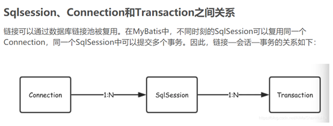

Mybatis链接


所以每次执行sql都会去连接池获取一个连接，执行一个sqlsession，sqlsession执行完一个事务提交后这个sqlsession也关闭了，连接回到连接池

鹏-o-:
首先innodb的每个增删改都是一个事务。不手动commit sqlsessionfactory的话，一个sqlsession就只执行一个事务。一般都是自动提交

鹏-o-:
若是你用了@transaction自定义一个事务，那里面所有语法都是一个sqlsession也就是一次连接

鹏-o-:
事务提高效率


#### mybatis 中BigDecimal中的0存为null的问题解决

mybatis中的类型判断是弱类型，而不是java中的强类型。

错误语句如下：

```
 <if test="bigDecimalNum !=null and bigDecimalNum !=''"> 
 #{bigDecimalNum }, 
 </if> 
```

因为多了个bigDecimalNum !=''， mybatis会自动把BigDecimal类型转为string，即0变为null啦。

正确的写法如下

```
 <if test="bigDecimalNum !=null"> 
  #{bigDecimalNum }, 
 </if> 
```

去掉bigDecimalNum !=''后正常。

同样的道理，数值类型在mybatis中一定不能加 ！=''的判断，否则就会把0作为null处理


通常一个mapper.xml文件，都会对应一个Dao接口，这个Dao接口的工作原理是什么？Dao接口里的方法，参数不同时，方法能重载吗？

**Mapper 接口的工作原理是JDK动态代理，Mybatis运行时会使用JDK动态代理为Mapper接口生成代理对象proxy，代理对象会拦截接口方法，根据类的全限定名+方法名，唯一定位到一个MapperStatement并调用执行器执行所代表的sql，然后将sql执行结果返回。**

Mapper接口里的方法，是不能重载的，因为是使用 全限名+方法名 的保存和寻找策略。


\#{}和${}的区别是什么？

**${}是字符串替换，#{}是预处理；**

Mybatis在处理\${}时，就是把${}直接替换成变量的值。而Mybatis在处理#{}时，会对sql语句进行预处理，将sql中的#{}替换为?号，调用PreparedStatement的set方法来赋值；

**使用#{}可以有效的防止SQL注入，提高系统安全性。**


Mybatis的Xml映射文件中，不同的Xml映射文件，id是否可以重复？

**不同的Xml映射文件，如果配置了namespace，那么id可以重复；如果没有配置namespace，那么id不能重复；**

原因就是namespace+id是作为Map<String, MapperStatement>的key使用的，如果没namespace，就剩下id，那么，id重复会导致数据互相覆盖。有了namespace，自然id就可以重复，namespace不同，namespace+id自然也就不同。


简述Mybatis的插件运行原理，以及如何编写一个插件。

答：Mybatis仅可以编写针对ParameterHandler、ResultSetHandler、StatementHandler、Executor这4种接口的插件，**Mybatis使用JDK的动态代理，为需要拦截的接口生成代理对象以实现接口方法拦截功能，每当执行这4种接口对象的方法时，就会进入拦截方法，具体就是InvocationHandler的invoke()方法，当然，只会拦截那些你指定需要拦截的方法**。

**编写插件：实现Mybatis的Interceptor接口并复写intercept()方法，然后再给插件编写注解，指定要拦截哪一个接口的哪些方法即可，最后在配置文件中配置你编写的插件。**


Mybatis如何分页查询？Mysql中可以使用limit语句，但limit并不是标准SQL中的，如果是其它的数据库，则需要使用其它语句。MyBatis提供了RowBounds类，用于实现分页查询。RowBounds中有两个数字，offset和limit。

RowBounds在处理分页时，只是简单的把offset之前的数据都skip掉，超过limit之后的数据不取出，上图中的代码取自MyBatis中的DefaultResultSetHandler类。跳过offset之前的数据是由方法skipRows处理，判断数据是否超过了limit则是由shouldProcessMoreRows方法进行判断。**简单点说道，就是先把数据全部查询到ResultSet，然后从ResultSet中取出offset和limit之间的数据，这就实现了分页查询。**


**Java面试题 Mybatis中一级缓存 和 二级缓存的区别？**

两者区别：一级缓存的作用域是在SqlSession中，二级缓存的作用域是针对mapper做缓存。

##### 一级缓存(本地缓存)：

**一级缓存是框架默认为我们开启的**，我们不需要做任何配置。

##### 二级缓存(全局缓存)：

二级缓存是 mapper 级别的缓存，多个sqlSession去操作同一个Mapper的sql，不管Sqlsession 是否相同，只要 mapper 的 namespace相同就能共享数据。也可以称之为 namespace 级别的缓存 。

**二级缓存开启要求：**
**1，xml 配置中开启 二级缓存**
2，去mapper映射文件中使用二级缓存
3，需要将要存储数据的 pojo 实现 Serializable接口，为了将数据取出做反序列化操作，因为二级的缓存的存储方式多种多样，有可能存储在内存中，也可能储存到磁盘中。

总结： 一级缓存是SqlSession级别的缓存，在当次会话中的相同查询会储存进一级缓存，当SqlSession 的会话关闭了(前提要开启了二级缓存)，该SqlSession的一级缓存数据就会储存进二级缓存中。