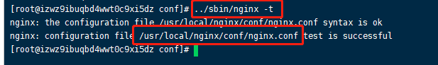

# Nginx

**Nginx只是一个静态文件服务器或者http请求转发器**，它可以把静态文件的请求直接返回静态文件资源，把动态文件的请求转发给后台的处理程序。

**nginx常用命令**

	sudo /usr/local/nginx/sbin/nginx  -c /nginx.config			nginx启动(-c带配置)
	sudo nginx -s reload										nginx重启
	sudo nginx -t										检查配置文件（可查询配置文件路径）
	sudo nginx -s stop											暴力停止服务
	sudo nginx -s quit											优雅停止服务

### 两种进程

**Nginx有两种进程，一个master进程，一种是worker进程**。nginx启动时，会生成两种类型的进程，一个是主进程（Master），一个（windows版本的目前只有一个）或者多个工作进程（Worker）。如图：

**服务器实际处理网络请求及响应的是工作进程（worker）**，在类unix系统上，nginx可以配置多个worker，而每个worker进程都可以同时处理数以千计的网络请求。

worker进程的数量当然也不是越多越好，实际调优的时候，一般要根据cpu 的数量而定。

**为什么这几个worker进程却能支撑上万甚至上十万的并发呢？**

**原因是Nginx设计的时候是基于非阻塞式的方式，能做到非阻塞是因为它的线程模型是基于Linux里面的epoll/select模型，这个也类似于我们java中nio的多路复用选择器模型。事件驱动加上异步非阻塞的io模型，可以说是nginx得以获得高并发、高性能的关键因素。同时学过netty的同学会发现，底层是有很多相似之处的。**

> 正向代理最大的特点是客户端非常明确要访问的服务器地址；服务器只清楚请求来自哪个代理服务器，而不清楚来自哪个具体的客户端；正向代理模式屏蔽或者隐藏了真实客户端信息。例子：科学上网工具、国家医保谈判

> 什么是反向代理？
>
> 明白了什么是正向代理，我们继续看关于反向代理的处理方式，举例如我大天朝的某宝网站，每天同时连接到网站的访问人数已经爆表，单个服务器远远不能满足人民日益增长的购买欲望了，此时就出现了一个大家耳熟能详的名词：分布式部署；也就是通过部署多台服务器来解决访问人数限制的问题

个人理解：

正向代理代理的是客户端，反向代理代理的是服务端

#### 负载均衡

通过proxy_pass 可以把请求代理至后端服务，但是为了实现更高的负载及性能， 我们的后端服务通常是多个， 这个是时候可以通过upstream 模块实现负载均衡。

max_fails参数就是设置失败多少次后，认为已经挂了，就剔除，fail_timeout参数就是剔除后从新检测这个属性也是设置恢复时检测的时长间隔，比如设置一分钟，那么服务恢复后得隔一分钟才能检测到并投入使用。可以想象，如果实时去检查的话，会很消耗性能，所以这两个参数非常有用。下面我们把失败最大重试次数设置成10次，恢复检测时长设置成30秒：

