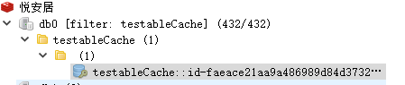

## Redis


优点：读写性能优异，支持持久化，支持事务（redisconntion、lua），数据结构丰富，支持主从/集群

缺点：容量受限，灾备恢复较差


项目用上： 存储字典、单号递增、@Cacheable存储数据、存储token、分布式锁

String:单号递增、token、分布式锁、@Cacheable

SET：判断这个人有没有出过团

HASH:存取字典key、value

Redis主要有5种数据类型，包括String，List，Set，Zset，Hash，满足大部分的使用要求

| 数据类型 | 可以存储的值           | 操作                                                         |
| -------- | ---------------------- | ------------------------------------------------------------ |
| STRING   | 字符串、整数或者浮点数 | 对整个字符串或者字符串的其中一部分执行操作 对整数和浮点数执行自增或者自减操作 |
| LIST     | 列表                   | 从两端压入或者弹出元素 对单个或者多个元素进行修剪， 只保留一个范围内的元素 |
| SET      | 无序集合               | 添加、获取、移除单个元素 检查一个元素是否存在于集合中 计算交集、并集、差集 从集合里面随机获取元素 |
| HASH     | 包含键值对的无序散列表 | 添加、获取、移除单个键值对 获取所有键值对 检查某个键是否存在 |
| ZSET     | 有序集合               | 添加、获取、删除元素 根据分值范围或者成员来获取元素 计算一个键的排名 |


Redis 提供了RDB和AOF两种持久化方式。默认是只开启RDB，当Redis重启时，它会优先使用AOF文件来还原数据集。

**RDB持久化（快照持久化）**

RDB持久化：将某个节点的所有数据都保存在硬盘上。

创建快照的几种方式：

1.save命令:快照创建完毕之前不会再响应任何其他命令。

2.bgsave命令:开辟子进程去处理，主线程去处理命令请求

3.主从复制

4.shutdown：执行一个SAVE命令，阻塞所有客户端，不再执行客户端发送的任何命令，并在SAVE命令执行完毕之后关闭服务器

**如果系统真的发生崩溃，用户将丢失最近一次生成快照之后更改的所有数据。因此，快照持久化只适用于即使丢失一部分数据也不会造成一些大问题的应用程序。不能接受这个缺点的话，可以考虑AOF持久化。**

**AOF持久化**

AOF持久化：将写命令添加到AOF文件的末尾

与快照持久化相比，**AOF持久化的实时性更好**，因此已成为主流的持久化方案。

在Redis的配置文件中存在三种同步方式

|   选项   |                  同步频率                   |
| :------: | :-----------------------------------------: |
|  always  | 每个写命令都同步，这样会严重降低Redis的速度 |
| everysec |                每秒同步一次                 |
|    no    |          让操作系统来决定何时同步           |

重写/压缩AOF
AOF虽然在某个角度可以将数据丢失降低到最小而且对性能影响也很小，但是极端的情况下，体积不断增大的AOF文件很可能会用完硬盘空间。另外，如果AOF体积过大，那么还原操作执行时间就可能会非常长。

为了解决AOF体积过大的问题，**用户可以向Redis发送 BGREWRITEAOF命令 ，这个命令会通过移除AOF文件中的冗余命令来重写（rewrite）AOF文件来减小AOF文件的体积**。

Redis 4.0 对持久化机制的优化
Redis 4.0 开始支持 RDB 和 AOF 的混合持久化（默认关闭，可以通过配置项 aof-use-rdb-preamble 开启）。

如果把混合持久化打开，AOF 重写的时候就直接把 RDB 的内容写到 AOF 文件开头。这样做的好处是可以结合 RDB 和 AOF 的优点, 快速加载同时避免丢失过多的数据。当然缺点也是有的， AOF 里面的 RDB 部分就是压缩格式不再是 AOF 格式，可读性较差。


#### 缓存雪崩

缓存雪崩：指缓存中数据大批量到过期时间，而查询数据量巨大，引起数据库压力过大甚至down机。

**解决方案**

1. **过期时间打散。**缓存数据的过期时间设置随机，防止同一时间大量数据过期现象发生。
2. **加互斥锁**。一般并发量不是特别多的时候，使用最多的解决方案是加锁排队。
3. **热点数据不过期**。该方式和缓存击穿一样，也是要着重考虑刷新的时间间隔和数据异常如何处理的情况。


关于互斥锁的选择，网上看到的大部分文章都是选择 Redis 分布式锁，因为这个可以保证只有一个请求会走到数据库，这是一种思路。

但是其实仔细想想的话，这边其实没有必要保证只有一个请求走到数据库，只要保证走到数据库的请求能大大降低即可，所以还有另一个思路是 JVM 锁。

JVM 锁保证了在单台服务器上只有一个请求走到数据库，通常来说已经足够保证数据库的压力大大降低，同时在性能上比分布式锁更好。

需要注意的是，无论是使用“分布式锁”，还是“JVM 锁”，加锁时要按 key 维度去加锁。

我看网上很多文章都是使用一个“固定的 key”加锁，这样会导致不同的 key 之间也会互相阻塞，造成性能严重损耗。


#### 缓存穿透

缓存穿透：指缓存和数据库中都没有的数据，导致所有的请求都落到数据库上，造成数据库短时间内承受大量请求而崩掉。

**解决方案**

1. **接口层增加校验**。如用户鉴权校验，id做基础校验，id<=0的直接拦截；
2. **缓存空值**。从缓存取不到的数据，在数据库中也没有取到，这时也可以将key-value对写为key-null，缓存有效时间可以设置短点，如30秒（设置太长会导致正常情况也没法使用）。这样可以防止攻击用户反复用同一个id暴力攻击
3. **布隆过滤器**。使用布隆过滤器存储所有可能访问的 key，不存在的 key 直接被过滤，存在的 key 则再进一步查询缓存和数据库。


**布隆过滤器的特点是判断不存在的，则一定不存在；判断存在的，大概率存在，但也有小概率不存在。**并且这个概率是可控的，我们可以让这个概率变小或者变高，取决于用户本身的需求。

布隆过滤器由一个 bitSet 和 一组 Hash 函数（算法）组成，是一种空间效率极高的概率型算法和数据结构，主要用来判断一个元素是否在集合中存在。


#### 缓存击穿

缓存击穿：指缓存中没有但数据库中有的数据（一般是缓存时间到期）。和缓存雪崩不同的是，缓存击穿指并发查同一条数据，缓存雪崩是不同数据都过期了，很多数据都查不到从而查数据库

**解决方案**

1. 设置热点数据永远不过期。
2. 加互斥锁。在并发的多个请求中，只有第一个请求线程能拿到锁并执行数据库查询操作，其他的线程拿不到锁就阻塞等着，等到第一个线程将数据写入缓存后，直接走缓存。


#### redis过期键淘汰策略

1.立即删除  

2.定时删除

3.惰性删除


**立即删除对cpu是最不友好的**。因为删除操作会占用cpu的时间，如果刚好碰上了cpu很忙的时候，比如正在做交集或排序等计算的时候，就会给cpu造成额外的压力。

惰性删除的缺点很明显:**浪费内存**。

定时删除是一个折中的办法，每隔一段时间执行一次删除操作。

redis使用的过期键值删除策略是：**惰性删除加上定期删除，两者配合使用**。

#### redis数据淘汰策略

|     策略     |                         描述                         |                           应用场景                           |
| :----------: | :--------------------------------------------------: | :----------------------------------------------------------: |
| volatile-lru | 从已设置过期时间的数据集中挑选最近最少使用的数据淘汰 | 如果设置了过期时间，且分热数据与冷数据，推荐使用 volatile-lru 策略。 |
| volatile-ttl |   从已设置过期时间的数据集中挑选将要过期的数据淘汰   | 如果让 Redis 根据 TTL 来筛选需要删除的key，请使用 volatile-ttl 策略。 |
| allkeys-lru  |       从所有数据集中挑选最近最少使用的数据淘汰       | 使用 Redis 缓存数据时，为了提高缓存命中率，需要保证缓存数据都是热点数据。可以将内存最大使用量设置为热点数据占用的内存量，然后启用 allkeys-lru 淘汰策略，将最近最少使用的数据淘汰。 |

##### 淘汰策略的内部实现

- 客户端执行一个命令，导致 Redis 中的数据增加，占用更多内存
- Redis 检查内存使用量，如果超出 maxmemory 限制，根据策略清除部分 key
- 继续执行下一条命令，以此类推


#### 事务

**Redis 通过 MULTI、EXEC、WATCH 等命令来实现事务(transaction)功能。**事务提供了一种将多个命令请求打包，然后一次性、按顺序地执行多个命令的机制，并且在事务执行期间，服务器不会中断事务而改去执行其他客户端的命令请求，它会将事务中的所有命令都执行完毕，然后才去处理其他客户端的命令请求。

事务中的多个命令被一次性发送给服务器，而不是一条一条发送，这种方式被称为流水线，可以减少客户端与服务器之间的网络通信次数从而提升性能。


https://www.cnblogs.com/coding-one/p/12402543.html)

spring 缓存抽象提供了以下一些注解来实现**声明式缓存**：

（通过拦截器Interceptor 和SpringAOP实现的）

| @Cacheable   | 触发缓存填充                       |
| ------------ | ---------------------------------- |
| @CacheEvict  | 触发缓存清除                       |
| @CachePut    | 在不影响方法执行的情况下更新缓存   |
| @Caching     | 重新组合应用于同一个方法的多个缓存 |
| @CacheConfig | 在类级别共享一些缓存相关的公共设置 |


**@Cacheable 缓存数据**

@Cacheable 提供两个参数来指定缓存名：value、cacheNames，二者选其一即可。

@Cacheable 支持同一个方法关联多个缓存。这种情况下，当执行方法之前，这些关联的每一个缓存都会被检查，而且只要至少其中一个缓存命中了，那么这个缓存中的值就会被返回。示例：

```java
@Cacheable({"menu", "menuById"})
```

当我们在声明 @Cacheable 时不指定 key 参数，则该缓存名下的所有 key 会使用 KeyGenerator 根据参数 自动生成。spring 有一个默认的 SimpleKeyGenerator ，在 spring boot 自动化配置中，这个会被默认注入。

相较于使用 KeyGenerator 生成，spring 官方更推荐显式指定 key 的方式，即指定 @Cacheable 的 key 参数。 

**key 和 keyGenerator 参数是互斥的，同时指定两个会导致异常**。

 **sync**是否同步，true/false。在一个多线程的环境中，某些操作可能被相同的参数并发地调用，这样同一个 value 值可能被多次计算（或多次访问 db），这样就达不到缓存的目的。

**condition**调用前判断，缓存的条件。

**unless**执行后判断，不缓存的条件。

示例：

```java
@Cacheable(cacheNames = {"testableCache"}, key = "'id-' + #id",  condition = "true", unless = "#result.data == null" )
```

redis存储的名称: testableCache::id-“id”




**@CachePut** **更新缓存数据**

**@CacheEvict  删除缓存数据**


### 布隆过滤器

#### （不存在的一定不存在，存在的可能存在）


什么是布隆过滤器？

我们可以把它看作由**二进制向量（或者说位数组）和一系列随机映射函数（哈希函数）两部分组成的数据结构。**相比于我们平时常用的的 List、Map 、Set 等数据结构，它占用空间更少并且效率更高，但是缺点是其返回的结果是概率性的，而不是非常准确的。理论情况下添加到集合中的元素越多，误报的可能性就越大。并且，存放在布隆过滤器的数据不容易删除。


给你一个数据，如何判断给你的数据在不在其中。如果服务器的内存足够大，那么用HashMap是一个不错的解决方案，理论上的时间复杂度可以达到O(1)，但是现在数据的大小已经远远超出了服务器的内存，所以无法使用HashMap，这个时候就可以使用“布隆过滤器”来解决这个问题。但是还是同样的，会有一定的“误判率”。

仅从布隆过滤器本身而言，根本没有存放完整的数据，只是运用一系列随机映射函数计算出位置，然后填充二进制向量。

布隆过滤器的优缺点：

- 优点：**由于存放的不是完整的数据，所以占用的内存很少，而且新增，查询速度够快；**
- 缺点： **随着数据的增加，误判率随之增加；无法做到删除数据；只能判断数据是否一定不存在，而无法判断数据是否一定存在。**

使用guava实现布隆过滤器是把数据放在本地内存中，无法实现布隆过滤器的共享（共享方便集群进行判断），我们还可以把数据放在redis中，用 redis来实现布隆过滤器，我们要使用的数据结构是bitmap，你可能会有疑问，redis支持五种数据结构：String，List，Hash，Set，ZSet，没有bitmap呀。没错，实际上bitmap的本质还是String。


### 1、Redis 是单线程还是多线程？

redis 4.0 之前，redis 是***\*完全单线程的\****。

redis 4.0 时，redis 引入了多线程，但是**额外的线程只是用于后台处理**

redis 6.0 中，**多线程主要用于网络 I/O 阶段**，也就是接收命令和写回结果阶段，而在执行命令阶段，还是由单线程串行执行。由于执行时还是串行，因此无需考虑并发安全问题。


### 2、为什么 Redis 是单线程？

因为 redis 是完全基于内存操作的，通常情况下CPU不会是redis的瓶颈，**redis 的瓶颈最有可能是机器内存的大小或者网络带宽**。

既然CPU不会成为瓶颈，那就顺理成章地采用单线程的方案了，因为**如果使用多线程的话会更复杂，同时需要引入上下文切换、加锁等等，会带来额外的性能消耗**。


### 3、Redis 为什么使用单进程、单线程也很快

主要有以下几点：

1、基于内存的操作

2、使用了 I/O 多路复用模型，select、epoll 等，基于 reactor 模式开发了自己的网络事件处理器

3、单线程可以避免不必要的上下文切换和竞争条件，减少了这方面的性能消耗。

4、以上这三点是 redis 性能高的主要原因，其他的还有一些小优化，例如：对数据结构进行了优化，简单动态字符串、压缩列表等

### 4、Sorted Set 为什么使用跳跃表，而不是红黑树？

主要有以下几个原因：

1）跳表的性能和红黑树差不多。

2）跳表更容易实现和调试。


### 5、为什么是让缓存失效，而不是更新缓存

案例如下，有两个并发的写请求，流程如下：


分析：由于是删除缓存，所以不存在数据不一致的情况。


### 6、如何保证数据库和缓存的数据一致性

在上文的案例中，无论是先操作数据库，还是先操作缓存，都会存在脏数据的情况，有办法避免吗？

答案是有的，由于数据库和缓存是两个不同的数据源，要保证其数据一致性，其实就是**典型的分布式事务场景，可以引入分布式事务来解决，常见的有：2PC、TCC、MQ事务消息等。**

但是**引入分布式事务必然会带来性能上的影响，这与我们当初引入缓存来提升性能的目的是相违背的**。

所以**在实际使用中，通常不会去保证缓存和数据库的强一致性，而是做出一定的牺牲，保证两者数据的最终一致性。**

**如果是实在无法接受脏数据的场景，则比较合理的方式是放弃使用缓存，直接走数据库。**

保证数据库和缓存数据最终一致性的常用方案如下：

1）更新数据库，数据库产生 binlog。

2）监听和消费 binlog，执行失效缓存操作。

3）如果步骤2失效缓存失败，则引入重试机制，将失败的数据通过MQ方式进行重试，同时考虑是否需要引入幂等机制。


兜底：当出现未知的问题时，及时告警通知，人为介入处理。


### 7、**redis延时双删**（数据库和缓存双写一致性方案）

https://www.it610.com/article/1306087917600411648.htm


（1）先淘汰缓存；

（2）再写数据库（这两步和原来一样）；

（3）休眠1秒，再次淘汰缓存；

这么做，可以将1秒内所造成的缓存脏数据，再次删除！


双删是为了**确保缓存和数据库的数据一致性**

延时是确保 **修改数据库 -> 清空缓存前，其他事务的更改缓存操作已经执行完。**


#### 字符串 string

Redis 中的字符串是一种 **动态字符串**，这意味着使用者可以修改，它的底层实现有点类似于 Java 中的 ArrayList，有一个字符数组，从源码的 sds.h/sdshdr 文件 中可以看到 Redis 底层对于字符串的定义 SDS，即 Simple Dynamic String 结构。

#### 列表 list

Redis 的列表相当于 Java 语言中的 **LinkedList**，注意它是链表而不是数组。这意味着 list 的插入和删除操作非常快，时间复杂度为 O(1)，但是索引定位很慢，时间复杂度为 O(n)。

#### 字典 hash

Redis 中的字典相当于 Java 中的 **HashMap**，内部实现也差不多类似，都是通过 **"数组 + 链表"** 的链地址法来解决部分 **哈希冲突**，同时这样的结构也吸收了两种不同数据结构的优点。

#### 集合 set

Redis 的集合相当于 Java 语言中的 **HashSet**，它内部的键值对是无序、唯一的。它的内部实现相当于一个特殊的字典，字典中所有的 value 都是一个值 NULL。

#### 有序列表 zset

这可能使 Redis 最具特色的一个数据结构了，它类似于 Java 中 SortedSet 和 HashMap 的结合体，一方面它是一个 set，保证了内部 value 的唯一性，另一方面它可以为每个 value 赋予一个 score 值，用来代表排序的权重。

它的内部实现用的是一种叫做 「**跳跃表**」 的数据结构。


### redis模式

#### 一. 主从

通过持久化功能，Redis保证了即使在服务器重启的情况下也不会损失（或少量损失）数据，因为持久化会把内存中数据保存到硬盘上，重启会从硬盘上加载数据。但是由于数据是存储在一台服务器上的，如果这台服务器出现硬盘故障等问题，也会导致数据丢失。为了**避免单点故障**，通常的做法是将数据库复制多个副本以部署在不同的服务器上，这样即使有一台服务器出现故障，其他服务器依然可以继续提供服务。

（优点）**读写分离：**

对于读占比较高的场景，可以通过把一部分流量分摊导出从节点(salve) 来减轻主节点（master）压力，同时需要主要只对主节点执行写操作，如下图：

（缺点）当使用从节点响应读请求时，业务端可能会遇到以下问题：

**复制数据延迟**
**读到过期数据**
**从节点故障**


```
主从数据库的配置
master  slave
主不用配置，从redis的conf文件加入 slaveof ip port 就可以了
或者从redis启动时  redis-server --port 6380 --slaveof 127.0.0.1 6379
    从数据库一般是只读，可以改为可写，但写入的数据很容易被主同步没，所以还是只读就可以。
也可以在运行是使用slaveof ip port命令，停止原来的主，切换成刚刚设置的主  slaveof no one会把自己变成主

复制原理
当从数据库启动时，会向主数据库发送sync命令，主数据库接收到sync后开始在后台报错快照rdb，在保存快照期间受到的命名缓存起来，当快照完成时，主数据库会将快照和缓存的命令一块发送给从。复制初始化结束。
之后，主每受到1个命令就同步发送给从。
当出现断开重连后，2.8之后的版本会将断线期间的命令传给重数据库。增量复制

主从复制是乐观复制，当客户端发送写执行给主，主执行完立即将结果返回客户端，并异步的把命令发送给从，从而不影响性能。也可以设置至少同步给多少个从主才可写。
无硬盘复制:如果硬盘效率低将会影响复制性能，2.8之后可以设置无硬盘复制，repl-diskless-sync yes
```


#### 二. 哨兵(sentinel)

当主数据库遇到异常中断服务后，开发者可以通过手动的方式选择一个从数据库来升格为主数据库，以使得系统能够继续提供服务。然而整个过程相对麻烦且需要人工介入，难以实现自动化。 为此，Redis 2.8中提供了哨兵工具来实现自动化的系统监控和故障恢复功能。
**哨兵的作用就是监控redis主、从数据库是否正常运行，主出现故障自动将从数据库转换为主数据库。**

顾名思义，哨兵的作用就是监控Redis系统的运行状况。它的功能包括以下两个。

    （1）监控主数据库和从数据库是否正常运行。
    （2）主数据库出现故障时自动将从数据库转换为主数据库。


可以用**info replication查看主从情况**

```

例子：
1主2从  1哨兵,可以用命令起也可以用配置文件里
可以使用双哨兵，更安全，
redis-server --port 6379
redis-server --port 6380 --slaveof 192.168.0.167 6379
redis-server --port 6381 --slaveof 192.168.0.167 6379


redis-sentinel sentinel.conf
哨兵配置文件
    sentinel.conf
        sentinel monitor mymaster 192.168.0.167 6379 1 

其中mymaster表示要监控的主数据库的名字，可以自己定义一个。这个名字必须仅由大小写字母、数字和“.-_”这 3 个字符组成。后两个参数表示主数据库的地址和端口号，这里我们要监控的是主数据库6379。
注意:

    1、使用时不能用127.0.0.1，需要用真实IP，不然java程序通过哨兵会连到java程序所在的机器(127.0.0.1 )
    
    2、配置哨兵监控一个系统时，只需要配置其监控主数据库即可，哨兵会自动发现所有复制该主数据库的从数据库

这样哨兵就能监控主6379和从6380、6381，一旦6379挂掉，哨兵就会在2个从中选择一个作为主，根据优先级选，如果一样就选个id小的，当6379再起来就作为从存在。
主从切换过程：

（1）      slave leader升级为master
（2）      其他slave修改为新master的slave
（3）      客户端修改连接
（4）      老的master如果重启成功，变为新master的slave


哨兵监控1主2从，停掉主，哨兵会选出1个从作为主，变成1主1从。然而当我把原来的主再起来，它不会作为从，只是个独立的节点。

如果在新的主刚被选出来时，我把原来的主起来，它就能成为新主的从节点。
如果在新的主选出来过一会再起原来的主，就不能成为新主的从节点
或者在老的主起来后，重启哨兵也能把它变成从，哨兵配置文件里有，哨兵会执行“+convert-to-slave”

```


#### 三. 集群(**redis cluster**)

即使使用哨兵，redis每个实例也是全量存储，每个redis存储的内容都是完整的数据，浪费内存且有木桶效应。为了最大化利用内存，可以采用集群，就是分布式存储。即每台redis存储不同的内容，
共有16384个slot（2的14次方个）。每个redis分得一些slot，hash_slot = crc16(key) mod 16384 找到对应slot，键是可用键，如果有{}则取{}内的作为可用键，否则整个键是可用键
**集群至少需要3主3从，且每个实例使用不同的配置文件，主从不用配置，集群会自己选**。

修改每个实例的配置文件：

    cluster-enabled yes  --开启集群
    
    cluster-config-file nodes-6382.conf --集群配置文件名，每个实例配置的要不同，redis会根据文件名自动新建
**用集群工具创建集群**

```
集群过程：
首先redis-trib.rb会以客户端的形式尝试连接所有的节点，并发送PING命令以确定节点能够正常服务。如果有任何节点无法连接，则创建失败。同时发送 INFO 命令获取每个节点的运行ID以及是否开启了集群功能（即cluster_enabled为1）。 准备就绪后集群会向每个节点发送 CLUSTER MEET命令，格式为 CLUSTER MEET ip port，这个命令用来告诉当前节点指定ip和port上在运行的节点也是集群的一部分，从而使得6个节点最终可以归入一个集群。

然后redis-trib.rb会分配主从数据库节点，分配的原则是尽量保证每个主数据库运行在不同的IP地址上，同时每个从数据库和主数据库均不运行在同一IP地址上，以保证系统的容灾能力

3主3从，当1个主故障，大家会给对应的从投票，把从立为主，若没有从数据库可以恢复则redis集群就down了。

客户端连接：
使用redis-cli -c -p 任意一个端口
```

##### redis cluster 架构

　　**1)redis-cluster架构图**


　　架构细节:

　　(1)所有的redis节点彼此互联(PING-PONG机制),内部使用二进制协议优化传输速度和带宽.

　　(2)节点的fail是通过集群中超过半数的节点检测失效时才生效.

　　(3)客户端与redis节点直连,不需要中间proxy层.客户端不需要连接集群所有节点,连接集群中任何一个可用节点即可

　　(4)redis-cluster把所有的物理节点映射到[0-16383]slot上,cluster 负责维护node<->slot<->value

 

  **2) redis-cluster选举:容错**


　　(1)领着选举过程是集群中所有master参与,如果半数以上master节点与master节点通信超过(cluster-node-timeout),认为当前master节点挂掉.

　　(2):什么时候整个集群不可用(cluster_state:fail),当集群不可用时,所有对集群的操作做都不可用，收到((error) CLUSTERDOWN The cluster is down)错误

  　　a:如果集群任意master挂掉,且当前master没有slave.集群进入fail状态,也可以理解成进群的slot映射[0-16383]不完成时进入fail状态.

  　　b:如果进群超过半数以上master挂掉，无论是否有slave集群进入fail状态.


#### 杂记

String

set key value
setnx key  value  key不存在才可用 相当于add操作
set key value xx  key存在 相当于update操作

批量操作
mget  k1 k2 k3
mset  k1 v1 k2 v2 k3 v3

getset key newvalue  设置新值返回旧值
append key value  追加值
strlen key 返回字符串的长度（注意中文）

incrbyfloat key 3.5 增加key对应的值3.5

getrange key start end 获取字符串指定下标所有的值

setrange key index value 设置指定下标的对应的值

Hash 
哈希命令都以h开头
hget key field  
hset key field value
hdel key field 
hgetall key 获取所有
 hexists key field   判断hash key 是否有field  复杂度o(1)
 hlen key 获取key的filed数量 复杂度o(1)
 批量  o(n)
 hmset key field value field value
 hmget key field field

 list(列表) 有序 可重复 左右两边弹入弹出
 增 
 lpush/rpush key value1 value2 value3..
 linsert key before|after value newvalue 在list指定的值前后插入newvalue
 删
 lpop/rpop key 
 lrem key count value 
 （count>0 从左到右 删除 count个 value  count<0 从右到左 count=0 全删）
 ltrim key start end 按索引范围修剪列表 
查 
 lrange key start end(包含end) 获取列表指定索引范围所有item
 lindex key index
 llen key 获取列表的长度
 改
 lset key index newvalue  设置列表指定索引值为 newvalue

 LRUSH + LPOP =Stack
 LRUSH + RPOP = Queue
 LPUSH + LTRIM = Capped Collection 控制列表大小
 LPUSH + BRPOP =Message Queue

 SET(集合，特点：无序，无重复，集合间操作)
 sadd  key element1 element2 增加 
 srem  key element1 删除
 scard key  计算几个大小
 sismember key value 判断it是否在集合中
 srandmember key count  从集合中随机挑count个元素（不会破坏集合数据）
 spop key  从集合中随机弹出一个元素
 smembers key 返回集合中的所有元素（无序，小心使用）

集合间
sdiff key1 key2 差集
sinter  key1 key2 交集
sunion key1 key2 并集
+ store destkey  将结果保存在 destkey 中
tips
SADD 标签
spop/srandmember 随机数应用
sadd + sinter 社交相关应用 共同关注的人

zset（有序集合）
key score value
user  1   an_zzz
zadd key score element (可以多对) 增加 o(n)
zrem key element(可以多个) 删除 o(1)
zscore key element 返回元素的分数 (可以多对)
zincrby key increScore element  增加或减少元素分数 o(1)
zcard key 返回元素个数
zrank 获取排名 从小到大，从0开始
zrange key start end [WITHSCORES] 返回指定索引范围内的升序元素[分值]o(long(n)+m)
zrangebyscore key minScore maxScore [WITHSCORES]  返回指定分数范围内的升序元素[分值]
zcount key minScore maxScore 返回指定分数范围内的元素个数
zremrangebyrank key start end 删除指定排名内的升序元素
zremrangebyscore key minScore maxScore 删除指定分数内的升序元素


慢查询参数
首先来关注下慢日志分析对应的两个参数：

1、slowlog-log-slower-than：预设阀值，即记录超过多少时间的记录，默认为10000微秒，即10毫秒。可设置为1000

2、slowlog-max-len：记录慢查询的条数，默认为128条，当超过设置的条数时最早进入队列的将被移除。线上建议增大数值，如：1000，这样可减少队列移除的频率。

config set 设置 


持久化方式
快照 ==》 MySQL dump ,redis RDB
写日志 ==》 MySQL binlog , redis AOF

RDB   
  save(同步)   文件策略：存在老的RDB文件，新替换老 复杂度：O(n)        阻塞？：是（阻塞客户端命令）
  bgsave(异步) 文件策略：与save相同                复杂度：与save相同  阻塞？：是（阻塞发生在fork,fork消耗内存）
  自动生成RDB （自动配置满足任一条件就会执行）
  触发机制：主从复制 shutdown
   RDB   缺点：耗时、耗性能  不可控、丢失数据

AOF
  always             不丢失数据    				IO开销大
  everysec（每秒）	 每秒一次fsync，保护磁盘	丢一秒数据
  no （OS决定fsync）  不用管					不可控

主从复制
指令        无需重启，但不便于管理
slaveof ip:端口
slaveof no one
配置文件   统一配置，需要重启
slaveof ip port
slaveof-read-only yes  只读

规避全量复制
1.第一次全量复制
2.节点运行ID不匹配
3.复制缓冲区不足 网络中断等。。

规避复制风暴

sentinel

三个定时任务
1.每10秒info 
 发现slave节点  确认主从关系
2.每2秒发布订阅 
 每2秒每个sentinel通过master节点的channel交换信息（pub/sub）
3.心态检测
 每1秒每个sentinel对其他sentinel和redis执行ping

 主观下线：每个sentinel节点对redis节点失败的“偏见”
 客观下线：所有sentinel节点对redis节点失败“达成共识”（超过quorum个统一）

 数据分布概念 
  1.节点取余分区
  2.一致性哈希分区
  3.虚拟槽哈希分布

  redis集群

  准备节点 --> meet操作 --> 分配槽 --> 配置主从

  集群伸缩 = 槽和数据在节点之间的移动

  加入集群的作用
  1.为他迁移槽和数据实现扩容
  2.作为从节点负责故障转移

  收缩集群
  1.下线迁移槽
  2.忘记节点
  3.关闭节点

  客户端路由
  moved 和 ask
  两者都是客户端重定向
  moved:槽已经确定迁移
  ask:槽还在迁移中

  数据倾斜
  1.节点和槽分配不均匀
  2.不同槽对应键值数差异较大
  3.包含bigkey
  4.内存相关配置不一致