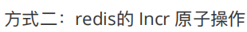

# RocketMQ


解耦、异步、削峰


topic(主题)：表示一类消息的集合，每个主题包含若干条消息，每条消息只能属于一个主题，是RocketMQ进行消息订阅的基本单位。

tag：消息标签，用于对某个Topic下的消息进行分类

group：

##### 生产者组（Producer Group）

同一类Producer的集合，这类Producer发送同一类消息且发送逻辑一致。如果发送的是事务消息且原始生产者在发送之后崩溃，则Broker服务器会联系同一生产者组的其他生产者实例以提交或回溯消费。

##### 消费者组（Consumer Group）

同一类Consumer的集合，这类Consumer通常消费同一类消息且消费逻辑一致。消费者组使得在消息消费方面，实现负载均衡和容错的目标变得非常容易。要注意的是，消费者组的消费者实例必须订阅完全相同的Topic。RocketMQ 支持两种消息模式：集群消费（Clustering）和广播消费（Broadcasting）。


生产者、消费者、

broker：负责消息的存储和传递，消息查询，HA保证等。

nameServer主要包含两个功能：1）Broker管理	2）路由管理


rocketmq支持顺序消息，而在rocketmq-spring-boot-starter中，分别提供了顺序同步，顺序异步，顺序单向的方式。但是在阿里云平台提供的rocketmq中，文档中只支持同步顺序消息。

rocketmq-spring-boot-starter提供一下三种方法：

生产者

```undefined
同步：syncSendOrderly
异步：asyncSendOrderly
单向：sendOneWayOrderly
```


消费者的 消费模式需要改成：consumeMode = ConsumeMode.ORDERLY


rocketMQ具有消息重试的机制，重试也分为两种重试：**producer重试**和**consumer重试**。

### producer重试

如果由于网络抖动等原因，Producer程序向Broker发送消息时没有成功，即发送端没有收到Broker的ACK，导致最终Consumer无法消费消息，此时RocketMQ会自动进行重试。

可以通过以下方式进行配置：
 1）使用starter的同学可以直接在yml文件中进行配置，主要属性有**超时时间**，**重试次数**，另外提供一个**在其他broker节点重试**的机制，如下所示：


```csharp
rocketmq:
  name-server: http://101.200.36.168:9876
  producer:
    #指定消息发送者的组，在控制台查询时会用到
    group: test
    #发送失败超时时间
    send-message-timeout: 3000
    #重试次数
    retry-times-when-send-failed: 3
    #在其他broker服务端进行重试默认false，开启设置为on
    retry-next-server: false
```


### consumer重试（两种：监听、自定义消费者）

两种方式默认情况下都是重试16次，使用延时等级配置的时间。
 自定义消费者可以使用如下的方式进行配置最大重试次数：

```java
 //设置重试次数为2
 consumer.setMaxReconsumeTimes(2);
```


## 消息过滤


**Kafka 与周边生态系统的兼容性是最好的没有之一，尤其在大数据和流计算领域，几乎所有的相关开源软件系统都会优先支持 Kafka。** Kafka 这种异步批量的设计带来的问题是，它的同步收发消息的响应时延比较高，因为当客户端发送一条消息的时候，Kafka 并不会立即发送出去，而是要等一会儿攒一批再发送，在它的 Broker 中，很多地方都会使用这种“先攒一波再一起处理”的设计。**当你的业务场景中，每秒钟消息数量没有那么多的时候，Kafka 的时延反而会比较高。所以，Kafka 不太适合在线业务场景。**


### 03 消息模型：主题和队列有什么区别？

消息模型分为两种：**队列模型**和**发布-订阅模型**。两种模型最大的区别就是：**一份消息数据能不能被消费多次的问题**。

队列是**先进先出（FIFO**, First-In-First-Out）的**线性表**（Linear List）。在具体应用中通常用链表或者数组来实现。队列只允许在后端（称为 rear）进行插入操作，在前端（称为 front）进行删除操作。

**早期的消息队列，就是按照“队列”的数据结构来设计的**。


**如果需要将一份消息数据分发给多个消费者，要求每个消费者都能收到全量的消息，例如，对于一份订单数据，风控系统、分析系统、支付系统等都需要接收消息。这个时候，单个队列就满足不了需求，一个可行的解决方式是，为每个消费者创建一个单独的队列，让生产者发送多份。(报纸📰分发与订阅报纸的客户,多个送报的人) 显然这是个比较蠢的做法，同样的一份消息数据被复制到多个队列中会浪费资源，更重要的是，生产者必须知道有多少个消费者。为每个消费者单独发送一份消息，这实际上违背了消息队列“解耦”这个设计初衷。 为了解决这个问题，演化出了另外一种消息模型：“发布 - 订阅模型（Publish-Subscribe Pattern）”。**


**在发布 - 订阅模型中，消息的发送方称为发布者（Publisher），消息的接收方称为订阅者（Subscriber），服务端存放消息的容器称为主题（Topic）。发布者将消息发送到主题中，订阅者在接收消息之前需要先“订阅主题”。“订阅”在这里既是一个动作，同时还可以认为是主题在消费时的一个逻辑副本，每份订阅中，订阅者都可以接收到主题的所有消息。**

**(比如有人订阅了齐鲁晚报,齐鲁商报,齐鲁人民报,那么每天都会有三份不同的报纸给他放到家门口收件处)** 

**(也有人订阅了汽车杂志,科技前沿杂志,那么那个订阅者每天都是接收这两份杂志)** 

**(再有人订阅花花公子,美妆杂志,孕期杂志,就接收这三份杂志)**


#### **RabbitMQ 的消息模型**

大部分消息队列都是使用发布订阅模型。RabbitMQ例外，RabbitMQ也不是普通的队列模型，RabbitMQ有一个特色Exchange模块。在 RabbitMQ 中，Exchange 位于生产者和队列之间，生产者并不关心将消息发送给哪个队列，而是将消息发送给 Exchange，由 Exchange 上配置的策略来决定将消息投递到哪些队列中。


**同一份消息如果需要被多个消费者来消费，需要配置 Exchange 将消息发送到多个队列，每个队列中都存放一份完整的消息数据，可以为一个消费者提供消费服务。这也可以变相地实现新发布 - 订阅模型中，“一份消息数据可以被多个订阅者来多次消费”这样的功能。具体的配置你可以参考 RabbitMQ 官方教程，其中一个章节专门是讲如何实现发布订阅的。**

#### **RocketMQ 的消息模型**

**RocketMQ 使用的消息模型是标准的发布 - 订阅模型**，在 RocketMQ 的术语表中，生产者、消费者和主题与我在上面讲的发布 - 订阅模型中的概念是完全一样的。
但是，在 RocketMQ 也有队列（Queue）这个概念，并且队列在 RocketMQ 中是一个非常重要的概念，那队列在 RocketMQ 中的作用是什么呢？这就要从消息队列的消费机制说起。

**几乎所有的消息队列产品都使用一种非常朴素的“请求 - 确认”机制，确保消息不会在传递过程中由于网络或服务器故障丢失。具体的做法也非常简单。在生产端，生产者先将消息发送给服务端，也就是 Broker，服务端在收到消息并将消息写入主题或者队列中后，会给生产者发送确认的响应。 如果生产者没有收到服务端的确认或者收到失败的响应，则会重新发送消息；在消费端，消费者在收到消息并完成自己的消费业务逻辑（比如，将数据保存到数据库中）后，也会给服务端发送消费成功的确认，服务端只有收到消费确认后，才认为一条消息被成功消费，否则它会给消费者重新发送这条消息，直到收到对应的消费成功确认。 这个确认机制很好地保证了消息传递过程中的可靠性，但是，引入这个机制在消费端带来了一个不小的问题。什么问题呢？为了确保消息的有序性，在某一条消息被成功消费之前，下一条消息是不能被消费的，否则就会出现消息空洞，违背了有序性这个原则。 也就是说，每个主题在任意时刻，至多只能有一个消费者实例在进行消费，那就没法通过水平扩展消费者的数量来提升消费端总体的消费性能。为了解决这个问题，RocketMQ 在主题下面增加了队列的概念。 每个主题包含多个队列，通过多个队列来实现多实例并行生产和消费。需要注意的是，RocketMQ 只在队列上保证消息的有序性，主题层面是无法保证消息的严格顺序的。RocketMQ 中，订阅者的概念是通过消费组（Consumer Group）来体现的。每个消费组都消费主题中一份完整的消息，不同消费组之间消费进度彼此不受影响，也就是说，一条消息被 Consumer Group1 消费过，也会再给 Consumer Group2 消费。**

**消费组中包含多个消费者，同一个组内的消费者是竞争消费的关系，每个消费者负责消费组内的一部分消息。如果一条消息被消费者 Consumer1 消费了，那同组的其他消费者就不会再收到这条消息。 在 Topic 的消费过程中，由于消息需要被不同的组进行多次消费，所以消费完的消息并不会立即被删除，这就需要 RocketMQ 为每个消费组在每个队列上维护一个消费位置（Consumer Offset），这个位置之前的消息都被消费过，之后的消息都没有被消费过，每成功消费一条消息，消费位置就加一。这个消费位置是非常重要的概念，我们在使用消息队列的时候，丢消息的原因大多是由于消费位置处理不当导致的。 RocketMQ 的消息模型中，比较关键的概念就是这些了。为了便于你理解，我画了下面这张图：**


#### **Kafka 的消息模型** 

**我们再来看看另一种常见的消息队列 Kafka，Kafka 的消息模型和 RocketMQ 是完全一样的，我刚刚讲的所有 RocketMQ 中对应的概念，和生产消费过程中的确认机制，都完全适用于 Kafka。唯一的区别是，在 Kafka 中，队列这个概念的名称不一样，Kafka 中对应的名称是“分区（Partition）”，含义和功能是没有任何区别的。**


### 04  如何利用事务消息实现分布式事务？

**什么是分布式事务？**
那什么是事务呢？如果我们需要对若干数据进行更新操作，为了保证这些数据的完整性和一致性，
我们希望这些更新操作**要么都成功**，**要么都失败**。至于更新的数据，不只局限于数据库中的数据，
可以是磁盘上的一个文件，也可以是远端的一个服务，或者以其他形式存储的数据。

一个严格意义的事务实现，应该具有 4 个属性：原子性、一致性、隔离性、持久性。这四个属性通常称为 ACID 特性。

大部分传统的单体关系型数据库都完整的实现了 ACID，但是，**对于分布式系统来说，严格的实现 ACID 这四个特性几乎是不可能的，或者说实现的代价太大，大到我们无法接受**。

分布式事务就是要在分布式系统中的实现事务。在分布式系统中，在保证可用性和不严重牺牲性能的前提下，光是要实现数据的一致性就已经非常困难了，所以出现了很多“残血版”的一致性，比如顺序一致性、最终一致性等等。

在实际应用中，比较常见的分布式事务实现有 2PC（Two-phase Commit，也叫二阶段提交）、TCC(Try-Confirm-Cancel) 和事务消息。每一种实现都有其特定的使用场景，也有各自的问题，都不是完美的解决方案。

**消息队列是如何实现分布式事务的？**
事务消息需要消息队列提供相应的功能才能实现，Kafka 和 RocketMQ 都提供了事务相关功能。

首先，订单系统在消息队列上开启一个事务。然后订单系统给消息服务器发送一个“半消息”，这个半消息不是说消息内容不完整，
它包含的内容就是完整的消息内容，半消息和普通消息的唯一区别是，在事务提交之前，对于消费者来说，这个消息是不可见的。
半消息发送成功后，订单系统就可以执行本地事务了，在订单库中创建一条订单记录，并提交订单库的数据库事务。然后根据本地事务的执行结果决定提交或者回滚事务消息。
如果订单创建成功，那就提交事务消息，购物车系统就可以消费到这条消息继续后续的流程。**如果订单创建失败，那就回滚事务消息，购物车系统就不会收到这条消息。**
这样就基本实现了“要么都成功，要么都失败”的一致性要求。
如果你足够细心，可能已经发现了，这个实现过程中，有一个问题是没有解决的。如果在第四步提交事务消息时失败了怎么办？
对于这个问题，Kafka 和 RocketMQ 给出了 2 种不同的解决方案。

Kafka 的解决方案比较简单粗暴，直接抛出异常，让用户自行处理。我们可以在业务代码中反复重试提交，直到提交成功，或者删除之前创建的订单进行补偿。
RocketMQ 则给出了另外一种解决方案。
RocketMQ 中的分布式事务实现
在 RocketMQ 中的事务实现中，增加了事务反查的机制来解决事务消息提交失败的问题。如果 Producer 也就是订单系统，
在提交或者回滚事务消息时发生网络异常，RocketMQ 的 Broker 没有收到提交或者回滚的请求，Broker 会定期去 Producer 上反查这个事务对应的本地事务的状态，
然后根据反查结果决定提交或者回滚这个事务。
为了支撑这个事务反查机制，我们的业务代码需要实现一个反查本地事务状态的接口，告知 RocketMQ 本地事务是成功还是失败。
在我们这个例子中，反查本地事务的逻辑也很简单，我们只要根据消息中的订单 ID，在订单库中查询这个订单是否存在即可，如果订单存在则返回成功，否则返回失败。RocketMQ 会自动根据事务反查的结果提交或者回滚事务消息。


### 05  如何确保消息不会丢失

现在主流的消息队列产品都提供了非常完善的消息可靠性保证机制，完全可以做到在消息传递过程中，即使发生网络中断或者硬件故障，也能确保消息的可靠传递，不丢消息。
绝大部分丢消息的原因都是由于开发者不熟悉消息队列，没有正确使用和配置消息队列导致的。虽然不同的消息队列提供的 API 不一样，相关的配置项也不同，但是在保证消息可靠传递这块儿，它们的实现原理是一样的。

**检测消息丢失的方法**
我们说，用消息队列最尴尬的情况不是丢消息，而是消息丢了还不知道。一般而言，一个新的系统刚刚上线，各方面都不太稳定，需要一个磨合期，这个时候，特别需要监控到你的系统中是否有消息丢失的情况。
如果是 IT 基础设施比较完善的公司，一般都有分布式链路追踪系统，使用类似的追踪系统可以很方便地追踪每一条消息。如果没有这样的追踪系统，这里我提供一个比较简单的方法，来检查是否有消息丢失的情况。

**我们可以利用消息队列的有序性来验证是否有消息丢失。原理非常简单，在 Producer 端，我们给每个发出的消息附加一个连续递增的序号，然后在 Consumer 端来检查这个序号的连续性。 如果没有消息丢失，Consumer 收到消息的序号必然是连续递增的，或者说收到的消息，其中的序号必然是上一条消息的序号 +1。如果检测到序号不连续，那就是丢消息了。还可以通过缺失的序号来确定丢失的是哪条消息，方便进一步排查原因。 大多数消息队列的客户端都支持拦截器机制，你可以利用这个拦截器机制，在 Producer 发送消息之前的拦截器中将序号注入到消息中，在 Consumer 收到消息的拦截器中检测序号的连续性，这样实现的好处是消息检测的代码不会侵入到你的业务代码中，待你的系统稳定后，也方便将这部分检测的逻辑关闭或者删除。 如果是在一个分布式系统中实现这个检测方法，有几个问题需要你注意。 首先，像 Kafka 和 RocketMQ 这样的消息队列，它是不保证在 Topic 上的严格顺序的，只能保证分区上的消息是有序的，所以我们在发消息的时候必须要指定分区，并且，在每个分区单独检测消息序号的连续性。 如果你的系统中 Producer 是多实例的，由于并不好协调多个 Producer 之间的发送顺序，所以也需要每个 Producer 分别生成各自的消息序号，并且需要附加上 Producer 的标识，在 Consumer 端按照每个 Producer 分别来检测序号的连续性。 Consumer 实例的数量最好和分区数量一致，做到 Consumer 和分区一一对应，这样会比较方便地在 Consumer 内检测消息序号的连续性。**

#### **确保消息可靠传递**

一条消息从生产到消费完成这个过程，可以划分三个阶段，为了方便描述，我给每个阶段分别起了个名字。


- 生产阶段: 在这个阶段，从消息在 Producer 创建出来，经过网络传输发送到 Broker 端。
- 存储阶段: 在这个阶段，消息在 Broker 端存储，如果是集群，消息会在这个阶段被复制到其他的副本上。
- 消费阶段: 在这个阶段，Consumer 从 Broker 上拉取消息，经过网络传输发送到 Consumer 上。

**1. 生产阶段**
在生产阶段，消息队列通过最常用的请求确认机制，来保证消息的可靠传递：当你的代码调用发消息方法时，消息队列的客户端会把消息发送到 Broker，Broker 收到消息后，会给客户端返回一个确认响应，表明消息已经收到了。客户端收到响应后，完成了一次正常消息的发送。只要 Producer 收到了 Broker 的确认响应，就可以保证消息在生产阶段不会丢失。有些消息队列在长时间没收到发送确认响应后，会自动重试，如果重试再失败，就会以返回值或者异常的方式告知用户。
你在编写发送消息代码时，需要注意，正确处理返回值或者捕获异常，就可以保证这个阶段的消息不会丢失。以 Kafka 为例，我们看一下如何可靠地发送消息：
**同步发送时，只要注意捕获异常即可。**

**异步发送时，则需要在回调方法里进行检查。这个地方是需要特别注意的，很多丢消息的原因就是，我们使用了异步发送，却没有在回调中检查发送结果。**

**2. 存储阶段**
在存储阶段正常情况下，只要 Broker 在正常运行，就不会出现丢失消息的问题，但是如果 Broker 出现了故障，比如进程死掉了或者服务器宕机了，还是可能会丢失消息的。
**如果对消息的可靠性要求非常高，可以通过配置 Broker 参数来避免因为宕机丢消息。**

**对于单个节点的 Broker，需要配置 Broker 参数，在收到消息后，将消息写入磁盘后再给 Producer 返回确认响应**，这样即使发生宕机，由于消息已经被写入磁盘，就不会丢失消息，恢复后还可以继续消费。例如，在 RocketMQ 中，需要将刷盘方式 flushDiskType 配置为 SYNC_FLUSH 同步刷盘。
**如果是 Broker 是由多个节点组成的集群，需要将 Broker 集群配置成：至少将消息发送到 2 个以上的节点，再给客户端回复发送确认响应**。这样当某个 Broker 宕机时，其他的 Broker 可以替代宕机的 Broker，也不会发生消息丢失。

**3. 消费阶段**

消费阶段采用和生产阶段类似的确认机制来保证消息的可靠传递，客户端从 Broker 拉取消息后，执行用户的消费业务逻辑，成功后，才会给 Broker 发送消费确认响应。如果 Broker 没有收到消费确认响应，下次拉消息的时候还会返回同一条消息，确保消息不会在网络传输过程中丢失，也不会因为客户端在执行消费逻辑中出错导致丢失。
你在编写消费代码时需要注意的是，**不要在收到消息后就立即发送消费确认，而是应该在执行完所有消费业务逻辑之后，再发送消费确认。**

#### 小结

这节课我带大家分析了一条消息从发送到消费整个流程中，消息队列是如何确保消息的可靠性，不会丢失的。这个过程可以分为分三个阶段，每个阶段都需要正确的编写代码并且设置正确的配置项，才能配合消息队列的可靠性机制，确保消息不会丢失。


### 06  如何处理消费过程中的重复消息？

那有没有消息队列能保证消息不重复呢？
**消息重复的情况必然存在**

在 MQTT 协议中，给出了三种传递消息时能够提供的服务质量标准，这三种服务质量从低到高依次是：

```
**At most once: 至多一次。**消息在传递时，最多会被送达一次。换一个说法就是，没什么消息可靠性保证，允许丢消息。一般都是一些对消息可靠性要求不太高的监控场景使用，比如每分钟上报一次机房温度数据，可以接受数据少量丢失。
**At least once: 至少一次。**消息在传递时，至少会被送达一次。也就是说，不允许丢消息，但是允许有少量重复消息出现。
**Exactly once：恰好一次。**消息在传递时，只会被送达一次，不允许丢失也不允许重复，这个是最高的等级。
```

这个服务质量标准不仅适用于 MQTT，对所有的消息队列都是适用的。我们现在常用的绝大部分消息队列提供的服务质量都是
At least once，包括 RocketMQ、RabbitMQ 和 Kafka 都是这样。也就是说，消息队列很难保证消息不重复。
说到这儿我知道肯定有的同学会反驳我：“你说的不对，我看过 Kafka 的文档，Kafka 是支持 Exactly once 的。”我在这里跟这些同学解释一下，你说的没错，Kafka 的确是支持 Exactly once，但是我讲的也没有问题，为什么呢？
Kafka 支持的“Exactly once”和我们刚刚提到的消息传递的服务质量标准“Exactly once”是不一样的，它是 Kafka 提供的另外一个特性，Kafka 中支持的事务也和我们通常意义理解的事务有一定的差异。

**既然消息队列无法保证消息不重复**，就需要我们的消费代码能够接受“消息是可能会重复的”这一现状，然后，通过一些方法来消除重复消息对业务的影响。
**用幂等性解决重复消息问题**
一般解决重复消息的办法是，在消费端，让我们消费消息的操作具备幂等性。一个幂等操作的特点是，**其任意多次执行所产生的影响均与一次执行的影响相同。**

我们举个例子来说明一下。在不考虑并发的情况下，“将账户 X 的余额设置为 100 元”，执行一次后对系统的影响是，账户 X 的余额变成了 100 元。只要提供的参数 100 元不变，那即使再执行多少次，账户 X 的余额始终都是 100 元，不会变化，这个操作就是一个幂等的操作。
再举一个例子，“将账户 X 的余额加 100 元”，这个操作它就不是幂等的，每执行一次，账户余额就会增加 100 元，执行多次和执行一次对系统的影响（也就是账户的余额）是不一样的。

如果我们系统消费消息的业务逻辑具备幂等性，那就不用担心消息重复的问题了，因为同一条消息，消费一次和消费多次对系统的影响是完全一样的。也就可以认为，消费多次等于消费一次。
从对系统的影响结果来说：**At least once + 幂等消费 = Exactly once。**

那么如何实现幂等操作呢？最好的方式就是，**从业务逻辑设计上入手，将消费的业务逻辑设计成具备幂等性的操作**。但是，不是所有的业务都能设计成天然幂等的，这里就需要一些方法和技巧来实现幂等。

**1. 利用数据库的唯一约束实现幂等**

例如我们刚刚提到的那个不具备幂等特性的转账的例子：将账户 X 的余额加 100 元。在这个例子中，我们可以通过改造业务逻辑，让它具备幂等性。
首先，我们可以限定，对于每个转账单每个账户只可以执行一次变更操作，在分布式系统中，这个限制实现的方法非常多，最简单的是我们在数据库中建一张转账流水表，这个表有三个字段：转账单 ID、账户 ID 和变更金额，然后给转账单 ID 和账户 ID 这两个字段联合起来创建一个唯一约束，这样对于相同的转账单 ID 和账户 ID，表里至多只能存在一条记录。
这样，我们消费消息的逻辑可以变为：“在转账流水表中增加一条转账记录，然后再根据转账记录，异步操作更新用户余额即可。”在转账流水表增加一条转账记录这个操作中，由于我们在这个表中预先定义了“账户 ID 转账单 ID”的唯一约束，对于同一个转账单同一个账户只能插入一条记录，后续重复的插入操作都会失败，这样就实现了一个幂等的操作。我们只要写一个 SQL，正确地实现它就可以了。
基于这个思路，不光是可以使用关系型数据库，只要是支持类似“**INSERT IF NOT EXIST**”语义的存储类系统都可以用于实现幂等，比如，你可以用** Redis 的 SETNX **命令来替代数据库中的唯一约束，来实现幂等消费。

**2. 为更新的数据设置前置条件**
另外一种实现幂等的思路是，**给数据变更设置一个前置条件，如果满足条件就更新数据，否则拒绝更新数据，在更新数据的时候，同时变更前置条件中需要判断的数据。**这样，重复执行这个操作时，由于第一次更新数据的时候已经变更了前置条件中需要判断的数据，不满足前置条件，则不会重复执行更新数据操作。
比如，刚刚我们说过，“将账户 X 的余额增加 100 元”这个操作并不满足幂等性，我们可以把这个操作加上一个前置条件，变为：“如果账户 X 当前的余额为 500 元，将余额加 100 元”，这个操作就具备了幂等性。对应到消息队列中的使用时，可以在发消息时在消息体中带上当前的余额，在消费的时候进行判断数据库中，当前余额是否与消息中的余额相等，只有相等才执行变更操作。（感觉在高并发情况下还是会存在问题，如果刚好有人消费了100，又重复消费消息，岂不是。。。）
但是，如果我们要更新的数据不是数值，或者我们要做一个比较复杂的更新操作怎么办？用什么作为前置判断条件呢？更加通用的方法是，给你的数据增加一个版本号属性，每次更数据前，比较当前数据的版本号是否和消息中的版本号一致，如果不一致就拒绝更新数据，更新数据的同时将版本号 +1，一样可以实现幂等更新。

**3. 记录并检查操作**
如果上面提到的两种实现幂等方法都不能适用于你的场景，我们还有一种通用性最强，适用范围最广的实现幂等性方法：**记录并检查操作，也称为“Token 机制或者 GUID（全局唯一 ID）机制”，实现的思路特别简单：在执行数据更新操作之前，先检查一下是否执行过这个更新操作。**
具体的实现方法是，在发送消息时，给每条消息指定一个全局唯一的 ID，消费时，先根据这个 ID 检查这条消息是否有被消费过，如果没有消费过，才更新数据，然后将消费状态置为已消费。
原理和实现是不是很简单？其实一点儿都不简单，在分布式系统中，这个方法其实是非常难实现的。首先，给每个消息指定一个全局唯一的 ID 就是一件不那么简单的事儿，方法有很多，但都不太好同时满足简单、高可用和高性能，或多或少都要有些牺牲。更加麻烦的是，在“检查消费状态，然后更新数据并且设置消费状态”中，三个操作必须作为一组操作保证原子性，才能真正实现幂等，否则就会出现 Bug。

比如说，对于同一条消息：“全局 ID 为 8，操作为：给 ID 为 666 账户增加 100 元”，有可能出现这样的情况：

```
t0 时刻：Consumer A 收到条消息，检查消息执行状态，发现消息未处理过，开始执行“账户增加 100 元”；
t1 时刻：Consumer B 收到条消息，检查消息执行状态，发现消息未处理过，因为这个时刻，Consumer A 还未来得及更新消息执行状态。
```

这样就会导致账户被错误地增加了两次 100 元，这是一个在分布式系统中非常容易犯的错误，一定要引以为戒。
对于这个问题，当然我们可以用事务来实现，也可以用锁来实现，但是在分布式系统中，无论是分布式事务还是分布式锁都是比较难解决问题。


### 07消息积压了该如何处理？

#### **如何解决消息堆积问题**

首先什么是消息堆积：**消费端消费的速度赶不上生产端生产的速度。**

如何解决消息堆积问题：

1.优化消费端的性能

​	使用消费队列的时候大部分情况下性能问题都出现在消费端。如果消费的速度赶不上生产的速度就会造成消息堆积，如果这种**性能倒挂问题只是暂时的，那问题不大**，只要消费端的性能恢复后，超过发送端的性能，消息是可以逐渐的被消化掉。**反之，则会整个系统就会出现问题。**要么队列的存储被填满无法提供服务，要么消息丢失，这对整个系统都是严重的故障。

​	**消费端的性能优化除了优化消费业务逻辑外，也可以通过水平扩容，增加消费端的并发数来提升总体的消费性能。**要注意：在扩容Consumer的实例数量的同时，必须同步扩容主题中的分区（也叫队列）数量，确保Consumer的实例数和分区数量是相等的。

消息积压了应该如何处理？

​	**能导致积压突然增加，最粗的粒度的原因只有两种：要么是发送变快了，要么是消费变慢了。**

​	大部分消息队列都配置了监控功能，只要**通过监控数据，很容易判断是哪种原因**。**如果短时间不太可能优化消费端的代码来提升消费性能，唯一的方法就是通过扩容消费端的实例来提升总体的消费能力。如果也没办法短时间进行扩容，没办法的办法就是将系统降级，通过关闭一些不重要的业务，将减少发送方发送的数据量，让系统资源尽量服务一些重要的业务**。

​	还有一种不太常见的情况就是发送和消费的速度都没太大变化，这时候你就需要检查一下你的消费端，**是不是消费失败导致一条消息反复消费，这种情况也会导致拖慢整个系统的消费速度**。

​	如果是**消费端变慢了，优先检查一下日志是否有大量的消费错误**。或者卡在某处，比如触发了死锁或者卡在某些资源上了。


### 08答疑解惑

#### 网关在发送消息之后，是如何来接收后端服务的秒杀结果，又如何来给 APP 返回响应的呢？

在解答这个问题之前，我需要先说一下，实际生产环境中的秒杀系统，远比我们举的这个例子复杂得多，实现方案也是多种多样的，不是说一定要按照我们这个例子的方式来实现。在这个例子中，网关接收后端服务秒杀结果，实现的方式也不只一种，这里我给大家提供一个比较简单的方案。

网关在收到 APP 的秒杀请求后，直接给消息队列发消息。至于消息的内容，并不一定是 APP 请求的 Request，只要包含足够的字段就行了，比如用户 ID、设备 ID、请求时间等等。另外，还需要包含这个请求的 ID 和网关的 ID，这些后面我们会用到。
如果发送消息失败，可以直接给 APP 返回秒杀失败结果，成功发送消息之后，线程就阻塞等待秒杀结果。这里面不可能无限等待下去，需要设定一个等待的超时时间。
等待结束之后，去存放秒杀结果的 Map 中查询是否有返回的秒杀结果，如果有就构建 Response，给 APP 返回秒杀结果，如果没有，按秒杀失败处理。
这是处理 APP 请求的线程，接下来我们来看一下，网关如何来接收从后端秒杀服务返回的秒杀结果。
我们可以选择用 RPC 的方式来返回秒杀结果，这里网关节点是 RPC 服务端，后端服务为客户端。之前网关发出去的消息中包含了网关的 ID，后端服务可以通过这个网关 ID 来找到对应的网关实例，秒杀结果中需要包含请求 ID，这个请求 ID 也是从消息中获取的。
网关收到后端服务的秒杀结果之后，用请求 ID 为 Key，把这个结果保存到秒杀结果的 Map 中，然后通知对应的处理 APP 请求的线程，结束等待。我刚刚说过，处理 APP 请求的线程，在结束等待之后，会去秒杀的结果 Map 中查询这个结果，然后再给 APP 返回响应。
我把这个处理过程的流程图放在这里，便于你理解：


#### **详解 RocketMQ 和 Kafka 的消息模型**

RocketMQ 和 kafka 的消息模型理解的还不是很透彻，这两个消息队列产品的消息模型是一样的，我在这里，再把这个模型相关的概念，通过一个例子详细地说一说。
假设有一个主题 MyTopic，我们为主题创建 5 个队列，分布到 2 个 Broker 中。


先说消息生产这一端，假设我们有 3 个生产者实例：Produer0，Produer1 和 Producer2。
**这 3 个生产者是如何对应到 2 个 Broker 的，又是如何对应到 5 个队列的呢？这个很简单，不用对应，随便发**。每个生产者可以在 5 个队列中轮询发送，也可以随机选一个队列发送，或者只往某个队列发送，这些都可以。比如 Producer0 要发 5 条消息，可以都发到队列 Q0 里面，也可以 5 个队列每个队列发一条。
然后说消费端，很多同学没有搞清楚消费组、消费者和队列这几个概念的对应关系。
每个消费组就是一份订阅，它要消费主题 MyTopic 下，所有队列的全部消息。**注意，队列里的消息并不是消费掉就没有了，这里的“消费”，只是去队列里面读了消息，并没有删除，消费完这条消息还是在队列里面。**
**多个消费组在消费同一个主题时，消费组之间是互不影响的**。比如我们有 2 个消费组：G0 和 G1。G0 消费了哪些消息，G1 是不知道的，也不用知道。G0 消费过的消息，G1 还可以消费。即使 G0 积压了很多消息，对 G1 来说也没有任何影响。
然后我们再说消费组的内部，**一个消费组中可以包含多个消费者的实例**。比如说消费组 G1，包含了 2 个消费者 C0 和 C1，那这 2 个消费者又是怎么和主题 MyTopic 的 5 个队列对应的呢？
由于消费确认机制的限制，这里面有一个原则是，**在同一个消费组里面，每个队列只能被一个消费者实例占用**。至于如何分配，这里面有很多策略，我就不展开说了。总之保证每个队列分配一个消费者就行了。比如，我们可以让消费者 C0 消费 Q0，Q1 和 Q2，C1 消费 Q3 和 Q4，**如果 C0 宕机了，会触发重新分配**，这时候 C1 同时消费全部 5 个队列。
再强调一下，**队列占用只是针对消费组内部来说的，对于其他的消费组来说是没有影响的**。比如队列 Q2 被消费组 G1 的消费者 C1 占用了，对于消费组 G2 来说，是完全没有影响的，G2 也可以分配它的消费者来占用和消费队列 Q2。
**最后说一下消费位置，每个消费组内部维护自己的一组消费位置，每个队列对应一个消费位置。消费位置在服务端保存，并且，消费位置和消费者是没有关系的**。每个消费位置一般就是一个整数，记录这个消费组中，这个队列消费到哪个位置了，这个位置之前的消息都成功消费了，之后的消息都没有消费或者正在消费。

#### **如何实现单个队列的并行消费？**

如果不要求严格顺序，如何实现单个队列的并行消费？关于这个问题，有很多的实现方式，在 JMQ（京东自研的消息队列产品）中，它实现的思路是这样的。
比如说，队列中当前有 10 条消息，对应的编号是 0-9，当前的消费位置是 5。同时来了三个消费者来拉消息，把编号为 5、6、7 的消息分别给三个消费者，每人一条。过了一段时间，三个消费成功的响应都回来了，这时候就可以把消费位置更新为 8 了，这样就实现并行消费。
这是理想的情况。还有可能编号为 6、7 的消息响应回来了，编号 5 的消息响应一直回不来，怎么办？这个位置 5 就是一个消息空洞。为了避免位置 5 把这个队列卡住，可以先把消费位置 5 这条消息，复制到一个特殊重试队列中，然后依然把消费位置更新为 8，继续消费。再有消费者来拉消息的时候，优先把重试队列中的那条消息给消费者就可以了。
这是并行消费的一种实现方式。需要注意的是，并行消费开销还是很大的，不应该作为一个常规的，提升消费并发的手段，如果消费慢需要增加消费者的并发数，还是需要扩容队列数。

------

#### **如何保证消息的严格顺序？**

怎么来保证消息的严格顺序？我们多次提到过，主题层面是无法保证严格顺序的，只有在队列上才能保证消息的严格顺序。
**如果说，你的业务必须要求全局严格顺序，就只能把消息队列数配置成 1，生产者和消费者也只能是一个实例，这样才能保证全局严格顺序。**
**大部分情况下，我们并不需要全局严格顺序，只要保证局部有序就可以满足要求了。比如，在传递账户流水记录的时候，只要保证每个账户的流水有序就可以了，不同账户之间的流水记录是不需要保证顺序的。**
**如果需要保证局部严格顺序，可以这样来实现。在发送端，我们使用账户 ID 作为 Key，采用一致性哈希算法计算出队列编号，指定队列来发送消息。一致性哈希算法可以保证，相同 Key 的消息总是发送到同一个队列上，这样可以保证相同 Key 的消息是严格有序的。**如果不考虑队列扩容，也可以用队列数量取模的简单方法来计算队列编号。


### 09学习开源代码该如何入手？

掌握这些开源软件的最佳方式就是去学习它的源代码。很多同学跟我说：“我也很想去看一些开源软件的代码，也尝试去看过，但是面对上千个源码文件，几十万行代码，完全不知道从哪儿入手啊。”
这节课我们就针对这个情况来聊一聊，学习开源软件的代码该如何入手。有一点我提前说明一下，对于这节课里面涉及到的一些名词，我会直接使用英文，主要目的是方便你直接对应到那些开源软件英文官网上的标题。
**通过文档来了解开源项目**
学习源代码应该从哪儿入手呢？**最佳的方式就是先看它的文档。**

通过看文档，你可以快速地掌握这个软件整体的结构，它有哪些功能特性，它涉及到的关键技术、实现原理和它的生态系统等等。在掌握了这些之后，你对它有个整体的了解，然后再去看它的源代码，就不会再有那种盲人摸象找不到头绪的感觉了。
首先强调一点是，你必须去**看这些开源软件官方网站上的文档**，尽量不要去网上搜一些翻译的中文文档。为什么呢？
**因为这些开源软件，特别是一些社区活跃的软件，它的迭代是很快的，即使是自带官方中文翻译的项目，它的中文文档很多都会落后于英文版，你能看到的中文版本很多时候都已经过时了。那非官方的翻译，问题可能就不止是过时的问题了，可能还会出现一些错漏的地方。所以，最好还是直接来看官方的英文文档。**
如果说你的英文阅读水平确实有限，直接阅读英文文档有困难或者看得非常慢，怎么办？你还是要按照我接下来告诉你的方法去看它的英文官网，即使阅读大段的技术文章有困难，网站的标题你总能看懂吧？找到你需要阅读的文章后，**你可以在网上搜一下对应的中文版本，先看一遍中文版，然后再对着英文原版过一遍，弥补中文版可能过时或翻译不准确的问题。**
开源社区经过这么多年的发展，它已经形成一个相对比较成熟的文化。每个开源软件，代码如何管理、社区成员如何沟通、如何协作这些都已经形成了一个比较固定的套路。大多数开源软件，它的官网和技术文档也是有一个相对比较固定的结构的。
接下来我们以Kafka http://kafka.apache.org/ 的官网为例子，来说下怎么来看它的文档。

**如果说你对这个项目完全不了解，没用过这个软件，你首先需要看的文档是Quick Start，按照 Quick Start 中的指导快速把它的环境搭起来**，把它运行起来，这样你会对这个项目有个感性认识，也便于你在后续深入学习的时候“跑”一些例子。
然后你需要找一下它的**Introduction（介绍），一般里面会有项目的基本介绍**。这里面很重要的一点是，你需要找到这个项目用到的一些基本概念或者名词的介绍文档，在 Kafka 的文档中，这些内容就在 Introduction 里面，比如 Topic、Producer、 Consumer、Partition 这些概念在 Kafka 中代表的含义。
有些开源项目会单独有一个 **Basic Concepts 文档来讲这些基础概念**。这个文档非常重要，因为这些开源社区的开发者都有个很不好的爱好：发明概念。很多开源项目都会自己创造一些名词或者概念，了解这些基本概念才有可能看懂它项目的其他文档。
对项目有个基本的了解之后呢，接下来你可以看一下它的使用场景、功能特性以及相关的生态系统的介绍。在 Kafka 中功能相关的内容在**Use cases和EcoSystem两篇文章中，有些项目中会有类似名为 Features 的文档介绍功能和特性。**
**其中项目的生态系统，也就是 EcoSystem，一般会介绍它这个项目适用的一些典型的使用场景，在某个场景下适合与哪些其他的系统一起来配合使用等。**如果说你的系统不是特别特殊或者说冷门的话，你大概率可以在 EcoSystem 里面找到和你类似的场景，可以少走很多的弯路。
你在读完上面这些文档之后，对这个项目的整体应该会有一个比较全面的了解了，比如说：

```
这个项目是干什么的？
能解决哪些问题？
适合在哪些场景使用？
有哪些功能？
如何使用？
```

对这些问题有一个初步的答案之后，接下来你就可以去深入学习它的实现原理了。这是不是意味着，你可以立即去看它的源码呢？这样做或许可行，但并不是最好的方法。
你知道大部分开源项目都是怎么诞生的吗？一般来说是这样的：某个大学或者大厂的科学家，某天脑海里突然出现了一个改变世界的想法，科学家们会基于这个想法做一些深入的研究，然后写了一篇论文在某个学术期刊或者会议上发表。论文发表后在业内获得很多的赞，这时候就轮到像 Google、Facebook 这样的大厂出手了：这个论文很有价值，不如我们把它实现出来吧？一个开源项目就这样诞生了。
所以，**对于这样的开源项目，它背后的这篇论文就是整个项目的灵魂，你如果能把这篇论文看完并且理解透了，这个项目的实现原理也就清楚了。**
对于 Kafka 来说，它的灵魂是这篇博文：**The Log: What every software engineer should know about real-time data’s unifying abstraction**，
对应的中文译稿在这里：《日志：每个软件工程师都应该知道的有关实时数据的统一抽象》。
这篇博文被评为程序员史诗般必读文章，无论你是不是想了解 Kafka 的实现原理，我都强烈推荐你好好读一下上面这篇博文。
学习完项目灵魂，就可以开始阅读源码了。
**用以点带面的方式来阅读源码**
需要注意的是，你在读源码的时候，千万不要上来就找 main 方法这样泛泛地去看，为什么？你可以想一下，**一篇文章，它是一个线性结构**，你从前往后读就行了。**一本书呢？如果我们看目录的话，可以认为是个树状结构，但大多数的书的内容还是按照线性结构来组织的，你可以从前往后读，也可以通过目录跳着读。**
那**程序的源代码是什么结构？那是一个网状结构**，关系错综复杂，所以这种结构是非常不适合人类去阅读的。你如果是泛泛去读源代码，很容易迷失在这个代码织成的网里面。那怎么办？
我推荐大家阅读源码的方式是，**带着问题去读源码，最好是带着问题的答案去读源码**。你每次读源码之前，确定一个具体的问题，比如：

```
RocketMQ 的消息是怎么写到文件里的？
Kafka 的 Coordinator 是怎么维护消费位置的？
```

类似这种非常细粒度的问题，粒度细到每个问题的答案就是一两个流程就可以回答，这样就可以了。如果说你就想学习一下源代码，或者说提不出这些问题怎么办呢？答案还是，**看文档**。
确定问题后，先不要着急看源代码，而是应该先找一下是否有对应的实现文档，一般来说，核心功能都会有专门的文档来说明它的实现原理，比如在 Kafka 的文档中，DESIGN和IMPLEMENTATION两个章节中，介绍了 Kafka 很多功能的实现原理和细节。一些更细节的非核心的功能不一定有专门的文档来说明，但是我们可以去找一找是否有对应的 Improvement Proposal。（Kafka 的所有 Improvement Proposals [在这里](https://cwiki.apache.org/confluence/display/KAFKA/Kafka+Improvement+Proposals)。）
这个 Improvement Proposal 是什么呢？你可以认为它是描述一个新功能的文档，一般开源项目需要增加一个新的功能或者特性的时候，都会创建一个 Improvement Proposal，一般标题都是"xIP- 新功能名称"，其中 IP 就是 Improvement Proposal 的缩写，x 一般就是这个开源项目的名称的首字母，比如 Kafka 中 Improvement Proposal 的标题就都是以 KIP 来开头。
每个 Improvement Proposal 都是有固定格式的，一般要说明为什么需要增加这个功能，会对系统产生那些影响和改变，还有我们最关心的设计和实现原理的简述。
你读完讲解实现的文档再去看源代码，也就是我刚刚说的，不只是带着问题去读，而是带着答案去读源码。这样你在读源码的时候，不仅仅是更容易理解源代码，还可以把更多的精力放在一些实现细节上，这样阅读源码的效果会更好。
**使用这种以问题为阅读单元的方式来读源代码，你每次只要花很短的时间，阅读很少的一部分源码，就能解决一个问题，得到一些收获。这种方式其实是通过一个一个的问题，在网状的源代码中，每次去读几个点组成的那一两条线。随着你通过阅读源码了解的问题越来越多，你对项目源码的理解也会越来越全面和深入。**

**小结**
如果你想了解一个开源项目，学习它的代码，最佳的切入点就是去读它的官方文档，这些文档里面，最重要的灵魂就是项目背后的那篇论文，它一般是这个开源项目的理论基础。
在阅读源码的时候呢，最佳的方式是带着问题去阅读，最好是带着问题的答案去读，这样难度低、周期短、收获快。不要想着一定要从总体上去全面掌握一个项目的所有源代码，也没有必要。
然后，**最重要的是，把主要的流程用流程图或者时序图画出来，把重点的算法、原理用文字写出来。**


同步异步有重试机制，不会因为网络抖动而数据丢失

 


​                               


网络原因没有收到消费者回应，其实是到达消费者了的，那可能触发重试机制，导致重复消费





​	电商应用转变成基于消息队列的方式后，系统可用性就高多了，比如物流系统因为发生故障，需要几分钟的时间来修 ，在这几分钟的时间里，物流系统要处理的内容被 存在消息队列里，用户的下单操作可以正常完成

​	使用消息队列进行流 消峰，很多时候不是因为能力不够，而是出于经济性的考量 比如有的业务系统，流量最高峰也不会超过一万 QPS ，而平时只有一千左右的 QPS 这种情况下我们就可以用个普通性能的服务器（只支持一千左右的 QPS 就可以），然后加个消息队列作为高峰期的缓冲，无须花大笔资金部署能处理上万 QPS 的服务器

 	如果订单系统每秒最多能处理 万次下单，这个处理能力应对正常时段的下单是绰绰有余的，正常时段我们下单后一秒内就能返回结果双十一零点的时候，如果没有消息队列这种缓冲机制，为了保证系统稳定，只能在订单超过一万次后就不允许用户下单了；如果有消息队列做缓冲，我们可以取消这个限制，把一秒内下的订单分散成一段时间来处理，这时有些用户可能在下单后十几秒才能收到下单成功的状态，但是也比不能下单的体验要好

​	数据的产生方只需要把各自的数据写入一个消息队列即可。数据使用方根据各自需求订阅感兴趣的数据，不同数据团队所订阅的数据可以重复也可以不重复，互不干扰也不必和数据产生方关联


消息的发布是指某个生产者向某个topic发送消息；

消息的订阅是指某个消费者关注了某个topic中带有某些tag的消息，进而从该topic消费数据。

​                               

主从同步刷盘超时

主从同步双写超时

主从同步双写找不到从节点

成功发送

​                               

所以一般对key值做幂等性处理

​                               


消费者获取消费次数

 

在消费者有个getReconsumeTimes的方法获取重试次数，但重试次数大于3的时候，发送邮件人工介入


                               

默认3S重试

 

生产者默认重试3次，消费者重试没默认，需要人工介入


;

只订阅这几个tag

先broker过滤再customer验证二次过滤

Broker通过hashcode过滤，customer通过tag

通过tag好处，节省空间，不需要访问内容（高效），避免broker的hash冲突


长轮询，消费者发请求，再15秒内有数据过来消费者可以收到信息


多线程和消息队列的区别


