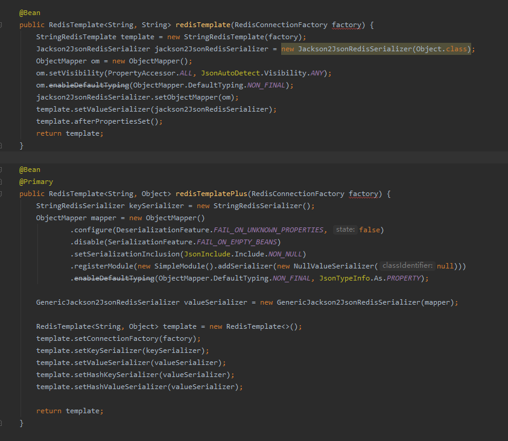

## Spring


@Transactional  失效原因

1. **没使用public方法**。@Transactional 注解应该只被应用到 public 方法上，这是由 Spring AOP 的本质决定的。如果你在 protected、private 或者默认可见性的方法上使用 @Transactional 注解，这将被忽略，也不会抛出任何异常。

2. **不是来自外部的调用。**默认情况下，只有来自外部的方法调用才会被AOP代理捕获，也就是，类内部方法调用本类内部的其他方法并不会引起事务行为，即使被调用方法使用@Transactional注解进行修饰。

   [解决方法](https://blog.csdn.net/li12412414/article/details/81012952)：

   （1） 放在另外的一个类中进行调用    

   

   （2）暴露AOP代理对象  

   ​	例子：

    1. ((ThirdPartyMessageServiceV2) AopContext.currentProxy()).asyncSendMessage(session, messageDto); 

       使用ThreadLocal进行实现，所以开线程时可能会有问题（未认证）

    2. SpringContextUtil.getBean(ThirdPartyMessageServiceV2.class).asyncSendMessage(session, messageDto);（推荐）

        

   （3）往实现类中注入自身。

   

3. **使用多线程**。使用多线程操作数据库（spring 的事务是通过LocalThread来保证线程安全的，事务和当前线程绑定， 搞了多个线程自然会让事务失效）

4. 


### Spring的7种传播特性

| 传播行为(PROPAGATION)     | 描述                                                         |
| ------------------------- | ------------------------------------------------------------ |
| PROPAGATION_REQUIRED      | 如果当前没有事务，就新建一个事务，如果已存在一个事务中，加入到这个事务中，这是最常见的选择。 |
| PROPAGATION_SUPPORTS      | 支持当前事务，如果没有当前事务，就以非事务方法执行。         |
| PROPAGATION_MANDATORY     | 使用当前事务，如果没有当前事务，就抛出异常。                 |
| PROPAGATION_REQUIRES_NEW  | 新建事务，如果当前存在事务，把当前事务挂起。                 |
| PROPAGATION_NOT_SUPPORTED | 以非事务方式执行操作，如果当前存在事务，就把当前事务挂起。   |
| PROPAGATION_NEVER         | 以非事务方式执行操作，如果当前事务存在则抛出异常。           |
| PROPAGATION_NESTED        | 如果当前存在事务，则在嵌套事务内执行。如果当前没有事务，则执行与PROPAGATION_REQUIRED 类似的操作 |


### spring如何解决循环依赖

如何解决

首先搞懂一个概念，解决循环依赖并不是靠我们，spring会帮我们解决
但是！！！记住一点，很重要

**spring只能通过提前暴露bean来解决setter注入的循环依赖，构造器注入的循环依赖无法解决**（Spring实例化一个bean的时候，是分两步进行的，首先实例化目标bean，然后为其注入属性。）

不过话说回来，如果出现循环依赖，一般都是设计上的问题，但凡正经点的项目都不会出现这种问题，如果出现了，不用方，我们能做的就是把构造器创建bean改成setter，剩下的交给spring；

#### Spring 是如何解决的循环依赖？

Spring 是通过提前暴露 bean 的引用来解决的。

**Spring 为了解决单例的循环依赖问题，使用了三级缓存。其中一级缓存为单例池(singletonObjects)，二级缓存为提前曝光对象(earlySingletonObjects)，三级缓存为提前曝光对象工厂(singletonFactories)。**

假设A、B循环引用，实例化 A 的时候就将其放入三级缓存中，接着填充属性的时候，发现依赖了 B，同样的流程也是实例化后放入三级缓存，接着去填充属性时又发现自己依赖 A，这时候从缓存中查找到早期暴露的 A，没有 AOP 代理的话，直接将 A 的原始对象注入 B，完成 B 的初始化后，进行属性填充和初始化，这时候 B 完成后，就去完成剩下的 A 的步骤，如果有 AOP 代理，就进行 AOP 处理获取代理后的对象 A，注入 B，走剩下的流程。


平时自己怎么解决循环依赖的？

1.避免模块间的互相依赖，比如Service互相依赖，可以将不必要的Service去掉，换成mapper层或者抽多个bizService/poService

2.使用@Lazy注解，进行懒加载。

3.使用setter注入

4.@PostConstruct 


#### 为什么要使用三级缓存呢？二级缓存能解决循环依赖吗？

**如果没有 AOP 代理，二级缓存可以解决问题，但是有 AOP 代理的情况下，只用二级缓存就意味着所有 Bean 在实例化后就要完成 AOP 代理，这样违背了 Spring 设计的原则**，Spring 在设计之初就是通过 AnnotationAwareAspectJAutoProxyCreator 这个后置处理器来在 Bean 生命周期的最后一步来完成 AOP 代理，而不是在实例化后就立马进行 AOP 代理。


#### 多个AOP的顺序怎么定

通过 Ordered 和 PriorityOrdered 接口进行排序。PriorityOrdered 接口的优先级比 Ordered 更高，如果同时实现 PriorityOrdered 或 Ordered 接口，则再按 order 值排序，值越小的优先级越高。


#### JDK 动态代理和 Cglib 代理的区别

1、JDK 动态代理本质上是实现了被代理对象的接口，而 Cglib 本质上是继承了被代理对象，覆盖其中的方法。

2、JDK 动态代理只能对实现了接口的类生成代理，Cglib 则没有这个限制。但是 Cglib 因为使用继承实现，所以 Cglib 无法代理被 final 修饰的方法或类。

3、在调用代理方法上，JDK 是通过反射机制调用，Cglib是通过FastClass 机制直接调用。FastClass 简单的理解，就是使用 index 作为入参，可以直接定位到要调用的方法直接进行调用。


> JDK 动态代理为什么只能对实现了接口的类生成代理

根本原因是通过 JDK 动态代理生成的类已经继承了 Proxy 类，所以无法再使用继承的方式去对类实现代理。


#### Spring 事务的实现原理

Spring 事务的底层实现主要使用的技术：AOP（动态代理） + ThreadLocal + try/catch。

动态代理：基本所有要进行逻辑增强的地方都会用到动态代理，AOP 底层也是通过动态代理实现。

ThreadLocal：主要用于线程间的资源隔离，以此实现不同线程可以使用不同的数据源、隔离级别等等。

try/catch：最终是执行 commit 还是 rollback，是根据业务逻辑处理是否抛出异常来决定。


Spring 事务的核心逻辑伪代码如下：

```java
public void invokeWithinTransaction() {
    // 1.事务资源准备
    try {
        // 2.业务逻辑处理，也就是调用被代理的方法
    } catch (Exception e) {
        // 3.出现异常，进行回滚并将异常抛出
    } finally {
        // 现场还原：还原旧的事务信息
    }
    // 4.正常执行，进行事务的提交
    // 返回业务逻辑处理结果
}
```


> Spring中如何让两个bean按顺序加载？

1、使用 @DependsOn、depends-on

2、让后加载的类依赖先加载的类


lazy是是否懒加载，如果一个类不是启动就需要的就可以设置为懒加载，用的时候再初始化。DependsOn是说该类的初始化依赖于另外一个类的初始化，也就是只有另外一个类初始化了，这个类才会初始化。


#### 使用 Mybatis 时，调用 DAO接口时是怎么调用到 SQL 的？

简单点说，当我们使用 Spring+MyBatis 时：

1、DAO接口会被加载到 Spring 容器中，通过动态代理来创建

2、XML中的SQL会被解析并保存到本地缓存中，key是SQL 的 namespace + id，value 是SQL的封装

3、当我们调用DAO接口时，会走到代理类中，通过接口的全路径名，从步骤2的缓存中找到对应的SQL，然后执行并返回结果


#### Spring 如何保证线程安全

一般来说，Spring 管理的 controller、service、dao 都是单例存在，节省内存和 cpu、提高单机资源利用率（默认单例，配置多例模式使用 scope=prototype），既然是单例，那么如何控制单例被多个线程同时访问线程安全呢？

首先要理解每个 http 请求到后台都是一个单独的线程，线程之间共享同一个进程的内存、io、cpu 等资源，但线程栈是线程独有，线程之间不共享栈资源.

**其次，bean 分为有状态 bean 和无状态 bean，有状态 bean 即类定义了成员变量，可能被多个线程同时访问，则会出现线程安全问题；无状态 bean 每个线程访问不会产生线程安全问题，因为各个线程栈及方法栈资源都是独立的，不共享**。即是，无状态 bean 可以在多线程环境下共享，有状态 bean 不能。

Spring 应用中 dao、service 一般以单例形式存在，dao、service 中使用的数据库 connection 以及 RequestContextHolder、TransactionSynchronizationManager、LocaleContextHolder 等都是有状态 bean，而 dao、service 又是单例，如何保证线程安全呢？

答案是**使用 threadLocal 进行处理，ThreadLocal 是线程本地变量，每个线程拥有变量的一个独立副本，所以各个线程之间互不影响，保证了线程安全**


### [SPRING框架七大模块](https://www.cnblogs.com/jmyyyy/p/11079360.html)

 

****

**核心容器（Spring Core）**

　　核心容器提供Spring框架的基本功能。Spring以bean的方式组织和管理Java应用中的各个组件及其关系。Spring使用BeanFactory来产生和管理Bean，它是工厂模式的实现。BeanFactory使用控制反转(IoC)模式将应用的配置和依赖性规范与实际的应用程序代码分开。

**应用上下文（Spring Context）**

　　Spring上下文是一个配置文件，向Spring框架提供上下文信息。Spring上下文包括企业服务，如JNDI、EJB、电子邮件、国际化、校验和调度功能。

**面向切面编程（Spring AOP）**

　　AOP(Aspect Oriented Programming)

　　通过配置管理特性，Spring AOP 模块直接将面向方面的编程功能集成到了 Spring框架中。所以，可以很容易地使 Spring框架管理的任何对象支持 AOP。Spring AOP 模块为基于 Spring 的应用程序中的对象提供了事务管理服务。通过使用 Spring AOP，不用依赖 EJB 组件，就可以将声明性事务管理集成到应用程序中。

**JDBC和DAO模块（Spring DAO）**

　　JDBC、DAO的抽象层提供了有意义的异常层次结构，可用该结构来管理异常处理，和不同数据库供应商所抛出的错误信息。异常层次结构简化了错误处理，并且极大的降低了需要编写的代码数量，比如打开和关闭链接。

**对象实体映射（Spring ORM）**

　　ORM(Object Relational Mapping)

　　Spring框架插入了若干个ORM框架，从而提供了ORM对象的关系工具，其中包括了Hibernate、JDO和 IBatis SQL Map等，所有这些都遵从Spring的通用事物和DAO异常层次结构。

**Web模块（Spring Web）**

　　Web上下文模块建立在应用程序上下文模块之上，为基于web的应用程序提供了上下文。所以Spring框架支持与Struts集成，web模块还简化了处理多部分请求以及将请求参数绑定到域对象的工作。

**MVC模块（Spring Web MVC）**

　　MVC(Model View Controller)

　　MVC框架是一个全功能的构建Web应用程序的MVC实现。通过策略接口，MVC框架变成为高度可配置的。MVC容纳了大量视图技术，其中包括JSP、POI等，模型来有JavaBean来构成，存放于m当中，而视图是一个街口，负责实现模型，控制器表示逻辑代码，由c的事情。Spring框架的功能可以用在任何J2EE服务器当中，大多数功能也适用于不受管理的环境。Spring的核心要点就是支持不绑定到特定J2EE服务的可重用业务和数据的访问的对象，毫无疑问这样的对象可以在不同的J2EE环境，独立应用程序和测试环境之间重用。


个人理解：

 Core、Context、AOP、DAO、ORM、Web、MVC七个模块


#### SpringMVC 的 controller 并发访问

SpringMVC 中的 controller 默认是单例的，那么如果不小心在类中定义了类变量，那么这个类变量是被所有请求共享的，这可能会造成多个请求修改该变量的值，出现与预期结果不符合的异常。所以如上所述，属性变量会到值线程安全问题，解决方法包括使用 **threadLocal 或不使用属性变量、配置为多例均可（加锁控制效率不行）**


### SpringMVC


1、用户发送请求至前端控制器DispatcherServlet。

2、DispatcherServlet收到请求调用HandlerMapping处理器映射器。

3、处理器映射器找到具体的处理器(可以根据xml配置、注解进行查找)，生成处理器对象及处理器拦截器(如果有则生成)一并返回给DispatcherServlet。

4、 DispatcherServlet调用HandlerAdapter处理器适配器。

5、HandlerAdapter经过适配调用具体的处理器(Controller，也叫后端控制器)。

6、Controller执行完成返回ModelAndView。

7、HandlerAdapter将controller执行结果ModelAndView返回给DispatcherServlet。

8、DispatcherServlet将ModelAndView传给ViewReslover视图解析器。

9、ViewReslover解析后返回具体View.

10、DispatcherServlet根据View进行渲染视图（即将模型数据填充至视图中）。 

11、DispatcherServlet响应用户。


### ApplicationEventPublisher / ApplicationEvent

Spring中事件机制：发布ApplicationEventPublisher，实现监听ApplicationEvent。可以使核心业务与子业务进行解耦，也便于后期的业务的扩展。（单机）

https://blog.csdn.net/weixin_43770545/article/details/105971971


##### **applicationEventPublisher.publishEvent();**

调用 ApplicationEventPublisher的publishEvent 方法对某一事件进行发布。随后Spring容器会把该事件告诉所有的监听者。

例子：

```java
applicationEventPublisher.publishEvent(
    new WxPushEvent()
        .setAppId(appid)
        .setWxMpXmlMessage(inMessage)
);
```


##### **@EventListener**

**condition** = "#event.operate.name()==‘ADD’"**对监听进行了细化**：监听类型为“新增”的事件

**注意：自定义监听必须交给spring容器管理，否则不起作用哈。如下图加@Component注解就行**


**方法异步：**

**（可丢弃才能异步）**

**定义方法上方加@Async()注解**就好了。

异步方法可以指定使用某一线程池：如 @Async(“lazyTraceExecutor”)，lazyTraceExecutor是**线程池Bean对象的名字**。

例子：

```java
@MqEventListener
public void wxPushEvent(WxPushEvent event) {
    innerWxPortalService.route(event);
}
```


##### **@TransactionEventListener**

Spring的发布订阅模型实际上并不是异步的，而是同步的来将代码进行解耦。而TransactionEventListener仍是通过这种方式，只不过加入了回调的方式来解决，这样就能够在事务进行Commited，Rollback…等的时候才会去进行Event的处理。

内部实现就是包装@TransactionalEventListener注解的方法，**添加了一个适配器**， ApplicationListenerMethodTransactionalAdapter，内部通过TransactionSynchronizationManager.registerSynchronization **注册一个同步器发布事务时,，记下event，然后注册一个同步器**TransactionSynchronizationEventAdapter，当事务提交后， TransactionSynchronizationManager会回调上面注册的同步适配器，这里注册就是放入到一个ThreadLocal里面，通过它来传递参数。这时，TransactionSynchronizationEventAdapter内部才会真正的去调用hanldeOrderCreatedEvent方法。

其中参数phase默认为AFTER_COMMIT

例子：

```java
@TransactionalEventListener(phase = TransactionPhase.BEFORE_COMMIT)
```


### @PostConstruct、@DependsOn、@Order注解

`@Order`注解的作用是定义Spring IOC容器中Bean的执行顺序的优先级


@PostConstruct 注解可以用于**修饰一个非静态的、返回值类型为 void 的方法**（eg：myInit()）。
该方法（myInit()）**会在服务器加载Servlet的时候被执行，且只会被执行一次**！
**该方法（myInit()）的调用执行在构造函数之后，在Servlet的 init() 方法之前，在Servlet的 destroy()方法之后。**


@DependsOn注解的作用
该注解的作用顾名思义，就是 “**谁依赖谁**”。
假如在Test02类上加上@DependsOn(value = "test01")，那么就说明Test02在加载时，要依赖于Test01，Spring IOC 容器会优先加载Test01，然后再加载Test02。


### 注解

#### @Primary

@Primary：在众多相同的Bean中，优先使用@Primary注解的Bean。

这个和@Qualifier有点区别，@Qualifier指的是使用哪个Bean进行注入。

例子：




#### @Bean

用于注册Bean的注解的有那么多个（如@Component  等），为何还要出现@Bean注解？

原因很简单：类似@Component , @Repository , @ Controller , @Service, @Configration 这些注册Bean的注解存在局限性，只能局限作用于自己编写的类，如果是一个jar包第三方库要加入IOC容器的话，这些注解就手无缚鸡之力了，是的，@Bean注解就可以做到这一点！当然**除了@Bean注解能做到还有@Import也能把第三方库中的类实例交给spring管理**，而且@Import更加方便快捷，只是@Import注解并不在本篇范围内，这里就不再概述。

@Bean注解总结
1、Spring的@Bean注解用于告诉方法，产生一个Bean对象，然后这个Bean对象交给Spring管理。 产生这个Bean对象的方法Spring只会调用一次，随后这个Spring将会将这个Bean对象放在自己的IOC容器中。

2、@Component , @Repository , @ Controller , @Service 这些注解只局限于自己编写的类，而@Bean注解能把第三方库中的类实例加入IOC容器中并交给spring管理。

3、@Bean注解的另一个好处就是能够动态获取一个Bean对象，能够根据环境不同得到不同的Bean对象。

4、记住，@Bean就放在方法上，就是让方法去产生一个Bean，然后交给Spring容器，剩下的你就别管了。


#### @Import

https://blog.csdn.net/mamamalululu00000000/article/details/86711079

1、**@Import只能用在类上** ，@Import通过快速导入的方式实现把实例加入spring的IOC容器中

2、加入IOC容器的方式有很多种，@Import注解就相对很牛皮了，**@Import注解可以用于导入第三方包** ，当然@Bean注解也可以，但是@Import注解快速导入的方式更加便捷

3、@Import注解的三种使用方式总结

第一种用法：`@Import`（{ 要导入的容器中的组件 } ）：容器会自动注册这个组件，**id默认是全类名**

第二种用法：`ImportSelector`：返回需要导入的组件的全类名数组，springboot底层用的特别多【**重点** 】

第三种用法：`ImportBeanDefinitionRegistrar`：手动注册bean到容器

**以上三种用法方式皆可混合在一个@Import中使用，特别注意第一种和第二种都是以全类名的方式注册，而第三中可自定义方式。**

@Import注解本身在springboot中用的很多，特别是其中的第二种用法ImportSelector方式在springboot中使用的特别多，尤其要掌握！


#### @EnableConfigurationProperties

https://www.jianshu.com/p/7f54da1cb2eb

**作用：**

@EnableConfigurationProperties注解的作用是：使使用 **@ConfigurationProperties** 注解的类生效。

**说明：**

**如果一个配置类只配置@ConfigurationProperties注解，而没有使用@Component，那么在IOC容器中是获取不到properties 配置文件转化的bean。说白了 @EnableConfigurationProperties 相当于把使用  @ConfigurationProperties 的类进行了一次注入。**
 测试发现 @ConfigurationProperties 与 @EnableConfigurationProperties 关系特别大。

测试证明：
 `@ConfigurationProperties` 与 `@EnableConfigurationProperties` 的关系。

`@EnableConfigurationProperties` 文档中解释：
 当`@EnableConfigurationProperties`注解应用到你的`@Configuration`时， 任何被`@ConfigurationProperties`注解的beans将自动被Environment属性配置。 这种风格的配置特别适合与SpringApplication的外部YAML配置进行配合使用。


1.使用 `@EnableConfigurationProperties` 进行注册

2.不使用 `@EnableConfigurationProperties` 进行注册，使用 `@Component` 注册 （如果@ConfigurationProperties是在第三方包中，那么@component是不能注入到容器的。只有@EnableConfigurationProperties才可以注入到容器。）（但是使用@Import注解一样能够将bean注册到容器中）


#### @ConditionalOnProperty

在spring boot中有时候需要控制配置类是否生效,可以使用@ConditionalOnProperty注解来控制@[Configuration](https://so.csdn.net/so/search?q=Configuration&spm=1001.2101.3001.7020)是否生效.

**配置类代码:**

```java
@Configuration
@ConditionalOnProperty(prefix = "filter",name = "loginFilter",havingValue = "true", matchIfMissing = true)
public class FilterConfig {
	//prefix为配置文件中的前缀,
	//name为配置的名字
	//havingValue是与配置的值对比值,当两个值相同返回true,配置类生效.
    @Bean
    public FilterRegistrationBean getFilterRegistration() {
        FilterRegistrationBean filterRegistration  = new FilterRegistrationBean(new LoginFilter());
        filterRegistration.addUrlPatterns("/*");
        return filterRegistration;
    }
}

```

**配置文件中的代码:**

```
filter.loginFilter=true
```


### 接口

#### ApplicationContextAware 

　看到—Aware就知道是干什么的了，就是属性注入的。`ApplicationContextAware` 通过它Spring容器会自动把上下文环境对象调用`ApplicationContextAware`接口中的`setApplicationContext`方法。

我们在`ApplicationContextAware`的实现类中，就可以**通过这个上下文环境对象得到Spring容器中的Bean。**

例子：

```java
public class RedisRateLimiterAspect implements ApplicationContextAware {

	// ApplicationContextAware会自动注入上下文
	private  ApplicationContext applicationContext;

}
```


### jackson子类型反序列化问题

```json
{"otaWebhook":{"@class":"com.locals.hudson.ota.airbnb.request.AirbnbWebhookRequest"}
}
```

