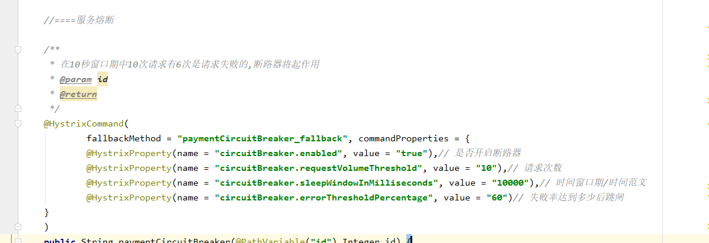
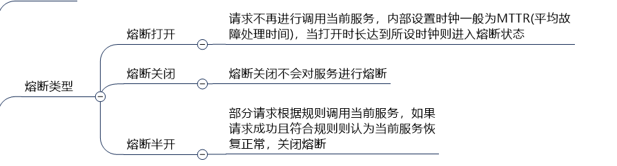
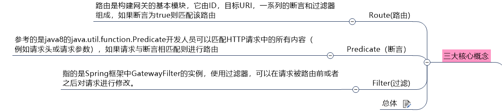
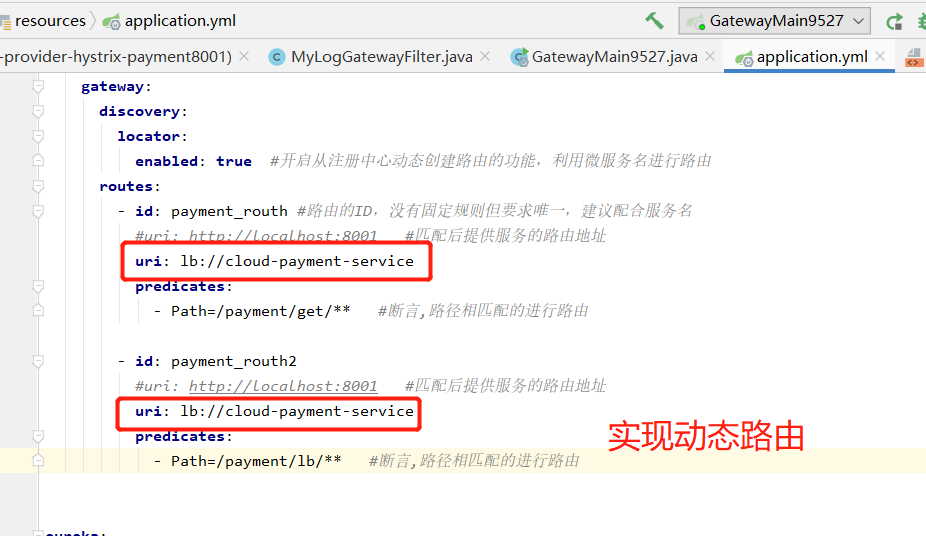
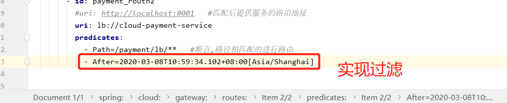
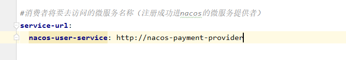
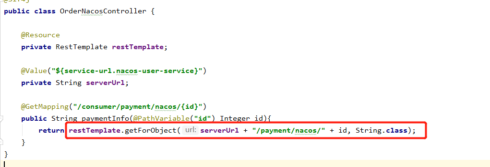
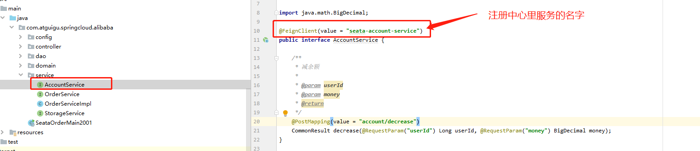

```java
* HystrixCommand:一旦调用服务方法失败并抛出了错误信息后,会自动调用@HystrixCommand标注好的fallbckMethod调用类中的指定方法
* execution.isolation.thread.timeoutInMilliseconds:线程超时时间3秒钟


    @HystrixCommand(fallbackMethod = "payment_TimeOutHandler",commandProperties = {
            @HystrixProperty(name = "execution.isolation.thread.timeoutInMilliseconds", value = "3000")
    })
    
     //@HystrixCommand  
     //全局拦截，需要在类上加 @DefaultProperties(defaultFallback = "payment_Global_FallbackMethod")  以及对应的 payment_Global_FallbackMethod 方法
    public String paymentInfo_TimeOut(Integer id) {
        //int age = 10 / 0;

        int timeNumber = 5;
        try {
            // 暂停3秒钟
            TimeUnit.SECONDS.sleep(timeNumber);
        } catch (InterruptedException e) {
            e.printStackTrace();
        }
        return "线程池:" + Thread.currentThread().getName() + " paymentInfo_TimeOut,id:" + id + 				"\t" + "O(∩_∩)O哈哈~  耗时(秒)" + timeNumber;
    }
    
```

在消费端对业务层接口进行拦截


Hystrix 的三种降级方法

* 在方法上
* 在类上
* 实现需要降级的接口




Hystrix熔断




### gateWay






### Nacos

默认端口 8848

nacos默认是一个AP的模式，可以切换成CP。nacos默认用的是自带的嵌入型数据库derby。支持负载均衡，融入了ribbon

服务**注册中心**(代替Eureka)、服务**配置中心**（代替Config）

在 Nacos Spring Cloud 中，`dataId` 的完整格式如下：

```plain
${prefix}-${spring.profiles.active}.${file-extension}
```

- `prefix` 默认为 `spring.application.name` 的值，也可以通过配置项 `spring.cloud.nacos.config.prefix`来配置。
- `spring.profiles.active` 即为当前环境对应的 profile，详情可以参考 [Spring Boot文档](https://docs.spring.io/spring-boot/docs/current/reference/html/boot-features-profiles.html#boot-features-profiles)。 **注意：当 `spring.profiles.active` 为空时，对应的连接符 `-` 也将不存在，dataId 的拼接格式变成 `${prefix}.${file-extension}`**
- `file-exetension` 为配置内容的数据格式，可以通过配置项 `spring.cloud.nacos.config.file-extension` 来配置。目前只支持 `properties` 和 `yaml` 类型。

通过 Spring Cloud 原生注解 `@RefreshScope` 实现配置自动更新

通过 Spring Cloud 原生注解 `@EnableDiscoveryClient` 开启服务注册发现功能


通过restTemplate进行轮询进行远程调用，restTemplate去nacos找对应服务。







Sentinel

默认端口 8719

dashboard 默认端口8080   

Sentinel 支持以下几种规则：**流量控制规则**、**熔断降级规则**、**系统保护规则**、**来源访问控制规则** 和 **热点参数规则**。

在 Sentinel 中所有流控降级相关的异常都是异常类 `BlockException` 的子类：

- 流控异常：`FlowException`
- 熔断降级异常：`DegradeException`
- 系统保护异常：`SystemBlockException`
- 热点参数限流异常：`ParamFlowException`


服务雪崩

服务熔断

服务降级

服务限流

进入 Sentinel 图形管理界面，并没有看到关于微服务任何信息。这是因为 **`Sentinel 采用的懒加载机制，只有执行一次方法调用，才能被Sentinel监控到。`**


1.流控规则

阈值类型

1.1 阈值类型：QPS  ：  当调用该 API 的 **`QPS`** 达到阈值的时候，进行限流。

1.2 阈值类型：线程数：  当调用该 API 的 **`线程数`** 达到阈值的时候，进行限流。

流控模式

1.3 流控模式：直接  

1.4 流控模式：关联  ：当关联的资源达到阈值时，就限流自己。**`当与 A 资源关联的 B 资源达到阈值时，就限流自己(A)`**，即：B惹事，A挂了  **应用场景：**双十一，`支付接口`和`下单接口`关联。当支付接口达到阈值，就限流下单接口

1.5 流控模式：链路：当链路中的资源达到阈值时，就会对使用到该资源的链路进行流控。**`当 A01 资源达到设定阈值时，所有调用该服务的链路，都会被限流`**，即：**`A01 挂了，用到我的链路都得挂`**

流控效果

1.6 流控效果：快速失败

1.7 流控效果：Warm Up :某个服务，日常访问量很少，基本为 0，突然1s访问量 10w，这种极端情况，会直接将服务击垮。所以通过配置 **`流控效果：Warm Up`**，允许系统慢慢呼呼的进行预热，经预热时长逐渐升至设定的QPS阈值。**公式：**阈值/coldFactor（默认值为3）

**应用场景：** 秒杀系统。秒杀系统在开启的瞬间，会有很多的流量上来，很有可能将系统打死。预热方式就是为了保护系统，可以慢慢的将流量放进来，最终将阈值增长到指定的数值

1.8 流控效果：排队等待:  让请求以均匀的速度通过，对应的是漏桶算法。这种方式主要用于处理间隔性突发的流量，例如消息队列。

**应用场景：**在某一秒有大量的请求到来，而接下来的几秒则处于空闲状态。我们希望系统能够在接下来的空闲期间逐渐处理这些请求，而不是在第一秒直接拒绝多余的请求。


2.降级规则
2.1 RT：即 **`平均响应时间(DEGRADE_GRADE_RT)`** 。


说明： /testA 服务，设置 降级策略为 RT，RT(平均响应时间)为 200ms，时间窗口为 5s。发送请求平均响应时间在 200ms 内，正常访问不会被熔断降级。当平均响应时间 > 200ms，便会被熔断降级。时间窗口5s内断路器处于打开状态，无法提供服务，时间窗口结束，服务恢复正常访问。就是服务会被熔断5s的意思（切记是平均响应时间）

2.2 异常比例：QPS >= 5` && `异常比例超过设定的阈值`，便会发生服务降级 。


异常比例为 0.0~1.0 范围内值。**`时间窗口就是断路器开启时间长短(降级时间)`** 。

2.3 异常数：指的是资源 **`近1分钟`** 的异常数目，超过阈值之后会进行熔断。

**重点注意：**异常数，统计时间窗口是分钟级别，若 timeWindow 小于 60s，则结束熔断状态后仍可能再次进入熔断状态。推荐 **`时间窗口一定要>=60s`**

3.热点规则
3.1 何为热点

热点即经常访问的数据。**`热点参数限流会统计传入参数中的热点参数，并根据配置的限流阈值与模式，对包含热点参数的资源调用进行限流。`** 热点参数限流可以看做是一种特殊的流量控制，仅对包含热点参数的资源调用生效。


3.2 何为热点限流

一句话解释：根据 url 传递进来的参数进行限流。带这个参数就限流，不带就不限流。

3.3 热点规则
Ⅰ.基本配置

业务代码：@SentinelResource(value = "testC")    //此处value值，一般为@XXXMapping属性值去掉斜杠


**配置说明：**

  对 `/testC` 服务，配置热点key限流。当 1.参数 name 存在（参数索引为1对应的参数为name）  2.一秒内调用 `/testC` 服务 > 5次，满足限流规则。服务将被熔断。断路器打开，5s 后服务恢复正常

**友好处理**

  被限流后，直接报错 java.lang.refletc.UndeclaredThrowableException。异常显示到前台用户界面，显然不是不友好。

  此处也是需要用到 @SentinelResource 的 blockHandler 属性，它是 Sentinel控制台违规的兜底方法配置(还会介绍一个 fallback属性，它是@GetMapping请求Java 方法执行出现异常的兜底方法配置，要分清楚)


Ⅱ.参数例外项配置

1.需求：

  当 name 参数值为 Wade 时，限流阈值变更为 100。此时就需要对 参数例外项 进行配置了。

  参数类型 支持：int、double、String、long、float、char、byte 7种类型，参数值 指 name 参数的值，限流阈值 指该参数值允许的阈值。


4.系统规则

系统保护规则是从应用级别的入口流量进行控制，从单台机器的 load、CPU 使用率、平均 RT、入口 QPS 和并发线程数等几个维度监控应用指标，让系统尽可能跑在最大吞吐量的同时保证系统整体的稳定性。

1.系统规则支持以下模式

Load 自适应（仅对 Linux/Unix-like 机器生效）：系统的 load1 作为启发指标，进行自适应系统保护。当系统 load1 超过设定的启发值，且系统当前的并发线程数超过估算的系统容量时才会触发系统保护（BBR 阶段）。系统容量由系统的 maxQps * minRt 估算得出。设定参考值一般是 CPU cores * 2.5。
CPU usage（1.5.0+ 版本）：当系统 CPU 使用率超过阈值即触发系统保护（取值范围 0.0-1.0），比较灵敏。
平均 RT：当单台机器上所有入口流量的平均 RT 达到阈值即触发系统保护，单位是毫秒。
并发线程数：当单台机器上所有入口流量的并发线程数达到阈值即触发系统保护。
入口 QPS：当单台机器上所有入口流量的 QPS 达到阈值即触发系统保护。

2. 入口QPS配置

入口QPS，实用性还是比较危险的。 如果 sentinel 密码被修改，将你的整个系统 **`入口QPS`** 配置很小，那么整个系统就瘫痪了。


### @SentinelResource的用法

@SentinelResource 可以说是 Sentinel 学习的突破口，搞懂了这个注解的应用，基本上就搞清楚了 Sentinel 的大部分应用场景。**`Sentinel 提供了 @SentinelResource 注解用于定义资源，并提供了AspectJ的扩展用于自动定义资源、处理BlockException等。`**

#### 1.@SentinelResource 属性介绍

|         属性名         | 是否必填 | 说明                                                         |
| :--------------------: | :------: | :----------------------------------------------------------- |
|       **value**        |    是    | 资源名称 。（必填项，需要通过 `value` 值找到对应的规则进行配置） |
|       entryType        |    否    | entry类型，标记流量的方向，取值IN/OUT，默认是OUT             |
|    **blockHandler**    |    否    | **处理BlockException的函数名称(可以理解为对Sentinel的配置进行方法兜底)**。函数要求：<br/>1.必须是 public 修饰<br/>2.返回类型与原方法一致<br/>3. 参数类型需要和原方法相匹配，并在最后加 BlockException 类型的参数。<br/>4. 默认需和原方法在同一个类中。若希望使用其他类的函数，可配置 blockHandlerClass ，并指定blockHandlerClass里面的方法。 |
| **blockHandlerClass**  |    否    | **存放blockHandler的类**。 对应的处理函数必须 public static 修饰，否则无法解析，其他要求：同blockHandler。 |
|      **fallback**      |    否    | **用于在抛出异常的时候提供fallback处理逻辑(可以理解为对Java异常情况方法兜底)**。<br/>fallback函数可以针对所有类型的异常（除了 exceptionsToIgnore 里面排除掉的异常类型）进行处理。函数要求：<br/>1.返回类型与原方法一致<br/>2.参数类型需要和原方法相匹配，Sentinel 1.6开始，也可在方法最后加 Throwable 类型的参数。<br/>3.默认需和原方法在同一个类中。若希望使用其他类的函数，可配置 fallbackClass ，并指定fallbackClass里面的方法。 |
|  **defaultFallback**   |    否    | **用于通用的 fallback 逻辑**。<br/>默认 fallback 函数可以针对所有类型的异常（除了 exceptionsToIgnore 里面排除掉的异常类型）进行处理。若同时配置了 fallback 和 defaultFallback，以fallback为准。函数要求：<br/>1.返回类型与原方法一致<br/>2.方法参数列表为空，或者有一个 Throwable 类型的参数。<br/>3.默认需要和原方法在同一个类中。若希望使用其他类的函数，可配置 fallbackClass ，并指定 fallbackClass 里面的方法。 |
| **exceptionsToIgnore** |    否    | **指定排除掉哪些异常。** 排除的异常不会计入异常统计，也不会进入fallback逻辑，而是原样抛出。 |
|   exceptionsToTrace    |    否    | 需要trace的异常                                              |


#### 2. fallback 指定Java异常兜底方法

**2.1 fallback只用来处理与Java逻辑异常相关的兜底**。

比如：NullPointerException、ArrayIndexOutOfBoundsException 等Java代码中的异常，fallback 指定的兜底方法便会生效。

@SentinelResource(value = "testA", fallback = "fallbackMethod")

**2.2 使用 fallbackClass 将兜底方法与业务解耦合**

@SentinelResource(value = "testA", fallback = "fallbackMethod", fallbackClass = CustomerFallback.class)

**2.3 defaultFallback 用于指定通用的 fallback 兜底方法**

使用 defaultFallback 来指定通用的 fallback 兜底方法。

如果当前业务配置有 defaultFallback 和 fallback 两个属性，则优先执行 fallback 指定的方法。
如果 fallback 指定的方法不存在，还会执行 defaultFallback 指定的方法。

```java
@GetMapping("/testA")
@SentinelResource(value = "testA",
        fallback = "fallbackMethod",
        fallbackClass = CustomerFallback.class,
        defaultFallback = "defaultFallbackMethod" //直接指定即可，使用比较简单
)
public String testA() {
    int i = 10 / 0;
    return "-----testA";
}

/**
 * 单独一个类，存放兜底方法
 */
public class CustomerFallback {

    public static String defaultFallbackMethod(Throwable e) {
        return "通用的fallback兜底方法";
    }

    public static String fallbackMethod(Throwable e) {
        return "限流请求连接(Java类异常)的兜底方法：" + e.getMessage();
    }
}

```


#### 3. blockHandler 指定 Sentinel 配置兜底方法

**blockHandler 只用来处理 与 Sentinel 配置有关的兜底**。比如：配置某资源 QPS =1，当 QPS >1 时，blockHandler 指定的兜底方法便会生效。

**3.1 兜底方法与业务方法耦合**.

```java
@GetMapping("/testB")
@SentinelResource(value = "testB",blockHandler = "exceptionMethod")
public String testB() {
    return "-----testB";
}

public String exceptionMethod(BlockException exception) {
    return "限流@SentinelResource value 属性的兜底方法:" + exception;
}

```

**3.2 使用 blockHandlerClass 将兜底方法与业务解耦合**

```java
@GetMapping("/testB")
@SentinelResource(value = "testB",blockHandler = "exceptionMethod",blockHandlerClass = CustomerBlockHandler.class)
public String testB() {
    return "-----testB";
}

/**
 * 单独一个类，存放兜底方法
 */
public class CustomerBlockHandler {

    public static String exceptionMethod(BlockException exception) {
        return "处理与 Sentinel 配置相关的兜底方法:" + exception;
    }
}

```

#### 4. exceptionsToIgnore 用于指定异常不走兜底方法

**使用 exceptionsTolgnore 属性，来 指定某些异常不执行兜底方法，直接显示错误信息。**配置 ArithmeticException 异常不走兜底方法。java.lang.ArithmeticException: / by zero ，便不会再执行兜底方法，直接显示错误信息给前台页面。


### Seata 

#### 什么是 Seata

**Seata 是一款开源的分布式事务解决方案，致力于提供高性能和简单易用的分布式事务服务**。Seata 将为用户提供了 **AT**、TCC、SAGA 和 XA 事务模式，为用户打造一站式的分布式解决方案。

**此处重点介绍   AT模式 ，在工作中也最常用，用起来也比较简单。**

#### Seata 术语表

#### TC (Transaction Coordinator) - 事务协调者

维护全局和分支事务的状态，驱动全局事务提交或回滚。

#### TM (Transaction Manager) - 事务管理器

定义全局事务的范围：开始全局事务、提交或回滚全局事务。

#### RM (Resource Manager) - 资源管理器

管理分支事务处理的资源，与TC交谈以注册分支事务和报告分支事务的状态，并驱动分支事务提交或回滚。


Seata管理的分布式事务的典型生命周期：

1.TM 向 TC 申请开启一个全局事务，全局事务创建成功并生成一个全局唯一的 XID；
2.XID 在微服务调用链路的上下文中传播；
3.RM 向 TC 注册分支事务，将其纳入 XID 对应全局事务的管辖；
4.TM 向 TC 发起针对 XID 的全局提交或回滚决议；
5.TC 调度 XID 下管辖的全局分支事务，完成分支提交或回滚请求。

### 5. AT 模式

#### 优缺点

1. 一个 @GlobalTransactional 注解走天下**（优点）**
2. 基于数据库方式，需要在数据库中建 seata 库，业务库见 undo_log 表**（缺点）**

#### 整体机制

两阶段(2PC)提交协议的演变：

- **一阶段**：业务数据和回滚日志记录在同一个本地事务中提交，释放本地锁和连接资源。
- **二阶段**：

    1.提交异步化，非常快速地完成。

    2.回滚通过一阶段的回滚日志进行反向补偿。

#### 写隔离

- 一阶段本地事务提交前，需要确保先拿到 **全局锁** 。
- 拿不到 **全局锁** ，不能提交本地事务。
- 拿 **全局锁** 的尝试被限制在一定范围内，超出范围将放弃，并回滚本地事务，释放本地锁。

#### 读隔离

在数据库本地事务隔离级别 **读已提交（Read Committed）** 或以上的基础上，Seata（AT 模式）的默认全局隔离级别是 **读未提交（Read Uncommitted）** 。

如果应用在特定场景下，必需要求全局的 **读已提交** ，目前 Seata 的方式是通过 **`SELECT FOR UPDATE`** 语句的代理。

**`SELECT FOR UPDATE`** 语句的执行会申请 **全局锁** ，如果 **全局锁** 被其他事务持有，则释放本地锁（回滚 SELECT FOR UPDATE 语句的本地执行）并重试。这个过程中，查询是被 block 住的，直到 **全局锁** 拿到，即读取的相关数据是 **已提交** 的，才返回。

出于总体性能上的考虑，Seata 目前的方案并没有对所有 SELECT 语句都进行代理，仅针对 FOR UPDATE 的 SELECT 语句。


### OpenFeign

OpenFeign提供了两个重要标注**@FeignClient**和**@EnableFeignClients**。

@FeignClient标注用于声明Feign客户端可访问的Web服务。

@EnableFeignClients标注用于修饰Spring Boot应用的入口类，以通知Spring Boot启动应用时，扫描应用中声明的Feign客户端可访问的Web服务。

调用其他模块的接口




### Gateway（网关）

**Spring Cloud Gateway 底层使用了高性能的通信框架Netty**

SpringCloud Gateway和Zuul主要的区别，还是在底层的通信框架上。

简单说明一下三个术语：

**（**1**）**Filter**（过滤器）**：

和Zuul的过滤器在概念上类似，可以使用它拦截和修改请求，并且对上游的响应，进行二次处理。过滤org.springframework.cloud.gateway.filter.GatewayFilter类的实例。

（2）**Route**（路由）：

网关配置的基本组成模块，和Zuul的路由配置模块类似。一个**Route模块**由一个 ID，一个目标 URI，一组断言和一组过滤器定义。如果断言为真，则路由匹配，目标URI会被访问。

**（**3**）**Predicate**（断言）**：

这是一个 Java 8 的 Predicate，可以使用它来匹配来自 HTTP 请求的任何内容，例如 headers 或参数。**断言的**输入类型是一个 ServerWebExchange。


### Zipkin/Skywalking（分布式跟踪系统）