# java核心技术36讲


## 第1讲 | 谈谈你对Java平台的理解？ 

今天我要问你的问题是，谈谈你对Java平台的理解？“Java是解释执行”，这句话正确吗？
典型回答 

**Java本身是一种面向对象的语言，最显著的特性有两个方面，一是所谓的“书写一次，到处运行”（Write once, run anywhere），能够非常容易地获得跨平台能力；另外就是垃圾收集（GC, Garbage Collection），Java通过垃圾收集器（Garbage Collector）回收分配内存，大部分情况下，程序员不需要自己操心内存的分配和回收。**
**我们日常会接触到JRE（Java Runtime Environment）或者JDK（Java Development Kit）。 JRE，也就是Java运行环境，包含了JVM和Java类库，以及一些模块等。 而JDK可以看作是JRE的一个超集，提供了更多工具，比如编译器、各种诊断工具等。**
**对于“Java是解释执行”这句话，这个说法不太准确。我们开发的Java的源代码，首先通过Javac编译成为字节码（bytecode），然后，在运行时，通过 Java虚拟机（JVM）内嵌的 解释器将字节码转换成为最终的机器码。但是常见的JVM，比如我们大多数情况使用的Oracle JDK提供的Hotspot JVM，都提供了JIT（Just-In-Time）编译器，也就是通常所说的 动态编译器，JIT能够在运行时将热点代码编译成机器码，这种情况下部分热点代码就属于编译执行，而不是解释执行了。**


## 第2讲 | Exception和Error有什么区别？ 

今天我要问你的问题是，请对比Exception和Error，另外，运行时异常与一般异常有什么区别？
**典型回答** 

**Exception和Error都是继承了Throwable类，在Java中只有Throwable类型的实例才可以被抛出（throw）或者捕获（catch），它是异常处理机制的基本组成类型。**
**Exception和Error体现了Java平台设计者对不同异常情况的分类。Exception是程序正常运行中，可以预料的意外情况，可能并且应该被捕获，进行相应处理。**
**Error是指在正常情况下，不大可能出现的情况，绝大部分的Error都会导致程序（比如JVM自身）处于非正常的、不可恢复状态。既然是非正常情况，所以不便于也不需要捕获，常 见的比如OutOfMemoryError之类，都是Error的子类。**
**Exception又分为可检查（checked）异常和不检查（unchecked）异常，可检查异常在源代码里必须显式地进行捕获处理，这是编译期检查的一部分。前面我介绍的不可查 的Error，是Throwable不是Exception。**
**不检查异常就是所谓的运行时异常，类似 NullPointerException、ArrayIndexOutOfBoundsException之类，通常是可以编码避免的逻辑错误，具体根据需要来判断是否需要捕 获，并不会在编译期强制要求。**


我的理解：

Error主要是指在运行中不大可能会出现的异常，当它出现了大部分会导致系统的无法向外提供服务，比如OOM。

Exception分为两种：受检查异常和不受检查异常。区别是需不需要在编译时进行捕获。不受检查异常类似于RunTimeException、NullPointerException等，主要根据需求判断是否需要捕获。


你了解哪些Error、Exception或者RuntimeException？

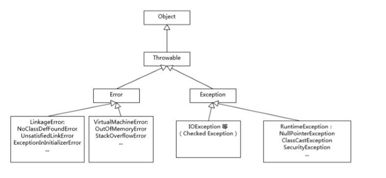

ClassNotFoundException的产生原因： Java支持使用Class.forName方法来动态地加载类，任意一个类的类名如果被作为参数传递给这个方法都将导致该类被加载到JVM内存中，如果这个类在类路径中没有被找到，那么此时就会在 运行时抛出ClassNotFoundException异常。 ClassNotFoundException的产生原因主要是： Java支持使用反射方式在运行时动态加载类，例如使用Class.forName方法来动态地加载类时，可以将类名作为参数传递给上述方法从而将指定类加载到JVM内存中，如果这个类在类路径中没 有被找到，那么此时就会在运行时抛出ClassNotFoundException异常。 解决该问题需要确保所需的类连同它依赖的包存在于类路径中，常见问题在于类名书写错误。 另外还有一个导致ClassNotFoundException的原因就是：当一个类已经某个类加载器加载到内存中了，此时另一个类加载器又尝试着动态地从同一个包中加载这个类。通过控制动态类加载过 程，可以避免上述情况发生。 

NoClassDefFoundError产生的原因在于： 如果JVM或者ClassLoader实例尝试加载（可以通过正常的方法调用，也可能是使用new来创建新的对象）类的时候却找不到类的定义。要查找的类在编译的时候是存在的，运行的时候却找不到了。这个时候就会导致NoClassDefFoundError. 造成该问题的原因可能是打包过程漏掉了部分类，或者jar包出现损坏或者篡改。解决这个问题的办法是查找那些在开发期间存在于类路径下但在运行期间却不在类路径下的类。

（编译期存在，运行期不存在）

### 第3讲 | 谈谈final、finally、 finalize有什么不同？ 

今天，我要问你的是一个经典的Java基础题目，谈谈fnal、fnally、 fnalize有什么不同？
典型回答 

**fnal可以用来修饰类、方法、变量，分别有不同的意义，fnal修饰的class代表不可以继承扩展，fnal的变量是不可以修改的，而fnal的方法也是不可以重写的（override）。**
**fnally则是Java保证重点代码一定要被执行的一种机制。我们可以使用try-fnally或者try-catch-fnally来进行类似关闭JDBC连接、保证unlock锁等动作。**
**fnalize是基础类java.lang.Object的一个方法，它的设计目的是保证对象在被垃圾收集前完成特定资源的回收。fnalize机制现在已经不推荐使用，并且在JDK 9开始被标记 为deprecated。**


1，不要在 fnally 中使用 return 语句。 2，fnally 总是执行，除非程序或者线程被中断


### 第4讲 | 强引用、软引用、弱引用、幻象引用有什么区别？ 

在Java语言中，除了原始数据类型的变量，其他所有都是所谓的引用类型，指向各种不同的对象，理解引用对于掌握Java对象生命周期和JVM内部相关机制非常有帮助。
今天我要问你的问题是，强引用、软引用、弱引用、幻象引用有什么区别？具体使用场景是什么？
典型回答 

**不同的引用类型，主要体现的是对象不同的可达性（reachable）状态和对垃圾收集的影响。**
**所谓强引用（"Strong" Reference），就是我们最常见的普通对象引用，只要还有强引用指向一个对象，就能表明对象还“活着”，垃圾收集器不会碰这种对象。对于一个普通的对 象，如果没有其他的引用关系，只要超过了引用的作用域或者显式地将相应（强）引用赋值为null，就是可以被垃圾收集的了，当然具体回收时机还是要看垃圾收集策略。**
**软引用（SoftReference），是一种相对强引用弱化一些的引用，可以让对象豁免一些垃圾收集，只有当JVM认为内存不足时，才会去试图回收软引用指向的对象。JVM会确保在抛 出OutOfMemoryError之前，清理软引用指向的对象。软引用通常用来实现内存敏感的缓存，如果还有空闲内存，就可以暂时保留缓存，当内存不足时清理掉，这样就保证了使用缓 存的同时，不会耗尽内存。**
**弱引用（WeakReference）并不能使对象豁免垃圾收集，仅仅是提供一种访问在弱引用状态下对象的途径。这就可以用来构建一种没有特定约束的关系，比如，维护一种非强制性的映射关系，如果试图获取时对象还在，就使用它，否则重现实例化。它同样是很多缓存实现的选择。**
**对于幻象引用，有时候也翻译成虚引用，你不能通过它访问对象。幻象引用仅仅是提供了一种确保对象被fnalize以后，做某些事情的机制，比如，通常用来做所谓的PostMortem清理机制，我在专栏上一讲中介绍的Java平台自身Cleaner机制等，也有人利用幻象引用监控对象的创建和销毁。**

| 引用类型 | 被垃圾回收时间 | 用途           | 生存时间          |
| -------- | -------------- | -------------- | ----------------- |
| 强引用   | 从来不会       | 对象的一般状态 | JVM停止运行时终止 |
| 软引用   | 在内存不足时   | 对象缓存       | 内存不足时终止    |
| 弱引用   | 在垃圾回收时   | 对象缓存       | gc运行后终止      |
| 虚引用   | Unknown        | Unknown        | Unknown           |


### 第6讲 | 动态代理是基于什么原理？ 

谈谈Java反射机制，动态代理是基于什么原理？

反射机制是Java语言提供的一种基础功能，赋予程序在运行时自省（introspect，官方用语）的能力。通过反射我们可以直接操作类或者对象，比如获取某个对象的类定义，获取类 声明的属性和方法，调用方法或者构造对象，甚至可以运行时修改类定义。
动态代理是一种方便运行时动态构建代理、动态处理代理方法调用的机制，很多场景都是利用类似机制做到的，比如用来包装RPC调用、面向切面的编程（AOP）。
**实现动态代理的方式很多，比如JDK自身提供的动态代理，就是主要利用了上面提到的反射机制。还有其他的实现方式，比如利用传说中更高性能的字节码操作机制，类 似ASM、cglib（基于ASM）、Javassist等。**

通过反射机制 可以拿到Class、Field、Method、Constructor 这些我们去操作类和对象的元数据。

JDK Proxy的优势：
最小化依赖关系，减少依赖意味着简化开发和维护，JDK本身的支持，可能比cglib更加可靠。

平滑进行JDK版本升级，而字节码类库通常需要进行更新以保证在新版Java上能够使用。
代码实现简单。
基于类似cglib框架的优势：
有的时候调用目标可能不便实现额外接口，从某种角度看，限定调用者实现接口是有些侵入性的实践，类似cglib动态代理就没有这种限制。
只操作我们关心的类，而不必为其他相关类增加工作量。
高性能。

利用**动态代理机制**，相应的stub等类，**可以在运行时生成，对应的调用操作也是动态完成，极大地提高了我们的生产力**。


### 第7讲 | int和Integer有什么区别？ 

1 int和Integer JDK1.5引入了自动装箱与自动拆箱功能，Java可根据上下文，实现int/Integer,double/Double,boolean/Boolean等基本类型与相应对象之间的自动转换，为开发过程带来极大便利。 最常用的是通过new方法构建Integer对象。但是，基于大部分数据操作都是集中在有限的、较小的数值范围，在JDK1.5 中新增了静态工厂方法 valueOf，其背后实现是将int值为-128 到 127 之间的Integer对象进行缓存，在调用时候直接从缓存中获取，进而提升构建对象的性能，也就是说使用该方法后，如果两个对象的int值相同且落在缓存值范围内，那么这个两个对象就是 同一个对象；当值较小且频繁使用时，推荐优先使用整型池方法（时间与空间性能俱佳）。 

2 注意事项 

[1] 基本类型均具有取值范围，在大数*大数的时候，有可能会出现越界的情况。 

[2] 基本类型转换时，使用声明的方式。例：long result= 1234567890 * 24 * 365；结果值一定不会是你所期望的那个值，因为1234567890 * 24已经超过了int的范围，如果修改 为：long result= 1234567890L * 24 * 365；就正常了。 

[3] 慎用基本类型处理货币存储。如采用double常会带来差距，常采用BigDecimal、整型（如果要精确表示分，可将值扩大100倍转化为整型）解决该问题。 

[4] 优先使用基本类型。原则上，建议避免无意中的装箱、拆箱行为，尤其是在性能敏感的场合， 

[5] 如果有线程安全的计算需要，建议考虑使用类型AtomicInteger、AtomicLong 这样的线程安全类。部分比较宽的基本数据类型，比如 foat、double，甚至不能保证更新操作的原子性， 可能出现程序读取到只更新了一半数据位的数值。


自己的理解：

int是基本数据类型，Integer是引用数据类型。Integer可以为null,所以在装箱拆箱之前需要判断Integer是否为null，否则可能会报转换异常。然后Integer有一个缓冲池在-128~127之间。优先使用基本类型。原则上，建议避免无意中的装箱、拆箱行为，尤其是在性能敏感的场合。


节选自《深入理解JAVA虚拟机》： 在HotSpot虚拟机中，**对象在内存中存储的布局可以分为3块区域：对象头（Header）、实例数据（Instance Data）和对齐填充（Padding）。** HotSpot虚拟机的对象头包括两部分信息，第一部分用于**存储对象自身的运行时数据**，如哈希码（HashCode）、GC分代年龄、锁状态标志、线程持有的锁、偏向线程ID、偏向时间戳等，这部 分数据的长度在32位和64位的虚拟机（未开启压缩指针）中分别为32bit和64bit，官方称它为"Mark Word"。
对象头的另外一部分是**类型指针，即对象指向它的类元数据的指针**，虚拟机通过这个指针来确定这个对象是哪个类的实例。并不是所有的虚拟机实现都必须在对象数据上保留类型指针，换句话 说，查找对象的元数据信息并不一定要经过对象本身，这点将在2.3.3节讨论。另外，如果对象是一个Java数组，那在对象头中还必须有一块用于记录数组长度的数据，因为虚拟机可以通过普 通Java对象的元数据信息确定Java对象的大小，但是从数组的元数据中却无法确定数组的大小。
接下来的实例数据部分是对象真正存储的有效信息，也是在程序代码中所定义的各种类型的字段内容。无论是从父类继承下来的，还是在子类中定义的，都需要记录起来。 第三部分对齐填充并不是必然存在的，也没有特别的含义，它仅仅起着占位符的作用。由于HotSpot VM的自动内存管理系统要求对象起始地址必须是8字节的整数倍，换句话说，就是**对象的大小必须是8字节的整数倍**。


### 第8讲 | 对比Vector、ArrayList、LinkedList有何区别？ 

这三者都是实现集合框架中的List，也就是所谓的有序集合，因此具体功能也比较近似，比如都提供按照位置进行定位、添加或者删除的操作，都提供迭代器以遍历其内容等。但因 为具体的设计区别，在行为、性能、线程安全等方面，表现又有很大不同。
**Vector是Java早期提供的线程安全的动态数组，如果不需要线程安全，并不建议选择，毕竟同步是有额外开销的。**Vector内部是使用对象数组来保存数据，可以根据需要自动的增加 容量，当数组已满时，会创建新的数组，并拷贝原有数组数据。
**ArrayList是应用更加广泛的动态数组实现，它本身不是线程安全的**，所以性能要好很多。与Vector近似，ArrayList也是可以根据需要调整容量，不过两者的调整逻辑有所区 别，Vector在扩容时会提高1倍，而ArrayList则是增加50%。
**LinkedList顾名思义是Java提供的双向链表**，所以它不需要像上面两种那样调整容量，它也不是线程安全的。

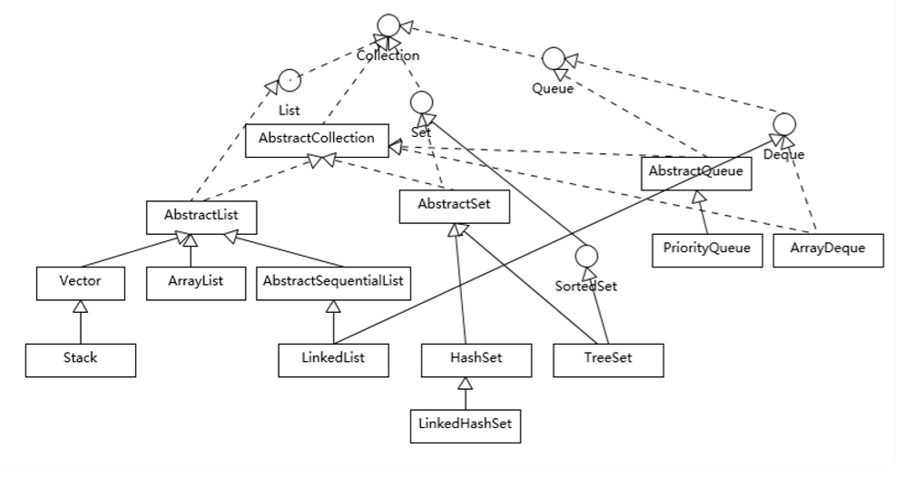


### 第9讲 | 对比Hashtable、HashMap、TreeMap有什么不同？ 

Hashtable、HashMap、TreeMap都是最常见的一些Map实现，是以键值对的形式存储和操作数据的容器类型。
**Hashtable是早期Java类库提供的一个哈希表实现，本身是同步的，不支持null键和值，由于同步导致的性能开销，所以已经很少被推荐使用。**
**HashMap是应用更加广泛的哈希表实现，行为上大致上与HashTable一致，主要区别在于HashMap不是同步的，支持null键和值等。**通常情况下，HashMap进行put或者get操 作，可以达到常数时间的性能，所以它是绝大部分利用键值对存取场景的首选，比如，实现一个用户ID和用户信息对应的运行时存储结构。
**TreeMap则是基于红黑树的一种提供顺序访问的Map**，和HashMap不同，它的get、put、remove之类操作都是O（log(n)）的时间复杂度，**具体顺序可以由指定 的Comparator来决定**，或者根据键的自然顺序来判断


### 第10讲 | 如何保证集合是线程安全的? ConcurrentHashMap如何实现高效地线程安全？ 

Java提供了不同层面的线程安全支持。在传统集合框架内部，除了**Hashtable等同步容器**，还提供了所谓的同步包装器（Synchronized Wrapper），我们可以调用Collections工 具类提供的包装方法，来获取一个**同步的包装容器**（如Collections.synchronizedMap），但是它们都是利用非常粗粒度的同步方式，在高并发情况下，性能比较低下。
另外，更加普遍的选择是**利用并发包提供的线程安全容器类**，它提供了：
各种并发容器，**比如ConcurrentHashMap、CopyOnWriteArrayList。**
**各种线程安全队列（Queue/Deque），如ArrayBlockingQueue、SynchronousQueue。**
**各种有序容器的线程安全版本等。**
具体保证线程安全的方式，包括有从简单的synchronize方式，到基于更加精细化的，比如基于分离锁实现的ConcurrentHashMap等并发实现等。具体选择要看开发的场景需求， 总体来说，并发包内提供的容器通用场景，远优于早期的简单同步实现。

下面我来对比一下，在Java 8和之后的版本中，ConcurrentHashMap发生了哪些变化呢？
总体结构上，它的内部存储变得和我在专栏上一讲介绍的HashMap结构非常相似，同样是大的桶（bucket）数组，然后内部也是一个个所谓的链表结构（bin），同步的粒度要 更细致一些。
其内部仍然有Segment定义，但仅仅是为了保证序列化时的兼容性而已，不再有任何结构上的用处。
因为不再使用Segment，初始化操作大大简化，修改为lazy-load形式，这样可以有效避免初始开销，解决了老版本很多人抱怨的这一点。
数据存储利用volatile来保证可见性。
使用CAS等操作，在特定场景进行无锁并发操作。
使用Unsafe、LongAdder之类底层手段，进行极端情况的优化。


### 第11讲 | Java提供了哪些IO方式？ NIO如何实现多路复用？

#### 典型回答 

Java IO方式有很多种，基于不同的IO抽象模型和交互方式，可以进行简单区分。 

​	首先，传统的java.io包，它基于流模型实现，提供了我们最熟知的一些IO功能，比如File抽象、输入输出流等。**交互方式是同步、阻塞的方式（BIO）**，也就是说，在读取输入流或者写入输 出流时， **在读、写动作完成之前，线程会一直阻塞在那里，它们之间的调用是可靠的线性顺序。java.io包的好处是代码比较简单、直观，缺点则是IO效率和扩展性存在局限性，容易成为应用性能的瓶颈。** 很多时候，人们也把java.net下面提供的部分网络API，比如Socket、ServerSocket、HttpURLConnection也归类到同步阻塞IO类库，因为网络通信同样是IO行为。 

​	第二，在Java 1.4中引入了**NIO**框架（java.nio包），提供了Channel、Selector、Bufer等新的抽象，可以**构建多路复用的、同步非阻塞IO**程序，同时提供了更接近操作系统底层 的高性能数据操作方式。 

​	第三，在Java 7中，NIO有了进一步的改进，也就是NIO 2，引入了异步非阻塞IO方式，也有很多人叫它**AIO**（Asynchronous IO）。**异步IO操作基于事件和回调机制，可以简单 理解为，应用操作直接返回，而不会阻塞在那里，当后台处理完成，操作系统会通知相应线程进行后续工作**。


#### 基本概念

 区分**同步或异步**（synchronous/asynchronous）。简单来说，同步是一种可靠的有序运行机制，当我们进行同步操作时，后续的任务是等待当前调用返回，才会进行下一步； 而异步则相反，其他任务不需要等待当前调用返回，通常依靠事件、回调等机制来实现任务间次序关系。 

区分**阻塞与非阻塞**（blocking/non-blocking）。在**进行阻塞操作时，当前线程会处于阻塞状态，无法从事其他任务，只有当条件就绪才能继续，比如ServerSocket新连接建立完毕，或数据读取、写入操作完成；而非阻塞则是不管IO操作是否结束，直接返回，相应操作在后台继续处理。** 

不能一概而论认为同步或阻塞就是低效，具体还要看应用和系统特征。


#### java.io

对于java.io，我们都非常熟悉，我这里就从总体上进行一下总结。总体上，我认为你至少需要理解： IO不仅仅是对文件的操作，网络编程中，比如Socket通信，都是典型的IO操作目标。

 输入流、输出流（InputStream/OutputStream）是用于读取或写入字节的，例如操作图片文件。 

而Reader/Writer则是用于操作字符，增加了字符编解码等功能，适用于类似从文件中读取或者写入文本信息。本质上计算机操作的都是字节，不管是网络通信还是文件读 取，Reader/Writer相当于构建了应用逻辑和原始数据之间的桥梁。 

BuferedOutputStream等带缓冲区的实现，可以避免频繁的磁盘读写，进而提高IO处理效率。这种设计利用了缓冲区，将批量数据进行一次操作，但在使用中千万别忘 了fush。 

很多IO工具类都实现了Closeable接口，因为需要进行资源的释放。比如，打开FileInputStream，它就会获取相应的文件描述符（FileDescriptor），需要 利用try-with-resources、 try-fnally等机制保证FileInputStream被明确关闭，进而相应文件描述符也会失效，否则将导致资源无法被释放。利用专栏前面的内容提到 的Cleaner或fnalize机制作为资源释放的最后把关，也是必要的。


#### Java NIO概览 

首先，熟悉一下NIO的主要组成部分： 

**Buffer**，高效的数据容器，除了布尔类型，所有原始数据类型都有相应的Buffer实现。 

**Channel**，类似在Linux之类操作系统上看到的文件描述符，是NIO中被用来支持批量式IO操作的一种抽象。 File或者Socket，通常被认为是比较高层次的抽象，而Channel则是更加操作系统底层的一种抽象，这也使得NIO得以充分利用现代操作系统底层机制，获得特定场景的性能优 化，例如，DMA（Direct Memory Access）等。不同层次的抽象是相互关联的，我们可以通过Socket获取Channel，反之亦然。

通道有点类似 IO 中的流，但不同的是，同一个通道既允许读也允许写，而任意一个流要么是读流要么是写流。

 **Selector**，**是NIO实现多路复用的基础，它提供了一种高效的机制，可以检测到注册在Selector上的多个Channel中，是否有Channel处于就绪状态，进而实现了单线程对 多Channel的高效管理**。 Selector同样是基于底层操作系统机制，不同模式、不同版本都存在区别，例如，在最新的代码库里，相关实现如下： **Linux上依赖于epoll。 Windows上NIO2（AIO）模式则是依赖于iocp**。

**Chartset**，提供Unicode字符串定义，NIO也提供了相应的编解码器等，例如，通过下面的方式进行字符串到ByteBufer的转换： Charset.defaultCharset().encode("Hello world!"));


#### 多路复用IO模型

​	反应器（Reactor）：用于事件多路分离和分派的体系结构模式 

   多路复用IO模型是目前使用得比较多的模型。Java NIO实际上就是多路复用IO。

　　在多路复用IO模型中，会有一个线程不断去轮询多个socket的状态，只有当socket真正有读写事件时，才真正调用实际的IO读写操作。因为在多路复用IO模型中，只需要使用一个线程就可以管理多个socket，系统不需要建立新的进程或者线程，也不必维护这些线程和进程，并且只有在真正有socket读写事件进行时，才会使用IO资源，所以它大大减少了资源占用。

　　在Java NIO中，是通过selector.select()去查询每个通道是否有到达事件，如果没有事件，则一直阻塞在那里，因此这种方式会导致用户线程的阻塞。

　　也许有朋友会说，我可以采用 多线程+ 阻塞IO 达到类似的效果，但是由于在多线程 + 阻塞IO 中，每个socket对应一个线程，这样会造成很大的资源占用，并且尤其是对于长连接来说，线程的资源一直不会释放，如果后面陆续有很多连接的话，就会造成性能上的瓶颈。

　　而多路复用IO模式，通过一个线程就可以管理多个socket，只有当socket真正有读写事件发生才会占用资源来进行实际的读写操作。因此，多路复用IO比较适合连接数比较多的情况。

　　另外多路复用IO为何比非阻塞IO模型的效率高是因为在非阻塞IO中，不断地询问socket状态是通过用户线程去进行的，而在多路复用IO中，轮询每个socket状态是内核在进行的，这个效率要比用户线程要高的多。

　　不过要注意的是，多路复用IO模型是通过轮询的方式来检测是否有事件到达，并且对到达的事件逐一进行响应。因此对于多路复用IO模型来说，一旦事件响应体很大，那么就会导致后续的事件迟迟得不到处理，并且会影响新的事件轮询。


我们来分析传统阻塞式IO的瓶颈在哪里。在连接数不多的情况下，传统IO编写容易方便使用。但是随着连接数的增多，问题传统IO就不行了。因为前面说过，传统IO处理每个连接都要消耗一个线程，而程序的效率当线程数不多时是随着线程数的增加而增加，但是到一定的数量之后，是随着线程数的增加而减少。这里我们得出结论，传统阻塞式IO的瓶颈在于不能处理过多的连接。 

然后，非阻塞式IO的出现的目的就是为了解决这个瓶颈。而非阻塞式IO是怎么实现的呢？非阻塞IO处理连接的线程数和连接数没有联系，也就是说处理 10000个连接非阻塞IO不需要10000个线程，你可以用1000个也可以用2000个线程来处理。因为非阻塞IO处理连接是异步的。当某个连接发送请求到服务器，服**务器把这个连接请求当作一个请求"事件"，并把这个"事件"分配给相应的函数处理。我们可以把这个处理函数放到线程中去执行，执行完就把线程归还。这样一个线程就可以异步的处理多个事件。而阻塞式IO的线程的大部分时间都浪费在等待请求上了**。 


### 第12讲 | Java有几种文件拷贝方式？哪一种最高效？

Java有多种比较典型的文件拷贝实现方式，比如：

1. 利用java.io类库，直接为源文件构建一个FileInputStream读取，然后再为目标文件构建一个FileOutputStream，完成写入工作。
2. 利用java.nio类库提供的transferTo或transferFrom方法实现。

当然，Java标准类库本身已经提供了几种Files.copy的实现。

对于Copy的效率，这个其实与操作系统和配置等情况相关，总体上来说，NIO transferTo/From的方式可能更快，因为它更能利用现代操作系统底层机制，避免不必要拷贝和上下 文切换。

从实践角度，我前面并没有明确说NIO transfer的方案一定最快，真实情况也确实未必如此。

#### 1.拷贝实现机制分析 

先来理解一下，前面实现的不同拷贝方法，本质上有什么明显的区别。 首先，你需要理解用户态空间（User Space）和内核态空间（Kernel Space），这是操作系统层面的基本概念，**操作系统内核、硬件驱动等运行在内核态空间，具有相对高的特权**；而**用户态空间，则是给普通应用和服务使用**。


当我们使用输入输出流进行读写时，实际上是进行了多次上下文切换，比如应用读取数据时，先在内核态将数据从磁盘读取到内核缓存，再切换到用户态将数据从内核缓存读取到用 户缓存。 写入操作也是类似，仅仅是步骤相反，你可以参考下面这张图。

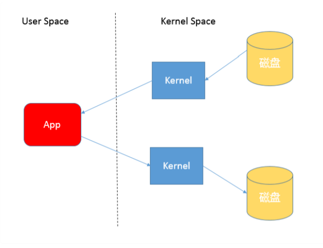

所以，这种方式会带来一定的额外开销，可能会降低IO效率。 

而基于NIO transferTo的实现方式，在Linux和Unix上，则会使用到零拷贝技术，**数据传输并不需要用户态参与，省去了上下文切换的开销和不必要的内存拷贝，进而可能提高应用 拷贝性能**。注意，transferTo不仅仅是可以用在文件拷贝中，与其类似的，例如读取磁盘文件，然后进行Socket发送，同样可以享受这种机制带来的性能和扩展性提高。 transferTo的传输过程是：

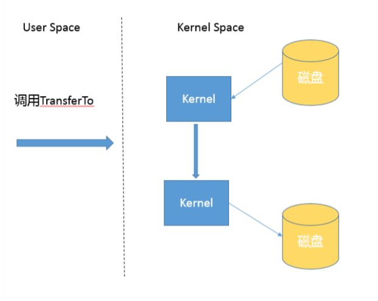

#### 2.Java IO/NIO源码结构

前面我在典型回答中提了第三种方式，即Java标准库也提供了文件拷贝方法（java.nio.fle.Files.copy）。如果你这样回答，就一定要小心了，因为很少有问题的答案是仅仅调用某 个方法。从面试的角度，面试官往往会追问：既然你提到了标准库，那么它是怎么实现的呢？有的公司面试官以喜欢追问而出名，直到追问到你说不知道。 其实，这个问题的答案还真不是那么直观，因为实际上有几个不同的copy方法。

```
public satic Path copy(Path source, Path target, CopyOption... options) throws IOException 

public satic long copy(InputStream in, Path target, CopyOption... options) throws IOException 

public satic long copy(Path source, OutputStream out) throws IOException 
```

可以看到，copy不仅仅是支持文件之间操作，没有人限定输入输出流一定是针对文件的，这是两个很实用的工具方法。 **后面两种copy实现，能够在方法实现里直接看到使用的是InputStream.transferTo()，你可以直接看源码，其内部实现其实是stream在用户态的读写（JDK8是InputStream/OutputStream，InputStream.transferTo()是jdk9增加的方法）**；而对于第一种方法的分析 过程要相对麻烦一些，可以参考下面片段。简单起见，我只分析同类型文件系统拷贝过程。 

```
public satic Path copy(Path source, Path target, CopyOption... options) throws IOException { 

FileSysemProvider provider = provider(source); 

if (provider(target) == provider) { 

// same provider provider.copy(source, target, options);

//这是本文分析的路径 

} 

else { 

// diferent providers CopyMoveHelper.copyToForeignTarget(source, target, options);

 } 

return target; }
```

 我把源码分析过程简单记录如下，JDK的源代码中，内部实现和公共API定义也不是可以能够简单关联上的，NIO部分代码甚至是定义为模板而不是Java源文件，在build过程自动生 成源码，下面顺便介绍一下部分JDK代码机制和如何绕过隐藏障碍。 首先，直接跟踪，发现FileSystemProvider只是个抽象类，阅读它的源码能够理解到，原来文件系统实际逻辑存在于JDK内部实现里，公共API其实是通过ServiceLoader机制加 载一系列文件系统实现，然后提供服务。 我们可以在JDK源码里搜索FileSystemProvider和nio，可以定位到sun/nio/fs，我们知道NIO底层是和操作系统紧密相关的，所以每个平台都有自己的部分特有文件系统逻辑。

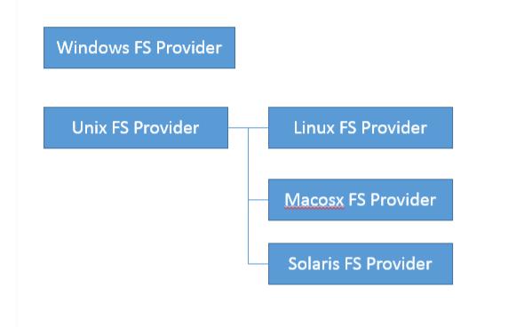 

省略掉一些细节，最后我们一步步定位到UnixFileSystemProvider → UnixCopyFile.Transfer，发现这是个本地方法。 最后，明确定位到UnixCopyFile.c，其**内部实现清楚说明竟然只是简单的用户态空间拷贝**！ **所以，我们明确这个最常见的copy方法其实不是利用transferTo，而是本地技术实现的用户态拷贝**。 

前面谈了不少机制和源码，我简单从实践角度总结一下，**如何提高类似拷贝等IO操作的性能，有一些宽泛的原则**： 

   **1.在程序中，使用缓存等机制，合理减少IO次数（在网络通信中，如TCP传输，window大小也可以看作是类似思路）。**

2. **使用transferTo等机制，减少上下文切换和额外IO操作。** 
3. **尽量减少不必要的转换过程，比如编解码；对象序列化和反序列化，比如操作文本文件或者网络通信，如果不是过程中需要使用文本信息，可以考虑不要将二进制信息转换成字符 串，直接传输二进制信息。**

#### 3.掌握NIO Buffer 

我在上一讲提到Buffer是NIO操作数据的基本工具，**Java为每种原始数据类型都提供了相应的Bufer实现（布尔除外）**，所以掌握和使用Bufer是十分必要的，尤其是涉及Direct Bufer等使用，因为其在垃圾收集等方面的特殊性，更要重点掌握。 

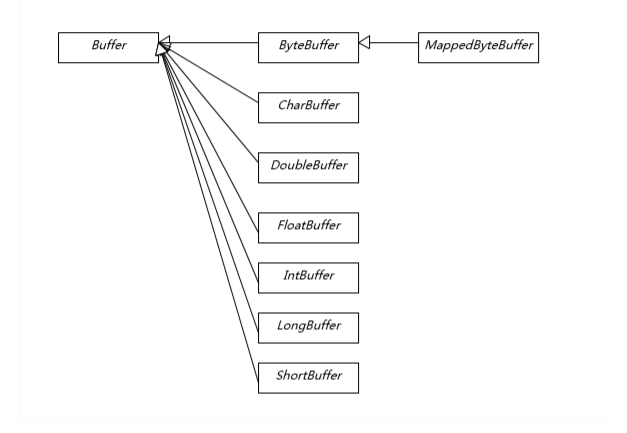

Bufer有几个基本属性： 

capcity，它反映这个Bufer到底有多大，也就是数组的长度。 

position，要操作的数据起始位置。 

limit，相当于操作的限额。在读取或者写入时，limit的意义很明显是不一样的。比如，读取操作时，很可能将limit设置到所容纳数据的上限；而在写入时，则会设置容量或容量 以下的可写限度。 

mark，记录上一次postion的位置，默认是0，算是一个便利性的考虑，往往不是必须的。 

前面三个是我们日常使用最频繁的，我简单梳理下Bufer的基本操作： 

我们创建了一个ByteBufer，准备放入数据，capcity当然就是缓冲区大小，而position就是0，limit默认就是capcity的大小。 当我们写入几个字节的数据时，position就会跟着水涨船高，但是它不可能超过limit的大小。 如果我们想把前面写入的数据读出来，需要调用fip方法，将position设置为0，limit设置为以前的position那里。 如果还想从头再读一遍，可以调用rewind，让limit不变，position再次设置为0。


#### 4.Direct Buffer和垃圾收集

我这里重点介绍两种特别的Buffer。 

**Direct Buffer**：如果我们看Buffer的方法定义，你会发现它定义了isDirect()方法，返回当前Bufer是否是Direct类型。这是因为Java提供了堆内和堆外（Direct）Buffer，我 们可以以它的allocate或者allocateDirect方法直接创建。 

**MappedByteBufer**：**它将文件按照指定大小直接映射为内存区域**，当程序访问这个内存区域时将直接操作这块儿文件数据，省去了将数据从内核空间向用户空间传输的损耗。我 们可以使用FileChannel.map创建MappedByteBufer，它本质上也是种Direct Bufer。

在实际使用中，Java会尽量对Direct Bufer仅做本地IO操作，对于很多大数据量的IO密集操作，可能会带来非常大的性能优势，因为： **Direct Buffer生命周期内内存地址都不会再发生更改，进而内核可以安全地对其进行访问，很多IO操作会很高效。 **

**减少了堆内对象存储的可能额外维护工作，所以访问效率可能有所提高。** 

但是请注意，Direct Bufer创建和销毁过程中，都会比一般的堆内Bufer增加部分开销，所以通常都建议用于长期使用、数据较大的场景。 使用Direct Bufer，我们需要清楚它对内存和JVM参数的影响。首先，因为它不在堆上，所以Xmx之类参数，其实并不能影响Direct Bufer等堆外成员所使用的内存额度，我们可 以使用下面参数设置大小：

```
 -XX:MaxDirectMemorySize=512M 
```

从参数设置和内存问题排查角度来看，这意味着我们在计算Java可以使用的内存大小的时候，不能只考虑堆的需要，还有Direct Bufer等一系列堆外因素。如果出现内存不足，堆外内存占用也是一种可能性。 另外，**大多数垃圾收集过程中，都不会主动收集Direct Buffer**，它的垃圾收集过程，就是基于我在专栏前面所介绍的Cleaner（一个内部实现）和幻象引用 （PhantomReference）机制，其本身不是public类型，内部实现了一个Deallocator负责销毁的逻辑。**对它的销毁往往要拖到full GC的时候，所以使用不当很容易导致OutOfMemoryError**。 

对于Direct Bufer的回收，我有几个建议： 

1. 在应用程序中，显式地调用System.gc()来强制触发。 
2. 另外一种思路是，在大量使用Direct Buffer的部分框架中，框架会自己在程序中调用释放方法，Netty就是这么做的，有兴趣可以参考其实现（PlatformDependent0）。 重复使用Direct Buffer。

#### 5.跟踪和诊断Direct Bufer内存占用？ 

因为通常的垃圾收集日志等记录，并不包含Direct Bufer等信息，所以Direct Buffer内存诊断也是个比较头疼的事情。幸好，在JDK 8之后的版本，我们可以方便地使用Native Memory Tracking（NMT）特性来进行诊断，你可以在程序启动时加上下面参数： 

```
-XX:NativeMemoryTracking={summary|detail} 
```

注意，**激活NMT通常都会导致JVM出现5%~10%的性能下降，请谨慎考虑**。

运行时，可以采用下面命令进行交互式对比： 

```
// 打印NMT信息

 jcmd  VM.native_memory detail 

// 进行baseline，以对比分配内存变化

 jcmd  VM.native_memory baseline 

// 进行baseline，以对比分配内存变化 

 jcmd  VM.native_memory detail.dif
```

**我们可以在Internal部分发现Direct Buffer内存使用的信息，这是因为其底层实际是利用unsafe_allocatememory。严格说，这不是JVM内部使用的内存**，所以在JDK 11以后， 其实它是归类在other部分里。


### 第13讲 | 谈谈接口和抽象类有什么区别？

#### 1.经典回答

接口和抽象类是Java面向对象设计的两个基础机制。 

**接口是对行为的抽象，它是抽象方法的集合，利用接口可以达到API定义和实现分离的目的**。接口，不能实例化；不能包含任何非常量成员，任何field都是隐含着public static fnal的意义；同时，没有非静态方法实现，也就是说要么是抽象方法，要么是静态方法。Java标准类库中，定义了非常多的接口，比如java.util.List。 

**抽象类是不能实例化的类，用abstract关键字修饰class，其目的主要是代码重用。**除了不能实例化，形式上和一般的Java类并没有太大区别，可以有一个或者多个抽象方法，也可 以没有抽象方法。抽象类大多用于抽取相关Java类的共用方法实现或者是共同成员变量，然后通过继承的方式达到代码复用的目的。Java标准库中，比如collection框架，很多通用 部分就被抽取成为抽象类，例如java.util.AbstractList。 

**Java类实现interface使用implements关键词，继承abstract class则是使用extends关键词**，我们可以参考Java标准库中的ArrayList。


#### 2.Marker Interface

**为接口添加任何抽象方法，相应的所有实现了这个接口的类，也必须实现新增方法，否则会出现编译错误。对于抽象类，如果我们添加非抽象方法，其子类只会享受到能力扩展，而不用担心编译出问题。** 接口的职责也不仅仅限于抽象方法的集合，其实有各种不同的实践。**有一类没有任何方法的接口，通常叫作Marker Interface，顾名思义，它的目的就是为了声明某些东西，比如我 们熟知的Cloneable、Serializable等。**这种用法，也存在于业界其他的Java产品代码中。 从表面看，这似乎和Annotation异曲同工，也确实如此，它的好处是简单直接。对于Annotation，因为可以指定参数和值，在表达能力上要更强大一些，所以更多人选择使 用Annotation。

 **Java 8增加了函数式编程的支持，所以又增加了一类定义，即所谓functional interface，简单说就是只有一个抽象方法的接口**，通常建议使用@FunctionalInterface Annotation来标记。Lambda表达式本身可以看作是一类functional interface，某种程度上这和面向对象可以算是两码事。**我们熟知的Runnable、Callable之类，都 是functional interface**。

还有一点可能让人感到意外，**严格说，Java 8以后，接口也是可以有方法实现的**！

 从Java 8开始，interface增加了对default method的支持。Java 9以后，甚至可以定义private default method。Default method提供了一种二进制兼容的扩展已有接口的办 法。比如，我们熟知的java.util.Collection，它是collection体系的root interface，在Java 8中添加了一系列default method，主要是增加Lambda、Stream相关的功能。我在 专栏前面提到的类似Collections之类的工具类，很多方法都适合作为default method实现在基础接口里面。 

你可以参考下面代码片段：

```
 public interface Collection extends Iterable {

 /** * Returns a sequential Stream with this collection as its source * ... **/ 

	default Stream sream() {

 		return StreamSupport.sream(spliterator(), false); 

	} 

}
```


#### 3.S.O.L.I.D原则

进行面向对象编程，掌握基本的设计原则是必须的，我今天介绍最通用的部分，也就是所谓的S.O.L.I.D原则。 

**单一职责**（Single Responsibility），类或者对象最好是只有单一职责，在程序设计中如果发现某个类承担着多种义务，可以考虑进行拆分。 

**开关原则**（Open-Close, Open for extension, close for modifcation），设计要对扩展开放，对修改关闭。换句话说，程序设计应保证平滑的扩展性，尽量避免因为新增同 类功能而修改已有实现，这样可以少产出些回归（regression）问题。 

**里氏替换**（Liskov Substitution），这是面向对象的基本要素之一，进行继承关系抽象时，凡是可以用父类或者基类的地方，都可以用子类替换。 

**接口分离**（Interface Segregation），我们在进行类和接口设计时，如果在一个接口里定义了太多方法，其子类很可能面临两难，就是只有部分方法对它是有意义的，这就破坏 了程序的内聚性。 对于这种情况，可以通过拆分成功能单一的多个接口，将行为进行解耦。在未来维护中，如果某个接口设计有变，不会对使用其他接口的子类构成影响。 

**依赖反转**（Dependency Inversion），实体应该依赖于抽象而不是实现。也就是说高层次模块，不应该依赖于低层次模块，而是应该基于抽象。实践这一原则是保证产品代码之 间适当耦合度的法宝。

值得注意的是，现代语言的发展，很多时候并不是完全遵守前面的原则的，比如，Java 10中引入了本地方法类型推断和var类型。

按照，里氏替换原则，我们通常这样定义变量： Lis lis = new ArrayLis<>(); 

如果使用var类型，可以简化为  var lis = new ArrayLis(); 

但是，list实际会被推断为“ArrayList < String >” ArrayLis lis = new ArrayLis(); 

理论上，这种语法上的便利，其实是增强了程序对实现的依赖，但是微小的类型泄漏却带来了书写的变量和代码可读性的提高，所以**，实践中我们还是要按照得失利弊进行选择，而 不是一味得遵循原则。**

#### 4.接口vs抽象类vs类 

1 支持多重继承：接口支持；抽象类不支持；类不支持； 

2 支持抽象函数：接口语义上支持；抽象类支持；类不支持； 

3 允许函数实现：接口不允许；抽象类支持；类允许； 

4 允许实例化：接口不允许；抽象类不允许；类允许； 

5 允许部分函数实现：接口不允许；抽象类允许；类不允许。 

6 定义的内容：接口中只能包括public函数以及public static fnal常量；抽象类与类均无任何限制。 

7 使用时机：当想要支持多重继承，或是为了定义一种类型请使用接口；当打算提供带有部分实现的“模板”类，而将一些功能需要延迟实现请使用抽象类；当你打算提供完整的具体实现请使用 类。


### 第14讲 | 谈谈你知道的设计模式？

#### 1.典型回答 

大致按照模式的应用目标分类，**设计模式可以分为创建型模式、结构型模式和行为型模式**。 

**创建型模式，是对对象创建过程的各种问题和解决方案的总结**，包括各种工厂模式（Factory、Abstract Factory）、单例模式（Singleton）、构建器模式（Builder）、原型模式（ProtoType）。

 **结构型模式，是针对软件设计结构的总结，关注于类、对象继承、组合方式的实践经验**。常见的结构型模式，包括桥接模式（Bridge）、适配器模式（Adapter）、装饰者模式 （Decorator）、代理模式（Proxy）、组合模式（Composite）、外观模式（Facade）、享元模式（Flyweight）等。

**行为型模式，是从类或对象之间交互、职责划分等角度总结的模式**。比较常见的行为型模式有策略模式（Strategy）、解释器模式（Interpreter）、命令模式（Command）、 观察者模式（Observer）、迭代器模式（Iterator）、模板方法模式（Template Method）、访问者模式（Visitor）。


InputStream是一个抽象类，标准类库中提供了FileInputStream、ByteArrayInputStream等各种不同的子类，分别从不同角度 对InputStream进行了功能扩展，这是典型的装饰器模式应用案例。


使用构建器模式，可以比较优雅地解决构建复杂对象的麻烦，这里的“复杂”是指类似需要输入的参数组合较多，如果用构造函数，我们往往需要为每一种可能的输入参数组合实现相 应的构造函数，一系列复杂的构造函数会让代码阅读性和可维护性变得很差。 上面的分析也进一步反映了创建型模式的初衷，即，将对象创建过程单独抽象出来，从结构上把对象使用逻辑和创建逻辑相互独立，隐藏对象实例的细节，进而为使用者实现了更加 规范、统一的逻辑。


门面模式形象上来讲就是在原系统之前放置了一个新的代理对象，只能通过该对象才能使用该系统，不再允许其它方式访问该系统。该代理对象封装了访问原系统的所有规则和接口方法，提供 的API接口较之使用原系统会更加的简单。 

举例:JUnitCore是JUnit类的 Facade模式的实现类，外部使用该代理对象与JUnit进行统一交互，驱动执行测试代码。 

使用场景:当我们希望封装或隐藏原系统；当我们使用原系统的功能并希望增加一些新的功能；编写新类的成本远小于所有人学会使用或者未来维护原系统所需的成本； 缺点:违反了开闭原则。如有扩展，只能直接修改代理对象。


#### 设计模式在Spring中的应用

下面一起来简要看看主流开源框架，如Spring等如何在API设计中使用设计模式。你至少要有个大体的印象，如： 

**BeanFactory和ApplicationContext应用了工厂模式。** 

**在Bean的创建中，Spring也为不同scope定义的对象，提供了单例和原型等模式实现。** 

**我在专栏第6讲介绍的AOP领域则是使用了代理模式、装饰器模式、适配器模式等。 各种事件监听器，是观察者模式的典型应用。** 

**类似JdbcTemplate等则是应用了模板模式**。


关于阅读源代码和理解底层，我有些建议： 

1. **带着问题和明确目的去阅读**，比如，以debug某个问题的角度，结合实践去验证，让自己能够感到收获，既加深理解，也有实际帮助，激励我们坚持下来。 
2. **一定要有输出**，至少要写下来，整理心得，交流、验证、提高。这和我们日常工作是类似的，千万不要做了好长一段时间后和领导说，没什么结论。


### 第15讲 | synchronized和ReentrantLock有什么区别呢？

#### 1.典型回答 

synchronized是Java内建的同步机制，所以也有人称其为Intrinsic Locking，它提供了互斥的语义和可见性，当一个线程已经获取当前锁时，其他试图获取的线程只能等待或者阻 塞在那里。 在Java 5以前，synchronized是仅有的同步手段，在代码中， synchronized可以用来修饰方法，也可以使用在特定的代码块儿上，本质上synchronized方法等同于把方法全部语 句用synchronized块包起来。 **ReentrantLock，通常翻译为再入锁，是Java 5提供的锁实现，它的语义和synchronized基本相同。再入锁通过代码直接调用lock()方法获取，代码书写也更加灵活。与此同时，ReentrantLock提供了很多实用的方法，能够实现很多synchronized无法做到的细节控制，比如可以控制fairness，也就是公平性，或者利用定义条件等**。但是，编码中也需 要注意，必须要明确调用unlock()方法释放，不然就会一直持有该锁。 synchronized和ReentrantLock的性能不能一概而论，早期版本synchronized在很多场景下性能相差较大，在后续版本进行了较多改进，在低竞争场景中表现可能优 于ReentrantLock。


2.

**线程安全需要保证几个基本特性**： 

**原子性**，简单说就是相关操作不会中途被其他线程干扰，一般通过同步机制实现。 

**可见性**，是一个线程修改了某个共享变量，其状态能够立即被其他线程知晓，通常被解释为将线程本地状态反映到主内存上，volatile就是负责保证可见性的。 

**有序性**，是保证线程内串行语义，避免指令重排等。

所谓的公平性是指在竞争场景中，当公平性为真时，会倾向于将锁赋予等待时间最久的线程。公平性是减少线程“饥饿”（个别线程长期等待锁，但始终无法获取）情况发生的一 个办法。 如果使用synchronized，我们根本无法进行公平性的选择，其永远是不公平的，这也是主流操作系统线程调度的选择。**通用场景中，公平性未必有想象中的那么重要，Java默认的调 度策略很少会导致 “饥饿”发生。与此同时，若要保证公平性则会引入额外开销，自然会导致一定的吞吐量下降。所以，我建议只有当你的程序确实有公平性需要的时候，才有必要指 定它**。

 我们再从日常编码的角度学习下再入锁。为保证锁释放，每一个lock()动作，我建议都立即对应一个try-catch-finally，典型的代码结构如下，这是个良好的习惯。 

```
ReentrantLock fairLock = new ReentrantLock(true);// 这里是演示创建公平锁，一般情况不需要。

 try { 
 	// do something 
 } finally { 
	fairLock.unlock(); 
 }
```

 ReentrantLock相比synchronized，因为可以像普通对象一样使用，所以可以利用其提供的各种便利方法，进行精细的同步操作，甚至是实现synchronized难以表达的用例，如： 带超时的获取锁尝试。 可以判断是否有线程，或者某个特定线程，在排队等待获取锁。 可以响应中断请求。 ... 这里我特别想强调条件变量（java.util.concurrent.Condition），**如果说ReentrantLock是synchronized的替代选择，Condition则是将wait、notify、notifyAll等操作转化为相 应的对象，将复杂而晦涩的同步操作转变为直观可控的对象行为**。 条件变量最为典型的应用场景就是标准类库中的ArrayBlockingQueue等。

我们参考下面的源码，首先，通过再入锁获取条件变量：

```
 /** Condition for waiting takes */ private fnal Condition notEmpty;

 /** Condition for waiting puts */ private fnal Condition notFull; 

public ArrayBlockingQueue(int capacity, boolean fair) { 

​	if (capacity <= 0) throw new IllegalArgumentException(); 

​	this.items = new Object[capacity]; 

​	lock = new ReentrantLock(fair); 

​	notEmpty = lock.newCondition(); 

​	notFull = lock.newCondition();

 } 
```

两个条件变量是从同一再入锁创建出来，然后使用在特定操作中，如下面的take方法，判断和等待条件满足： 

```
public E take() throws InterruptedException { 

​	final ReentrantLock lock = this.lock; 

​	lock.lockInterruptibly(); 

​	try { 

​	while (count == 0) 

​	notEmpty.await(); 

​	return dequeue(); 

​	} finally { 

​		lock.unlock(); 

​	} 

} 
```

当队列为空时，试图take的线程的正确行为应该是等待入队发生，而不是直接返回，这是BlockingQueue的语义，使用条件notEmpty就可以优雅地实现这一逻辑。 那么，怎么保证入队触发后续take操作呢？请看enqueue实现： 

```
private void enqueue(E e) { 

// assert lock.isHeldByCurrentThread();

 // assert lock.getHoldCount() == 1; 

// assert items[putIndex] == null; fnal Object[] items = this.items; 

items[putIndex] = e; 

if (++putIndex == items.length) putIndex = 0; 

count++; 

notEmpty.signal(); 

// 通知等待的线程，非空条件已经满足 

}


```

 **通过signal/await的组合，完成了条件判断和通知等待线程，非常顺畅就完成了状态流转**。注意，signal和await成对调用非常重要，不然假设只有await动作，线程会一直等待直到 被打断（interrupt）。 从性能角度，synchronized早期的实现比较低效，对比ReentrantLock，大多数场景性能都相差较大。但是在Java 6中对其进行了非常多的改进，可以参考性能对比，**在高竞争情况下，ReentrantLock仍然有一定优势**。我在下一讲进行详细分析，会更有助于理解性能差异产生的内在原因。**在大多数情况下，无需纠结于性能，还是考虑代码书写结构的便利性、可维护性等。**

在使用ReentrantLock类的时，一定要注意三点： 

**在finally中释放锁**，目的是保证在获取锁之后，最终能够被释放 

**不要将获取锁的过程写在try块内**，因为如果在获取锁时发生了异常，异常抛出的同时，也会导致锁无故被释放。

 ReentrantLock提供了一个newCondition的方法，以便用户在同一锁的情况下可以根据不同的情况执行等待或唤醒的动作。


### 第16讲 | synchronized底层如何实现？什么是锁的升级、降级？

#### 典型回答

在回答这个问题前，先简单复习一下上一讲的知识点。**synchronized代码块是由一对儿monitorenter/monitorexit指令实现的，Monitor对象是同步的基本实现单元**。 在**Java 6之前，Monitor的实现完全是依靠操作系统内部的互斥锁，因为需要进行用户态到内核态的切换，所以同步操作是一个无差别的重量级操作**。 现代的（Oracle）JDK中，JVM对此进行了大刀阔斧地改进，提供了三种不同的Monitor实现，也就是常说的三种不同的锁：**偏斜锁（Biased Locking）、轻量级锁和重量级锁**，大 大改进了其性能。 所谓锁的升级、降级，就是JVM优化synchronized运行的机制，当JVM检测到不同的竞争状况时，会自动切换到适合的锁实现，这种切换就是锁的升级、降级。 **当没有竞争出现时，默认会使用偏斜锁。JVM会利用CAS操作（compare and swap），在对象头上的Mark Word部分设置线程ID，以表示这个对象偏向于当前线程，所以并不涉 及真正的互斥锁。这样做的假设是基于在很多应用场景中，大部分对象生命周期中最多会被一个线程锁定，使用偏斜锁可以降低无竞争开销。 如果有另外的线程试图锁定某个已经被偏斜过的对象，JVM就需要撤销（revoke）偏斜锁，并切换到轻量级锁实现。轻量级锁依赖CAS操作Mark Word来试图获取锁，如果重试成功，就使用普通的轻量级锁；否则，进一步升级为重量级锁**。 我注意到有的观点认为Java不会进行锁降级。实际上据我所知，**锁降级确实是会发生的，当JVM进入安全点（SafePoint）的时候，会检查是否有闲置的Monitor，然后试图进行降级**。


#### **什么是锁升级，降级？**

所谓的锁升级、降级，就是 JVM 优化 synchronized 运行的机制，当 JVM 监测到不同的竞争状况是，会自动切换到不同的锁实现。这种切换就是锁的升级、降级。


#### 偏向锁的争议

偏斜锁并不适合所有应用场景，撤销操作（revoke）是比较重的行为，只有当存在较多不会真正竞争的synchronized块儿时，才能体现出明显改善。实践中对于偏斜锁的一直是有 争议的，有人甚至认为，当你需要大量使用并发类库时，往往意味着你不需要偏斜锁。从具体选择来看，我还是建议需要在实践中进行测试，根据结果再决定是否使用。 还有一方面是，偏斜锁会延缓JIT 预热的进程，所以很多性能测试中会显式地关闭偏斜锁，命令如下： 

```
-XX:-UseBiasedLocking
```


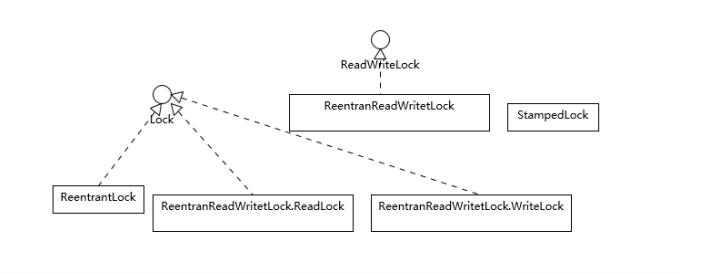

你可能注意到了，这些锁竟然不都是实现了Lock接口，**ReadWriteLock是一个单独的接口，它通常是代表了一对锁，分别对应只读和写操作**，标准类库中提供了再入版本的读写 锁实现（ReentrantReadWriteLock），对应的语义和ReentrantLock比较相似。 **StampedLock竟然也是个单独的类型，从类图结构可以看出它是不支持再入性的语义的，也就是它不是以持有锁的线程为单位。** 为什么我们需要读写锁（ReadWriteLock）等其他锁呢？ 这是因为，虽然ReentrantLock和synchronized简单实用，但是行为上有一定局限性，通俗点说就是“太霸道”，要么不占，要么独占。实际应用场景中，有的时候不需要大量竞争 的写操作，而是以并发读取为主，如何进一步优化并发操作的粒度呢？ Java并发包提供的读写锁等扩展了锁的能力，它所基于的原理是多个读操作是不需要互斥的，因为**读操作并不会更改数据，所以不存在互相干扰。而写操作则会导致并发一致性的问题**，所以写线程之间、读写线程之间，需要精心设计的互斥逻辑。

注意，writeLock和unLockWrite一定要保证成对调用。


安全点：In HotSpot JVM Stop-the-World pause mechanism is called safepoint. 

JNI：JNI是Java Native Interface的缩写，通过使用 [Java](https://baike.baidu.com/item/Java/85979)本地接口书写程序，可以确保代码在不同的平台上方便移植。


### 第17讲 | 一个线程两次调用start()方法会出现什么情况？

#### 典型回答

 **Java的线程是不允许启动两次的，第二次调用必然会抛出IllegalThreadStateException，这是一种运行时异常，多次调用start被认为是编程错误。** 关于线程生命周期的不同状态，在Java 5以后，线程状态被明确定义在其公共内部枚举类型java.lang.Thread.State中，分别是： 

**新建（NEW）**，表示线程被创建出来还没真正启动的状态，可以认为它是个Java内部状态。

就绪（RUNNABLE），表示该线程已经在JVM中执行，当然由于执行需要计算资源，它可能是正在运行，也可能还在等待系统分配给它CPU片段，在就绪队列里面排队。 在其他一些分析中，会额外区分一种状态RUNNING，但是从Java API的角度，并不能表示出来。 

**阻塞（BLOCKED）**，这个状态和我们前面两讲介绍的同步非常相关，阻塞表示线程在等待Monitor lock。比如，线程试图通过synchronized去获取某个锁，但是其他线程已经 独占了，那么当前线程就会处于阻塞状态。 

**等待（WAITING）**，表示正在等待其他线程采取某些操作。一个常见的场景是类似生产者消费者模式，发现任务条件尚未满足，就让当前消费者线程等待（wait），另外的生产 者线程去准备任务数据，然后通过类似notify等动作，通知消费线程可以继续工作了。Thread.join()也会令线程进入等待状态。 

**计时等待（TIMED_WAIT）**，其进入条件和等待状态类似，但是调用的是存在超时条件的方法

**终止（TERMINATED）**，不管是意外退出还是正常执行结束，线程已经完成使命，终止运行，也有人把这个状态叫作死亡

**在第二次调用start()方法的时候，线程可能处于终止或者其他（非NEW）状态，但是不论如何，都是不可以再次启动的。**

#### 线程是什么？ 

从操作系统的角度，可以简单认为，**线程是处理器任务调度的最小单元，一个进程可以包含多个线程，作为任务的真正运作者，有自己的栈（Stack）、寄存器（Register）、本地存储 （Thread Local）等，但是会和进程内其他线程共享文件描述符、虚拟地址空间等。**

#### 守护线程（Daemon Thread）

**有的时候应用中需要一个长期驻留的服务程序，但是不希望其影响应用退出，就可以将其设置为守护线程**，如果JVM发现只有守护线程存 在时，将结束进程，具体可以参考下面代码段。注意，必须在线程启动之前设置。

```
 Thread daemonThread = new Thread(); 

daemonThread.setDaemon(true); 

daemonThread.start();
```

Thread.onSpinWait()，这是Java 9中引入的特性。“onSpinWait()”没有任何行为上的保证，而是对JVM的一个暗示，JVM可能会利用CPU的pause指令进一步提高性能，性能特别敏感的应用可以关注。


写一个最简单的打印HelloWorld的程序，说说看，运行这个应用，Java至少会创建几个线程呢？

5个。


### 第18讲 | 什么情况下Java程序会产生死锁？如何定位、修复？

#### 典型回答 

死锁是一种特定的程序状态，在实体之间，由于循环依赖导致彼此一直处于等待之中，没有任何个体可以继续前进。**死锁不仅仅是在线程之间会发生，存在资源独占的进程之间同样 也可能出现死锁。**通常来说，我们大多是聚焦在多线程场景中的死锁，指两个或多个线程之间，**由于互相持有对方需要的锁，而永久处于阻塞的状态。** 你可以利用下面的示例图理解基本的死锁问题： 

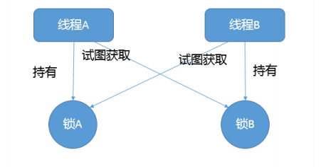

定位死锁最常见的方式就是利用jstack等工具获取线程栈，然后定位互相之间的依赖关系，进而找到死锁。**如果是比较明显的死锁，往往jstack等就能直接定位**，类似JConsole甚至 可以在图形界面进行有限的死锁检测。 **如果程序运行时发生了死锁，绝大多数情况下都是无法在线解决的，只能重启、修正程序本身问题**。所以，代码开发阶段互相审查，或者利用工具进行预防性排查，往往也是很重要的。 

在实际应用中，类死锁情况未必有如此清晰的输出，但是总体上可以理解为： 

区分线程状态 -> 查看等待目标 -> 对比Monitor等持有状态 

所以，理解线程基本状态和并发相关元素是定位问题的关键，然后配合程序调用栈结构，基本就可以定位到具体的问题代码。 如果我们是开发自己的管理工具，需要用更加程序化的方式扫描服务进程、定位死锁，可以考虑使用Java提供的标准管理API，ThreadMXBean，其直接就提供 了findDeadlockedThreads()方法用于定位。

#### 如何在编程中尽量预防死锁呢？ 

首先，我们来总结一下前面例子中死锁的产生包含哪些基本元素。基本上死锁的发生是因为： 

1. 互斥条件，类似Java中Monitor都是独占的，要么是我用，要么是你用。 

2. 互斥条件是长期持有的，在使用结束之前，自己不会释放，也不能被其他线程抢占。 

3. 循环依赖关系，两个或者多个个体之间出现了锁的链条环。

 所以，我们可以据此分析可能的避免死锁的思路和方法。

第一种方法  如果可能的话，尽量避免使用多个锁，并且只有需要时才持有锁。

第二种方法 如果必须使用多个锁，尽量设计好锁的获取顺序，这个说起来简单，做起来可不容易，你可以参看著名的银行家算法。

第三种方法 使用带超时的方法，为程序带来更多可控性。 类似Object.wait(…)或者CountDownLatch.await(…)，都支持所谓的timed_wait，我们完全可以就不假定该锁一定会获得，指定超时时间，并为无法得到锁时准备退出逻辑。 并发Lock实现，如ReentrantLock还支持非阻塞式的获取锁操作tryLock()，这是一个插队行为（barging），并不在乎等待的公平性，如果执行时对象恰好没有被独占，则直接获 取锁。有时，我们希望条件允许就尝试插队，不然就按照现有公平性规则等待，一般采用下面的方法： 

```
if (lock.tryLock() || lock.tryLock(timeout, unit)) { 
	// ...
 }
```


#### 思考题

有时候并不是阻塞导致的死锁，只是某个线程进入了死循环，导致其他线程一直等待，这种问题如何诊断呢？

死循环引起的其他线程阻塞，会导致cpu飙升，可以通过linux下top命令查看cpu使用率较高的java进程，进而用top -Hp pid查看该java进程下cpu使用率较高的线程。再用jstack命令查看线程具体调用情况，排查问题。


### 第19讲 | Java并发包提供了哪些并发工具类？

#### 典型回答 

我们通常所说的并发包也就是java.util.concurrent及其子包，集中了Java并发的各种基础工具类，具体主要包括几个方面： 

提供了比synchronized更加高级的各种**同步结构**，包括CountDownLatch、CyclicBarrier、Semaphore等，可以实现更加丰富的多线程操作，比如利用Semaphore作为资源 控制器，限制同时进行工作的线程数量。 

各种**线程安全的容器**，比如最常见的ConcurrentHashMap、有序的ConcunrrentSkipListMap，或者通过类似快照机制，实现线程安全的动态数 组CopyOnWriteArrayList等。 

各种**并发队列**实现，如各种BlockedQueue实现，比较典型的ArrayBlockingQueue、 SynchorousQueue或针对特定场景的PriorityBlockingQueue等。 

**强大的Executor框架**，可以创建各种不同类型的线程池，调度任务运行等，绝大部分情况下，不再需要自己从头实现线程池和任务调度器。


#### CountDownLatch和CyclicBarrier

下面，来看看CountDownLatch和CyclicBarrier，它们的行为有一定的相似度，经常会被考察二者有什么区别，我来简单总结一下。 CountDownLatch是不可以重置的，所以无法重用；而CyclicBarrier则没有这种限制，可以重用。

 CountDownLatch的基本操作组合是countDown/await。调用await的线程阻塞等待countDown足够的次数，不管你是在一个线程还是多个线程里countDown，只要次数足够 即可。所以就像Brain Goetz说过的，CountDownLatch操作的是事件。 

CyclicBarrier的基本操作组合，则就是await，当所有的伙伴（parties）都调用了await，才会继续进行任务，并自动进行重置。注意，正常情况下，CyclicBarrier的重置都是自 动发生的，如果我们调用reset方法，但还有线程在等待，就会导致等待线程被打扰，抛出BrokenBarrierException异常。CyclicBarrier侧重点是线程，而不是调用事件，它的 典型应用场景是用来等待并发线程结束。


#### 并发包里提供的线程安全Map、List和Set

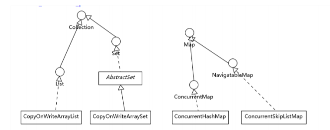

你可以看到，总体上种类和结构还是比较简单的，**如果我们的应用侧重于Map放入或者获取的速度，而不在乎顺序，大多推荐使用ConcurrentHashMap，反之则使 用ConcurrentSkipListMap**；如果我们需要对大量数据进行非常频繁地修改，ConcurrentSkipListMap也可能表现出优势。 我在前面的专栏，谈到了普通无顺序场景选择HashMap，有顺序场景则可以选择类似TreeMap等，但是为什么并发容器里面没有ConcurrentTreeMap呢？ 

这是因为**TreeMap要实现高效的线程安全是非常困难的，它的实现基于复杂的红黑树。为保证访问效率，当我们插入或删除节点时，会移动节点进行平衡操作，这导致在并发场景中 难以进行合理粒度的同步。**而SkipList结构则要相对简单很多，通过层次结构提高访问速度，虽然不够紧凑，空间使用有一定提高（O(nlogn)），但是在增删元素时线程安全的开销 要好很多。为了方便你理解SkipList的内部结构，我画了一个示意图。

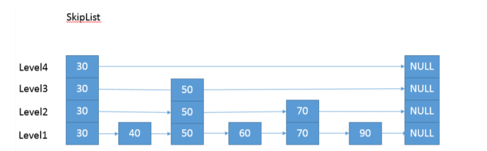

关于两个CopyOnWrite容器，其实CopyOnWriteArraySet是通过包装了CopyOnWriteArrayList来实现的，所以在学习时，我们可以专注于理解一种。 首先，CopyOnWrite到底是什么意思呢？它的原理是，任何修改操作，如add、set、remove，都会拷贝原数组，修改后替换原来的数组，通过这种防御性的方式，实现另类的线 程安全。所以这种数据结构，相对**比较适合读多写少的操作**，不然修改的开销还是非常明显的。


### 第20讲 | 并发包中的ConcurrentLinkedQueue和LinkedBlockingQueue有什么区别？

#### 典型回答 

有时候我们把并发包下面的所有容器都习惯叫作并发容器，但是严格来讲，类似ConcurrentLinkedQueue这种“Concurrent\*”容器，才是真正代表并发。 关于问题中它们的区别： **Concurrent类型基于lock-free，在常见的多线程访问场景，一般可以提供较高吞吐量。** 而**LinkedBlockingQueue内部则是基于锁，并提供了BlockingQueue的等待性方法**。 

不知道你有没有注意到，java.util.concurrent包提供的容器（Queue、List、Set）、Map，从命名上可以大概区分为Concurrent、CopyOnWrite和Blocking*等三类，同样是线 程安全容器，可以简单认为： 

Concurrent类型没有类似CopyOnWrite之类容器相对较重的修改开销。 

但是，凡事都是有代价的，Concurrent往往提供了较低的遍历一致性。你可以这样理解所谓的弱一致性，例如，当利用迭代器遍历时，如果容器发生修改，迭代器仍然可以继续 进行遍历。 与弱一致性对应的，就是我介绍过的同步容器常见的行为“fast-fail”，也就是检测到容器在遍历过程中发生了修改，则抛出ConcurrentModifcationException，不再继续遍历。 

弱一致性的另外一个体现是，size等操作准确性是有限的，未必是100%准确。 

与此同时，读取的性能具有一定的不确定性。


#### 线程安全队列一览

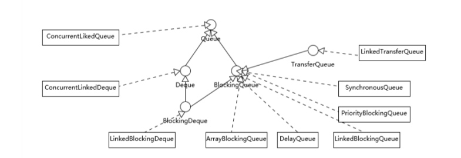

我们可以从不同的角度进行分类，从基本的数据结构的角度分析，有两个特别的Deque实现，ConcurrentLinkedDeque和LinkedBlockingDeque。**Deque的侧重点是支持对队列头尾都进行插入和删除**，所以提供了特定的方法，如: 

尾部插入时需要的addLast(e)、oferLast(e)。 尾部删除所需要的removeLast()、pollLast()。 

从上面这些角度，能够理解ConcurrentLinkedDeque和LinkedBlockingQueue的主要功能区别，也就足够日常开发的需要了。但是如果我们深入一些，通常会更加关注下面这些方面。 从行为特征来看，绝大部分Queue都是实现了**BlockingQueue**接口。在常规队列操作基础上，**Blocking意味着其提供了特定的等待性操作，获取时（take）等待元素进队，或者插 入时（put）等待队列出现空位。**

另一个BlockingQueue经常被考察的点，就是是否有界（Bounded、Unbounded），这一点也往往会影响我们在应用开发中的选择，我这里简单总结一下。

 ArrayBlockingQueue是最典型的的有界队列，其内部以fnal的数组保存数据，数组的大小就决定了队列的边界，所以我们在创建ArrayBlockingQueue时，都要指定容量，如 public ArrayBlockingQueue(int capacity, boolean fair) 

LinkedBlockingQueue，容易被误解为无边界，但其实其行为和内部代码都是基于有界的逻辑实现的，只不过如果我们没有在创建队列时就指定容量，那么其容量限制就自动被 设置为Integer.MAX_VALUE ，成为了无界队列。 

SynchronousQueue，这是一个非常奇葩的队列实现，每个删除操作都要等待插入操作，反之每个插入操作也都要等待删除动作。那么这个队列的容量是多少呢？是1吗？其实不 是的，其内部容量是0。 

**PriorityBlockingQueue是无边界的优先队列**，虽然严格意义上来讲，其大小总归是要受系统资源影响。 

**DelayedQueue和LinkedTransferQueue同样是无边界的队列。**对于无边界的队列，有一个自然的结果，就是**put操作永远也不会发生其他BlockingQueue的那种等待情况**。 

我在介绍ReentrantLock的条件变量用法的时候分析过ArrayBlockingQueue，不知道你有没有注意到，其条件变量与LinkedBlockingQueue版本的实现是有区别 的。notEmpty、notFull都是同一个再入锁的条件变量，而LinkedBlockingQueue则改进了锁操作的粒度，头、尾操作使用不同的锁，所以在通用场景下，它的吞吐量相对要更好 一些。

前面介绍了各种队列实现，在日常的应用开发中，如何进行选择呢？ 以LinkedBlockingQueue、ArrayBlockingQueue和SynchronousQueue为例，我们一起来分析一下，根据需求可以从很多方面考量： 

考虑应用场景中**对队列边界的要求**。ArrayBlockingQueue是有明确的容量限制的，而LinkedBlockingQueue则取决于我们是否在创建时指定，SynchronousQueue则干脆不 能缓存任何元素。 

**从空间利用角度**，数组结构的ArrayBlockingQueue要比LinkedBlockingQueue紧凑，因为其不需要创建所谓节点，但是其初始分配阶段就需要一段连续的空间，所以初始内存 需求更大。 

**通用场景中，LinkedBlockingQueue的吞吐量一般优于ArrayBlockingQueue，因为它实现了更加细粒度的锁操作。** **ArrayBlockingQueue实现比较简单，性能更好预测，属于表现稳定的“选手”。** 

如果我们需要实现的是两个线程之间接力性（handof）的场景，按照专栏上一讲的例子，你可能会选择CountDownLatch，但是SynchronousQueue也是完美符合这种场景 的，而且线程间协调和数据传输统一起来，代码更加规范。 可能令人意外的是，很多时候SynchronousQueue的性能表现，往往大大超过其他实现，尤其是在队列元素较小的场景。


### 第21讲 | Java并发类库提供的线程池有哪几种？ 分别有什么特点？

#### 典型回答 

通常开发者都是利用Executors提供的通用线程池创建方法，去创建不同配置的线程池，主要区别在于不同的ExecutorService类型或者不同的初始参数。 Executors目前提供了5种不同的线程池创建配置： 

**newCachedThreadPool**()，它是一种用来处理大量短时间工作任务的线程池，具有几个鲜明特点：它会试图缓存线程并重用，当无缓存线程可用时，就会创建新的工作线程；如 果线程闲置的时间超过60秒，则被终止并移出缓存；长时间闲置时，这种线程池，不会消耗什么资源。其内部使用SynchronousQueue作为工作队列。

 **newFixedThreadPool**(int nThreads)，重用指定数目（nThreads）的线程，其背后使用的是无界的工作队列，任何时候最多有nThreads个工作线程是活动的。这意味着，如 果任务数量超过了活动队列数目，将在工作队列中等待空闲线程出现；如果有工作线程退出，将会有新的工作线程被创建，以补足指定的数目nThreads。

 **newSingleThreadExecutor**()，它的特点在于工作线程数目被限制为1，操作一个无界的工作队列，所以它保证了所有任务的都是被顺序执行，最多会有一个任务处于活动状 态，并且不允许使用者改动线程池实例，因此可以避免其改变线程数目。 

**newSingleThreadScheduledExecutor**()和**newScheduledThreadPool**(int corePoolSize)，创建的是个ScheduledExecutorService，可以进行定时或周期性的工作调度， 区别在于单一工作线程还是多个工作线程。 

**newWorkStealingPool**(int parallelism)，这是一个经常被人忽略的线程池，Java 8才加入这个创建方法，其内部会构建ForkJoinPool，利用Work-Stealing算法，并行地处 理任务，不保证处理顺序。


#### Executor框架的基本组成

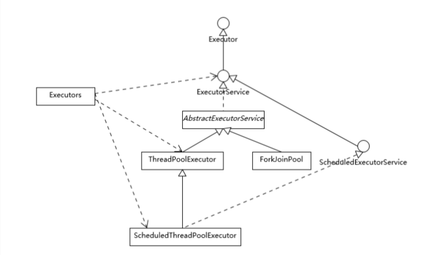

简单理解一下： 

工作队列负责存储用户提交的各个任务，这个工作队列，可以是容量为0的SynchronousQueue（使用newCachedThreadPool），也可以是像固定大小线程池 （newFixedThreadPool）那样使用LinkedBlockingQueue。

 private fnal BlockingQueue workQueue; 

内部的“线程池”，这是指保持工作线程的集合，线程池需要在运行过程中管理线程创建、销毁。例如，对于带缓存的线程池，当任务压力较大时，线程池会创建新的工作线程；当 业务压力退去，线程池会在闲置一段时间（默认60秒）后结束线程。 

private fnal HashSet workers = new HashSet<>(); 

线程池的工作线程被抽象为静态内部类Worker，基于AQS实现。 

ThreadFactory提供上面所需要的创建线程逻辑。 如果任务提交时被拒绝，比如线程池已经处于SHUTDOWN状态，需要为其提供处理逻辑，Java标准库提供了类似ThreadPoolExecutor.AbortPolicy 等默认实现，也可以按照实 际需求自定义。


线程池既然有生命周期，它的状态是如何表征的呢？

 这里有一个非常有意思的设计，**ctl变量被赋予了双重角色，通过高低位的不同，既表示线程池状态，又表示工作线程数目，这是一个典型的高效优化**。试想，实际系统中，虽然我们 可以指定线程极限为Integer.MAX_VALUE ，但是因为资源限制，这只是个理论值，所以完全可以将空闲位赋予其他意义。

private fnal AtomicInteger ctl = new AtomicInteger(ctlOf(RUNNING, 0)); // 真正决定了工作线程数的理论上限 

private satic fnal int COUNT_BITS = Integer.SIZE - 3; 

private satic fnal int COUNT_MASK = (1 << COUNT_BITS) - 1; // 线程池状态，存储在数字的高位 

private satic fnal int RUNNING = -1 << COUNT_BITS;


线程池实践 

线程池虽然为提供了非常强大、方便的功能，但是也不是银弹，使用不当同样会导致问题。我这里介绍些典型情况，经过前面的分析，很多方面可以自然的推导出来。 

避免任务堆积。前面我说过newFixedThreadPool是创建指定数目的线程，但是其工作队列是无界的，如果工作线程数目太少，导致处理跟不上入队的速度，这就很有可能占用大 量系统内存，甚至是出现OOM。诊断时，你可以使用jmap之类的工具，查看是否有大量的任务对象入队。 

避免过度扩展线程。我们通常在处理大量短时任务时，使用缓存的线程池，比如在最新的HTTP/2 client API中，目前的默认实现就是如此。我们在创建线程池的时候，并不能准 确预计任务压力有多大、数据特征是什么样子（大部分请求是1K 、100K还是1M以上？），所以很难明确设定一个线程数目。 另外，如果线程数目不断增长（可以使用jstack等工具检查），也需要警惕另外一种可能性，就是线程泄漏，这种情况往往是因为任务逻辑有问题，导致工作线程迟迟不能被释 放。建议你排查下线程栈，很有可能多个线程都是卡在近似的代码处。

 避免死锁等同步问题，对于死锁的场景和排查，你可以复习专栏第18讲。

 尽量避免在使用线程池时操作ThreadLocal，同样是专栏第17讲已经分析过的，通过今天的线程池学习，应该更能理解其原因，工作线程的生命周期通常都会超过任务的生命周 期。 


线程池大小的选择策略  如果我们的任务主要是进行计算，那么就意味着CPU的处理能力是稀缺的资源，我们能够通过大量增加线程数提高计算能力吗？往往是不能的，如果线程太多，反倒可能导致大量 的上下文切换开销。所以，这种情况下，**通常建议按照CPU核的数目N或者N+1。 如果是需要较多等待的任务，例如I/O操作比较多，可以参考Brain Goetz推荐的计算方法：** 

**线程数 = CPU核数 × （1 + 平均等待时间/平均工作时间）** 

这些时间并不能精准预计，需要根据采样或者概要分析等方式进行计算，然后在实际中验证和调整。

上面是仅仅考虑了CPU等限制，实际还可能受各种系统资源限制影响。


### 第22讲 | AtomicInteger底层实现原理是什么？如何在自己的产品代码中应用CAS操作？

#### 典型回答 

**AtomicIntger是对int类型的一个封装，提供原子性的访问和更新操作，其原子性操作的实现是基于CAS（compare-and-swap）技术。 所谓CAS，表征的是一些列操作的集合，获取当前数值，进行一些运算，利用CAS指令试图进行更新。如果当前数值未变，代表没有其他线程进行并发修改，则成功更新。否则，可 能出现不同的选择，要么进行重试，要么就返回一个成功或者失败的结果。 从AtomicInteger的内部属性可以看出，它依赖于Unsafe提供的一些底层能力，进行底层操作；以volatile的value字段，记录数值，以保证可见性。**


那么在Java代码中，我们怎么实现锁操作呢？

Unsafe似乎不是个好的选择，因为Java 9中移除 了Unsafe.moniterEnter()/moniterExit()，导致无法平滑升级到新的JDK版本。目前Java提供了两种公共API，可以实现这种CAS操作，比如使用java.util.concurrent.atomic.**AtomicLongFieldUpdater**，它是基于反射机制创建，我们需要保证类型和字段名称正确。

Atomic包提供了最常用的原子性数据类型，甚至是引用、数组等相关原子类型和更新操作工具，是很多线程安全程序的首选。

如果是Java 9以后，我们完全可以采用另外一种方式实现，也就是Variable Handle API，这是源自于JEP 193，提供了各种粒度的原子或者有序性的操作等。


一般来说，我们进行的类似CAS操作，可以并且推荐使用Variable Handle API去实现，其提供了精细粒度的公共底层API。我这里强调公共，是因为其API不会像内部API那样，发 生不可预测的修改，这一点提供了对于未来产品维护和升级的基础保障，坦白说，很多额外工作量，都是源于我们使用了Hack而非Solution的方式解决问题。 

CAS也并不是没有副作用，试想，其常用的失败重试机制，隐含着一个假设，即竞争情况是短暂的。大多数应用场景中，确实大部分重试只会发生一次就获得了成功，但是总是有意 外情况，所以在有需要的时候，还是**要考虑限制自旋的次数，以免过度消耗CPU**。 另外一个就是**著名的ABA问题**，这是通常只在lock-free算法下暴露的问题。我前面说过CAS是在更新时比较前值，如果对方只是恰好相同，例如期间发生了 A -> B -> A的更新， 仅仅判断数值是A，可能导致不合理的修改操作。**针对这种情况，Java提供了AtomicStampedReference工具类，通过为引用建立类似版本号（stamp）的方式，来保证CAS的正 确性**。 前面介绍了CAS的场景与实现，**幸运的是，大多数情况下，Java开发者并不需要直接利用CAS代码去实现线程安全容器等，更多是通过并发包等间接享受到lock-free机制在扩展性 上的好处。** 下面我来介绍一下AbstractQueuedSynchronizer（AQS），其是Java并发包中，实现各种同步结构和部分其他组成单元（如线程池中的Worker）的基础。


AQS的设计初衷

从原理上，一种同步结构往往是可以利用其他的结构实现的，例如我在专栏第19讲中提到过可以使用Semaphore实现互斥锁。但是，对某 种同步结构的倾向，会导致复杂、晦涩的实现逻辑，所以，他选择了将基础的同步相关操作抽象在AbstractQueuedSynchronizer中，利用AQS为我们构建同步结构提供了范本。 AQS内部数据和方法，可以简单拆分为： 

**一个volatile的整数成员表征状态**，同时提供了setState和getState方法 private volatile int sate;

 **一个先入先出（FIFO）的等待线程队列**，以实现多线程间竞争和等待，这是AQS机制的核心之一。 

**各种基于CAS的基础操作方法，以及各种期望具体同步结构去实现的acquire/release方法**。利用AQS实现一个同步结构，至少要实现两个基本类型的方法，分别是acquire操作，获取资源的独占权；还有就是release操作，释放对某个资源的独占。


### 第23讲 | 请介绍类加载过程，什么是双亲委派模型？

#### 典型回答 

一般来说，**我们把Java的类加载过程分为三个主要步骤：加载、链接、初始化**，具体行为在Java虚拟机规范里有非常详细的定义。 

**首先是加载阶段（Loading），它是Java将字节码数据从不同的数据源读取到JVM中，并映射为JVM认可的数据结构（Class对象）**，这里的数据源可能是各种各样的形态，如jar文 件、class文件，甚至是网络数据源等；如果输入数据不是ClassFile的结构，则会抛出ClassFormatError。 加载阶段是用户参与的阶段，我们可以自定义类加载器，去实现自己的类加载过程。 

**第二阶段是链接（Linking），这是核心的步骤，简单说是把原始的类定义信息平滑地转化入JVM运行的过程中。**这里**可进一步细分为三个步骤： 验证（Verifcation），这是虚拟机安全的重要保障，JVM需要核验字节信息是符合Java虚拟机规范的**，否则就被认为是VerifyError，这样就防止了恶意信息或者不合规的信息危 害JVM的运行，验证阶段有可能触发更多class的加载。 **准备（Preparation），创建类或接口中的静态变量，并初始化静态变量的初始值。**但这里的“初始化”和下面的显式初始化阶段是有区别的，侧重点在于分配所需要的内存空间， 不会去执行更进一步的JVM指令。 **解析（Resolution），在这一步会将常量池中的符号引用（symbolic reference）替换为直接引用。**在Java虚拟机规范中，详细介绍了类、接口、方法和字段等各个方面的解 析。 

**最后是初始化阶段（initialization），这一步真正去执行类初始化的代码逻辑，包括静态字段赋值的动作，以及执行类定义中的静态初始化块内的逻辑，编译器在编译阶段就会把这 部分逻辑整理好，父类型的初始化逻辑优先于当前类型的逻辑。** 

**再来谈谈双亲委派模型，简单说就是当类加载器（Class-Loader）试图加载某个类型的时候，除非父加载器找不到相应类型，否则尽量将这个任务代理给当前加载器的父加载器去做。使用委派模型的目的是避免重复加载Java类型。**


### 第29讲 | Java内存模型中的happen-before是什么？

#### 典型回答 

Happen-before关系，是Java内存模型中保证多线程操作可见性的机制，也是**对早期语言规范中含糊的可见性概念的一个精确定义**。 它的具体表现形式，包括但远不止是我们直觉中的synchronized、volatile、lock操作顺序等方面，例如： 

线程内执行的每个操作，都保证happen-before后面的操作，这就保证了基本的程序顺序规则，这是开发者在书写程序时的基本约定。 

对于volatile变量，对它的写操作，保证happen-before在随后对该变量的读取操作。 

对于一个锁的解锁操作，保证happen-before加锁操作。 

对象构建完成，保证happen-before于fnalizer的开始动作。 

甚至是类似线程内部操作的完成，保证happen-before其他Thread.join()的线程等。 

这些**happen-before关系是存在着传递性的**，如果满足a happen-before b和b happen-before c，那么a happen-before c也成立。 前面我一直用happen-before，而不是简单说前后，是因为它**不仅仅是对执行时间的保证，也包括对内存读、写操作顺序的保证。仅仅是时钟顺序上的先后，并不能保证线程交互的可见性。**


JMM为Java工程师隔离了不同处理器内存排序的区别，这也是为什么我通常不建议过早深入处理 器体系结构，某种意义上来说，这样本就违背了JMM的初衷。

#### JMM是怎么解决可见性等问题的呢？ 

在这里，我有必要简要介绍一下典型的问题场景。 我在第25讲里介绍了JVM内部的运行时数据区，**但是真正程序执行，实际是要跑在具体的处理器内核上。你可以简单理解为，把本地变量等数据从内存加载到缓存、寄存器，然后运算结束写回主内存。**你可以从下面示意图，看这两种模型的对应。

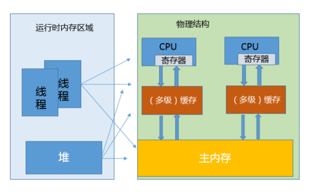

看上去很美好，但是当多线程共享变量时，情况就复杂了。试想，如果处理器对某个共享变量进行了修改，可能只是体现在该内核的缓存里，这是个本地状态，而运行在其他内核上 的线程，可能还是加载的旧状态，这很可能导致一致性的问题。从理论上来说，多线程共享引入了复杂的数据依赖性，不管编译器、处理器怎么做重排序，都必须尊重数据依赖性的 要求，否则就打破了正确性！这就是JMM所要解决的问题。 **JMM内部的实现通常是依赖于所谓的内存屏障，通过禁止某些重排序的方式，提供内存可见性保证，也就是实现了各种happen-before规则。与此同时，更多复杂度在于，需要尽量 确保各种编译器、各种体系结构的处理器，都能够提供一致的行为。**


#### 以volatile为例，看看如何利用内存屏障实现JMM定义的可见性？ 

对于一个volatile变量： 

**对该变量的写操作之后，编译器会插入一个写屏障。** 

**对该变量的读操作之前，编译器会插入一个读屏障。** 

​	**内存屏障能够在类似变量读、写操作之后，保证其他线程对volatile变量的修改对当前线程可见，或者本地修改对其他线程提供可见性。换句话说，线程写入，写屏障会通过类似强迫 刷出处理器缓存的方式，让其他线程能够拿到最新数值。**

我们经常会说volatile比synchronized之类更加轻量，但轻量也仅仅是相对的，volatile的读、写仍然要比普通的读写要开销更大，所以如果你是在性能高度敏感的场景，除非你确 定需要它的语义，不然慎用。


#### 可从四个维度去理解JMM 

1 从JVM运行时视角来看，JVM内存可分为JVM栈、本地方法栈、PC计数器、方法区、堆；其中前三区是线程所私有的，后两者则是所有线程共有的 

2 从JVM内存功能视角来看，JVM可分为堆内存、非堆内存与其他。其中堆内存对应于上述的堆区；非堆内存对应于上述的JVM栈、本地方法栈、PC计数器、方法区；其他则对应于直接内存 

3 从线程运行视角来看，JVM可分为主内存与线程工作内存。Java内存模型规定了所有的变量都存储在主内存中；每个线程的工作内存保存了被该线程使用到的变量，这些变量是主内存的副本拷贝，线程对变量的所有操作（读取、赋值等）都必须在工作内存中进行，而不能直接读写主内存中的变量 

4 从垃圾回收视角来看，JVM中的堆区=新生代+老年代。新生代主要用于存放新创建的对象与存活时长小的对象，新生代=E+S1+S2；老年代则用于存放存活时间长的对象


### 第30讲 | Java程序运行在Docker等容器环境有哪些新问题？

#### 典型回答 

对于Java来说，Docker毕竟是一个较新的环境**，例如，其内存、CPU等资源限制是通过CGroup（Control Group）实现的，早期的JDK版本（8u131之前）并不能识别这些限制**，进而会导致一些基础问题： 

如果未配置合适的JVM堆和元数据区、直接内存等参数，Java就有可能试图使用超过容器限制的内存，最终被容器OOM kill，或者自身发生OOM。 

错误判断了可获取的CPU资源，例如，Docker限制了CPU的核数，JVM就可能设置不合适的GC并行线程数等。

从应用打包、发布等角度出发，JDK自身就比较大，生成的镜像就更为臃肿，当我们的镜像非常多的时候，镜像的存储等开销就比较明显了。 

如果考虑到微服务、Serverless等新的架构和场景，Java自身的大小、内存占用、启动速度，都存在一定局限性，因为Java早期的优化大多是针对长时间运行的大型服务器端应用。


#### Docker到底有什么特别？

虽然看起来Docker之类容器和虚拟机非常相似。但是，如果深入分析你会发现，**Docker并不是一种完 全的虚拟化技术，而更是一种轻量级的隔离技术。**

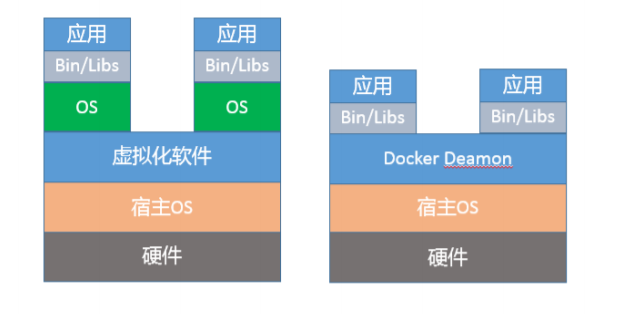

上面的示意图，展示了Docker与虚拟机的区别。从技术角度，基于namespace，Docker为每个容器提供了单独的命名空间，对网络、PID、用户、IPC通信、文件系统挂载点等实 现了隔离。对于CPU、内存、磁盘IO等计算资源，则是通过CGroup进行管理。如果你想了解更多Docker的细节，请参考相关技术文档。 **Docker仅在类似Linux内核之上实现了有限的隔离和虚拟化**，并不是像传统虚拟化软件那样，独立运行一个新的操作系统。如果是虚拟化的操作系统，不管是Java还是其他程序，只 要调用的是同一个系统API，都可以透明地获取所需的信息，基本不需要额外的兼容性改变。 容器虽然省略了虚拟操作系统的开销，实现了轻量级的目标，但也带来了额外复杂性，它限制对于应用不是透明的，需要用户理解Docker的新行为。所以，有专家曾经说过，“幸运 的是Docker没有完全隐藏底层信息，但是不幸的也是Docker没有隐藏底层信息！” 对于Java平台来说，这些未隐藏的底层信息带来了很多意外的困难，主要体现在几个方面：

 **第一，容器环境对于计算资源的管理方式是全新的，CGroup作为相对比较新的技术，历史版本的Java显然并不能自然地理解相应的资源限制。 **

**第二，namespace对于容器内的应用细节增加了一些微妙的差异，比如jcmd、jstack等工具会依赖于“/proc//”下面提供的部分信息，但是Docker的设计改变了这部分信息的原有 结构，我们需要对原有工具进行修改以适应这种变化**。


#### 从JVM运行机制的角度，为什么这些“沟通障碍”会导致OOM等问题呢？ 

你可以思考一下，这个问题实际是反映了JVM如何根据系统资源（内存、CPU等）情况，在启动时设置默认参数。

这就是所谓的Ergonomics机制，例如： 

JVM会大概根据检测到的内存大小，设置最初启动时的堆大小为系统内存的1/64；并将堆最大值，设置为系统内存的1/4。 

而JVM检测到系统的CPU核数，则直接影响到了Parallel GC的并行线程数目和JIT complier线程数目，甚至是我们应用中ForkJoinPool等机制的并行等级。 

这些默认参数，是根据通用场景选择的初始值。但是由于容器环境的差异，Java的判断很可能是基于错误信息而做出的。这就类似，我以为我住的是整栋别墅，实际上却只有一个房 间是给我住的。 

更加严重的是，JVM的一些原有诊断或备用机制也会受到影响。为保证服务的可用性，一种常见的选择是依赖“-XX:OnOutOfMemoryError”功能，通过调用处理脚本的形式来做一 些补救措施，比如自动重启服务等。但是，这种机制是基于fork实现的，当Java进程已经过度提交内存时，fork新的进程往往已经不可能正常运行了。 

根据前面的总结，似乎问题非常棘手，那我们在实践中，**如何解决这些问题呢？ 首先，如果你能够升级到最新的JDK版本，这个问题就迎刃而解了。** 

针对这种情况，JDK 9中引入了一些实验性的参数，以方便Docker和Java“沟通”，例如针对内存限制，可以使用下面的参数设置： -XX:+UnlockExperimentalVMOptions -XX:+UseCGroupMemoryLimitForHeap 注意，这两个参数是顺序敏感的，并且只支持Linux环境。而对于CPU核心数限定，Java已经被修正为可以正确理解“–cpuset-cpus”等设置，无需单独设置参数。 

如果你可以切换到JDK 10或者更新的版本，问题就更加简单了。Java对容器（Docker）的支持已经比较完善，默认就会自适应各种资源限制和实现差异。前面提到的实验性参 数“UseCGroupMemoryLimitForHeap”已经被标记为废弃。 与此同时，新增了参数用以明确指定CPU核心的数目。 -XX:ActiveProcessorCount=N 如果实践中发现有问题，也可以使用“-XX:-UseContainerSupport”，关闭Java的容器支持特性，这可以作为一种防御性机制，避免新特性破坏原有基础功能。 

**幸运的是，JDK 9中的实验性改进已经被移植到Oracle JDK 8u131之中**，你可以直接下载相应镜像，并配置“UseCGroupMemoryLimitForHeap”，后续很有可能还会进一步 将JDK 10中相关的增强，应用到JDK 8最新的更新中。

对于容器镜像大小的问题，如果你使用的是JDK 9以后的版本，完全**可以使用jlink工具定制最小依赖的Java运行环境，将JDK裁剪为几十M的大小，这样运行起来并 不困难。**


### 第32讲 | 如何写出安全的Java代码？

知识扩展 

首先，我们一起来看一段不起眼的条件判断代码，这里可能有什么问题吗？

 // a, b, c都是int类型的数值 

if (a + b < c) { 

// … 

} 

你可能会纳闷，这是再常见不过的一个条件判断了，能有什么安全隐患？ **这里的隐患是数值类型需要防范溢出**，否则这不仅仅可能会带来逻辑错误，在特定情况下可能导致严重的安全漏洞。 从语言特性来说，Java和JVM提供了很多基础性的改进，相比于传统的C、C++等语言，对于数组越界等处理要完善的多，原生的避免了缓冲区溢出等攻击方式，提高了软件的安全 性。但这并不代表完全杜绝了问题，Java程序可能调用本地代码，也就是JNI技术，错误的数值可能导致C/C++层面的数据越界等问题，这是很危险的。 所以，上面的条件判断，需要判断其数值范围，例如，写成类似下面结构。

 if (a < c – b){

}


对于安全标准特别高的系统，甚至可能要求敏感信息被使用后，要立即明确在内存中销毁，以免被探测；或者避免在发生core dump时，意外暴露。

 第三，Java提供了序列化等创新的特性，广泛使用在远程调用等方面，但也带来了复杂的安全问题。直到今天，序列化仍然是个安全问题频发的场景。 

**针对序列化，通常建议： 敏感信息不要被序列化！在编码中，建议使用transient关键字将其保护起来。 反序列化中，建议在readObject中实现与对象构件过程相同的安全检查和数据检查。** 另外，在JDK 9中，Java引入了过滤器机制，以保证反序列化过程中数据都要经过基本验证才可以使用。其原理是通过黑名单和白名单，限定安全或者不安全的类型，并且你可以进 行定制，然后通过环境变量灵活进行配置， 更加具体的使用你可以参考 ObjectInputFilter。 通过前面的介绍，你可能注意到，**很多安全问题都是源于非常基本的编程细节，类似Immutable、封装等设计，都存在着安全性的考虑。**


### 第33讲 | 后台服务出现明显“变慢”，谈谈你的诊断思路？

#### 典型回答 

首先，需要对这个问题进行更加清晰的定义: 服务是突然变慢还是长时间运行后观察到变慢？类似问题是否重复出现？ “慢”的定义是什么，我能够理解是系统对其他方面的请求的反应延时变长吗? 第二，理清问题的症状，这更便于定位具体的原因，有以下一些思路： **问题可能来自于Java服务自身，也可能仅仅是受系统里其他服务的影响。初始判断可以先确认是否出现了意外的程序错误，例如检查应用本身的错误日志。 对于分布式系统，很多公司都会实现更加系统的日志、性能等监控系统。一些Java诊断工具也可以用于这个诊断，例如通过JFR（Java Flight Recorder），监控应用是否大量出 现了某种类型的异常。 如果有，那么异常可能就是个突破点。 如果没有，可以先检查系统级别的资源等情况，监控CPU、内存等资源是否被其他进程大量占用，并且这种占用是否不符合系统正常运行状况。 监控Java服务自身，例如GC日志里面是否观察到Full GC等恶劣情况出现，或者是否Minor GC在变长等；利用jstat等工具，获取内存使用的统计信息也是个常用手段；利 用jstack等工具检查是否出现死锁等。** 如果还不能确定具体问题，对应用进行Profling也是个办法，但因为它会对系统产生侵入性，如果不是非常必要，大多数情况下并不建议在生产系统进行。 定位了程序错误或者JVM配置的问题后，就可以采取相应的补救措施，然后验证是否解决，否则还需要重复上面部分过程。


除了**CPU，内存和IO**是重要的注意事项，比如： 

​	利用free之类查看内存使用。 或者，进一步判断swap使用情况，top命令输出中Virt作为虚拟内存使用量，就是物理内存（Res）和swap求和，所以可以反推swap使用。显然，JVM是不希望发生大量 的swap使用的。 对于IO问题，既可能发生在磁盘IO，也可能是网络IO。例如，利用iostat等命令有助于判断磁盘的健康状况。

对于**JVM**层面的性能分析，我们已经介绍过非常多了：

​	 **利用JMC、JConsole等工具进行运行时监控。 利用各种工具，在运行时进行堆转储分析，或者获取各种角度的统计数据（如jstat -gcutil分析GC、内存分带等）。 GC日志等手段，诊断Full GC、Minor GC，或者引用堆积等**。 这里并不存在放之四海而皆准的办法，具体问题可能非常不同，还要看你是否能否充分利用这些工具，从种种迹象之中，逐步判断出问题所在。 对于应用Profling，简单来说就是利用一些侵入性的手段，收集程序运行时的细节，以定位性能问题瓶颈。所谓的细节，就是例如内存的使用情况、最频繁调用的方法是什么，或者 上下文切换的情况等。 我在前面给出的典型回答里提到，**一般不建议生产系统进行Profling，大多数是在性能测试阶段进行。但是，当生产系统确实存在这种需求时，也不是没有选择。我建议使用JFR配 合JMC来做Profling，因为它是从Hotspot JVM内部收集底层信息，并经过了大量优化，性能开销非常低，通常是低于 2% 的**；并且如此强大的工具，也已经被Oracle开源出来！ 所以，JFR/JMC完全具备了生产系统Profling的能力，目前也确实在真正大规模部署的云产品上使用过相关技术，快速地定位了问题。 它的使用也非常方便，你不需要重新启动系统或者提前增加配置。例如，你可以在运行时启动JFR记录，并将这段时间的信息写入文件： Jcmd  JFR.sart duration=120s flename=myrecording.jfr 然后，使用JMC打开“.jfr文件”就可以进行分析了，方法、异常、线程、IO等应有尽有，其功能非常强大。


### 第37讲 | 谈谈Spring Bean的生命周期和作用域？

典型回答 

Spring Bean生命周期比较复杂，可以分为创建和销毁两个过程。 首先，创建Bean会经过一系列的步骤，主要包括： 

实例化Bean对象。 

设置Bean属性。 

如果我们通过各种Aware接口声明了依赖关系，则会注入Bean对容器基础设施层面的依赖。具体包括BeanNameAware、BeanFactoryAware和ApplicationContextAware， 分别会注入Bean ID、Bean Factory或者ApplicationContext。 

调用BeanPostProcessor的前置初始化方法postProcessBeforeInitialization。 

如果实现了InitializingBean接口，则会调用afterPropertiesSet方法。 

调用Bean自身定义的init方法。 

调用BeanPostProcessor的后置初始化方法postProcessAfterInitialization。 

创建过程完毕。 

你可以参考下面示意图理解这个具体过程和先后顺序

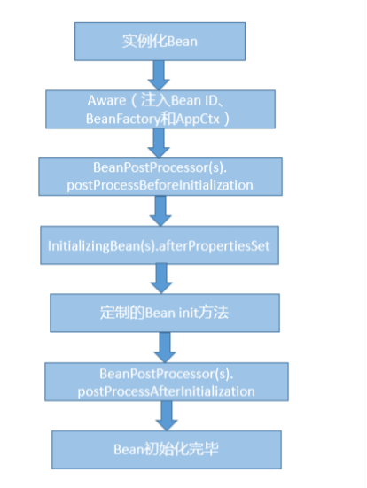


第二，Spring Bean的销毁过程会依次调用DisposableBean的destroy方法和Bean自身定制的destroy方法。 

**Spring Bean有五个作用域**，其中最基础的有下面两种： 

**Singleton**，这是Spring的默认作用域，也就是为每个IOC容器创建唯一的一个Bean实例。

 **Prototype**，针对每个getBean请求，容器都会单独创建一个Bean实例。 

从Bean的特点来看，Prototype适合有状态的Bean，而Singleton则更适合无状态的情况。另外，使用Prototype作用域需要经过仔细思考，毕竟频繁创建和销毁Bean是有明显开 销的。 

如果是**Web容器，**则支持另外三种作用域： 

**Request**，为每个HTTP请求创建单独的Bean实例。 

**Session**，很显然Bean实例的作用域是Session范围。 

GlobalSession，用于Portlet容器，因为每个Portlet有单独的Session，GlobalSession提供一个全局性的HTTP Session。


### 第38讲 | 对比Java标准NIO类库，你知道Netty是如何实现更高性能的吗？

#### 典型回答 

单独从性能角度，Netty在基础的NIO等类库之上进行了很多改进，例如： **更加优雅的Reactor模式实现、灵活的线程模型、利用EventLoop等创新性的机制，可以非常高效地管理成百上千的Channel。 充分利用了Java的Zero-Copy机制，并且从多种角度，“斤斤计较”般的降低内存分配和回收的开销。例如，使用池化的Direct Buffer等技术，在提高IO性能的同时，减少了对象 的创建和销毁；利用反射等技术直接操纵SelectionKey，使用数组而不是Java容器等。 使用更多本地代码。例如，直接利用JNI调用Open SSL等方式，获得比Java内建SSL引擎更好的性能。 在通信协议、序列化等其他角度的优化**。 总的来说，Netty并没有Java核心类库那些强烈的通用性、跨平台等各种负担，针对性能等特定目标以及Linux等特定环境，采取了一些极致的优化手段.

#### 知识扩展 

首先，我们从整体了解一下**Netty**。按照官方定义，它是**一个异步的、基于事件Client/Server的网络框架，目标是提供一种简单、快速构建网络应用的方式，同时保证高吞吐量、低延时、高可靠性**。 从设计思路和目的上，Netty与Java自身的NIO框架相比有哪些不同呢？ 我们知道Java的标准类库，由于其基础性、通用性的定位，往往过于关注技术模型上的抽象，而不是从一线应用开发者的角度去思考。我曾提到过，引入并发包的一个重要原因就 是，应用开发者使用Thread API比较痛苦，需要操心的不仅仅是业务逻辑，而且还要自己负责将其映射到Thread模型上。Java NIO的设计也有类似的特点，开发者需要深入掌握线 程、IO、网络等相关概念，学习路径很长，很容易导致代码复杂、晦涩，即使是有经验的工程师，也难以快速地写出高可靠性的实现。 Netty的**设计强调了 “Separation Of Concerns”，通过精巧设计的事件机制，将业务逻辑和无关技术逻辑进行隔离**，并通过各种方便的抽象，一定程度上填补了了基础平台和业务开 发之间的鸿沟，更有利于在应用开发中普及业界的最佳实践。 

另外，Netty > java.nio + java. net！ 从API能力范围来看，Netty完全是Java NIO框架的一个大大的超集。

除了核心的事件机制等，Netty还额外提供了很多功能，例如： 

从网络协议的角度，Netty除了支持传输层的UDP、TCP、SCTP协议，也支持HTTP(s)、WebSocket等多种应用层协议，它并不是单一协议的API。 

在应用中，需要将数据从Java对象转换成为各种应用协议的数据格式，或者进行反向的转换，Netty为此提供了一系列扩展的编解码框架，与应用开发场景无缝衔接，并且性能良好。 

它扩展了Java NIO Bufer，提供了自己的ByteBuf实现，并且深度支持Direct Bufer等技术，甚至hack了Java内部对Direct Bufer的分配和销毁等。

同时，Netty也提供了更 加完善的Scatter/Gather机制实现。 可以看到，Netty的能力范围大大超过了Java核心类库中的NIO等API，可以说它是一个从应用视角出发的产物。


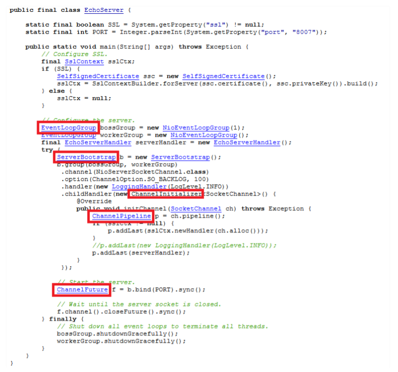

Netty的几个核心概念，请注意我用红框标记出的部分： 

ServerBootstrap，服务器端程序的入口，这是Netty为简化网络程序配置和关闭等生命周期管理，所引入的Bootstrapping机制。我们通常要做的创建Channel、绑定端口、注 册Handler等，都可以通过这个统一的入口，以Fluent API等形式完成，相对简化了API使用。与之相对应， Bootstrap则是Client端的通常入口。 

Channel，作为一个基于NIO的扩展框架，Channel和Selector等概念仍然是Netty的基础组件，但是针对应用开发具体需求，提供了相对易用的抽象。 

EventLoop，这是Netty处理事件的核心机制。例子中使用了EventLoopGroup。我们在NIO中通常要做的几件事情，如注册感兴趣的事件、调度相应的Handler等，都 是EventLoop负责。

 ChannelFuture，这是Netty实现异步IO的基础之一，保证了同一个Channel操作的调用顺序。Netty扩展了Java标准的Future，提供了针对自己场景的特有Future定义。 

ChannelHandler，这是应用开发者放置业务逻辑的主要地方，也是我上面提到的“Separation Of Concerns”原则的体现。 

ChannelPipeline，它是ChannelHandler链条的容器，每个Channel在创建后，自动被分配一个ChannelPipeline。

在上面的示例中，我们通过ServerBootstrap注册 了ChannelInitializer，并且实现了initChannel方法，而在该方法中则承担了向ChannelPipleline安装其他Handler的任务。

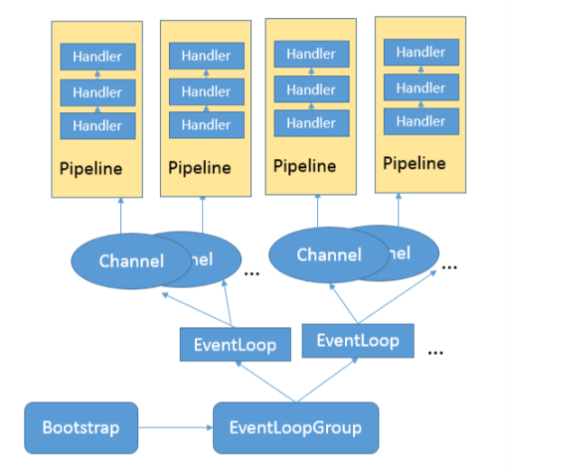

对比Java标准NIO的代码，Netty提供的相对高层次的封装，减少了对Selector等细节的操纵，而EventLoop、Pipeline等机制则简化了编程模型，开发者不用担心并发等问题，在 一定程度上简化了应用代码的开发。最难能可贵的是，这一切并没有以可靠性、可扩展性为代价，反而将其大幅度提高。