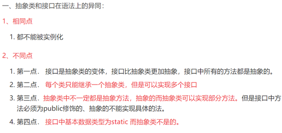

## 杂记

#### 1.脑裂

脑裂一般存在与集群环境，比如es、zookeeper集群，这些集环境有一个统一的特点，就是它们有一个大脑。Zookeeper中的脑裂问题是如果解决脑裂问题的——采用“过半机制”。在领导者选举的过程中，如果某台zkServer获得了超过半数（大于一半）的选票，则此zkServer就可以成为Leader。

 

#### 2. 2pc和3pc的详解与对比

https://www.jianshu.com/p/30a18e4ef16e


#### 3.B+树解决了B树需要回旋查找的问题

1.单一节点存储更多的元素，使得查询的IO次数更少。

2.所有查询都要查找到叶子节点，查询性能稳定。

3.所有叶子节点形成有序链表，便于范围查询。

 

#### 4. HashMap

如何进行位运算呢？有如下的公式（Length是HashMap的长度）：
index = Hash（Key） & （Length - 1）
反观长度16或者其他2的幂，Length-1的值是所有二进制位全为1，这种情况下，index的结果等同于HashCode后几位的值。只要输入的HashCode本身分布均匀，Hash算法的结果就是均匀的。

https://www.toutiao.com/i6864559347301941771/


#### 5.Java中的Object、T（泛型）、?区别

1.Object范围非常广，而T从一开始就会限定这个类型（包括它可以限定类型为Object）。
2.Object由于它是所有类的父类，所以会强制类型转换，而T从一开始在编码时（注意是在写代码时）就限定了某种具体类型，所以它不用强制类型转换。（之所以要强调在写代码时是因为泛型在虚拟机中会被JVM擦除掉它的具体类型信息，这点可参考泛型，在这里不做引申）。
?如果使用extends,super就能将范围缩小 ,使用泛型、通配符提高了代码的复用性。


#### 6.幂等性

通俗的说就是一个接口, 多次发起同一个请求, 必须保证操作只能执行一次 

1.实现幂等性常见的方式有：悲观锁（for update）、乐观锁、唯一约束
2.几种方式，按照最优排序：乐观锁 > 唯一约束 > 悲观锁

一般使用 分布式锁保证只有对应的一个任务执行，再利用 乐观锁/唯一索引 保证业务的幂等性。

例子：

### （乐观锁方式）

依靠数据库中的**乐观锁**来实现。

1.接收到支付宝支付成功请求
2.查询订单信息

```
select * from t_order where order_id = trade_no;
```

3.判断订单是已处理
4.如果订单已处理直接返回，若未处理，继续向下执行
5.打开本地事物
6.给本地系统给用户加钱
7.将订单状态置为成功，注意这块是重点，伪代码：

```
update t_order set status = 1 where order_id = trade_no where status = 0;//上面的update操作会返回影响的行数numif(num==1){ //表示更新成功
 提交事务;
}else{ //表示更新失败
 回滚事务;
}
```

注意：
update t_order set status = 1 where order_id = trade_no where status = 0; 是依靠**乐观锁**来实现的，status=0作为条件去更新，类似于java中的cas操作；关于什么是cas操作，可以移步：[什么是 CAS 机制？](https://technique.zhizuobiao.com/technique-19053000063/)
执行这条sql的时候，如果有多个线程同时到达这条代码，数据内部会保证update同一条记录会排队执行，最终最有一条update会执行成功，其他未成功的，他们的num为0，然后根据num来进行提交或者回滚操作。

### （唯一约束方式）

依赖数据库中唯一约束来实现。

我们可以创建一个表：

```
CREATE TABLE `t_uq_dipose` (  `id` bigint(20) NOT NULL AUTO_INCREMENT,  `ref_type` varchar(32) NOT NULL DEFAULT '' COMMENT '关联对象类型',  `ref_id` varchar(64) NOT NULL DEFAULT '' COMMENT '关联对象id',
  PRIMARY KEY (`id`),  UNIQUE KEY `uq_1` (`ref_type`,`ref_id`) COMMENT '保证业务唯一性') ENGINE=InnoDB;
```

对于任何一个业务，有一个业务类型(ref_type)，业务有一个全局唯一的订单号，业务来的时候，先查询t_uq_dipose表中是否存在相关记录，若不存在，继续放行。

过程如下：

1.接收到支付宝支付成功请求
2.查询t_uq_dipose(**条件ref_id,ref_type**)，可以判断订单是否已处理

```
select * from t_uq_dipose where ref_type = '充值订单' and ref_id = trade_no;
```

3.判断订单是已处理
4.如果订单已处理直接返回，若未处理，继续向下执行
5.打开本地事物
6.给本地系统给用户加钱
7.将订单状态置为成功
8.向t_uq_dipose插入数据，插入成功，提交本地事务，插入失败，回滚本地事务，伪代码：

```
try{    insert into t_uq_dipose (ref_type,ref_id) values ('充值订单',trade_no);
    提交本地事务：
}catch(Exception e){
    回滚本地事务;
}
```

说明：
对于同一个业务，ref_type是一样的，当并发时，插入数据只会有一条成功，其他的会违法唯一约束，进入catch逻辑，当前事务会被回滚，最终最有一个操作会成功，从而保证了幂等性操作。
关于这种方式可以写成通用的方式，不过业务量大的情况下，t_uq_dipose插入数据会成为系统的瓶颈，需要考虑分表操作，解决性能问题。
上面的过程中向t_uq_dipose插入记录，最好放在最后执行，原因：插入操作会锁表，放在最后能让锁表的时间降到最低，提升系统的并发性。


 

#### 7.减少锁的个数和请求

在同一个方法里，尽可能减少锁的个数 减少对锁的请求

 

#### 8.一致性Hash算法

一致性Hash算法是在Hash算法基础上建立和改进的，它是一种分布式算法，能确保数据的分布平衡性，常用于负载均衡类的应用。


#### 9.JWT总结


**JWT的构成**

第一部分我们称它为**头部**（header),第二部分我们称其为**载荷**（payload, 类似于飞机上承载的物品)，第三部分是**签证**（signature).

1.Header(头） 

作用：**记录令牌类型、签名算法等** 

例如：{“alg":"HS256","type","JWT}

2.Payload(有效载荷）

作用：**携带一些用户信息**，它的一个属性对被称为claim，这样的标准成为claims标准，同样是将其用Base64Url编码

例如：{"id":"1","created":"2021-09-01 00:00:00"}

3.Signature(签名）

作用：**防止Token被篡改、确保安全性** 

例如 计算出来的签名，一个字符串


JWT默认不加密，但可以加密。生成原始令牌后，可以使用改令牌再次对其进行加密。

当JWT未加密方法是，一些私密数据无法通过JWT传输。

JWT不仅可用于认证，还可用于信息交换。（善用JWT有助于减少服务器请求数据库的次数。）

JWT的最大缺点是服务器不保存会话状态，所以在使用期间不可能取消令牌或更改令牌的权限。也就是说，一旦**JWT签发，在有效期内将会一直有效**。

JWT本身包含认证信息，因此一旦信息泄露，任何人都可以获得令牌的所有权限。为了减少盗用，**JWT的有效期不宜设置太长**。**对于某些重要操作，用户在使用时应该每次都进行进行身份验证**。

为了减少盗用和窃取，JWT不建议使用HTTP协议来传输代码，而是**使用加密的HTTPS协议进行传输**。

https://www.liqingbo.cn/docs/jwt/content/summary.html


**JWT的签发生成也是在服务器端的，secret的作用是进行jwt的签发和jwt的验证，所以，它就是你服务端的私钥，在任何场景都不应该流露出去。一旦客户端得知这个secret, 那就意味着客户端是可以自我签发jwt了。**


**签名**

JWT签名算法中，一般有两个选择，一个采用HS256,另外一个就是采用RS256。

RS256 (采用SHA-256 的 RSA 签名) 是一种非对称算法。

HS256 (带有 SHA-256 的 HMAC 是一种对称算法, 双方之间仅共享一个密钥。由于使用相同的密钥生成签名和验证签名, 因此必须注意确保密钥不被泄密。

例子：


#### 10.MySQL

**MySQL的where查询不区分字段大小写MySQL数据库基本上用的都是 utf8 的编码格式，而 utf8 编码格式还存在各种排序规则。常用的如下：**

utf8_bin：将字符串中的每一个字符以十六进制方式存储数据，区分大小写。

utf8_general_ci：不区分大小写，ci为case insensitive的缩写，即大小写不敏感。

 utf8 编码格式的默认排序规则就是：utf8_general_ci——即不区分大小写。

**解决方案**

问题原因找到了，那就对症下药好了。

解决方法自然就是直接修改字段的 collate 属性为 utf8_bin。

```SQL
ALTER TABLE prvt_pub_stmt_vn CHANGE prs_dmtd_cde prs_dmtd_cde VARCHAR(255) 
CHARACTER SET utf8 COLLATE utf8_bin;
```

另外还有一种解决方法，就是不改变原有表结构，而是改SQL。**在查询字段前加上 binary 关键字。**

```sql
select distinct * from prvt_pub_stmt_vn
where issue_time >= '2020-08-01'
and issue_time <= '2020-08-01'
and binary prs_dmtd_cde in ('p','n');
```

Mysql 默认查询是不分大小写的，可以在 SQL 语句中加入 **binary** 来区分大小写。

binary 不是函数，是类型转换运算符，它用来强制它后面的字符串为一个二进制字符串，可以理解为在字符串比较的时候区分大小写。


#### 11.[Java中的<< 和 >> 和 >>> 详细分析](https://www.cnblogs.com/chuijingjing/p/9405598.html)

（数字往箭头的方向走）

**<<	表示左移移，不分正负数，低位补0；**　

**>>	表示右移，如果该数为正，则高位补0，若为负数，则高位补1；**

**>>>	表示无符号右移，也叫逻辑右移，即若该数为正，则高位补0，而若该数为负数，则右移后高位同样补0**


#### 12.[服务器端Session和客户端Session（和Cookie区别）](https://blog.csdn.net/java_faep/article/details/78082802)

**session是解决http协议无状态问题的服务端解决方案，它能让客户端和服务端一系列交互动作变成一个完整的事务，能使网站变成一个真正意义上的软件**


**会话cookie和持久cookie的区别**

如果不设置过期时间，则表示这个cookie生命周期为浏览器会话期间，只要关闭浏览器窗口，cookie就消失了。这种生命期为浏览会话期的cookie被称为会话cookie。会话cookie一般不保存在硬盘上而是保存在内存里。

如果设置了过期时间，浏览器就会把cookie保存到硬盘上，关闭后再次打开浏览器，这些cookie依然有效直到超过设定的过期时间。

存储在硬盘上的cookie可以在不同的浏览器进程间共享，比如两个IE窗口。而对于保存在内存的cookie，不同的浏览器有不同的处理方式。


#### 13.时区问题

前端只传年月日（“2020-10-12T16:00:00.000Z”），后端接收的时候出现时区问题用 （选择10月30号 传到后端变成10月29号）

```java
@JSONField(format = "yyyy-MM-dd HH:mm:ss")                    		//自动换会北京时区，日期正确，并且没有格式的问题（√）
@JsonFormat(pattern = "yyyy-MM-dd", timezone = "GMT+8")		  		//日期不正确（×）
@JsonFormat(pattern = "yyyy-MM-dd HH:mm:ss", timezone = "GMT+8")	//格式不正确（×）
```


#### 14.[为什么泛型类的类型不能是基本数据类型](https://www.cnblogs.com/mr-wuxiansheng/p/12950875.html)  

 （为什么Map、List 不能用基本数据类型？）

​	1.泛型的定义：在程序中我们将一个对象放入集合中，但是集合不会记住对象的类型，当我们在次使用对象的时候，对象变为Object类型，而程序中还是原来的类型，我们必须要自己转换其类型，为了解决这个问题，则提出泛型。

​	2.泛型要求包容的是对象类型，而基本数据类型在Java中不属于对象。但是基本数据类型有其封装类，且为对象类型。

​	3.想放int类型，要放Integer类型不能直接放int（基本数据类型）

(1) 基本数据类型的存储原理：所有的简单数据类型不存在“引用”的概念，基本数据类型都是直接存储在内存中的栈上的，数据本身的值就是存储在栈空间里面，Java语言里面八种数据类型是这种存储模型；

(2) 引用类型的存储原理：引用类型继承于Object类（也是引用类型）都是按照Java里面存储对象的内存模型来进行数据存储的，使用Java堆和栈来进行这种类型的数据存储，简单地讲，“**引用**”(存储对象在内存堆上的地址)是**存储在有序的栈上**的，而**对象本身的值存储在堆上**的；

**不论是基本数据类型还是引用类型，他们都会先在栈中分配一块内存，对于基本类型来说，这块区域包含的是基本类型的内容；而对于引用类型来说，这块区域包含的是指向真正内容的指针，真正的内容被手动的分配在堆上。**


#### 15.子类能继承父类的私有属性吗？

​	子类不能继承父类的私有属性，但是如果子类中公有的方法影响到了父类私有属性，那么私有属性是能够被子类使用的。

​	1.private类型的成员变量或者方法默认是final的，对于final方法，是不允许覆盖的。如果子类可以继承父类的private方法，那么自然而然可以覆写其中的方法，那也就与final冲突。

​    2.对于private声明的成员在本类之外是不可以被访问的。但是如果子类继承了的话，那也就意味着可以访问父类的private，这和private又有冲突，所以其实是不会继承的。

​	如果父类中有public 或者 protected方法访问了父类中的private成员，那么子类也就可以通过这个方法间接访问父类的private成员。可以通过公共的方法访问，比如get() 、set() 等 。


#### 	16.创建类的时候，几时会调用父类的构造器？

**1）静态变量只会初始化（执行）一次。**

**2）当有父类时，完整的初始化顺序为：父类静态变量（静态代码块）->子类静态变量（静态代码块）->父类非静态变量（非静态代码块）->父类构造器 ->子类非静态变量（非静态代码块）->子类构造器 。**


#### 	17.String 类型的数据放在堆里还是栈里？java的常量池又放在哪里?

​		在Java的实现中，new出来的String对象一般是放在堆中的。 如果是 String s ="xxx"; 这种,那就是放在常量池中. JDK6将常量池放在方法区中。 方法区此时也是持久代。 但是从JDK7开始, 常量池的实现 已经从方法区中移出来放到 堆内存里面了。


​	**首先**通过上图明白，java的runtime data area中分为栈，本地方法栈，程序计数器，堆，方法区

**所以说堆内存和方法区不是在一起的。详细分析可以看另一篇文章：[堆内存，方发区，分清楚了吗？](https://blog.csdn.net/yuan_qh/article/details/100851871)**

**其次**，方法区和永久代的关系很像Java中接口和类的关系，类实现了接口，而**永久代就是HotSpot虚拟机对虚拟机规范中方法区的一种实现方式。另一篇文章：[java方发区和永久代](https://blog.csdn.net/yuan_qh/article/details/100176771)**

**然后**我们在来说 常量池到底在哪里：

jdk 1.7之前常量池是存放在永久代（hotspot虚拟机对方发区的实现）中 ，方法区与堆是独立的，从这张内存图中也能看出来。

jdk 1.7常量池从永久代中移到了堆内存中，属于堆内存的一部分。

**Java8**移除了永久代并由元空间（metaspace）代替，存放在本地内存（native space）中。并没有对常量池再做变动。即**常量池一直在堆中**。


#### 	18.[字符串比较](https://blog.csdn.net/qq_34287953/article/details/82696935?utm_medium=distribute.pc_relevant.none-task-blog-title-2&spm=1001.2101.3001.4242)

《String的特性》
1、String类是final的，不可被继承。
2、String类是的本质是字符数组char[], 并且其值不可改变。
3、String类对象有个特殊的创建的方式，就是直接指定比如String x = "abc"，"abc"就表示一个字符串对象。而x是"abc"对象的地址，也叫做"abc"对象的引用。
4、String对象可以通过“+”串联。串联后会生成新的字符串。
5、Java运行时会维护一个String Pool（String池），JavaDoc翻译很模糊“字符串缓冲区”。String池用来存放运行时中产生的各种字符串，并且池中的字符串的内容不重复。而一般对象不存在这个缓冲池，并且创建的对象仅仅存在于方法的堆栈区。
6、创建字符串的方式很多，归纳起来有三类：
其一，使用new关键字创建字符串，比如String s1 = new String("abc");
其二，直接指定。比如String s2 = "abc";
其三，使用串联生成新的字符串。比如String s3 = "ab" + "c";

《String对象的创建》
String对象的创建也有很多门道，关键是要明白其原理。
原理1：当使用任何方式来创建一个字符串对象s=X时，Java运行时（运行中JVM）会拿着这个X在String池中找是否存在内容相同的字符串对象，如果不存在，则在池中创建一个字符串s，否则，不在池中添加。
原理2：Java中，只要使用new关键字来创建对象，则一定会（在堆区或栈区）创建一个新的对象。
原理3：使用直接指定或者使用纯字符串串联来创建String对象，则仅仅会检查维护String池中的字符串，池中没有就在池中创建一个，有则罢了！但绝不会在堆栈区再去创建该String对象。
原理4：**使用包含变量的表达式来创建String对象，则不仅会检查维护String池，而且还会在堆栈区创建一个String对象**。（引用指向堆里面）

（**总结：new String 出来的在堆里， 直接赋值出来的在常量池里，使用包含变量的表达式进行拼接在堆里**）

##### String.intern()

当通过语句str.intern()调用intern()方法后，JVM 就会在当前类的常量池中查找是否存在与str等值的String，若存在则直接返回常量池中相应Strnig的引用；若不存在，则会在常量池中创建一个等值的String，然后返回这个String在常量池中的引用。


《不可变类》
JAVA**为了提高效率，对String类型进行了特别的处理－－－为string类型提供了串池**
定义一个string类型的变量有两种方式：
string name= "tom ";(String name="t"+"o"+"m"的效果和此处是相同的)
string name =new string( "tom ")
如果你使用了第一种方式，那么当你在声明一个内容也是 "tom "的string时，它将使用串池里原来的那个内存，而不会重新分配内存，也就是说，string saname= "tom ",将会指向同一块内存。而如果用第二种方式，不管串池里有没有"tom"，它都会在堆中重新分配一块内存，定义一个新的对象。
另外关于string类型是不可改变的问题： string类型是不可改变的，也就是说，当你想改变一个string对象的时候，比如name= "madding " 那么虚拟机不会改变原来的对象，而是生成一个新的string对象，然后让name去指向它，如果原来的那个 "tom "没有任何对象去引用它，虚拟机的垃圾回收机制将接收它。


#### 	19.== 和 equals 的区别

==是一个比较运算符，基本数据类型比较的是值，引用数据类型比较的是地址值。（比较地址值即是指是否为同一个对象的引用）

equals()是一个方法，只能比较引用数据类型。重写前比较的是地址值，重写后比一般是比较对象的属性（内容）。


#### 	20.Object类有哪些方法？

**1. clone()**

保护方法，实现对象的浅复制，只有实现了`Cloneable`接口才可以调用该方法，否则抛出CloneNotSupportedException异常。

**2. getClass()**

final方法，返回Class类型的对象，反射来获取对象。

**3. toString()**

该方法用得比较多，一般子类都有覆盖，来获取对象的信息。

**4. finalize()**

该方法用于释放资源。因为无法确定该方法什么时候被调用，很少使用。

**5. equals()**

比较对象的内容是否相等

**6. hashCode()**

该方法用于哈希查找，重写了equals方法一般都要重写hashCode方法。这个方法在一些具有哈希功能的Collection中用到。

**7. wait()**

wait方法就是使当前线程等待该对象的锁，当前线程必须是该对象的拥有者，也就是具有该对象的锁。wait()方法一直等待，直到获得锁或者被中断。wait(long timeout)设定一个超时间隔，如果在规定时间内没有获得锁就返回。

调用该方法后当前线程进入睡眠状态，直到以下事件发生。

1. 其他线程调用了该对象的notify方法。
2. 其他线程调用了该对象的notifyAll方法。
3. 其他线程调用了interrupt中断该线程。
4. 时间间隔到了。

此时该线程就可以被调度了，如果是被中断的话就抛出一个InterruptedException异常。

**8. notify()**

该方法唤醒在该对象上等待的某个线程。

**9. notifyAll()**

该方法唤醒在该对象上等待的所有线程。


​	21.常量池分类，基本数据类型的常量池


​	22.java的基本类型一定存放在栈中吗?

不一定的，

反例，例如：

   int[] array=new int[]{1,2};

   由于new了一个对象，所以new int[]{1,2}这个对象时存储在堆中的，也就是说1,2这两个基本数据类型是存储在堆中


#### 	23.threadLocal里的threadLocalMap在什么情况下会产生冲突的？

​		前提：1.一个threadLocal对应一个实例threadLocalMap

​					2.threadLocalMap默认的key就是当前线程

​		怎么会产生冲突？？？

​	   首先，前提1是错的，一个Thread对应的是一个实例threadLocalMap，在**一个线程**中，多个threadLocal对应一个实例threadLocalMap。**在JDK1.8中，ThreadLocalMap的Entry节点的K并不是线程，而是ThreadLocal对象实例，V是这个ThreadLocal对象实例的值。并且这个ThreadLocalMap并不是ThreadLocal在维护，而是Thread在维护，即每个线程都有一个ThreadLocalMap**。


#### 	24.mySQL中的安全模式

​	问题：在使用mysql执行update的时候，如果不是用**主键**当where语句，会报如下错误，使用主键用于where语句中正常。

异常内容：Error Code: 1175. You are using safe update mode and you tried to update a table without a WHERE that uses a KEY column To disable safe mode, toggle the option in Preferences -> SQL Queries and reconnect.

​	因为**MySql运行在safe-updates模式下，该模式会导致非主键条件下无法执行update或者delete命令，执行命令**。

查看安全模式：show variables like 'sql_safe%'

开启全局安全模式：set GLOBAL sql_safe_updates='ON';

关闭全局安全模式：set GLOBAL sql_safe_updates='OFF';


#### 	25.封装、继承、多态

封装：封装就是隐藏对象的内部实现细节，提供对外暴露的接口

继承： 继承就是子类继承父类的特征和行为。当然，如果在父类中拥有私有属性(private修饰)，则子类是不能被继承的。

多态：同一个行为具有多个不同表现形式。


多态的三个基础：继承、重写、上转型


#### 	26.一方库、二方库、三方库是什么？

一方库：本工程中的各模块的相互依赖

二方库：公司内部的依赖库，一般指公司内部的其他项目发布的jar包

三方库：公司之外的开源库， 比如apache、ibm、google等发布的依赖


#### 	27.BIO、NIO、AIO

1. BIO(Blocking I/O) 同步阻塞I/O
2. NIO(New I/O) 同步非阻塞I/O
3. AIO(Asynchronous I/O) 异步非阻塞I/O
4. BIO (Blocking I/O): **同步阻塞I/O模式**，数据的读取写入必须阻塞在一个线程内等待其完成。在活动连接数不是特别高（小于单机1000）的情况下，这种模型是比较不错的，可以让每一个连接专注于自己的 I/O并且编程模型简单，也不用过多考虑系统的过载、限流等问题。线程池本身就是一个天然的漏斗，可以缓冲一些系统处理不了的连接或请求。但是，当面对十万甚至百万级连接的时候，传统的 BIO 模型是无能为力的。因此，我们需要一种更高效的 I/O 处理模型来应对更高的并发量。


1. NIO (New I/O): NIO是一种**同步非阻塞的I/O模型**，在Java 1.4 中引入了NIO框架，对应 java.nio 包，提供了 Channel , Selector，Buffer等抽象。NIO中的N可以理解为Non-blocking，不单纯是New。它支持面向缓冲的，基于通道的I/O操作方法。 NIO提供了与传统BIO模型中的 Socket 和 ServerSocket 相对应的 SocketChannel 和 ServerSocketChannel 两种不同的套接字通道实现,两种通道都支持阻塞和非阻塞两种模式。阻塞模式使用就像传统中的支持一样，比较简单，但是性能和可靠性都不好；非阻塞模式正好与之相反。对于低负载、低并发的应用程序，可以使用同步阻塞I/O来提升开发速率和更好的维护性；对于高负载、高并发的（网络）应用，应使用 NIO 的非阻塞模式来开发。


1. 多路复用采用的操作系统底层的模型，select poll epoll模型，想比于上面的NIO模式，这个能处理多个IO请求上述NIO在第一阶段一直轮询是否数据准备好，浪费大量cpu，如果多个NIO，那么就多个线程一起轮询。所以引发出IO复用模式，调用底层的select poll epoll等函数，让操作系统去轮询，查询到一个或者多个就返回。如果一个都没有还是会阻塞，本质上就是把轮询交给了内核。现在大部分Linux系统采用epoll模式，例如:Java NIO网络编程中，调用select方法，其本质上调用epoll_wait返回准备好的IO。这个的好处在于一个单独线程就能调度很多IO请求业务。轮询交给了内核。第二部分还是得用户线程去copy回数据到用户空间。但是采用直接内存空间，做内存映射就能做到零拷贝节约这一次的时间。

   

2. AIO (Asynchronous I/O): AIO 也就是 NIO 2。在 Java 7 中引入了 NIO 的改进版 NIO 2,它是**异步非阻塞的IO模型**。异步 IO 是基于事件和回调机制实现的，也就是应用操作之后会直接返回，不会堵塞在那里，当后台处理完成，操作系统会通知相应的线程进行后续的操作。AIO 是异步IO的缩写，虽然 NIO 在网络操作中，提供了非阻塞的方法，但是 NIO 的 IO 行为还是同步的。对于 NIO 来说，我们的业务线程是在 IO 操作准备好时，得到通知，接着就由这个线程自行进行 IO 操作，IO操作本身是同步的。查阅网上相关资料，我发现就目前来说 AIO 的应用还不是很广泛，Netty 之前也尝试使用过 AIO，不过又放弃了。

   

    

   ### 总结

   同步就是上述两个过程都阻塞了
   非阻塞就是上述第一个过程你没有阻塞，但是用户线程必须不断的询问os，类似于CAS，cpu疯狂占用，数据是否从磁盘拷贝到内和空间了，如果拷贝好了，则在数据复制的过程阻塞。所以所有的同步过程，在第二阶段都是阻塞的，尽管这是非阻塞的调用。
   多路复用：和非阻塞一样，在第二阶段也是阻塞的，但是第一阶段不再由自己去询问操作系统，而是统一交给一个内核线程去处理，现在才有epoll模型，这个比较快，但是没有事件准备好的情况下还是会阻塞，当你的数据读取完成，这个线程就发送一个信号给原先发起系统调用的用户线程，并开始数据拷贝了。
   异步：上述两个过程都是非阻塞的。

    

   #### 28.传统的 IO 大致可以分为4种类型：

- InputStream、OutputStream 基于字节操作的 IO
- Writer、Reader 基于字符操作的 IO
- File 基于磁盘操作的 IO
- Socket 基于网络操作的 IO

[java.net](http://java.net/) 下提供的 Scoket 很多时候人们也把它归为 同步阻塞 IO ,因为网络通讯同样是 IO 行为。

[java.io](http://java.io/) 下的类和接口很多，但大体都是 InputStream、OutputStream、Writer、Reader 的子集，所有掌握这4个类和File的使用，是用好 IO 的关键。


#### [	29.静态变量、实例变量、局部变量线程安全吗，为什么？](https://www.cnblogs.com/liuqing576598117/p/10600370.html)

静态变量：线程不安全。

静态变量即类变量，前面加static，位于方法区，为所有对象共享，共享一份内存，一旦静态变量被修改，其他对象均对修改可见，故线程不安全。

实例变量：单例模式（只有一个对象实例存在）线程不安全，非单例线程安全。

实例变量为不加static的变量，在虚拟机的堆中分配，若在系统中只存在一个此对象的实例，在多线程环境下，“犹如”静态变量那样，被某个线程修改后，其他线程对修改均可见，故线程非安全；如果每个线程执行都是在不同的对象中，那对象与对象之间的实例变量的修改将互不影响，故线程安全。

局部变量：线程安全。

每个线程执行时将会把局部变量放在各自栈帧的工作内存中，线程间不共享，故不存在线程安全问题。

#### 30.[String和StringBuilder、StringBuffer的区别](https://www.cnblogs.com/liuqing576598117/p/10600353.html)

　**String：适用于少量的字符串操作的情况**

　**StringBuilder：适用于单线程下在字符缓冲区进行大量操作的情况**

　**StringBuffer：适用多线程下在字符缓冲区进行大量操作的情况**

首先说运行速度，或者说是执行速度，在这方面**运行速度快慢为：StringBuilder > StringBuffer > String**    String最慢的原因：String为字符串常量，而StringBuilder和StringBuffer均为字符串变量，即String对象一旦创建之后该对象是不可更改的，但后两者的对象是变量，是可以更改的。

在线程安全上，StringBuilder是线程不安全的，而StringBuffer是线程安全的


#### 	31.[双亲委派机制](https://blog.csdn.net/codeyanbao/article/details/82875064)  

在介绍双亲委派机制的时候，不得不提**ClassLoader（类加载器）**。说ClassLoader之前，我们得先了解下Java的基本知识。  
 Java是运行在Java的虚拟机(JVM)中的，但是它是如何运行在JVM中了呢？我们在IDE中编写的Java源代码被编译器编译成**.class**的字节码文件。然后由我们得ClassLoader负责将这些class文件给加载到JVM中去执行。  
 JVM中提供了三层的ClassLoader：

- **Bootstrap classLoader**（启动类加载器）:主要负责加载核心的类库(java.lang.*等)，构造ExtClassLoader和APPClassLoader。

- **ExtClassLoader**（标准扩展类加载器）：主要负责加载jre/lib/ext目录下的一些扩展的jar。

- **AppClassLoader**（系统类加载器）：主要负责加载应用程序的主函数类

  那如果有一个我们写的Hello.java编译成的**Hello.class**文件，它是如何被加载到JVM中的呢？

  #### 什么是双亲委派机制

    **如果一个类加载器收到了类加载的请求，它首先不会自己去尝试加载这个类，而是把这个请求委派给父类加载器去完成，每一个层次的类加载器都是如此，只有当父加载器反馈自己无法完成这个加载请求（它的搜索范围中没有找到所需的类）时，子加载器才会尝试自己去加载**

  #### 双亲委派机制

  为了大家更容易理解，我做了一张图来描述一下上面这段代码的流程：  

  

  从上图中我们就更容易理解了，当一个Hello.class这样的文件要被加载时。不考虑我们自定义类加载器，首先会在AppClassLoader中**检查是否加载过**，如果有那就无需再加载了。如果没有，那么会拿到**父加载器**，然后调用父加载器的**loadClass**方法。父类中同理也会先检查自己是否已经加载过，如果没有再往上。注意这个类似递归的过程，直到到达**Bootstrap classLoader**之前，都是在检查是否加载过，并不会选择自己去加载。直到**BootstrapClassLoader，**已经没有父加载器了，这时候开始考虑自己是否能加载了，如果自己无法加载，会下沉到子加载器去加载，一直到最底层，如果没有任何加载器能加载，就会抛出**ClassNotFoundException**。那么有人就有下面这种疑问了？

  #### 为什么要设计这种机制

  这种设计有个好处是，如果有人想替换系统级别的类：String.java。篡改它的实现，在这种机制下这些系统的类已经被Bootstrap classLoader加载过了（为什么？因为当一个类需要加载的时候，最先去尝试加载的就是BootstrapClassLoader），所以其他类加载器并没有机会再去加载，**从一定程度上防止了危险代码的植入**。

总结了一张脑图如下：


​	


#### 	32.Callable和Runnable的区别

1.  Callable规定的方法是call()，而Runnable规定的方法是run(). 
2.  Callable的任务执行后可返回值，而Runnable的任务是不能返回值的。 
3.  call()方法可抛出异常，而run()方法是不能抛出异常的。 
4.  运行Callable任务可拿到一个Future对象， Future表示异步计算的结果。 
5.  它提供了检查计算是否完成的方法，以等待计算的完成，并检索计算的结果。 
6.  通过Future对象可了解任务执行情况，可取消任务的执行，还可获取任务执行的结果。 
7.  Callable是类似于Runnable的接口，实现Callable接口的类和实现Runnable的类都是可被其它线程执行的任务。

##### **Runnable**

其中Runnable应该是我们最熟悉的接口，它只有一个run()函数，用于将耗时操作写在其中，**该函数没有返回值**。然后使用某个线程去执行该runnable即可实现多线程，Thread类在调用start()函数后就是执行的是Runnable的run()函数。

##### Callable

Callable与Runnable的功能大致相似，Callable中有一个call()函数，**但是call()函数有返回值**，而Runnable的run()函数不能将结果返回给客户程序。


#### 	33.volatile是做什么的?

##### 1.volatile保证可见性

一旦一个共享变量（类的成员变量、类的静态成员变量）被volatile修饰之后，那么就具备了两层语义：

**1）保证了不同线程对这个变量进行操作时的可见性，即一个线程修改了某个变量的值，这新值对其他线程来说是立即可见的。**

**2）禁止进行指令重排序。**

第一：**使用volatile关键字会强制将修改的值立即写入主存**；

第二：使用volatile关键字的话，当线程2进行修改时，会导致线程1的工作内存中缓存变量stop的缓存行无效（反映到硬件层的话，就是CPU的L1或者L2缓存中对应的缓存行无效）；

第三：由于线程1的工作内存中缓存变量stop的缓存行无效，所以线程1再次读取变量stop的值时会去主存读取。

##### 2.volatile不能确保原子性

可见性只能保证每次读取的是最新的值，但是volatile没办法保证对变量的操作的原子性。

解决方案：可以通过synchronized或lock，进行加锁，来保证操作的原子性。也可以通过AtomicInteger。

##### 3.volatile保证有序性

在前面提到volatile关键字能禁止指令重排序，所以volatile能在一定程度上保证有序性。

volatile关键字禁止指令重排序有两层意思：

1）当程序执行到volatile变量的读操作或者写操作时，在其前面的操作的更改肯定全部已经进行，且结果已经对后面的操作可见；在其后面的操作肯定还没有进行；

2）在进行指令优化时，不能将在对volatile变量的读操作或者写操作的语句放在其后面执行，也不能把volatile变量后面的语句放到其前面执行。


#### 34.Java三大器 —— 过滤器、监听器、拦截器


#### 35.审阅多线程代码需要考虑的问题

这里列一下我的清单：

并发访问时，那些数据需要保护？
如何确定访问数据受到了保护？
是否会有多个线程同时访问这段代码？
这个线程获取了哪个互斥量？
其他线程可能获取哪些互斥量？
两个线程间的操作是否有依赖关系？如何满足这种关系？
这个线程加载的数据还是合法数据吗？数据是否被其他线程修改过？
当假设其他线程可以对数据进行修改，这将意味着什么？并且，怎么确保这样的事情不会发生？


#### 36.怎么实现全局异常拦截

1.继承HandlerExceptionResolver方法即可全局拦截

```java
GlobalExceptionHandler implements HandlerExceptionResolver{
    
     @Override
    public ModelAndView resolveException(HttpServletRequest request,
                                         HttpServletResponse response, Object handler, Exception e) {
        
    }
}
```

2.使用 @ControllerAdvice 实现全局异常处理

@ControllerAdvice ，这是一个非常有用的注解，顾名思义，这是一个增强的 Controller。使用这个 Controller ，可以实现三个方面的功能：

1. 全局异常处理
2. 全局数据绑定
3. 全局数据预处理

```
@ControllerAdvice
public class MyGlobalExceptionHandler {
    @ExceptionHandler(Exception.class)
    public ModelAndView customException(Exception e) {
        
    }
}
```

在该类中，可以定义多个方法，不同的方法处理不同的异常，例如专门处理空指针的方法、专门处理数组越界的方法...，也可以直接向上面代码一样，在一个方法中处理所有的异常信息。

@ExceptionHandler 注解用来指明异常的处理类型，即如果这里指定为 NullpointerException，则数组越界异常就不会进到这个方法中来。


#### 37.进程、线程、纤程

进程

线程

纤程：纤程是用户态的线程，是线程中的线程，切换和调度不需要经过OS(操作系统)。


#### 38.代理、反向代理

代理：正向代理的过程，它隐藏了真实的请求客户端，服务端不知道真实的客户端是谁。例如：某些科学上网工具、让领导帮我向上反馈

反向代理：反向代理隐藏了真实的服务端。例如：10086客服

Nginx就是性能非常好的反向代理服务器，用来做负载均衡。

两者的区别在于代理的对象不一样：**正向代理**代理的对象是客户端，**反向代理**代理的对象是服务端


#### 39.Spring中@Component与@Bean的区别

**@Component VS @Bean**

　　@Component 和 它的子类型（@Controller, @Service and @Repository）注释在类上。告诉Spring，我是一个bean，通过类路径扫描自动检测并注入到Spring容器中。

　　@Bean不能注释在类上，只能用于在配置类中显式声明单个bean。意思就是，我要获取这个bean的时候，spring要按照这种方式去获取这个bean。默认情况下@Bean注释的方法名作为对象的名字，也可以用name属性定义对象的名字。

```java
  @Configuration
  public class AppConfig {
      @Bean
      public MessageBuilder messageBuilder(){
          return new MessageBuilder();
      }
  }
```


#### 	40.跨域

​	1.什么是跨域

​		出于浏览器的同源策略限制。

​	2.为什么会出现跨域

​		当一个请求url的**协议、域名、端口**三者之间任意一个与当前页面url不同即为跨域

​	3.怎么解决跨域

（1）	CORS

​	CORS 是跨域资源分享（Cross-Origin Resource Sharing）的缩写。它是 W3C 标准，属于跨源 AJAX 请求的根本解决方法。

​	1、普通跨域请求：只需服务器端设置Access-Control-Allow-Origin

​	2、带cookie跨域请求：前后端都需要进行设置

（2） 数据中台/nginx/其他服务器代理

​	nginx实现跨域的原理，实际就是把web项目和后端接口项目放到一个域中，这样就不存在跨域问题，然后根据请求地址去请求不同服务器（真正干活的服务器）；


#### 41.什么是反射

反射是指在运行状态中，对于任意一个类都能够知道这个类所有的属性和方法；并且对于任意一个对象，都能够调用它的任意一个方法；这种动态获取信息以及动态调用对象方法的功能称为反射机制。


#### 42.是否可以从一个静态（static）方法内部发出对非静态（non-static）方法的调用？

区分两种情况，发出调用时是否显示创建了对象实例。

1）没有显示创建对象实例：不可以发起调用，非静态方法只能被对象所调用，静态方法可以通过对象调用，也可以通过类名调用，所以静态方法被调用时，可能还没有创建任何实例对象。因此通过静态方法内部发出对非静态方法的调用，此时可能无法知道非静态方法属于哪个对象。

```java
public class Demo {
    public static void staticMethod() {
        // 直接调用非静态方法：编译报错
        instanceMethod();
    }
    public void instanceMethod() {
        System.out.println("非静态方法");
    }
}
```

2）显示创建对象实例：可以发起调用，在静态方法中显示的创建对象实例，则可以正常的调用。

```java
public class Demo {
    public static void staticMethod() {
        // 先创建实例对象，再调用非静态方法：成功执行
        Demo demo = new Demo();
        demo.instanceMethod();
    }
    public void instanceMethod() {
        System.out.println("非静态方法");
    }
}
```


#### 43.DDD

DDD中提出了**通用语言**这么一个概念，并且基本将通用语言的概念贯穿于整个落地的过程。这样会大大的**减少成员之间的沟通成本**。

**目的是为了提升软件系统的可维护性、可扩展性、应对业务需求变更的能力。**





并发指在⼀段时间内宏观上去处理多个任务。 并⾏指同⼀个时刻，多个任务确实真的同时运⾏。


#### 44.java8 List---->Map

**映射属性**

把用户列表映射出名称和年龄的Map

```java
Map<String, Integer> ageMap = users.stream().collect(Collectors.toMap(User::getName,User::getAge));
```

**映射对象**

把用户列表映射为名称和用户对象的Map

```java
 Map<String, User> userMap = users.stream().collect(Collectors.toMap(User::getName,user -> user));
```

注意：List转换为Map，列表里作为建的属性不能出现重复。


#### 45.有return的情况下try catch finally的执行顺序

任何执行try 或者catch中的return语句之前，都会先执行finally语句，如果finally存在的话。
         如果finally中有return语句，那么程序就return了，所以finally中的return是一定会被return的，
         编译器把finally中的return实现为一个warning。

https://blog.csdn.net/xx326664162/article/details/50266995


#### 46.平衡二叉树、B树、B+树

平衡二叉树是基于二分法的策略提高数据的查找速度的二叉树的数据结构；

B树和平衡二叉树稍有不同的是B树属于多叉树又名平衡多路查找树；

B+树是B树的一个升级版，相对于B树来说B+树更充分的利用了节点的空间，让查询速度更加稳定，其速度完全接近于二分法查找。

**1、相同思想和策略**

从平衡二叉树、B树、B+树、B*树总体来看它们的贯彻的思想是相同的，都是采用二分法和数据平衡策略来提升查找数据的速度；

**2、不同的方式的磁盘空间利用**

不同点是他们一个一个在演变的过程中通过IO从磁盘读取数据的原理进行一步步的演变，每一次演变都是为了让节点的空间更合理的运用起来，从而使树的层级减少达到快速查找数据的目的；


#### 47.对象

状态（内部数据）、行为（方法）、标识（唯一地址）

##### 创建对象：

1.Java解释器先查询到类路径

2.载入对应的xxx.class

3.new xxx() 创建对象分配堆内存

4.将对象存储内存清零

5.执行字段定义处的初始化

5.执行构造器


初始化的顺序是先静态对象（第一次），而后是“非静态”对象。

构造器没有显示的使用static关键字，但实际上构造器也是静态方法。

#### 48.@PostConstruct

@PostConstruct注解是Java自己的注解。

Java中该注解的说明：**@PostConstruct该注解被用来修饰一个非静态的void（）方法**。被@PostConstruct修饰的方法会在服务器加载Servlet的时候运行，并且只会被服务器执行一次。PostConstruct在构造函数之后执行，init（）方法之前执行。PreDestroy（）方法在destroy（）方法之后执行。


通常我们会是在Spring框架中使用到@PostConstruct注解 该注解的方法在整个Bean初始化中的执行顺序：

**Constructor(构造方法) -> @Autowired(依赖注入) -> @PostConstruct(注释的方法)**

使用场景：https://zhuanlan.zhihu.com/p/126749381


#### 49.**MDC**

MDC 全称是 Mapped Diagnostic Context，可以粗略的理解成是一个线程安全的存放诊断日志的容器。

##### **MDC 能干什么？**

a）在 WEB 应用中，如果想在日志中输出请求用户 IP 地址、请求 URL、统计耗时等等，MDC 基本都能支撑；

b）在 WEB 应用中，如果能画出用户的请求到响应整个过程，势必会快速定位生产问题，那么借助 MDC 来保存用户请求时产生的 reqId，当请求完成后，再将这个 reqId 进行移除，这么一来通过 grep reqId 就能轻松 get 整个请求流程的日志轨迹；

c）在微服务盛行的当下，链路跟踪是个难题，而借助 MDC 去埋点，巧妙实现链路跟踪应该不是问题。


#### 50.Spring事务传播


REQUEST_NEW: **内部事务提交，外部回滚不影响内部事务。内部事务回滚，导致外部事务回滚。**

REQUIRED: 嵌套事务，外部REQUIRED，内部REQUIRED。内部事务失败后，try...catch 抓住也**会**导致主事务回滚。

NESTED:嵌套事务，外部REQUIRED，内部NESTED。内部事务失败后，try...catch 抓住也**不会**导致主事务回滚。


#### **51.traceId 和 spanId**

**跟踪（trace）和 跨度（ span）。trace 是请求在分布式系统中的整个链路视图，span 则代表整个链路中不同服务内部的视图，span 组合在一起就是整个 trace 的视图。**

在整个请求的调用链中，请求会一直携带 traceid 往下游服务传递，每个服务内部也会生成自己的 spanid 用于生成自己的内部调用视图，并和traceid一起传递给下游服务。

**traceid 在请求的整个调用链中始终保持不变**，所以在日志中可以通过 traceid 查询到整个请求期间系统记录下来的所有日志。请求到达每个服务后，服务都会为请求生成spanid，而随请求一起从上游传过来的上游服务的 spanid 会被记录成parent-spanid或者叫 pspanid。当前服务生成的 spanid 随着请求一起再传到下游服务时，这个spanid 又会被下游服务当做 pspanid 记录。


通过在访问日志和业务日志里记录的traceid、spanid 和 pspanid 能完整的还原出整个请求的调用链路视图，对错误排查能起到很大的帮助。


#### 52.数据库判断是否存在优化

根据某一条件从数据库表中查询 『有』与『没有』，只有两种状态，那为什么在写SQL的时候，还要SELECT count(*) 呢？无论是刚入道的程序员新星，还是精湛沙场多年的程序员老白，都是一如既往的count。

推荐写法如下：

```
SELECT 1 FROM table WHERE a = 1 AND b = 2 LIMIT 1  
  
##### Java写法:  
Integer exist = xxDao.existXxxxByXxx(params);  
if ( exist != NULL ) {  
  //当存在时，执行这里的代码  
} else {  
  //当不存在时，执行这里的代码  
}
```

SQL不再使用`count`，而是改用`LIMIT 1`，让数据库查询时遇到一条就返回，不要再继续查找还有多少条了业务代码中直接判断是否非空即可。


#### 53.lambda表达式中使用的变量应该是final或者有效的final

**lambda表达式是由匿名内部类演变过来的**，它们的作用都是实现接口方法，于是类比匿名内部类，lambda表达式中使用的变量也需要是final类型。

**Java 8 之后，在匿名类或 Lambda 表达式中访问的局部变量，如果不是 final 类型的话，编译器自动加上 final 修饰符，即Java8新特性：effectively final。**

#####  Lambda 表达式或者匿名内部类不能访问非 final 的局部变量，这是为什么呢？

首先思考外部的局部变量finalI和匿名内部类里面的finalI是否是同一个变量？
我们知道，**每个方法在执行的同时都会创建一个栈帧用于存储局部变量表、操作数栈、动态链接，方法出口等信息，每个方法从调用直至执行完成的过程，就对应着一个栈帧在虚拟机栈中入栈到出栈的过程**（《深入理解Java虚拟机》第2.2.2节 Java虚拟机栈）。

就是说**在执行方法的时候，局部变量会保存在栈中，方法结束局部变量也会出栈，随后会被垃圾回收掉，而此时，内部类对象可能还存在，如果内部类对象这时直接去访问局部变量的话就会出问题，因为外部局部变量已经被回收了，解决办法就是把匿名内部类要访问的局部变量复制一份作为内部类对象的成员变量，查阅资料或者通过反编译工具对代码进行反编译会发现，底层确实定义了一个新的变量，通过内部类构造函数将外部变量复制给内部类变量。**

##### 为何还需要用final修饰？

其实**复制变量的方式会造成一个数据不一致的问题**，在执行方法的时候局部变量的值改变了却无法通知匿名内部类的变量，随着程序的运行，就会导致程序运行的结果与预期不同，于是**使用final修饰这个变量，使它成为一个常量，这样就保证了数据的一致性。**


#### 54.Static class

  java允许我们在一个类里面定义静态类。比如内部类（nested class）。把nested class封闭起来的类叫外部类。在java中，我们不能用static修饰顶级类（top level class）。只有内部类可以为static。

   静态内部类和非静态内部类之间到底有什么不同呢？下面是两者间主要的不同。

  1.**静态内部类跟静态方法一样，只能访问静态的成员变量和方法，不能访问非静态的方法和属性，但是普通内部类可以访问任意外部类的成员变量和方法**

2.**静态内部类可以声明普通成员变量和方法，而普通内部类不能声明static成员变量和方法**。

3.**静态内部类可以单独初始化**: 

```
Inner i = new Outer.Inner();
```

 普通内部类初始化：

```
Outer o = new Outer();
Inner i = o.new Inner();
```


使用场景：

静态内部类使用场景一般是**当外部类需要使用内部类，而内部类无需外部类资源，并且内部类可以单独创建的时候**会考虑采用静态内部类的设计。

对于静态类**总结**是：

1.**如果类的构造器或静态工厂中有多个参数，设计这样类时，最好使用Builder模式，特别是当大多数参数都是可选的时候。**

 **2.如果现在不能确定参数的个数，最好一开始就使用构建器即Builder模式。**

参考文章：https://www.cnblogs.com/kungfupanda/p/7239414.html


#### 55.Enum

EnumXXX.values()

枚举中的一个特殊方法，values()

理论上此方法可以将枚举类转变为一个枚举类型的数组，因为枚举中没有下标，我们没有办法通过下标来快速找到需要的枚举类，这时候，转变为数组之后，我们就可以通过数组的下标，来找到我们需要的枚举类。

```java
    public static EnumCustomerServiceType parseFromCode(Integer code) {
        for (EnumCustomerServiceType sourcePage : EnumCustomerServiceType.values()) {
            if (sourcePage.code.equals(code)) {
                return sourcePage;
            }
        }
        throw new IllegalArgumentException(StrUtil.format("sourcePage：{}", code));
    }
```


#### 56.lambda学习

简介

**Lambda表达式（也称闭包）**，是Java8中最受期待和欢迎的新特性之一。在Java语法层面Lambda表达式允许函数作为一个方法的参数（函数作为参数传递到方法中），或者把代码看成数据。**Lambda表达式可以简化函数式接口的使用。函数式接口就是一个只具有一个抽象方法的普通接口，像这样的接口就可以使用Lambda表达式来简化代码的编写。**


##### 使用Lambda表达式的前提

**对应接口有且只有一个抽象方法！！！**


##### 基础语法

Lambda 表达式的基础语法：Java8中引入了一个新的操作符 “->” 该操作符称为箭头操作符或 Lambda 操作符
箭头操作符将 Lambda 表达式拆分成两部分：
左侧：Lambda 表达式的参数列表
右侧：Lambda 表达式中所需执行的功能， 即 Lambda 体

```java
(args1, args2...) -> {};
```


##### Lambda表达式的重要特征

**可选类型声明：不需要声明参数类型，编译器可以统一识别参数值。**
**可选的参数圆括号：一个参数无需定义圆括号，但多个参数需要定义圆括号。**
**可选的大括号：如果主体包含了一个语句，就不需要使用大括号。**
**可选的返回关键字：如果主体只有一个表达式返回值则编译器会自动返回值，大括号需要指定明表达式返回了一个数值。**

Lambda表达式的重要特征
可选类型声明：不需要声明参数类型，编译器可以统一识别参数值。
可选的参数圆括号：一个参数无需定义圆括号，但多个参数需要定义圆括号。
可选的大括号：如果主体包含了一个语句，就不需要使用大括号。
可选的返回关键字：如果主体只有一个表达式返回值则编译器会自动返回值，大括号需要指定明表达式返回了一个数值。

##### 使用Lambda表达式的优缺点

优点

**使用Lambda表达式可以简化接口匿名内部类的使用，可以减少类文件的生成，可能是未来编程的一种趋势。**

缺点

**使用Lambda表达式会减弱代码的可读性，而且Lambda表达式的使用局限性比较强，只能适用于接口只有一个抽象方法时使用，不宜调试。**

函数式接口
**只有函数式接口，才可以转换为lambda表达式**
**有且只有一个抽象方法的接口被成为函数式接口！**
**函数式接口可以显式的被@FunctionalInterface所表示，当被标识的接口不满足规定时，编译器会提示报错**


#### 57.零拷贝

所谓的零拷贝（Zero-Copy）是指**将数据直接从磁盘文件复制到网卡设备中，而不需要经由应用程序之手** 。**零拷贝大大提高了应用程序的性能，减少了内核和用户模式之间的上下文切换** 。 对 Linux操作系统而言，零拷贝技术依赖于底层的 `sendfile()` 方法实现 。 对应于 Java 语言，`FileChannal.transferTo()` 方法的底层实现就是 `sendfile()` 方法。


#### 58.IDEA快捷键

```java
ctrl + u	跳转到父类

ctrl + q	查看接口注释

ctrl + h	接口继承关系
    
ctrl + Alt + h 查看方法调用层次。 f4跳转到源代码后，直接使用alt+8就可以跳回去了。就又可以继续看下一个调用的地方了
    
Ctrl + Alt + O 格式化import列表
    
Ctrl + Alt + L 格式化代码
    
Alt + 7 	查看类中方法
    
Alt + F7	列出哪些地方调用了对应方法/变量（查看被调用！！！）

Ctrl + Shift + i 打开小窗口看对应类的内容（字典、类定义）
    
Ctrl + e 查看最近打开文件
    
Ctrl + w    选你所想
    
Ctrl + Tab    切来切去
    
Ctrl + Shift + Space     智能补全
    
Ctrl + alt + B，Ctrl + shift + B      快速进入实现类 
    
Ctrl+F12 查看file，method结构图、类继承机构图
    
Ctrl+shift+Alt+U 查看maven依赖，类图
    
使用f7 调试的时候遇到方法体的时候会进入到方法体内部   每个方法依次执行
使用f8 调试的时候 遇到方法体不会进入方法内部  只会依次执行
使用f9 调试的时候 只会执行 打断点的地方
```

https://www.techug.com/post/intellij-idea.html


#### 59.Thread.Sleep(0)

**Thread.Sleep(0) 并非是真的要线程挂起0毫秒，意义在于这次调用Thread.Sleep(0)的当前线程确实的被冻结了一下，让其他线程有机会优先执行。Thread.Sleep(0) 是你的线程暂时放弃cpu，也就是释放一些未用的时间片给其他线程或进程使用，就相当于一个让位动作。**

线程睡眠(sleep)

让当前正在执行的线程暂停一段时间，并进入**阻塞状态**，则可以通过调用Thread类的静态sleep()方法来实现。当前线程调用sleep()方法进入阻塞状态后，在其睡眠时间内，该线程不会获得执行的机会，而其它任何优先级的线程都可以得到执行的机会，即使系统中没有其它可执行的线程，处于sleep()的线程也不会执行，sleep()是用来暂停线程的执行。

线程让步（yield）
yield()方法是一个和sleep()方法有点相似的方法，它也是Thread类提供的一个静态方法。可以让当前正在执行的线程暂停，**但它不会阻塞该线程，只是将该线程转入就绪状态**。yeild()只是让当前线程暂停一下，让系统的线程调度器重新调度一次，完全可能的情况是：当某个线程调用了yield()线程暂停之后，线程调度器又将其调度出来重新执行。
当某个线程调用了yield()方法暂停之后，只有优先级与当前线程相同，或者优先级比当前线程更高的处于就绪状态的线程才会获得执行机会。

sleep()方法的声明抛出了InterruptedException异常，所以调用sleep()方法时要么捕捉异常，要么抛出该异常。
sleep()方法比yield()方法具有更好的可移动性，所以**建议不要使用yield()方法来控制并发线程的执行**

#### 60.@Async 注解

对于异步方法调用，从Spring3开始提供了@Async注解，该注解可以被标在方法上，以便异步地调用该方法。调用者将在调用时立即返回，方法的实际执行将提交给Spring TaskExecutor的任务中，由指定的线程池中的线程执行。

**在项目应用中，@Async调用线程池，推荐使用自定义线程池的模式。自定义线程池常用方案：重新实现接口AsyncConfigurer**

Spring应用默认的线程池，指在@Async注解在使用时，不指定线程池的名称。查看源码，@Async的默认线程池为SimpleAsyncTaskExecutor。

- SimpleAsyncTaskExecutor：不是真的线程池，这个类不重用线程，默认每次调用都会创建一个新的线程。

- SyncTaskExecutor：这个类没有实现异步调用，只是一个同步操作。只适用于不需要多线程的地方。
- ConcurrentTaskExecutor：Executor的适配类，不推荐使用。如果ThreadPoolTaskExecutor不满足要求时，才用考虑使用这个类。
- SimpleThreadPoolTaskExecutor：是Quartz的SimpleThreadPool的类。线程池同时被quartz和非quartz使用，才需要使用此类。
- ThreadPoolTaskExecutor ：最常使用，推荐。其实质是对java.util.concurrent.ThreadPoolExecutor的包装。

异步的方法有

- 最简单的异步调用，返回值为void
- 带参数的异步调用，异步方法可以传入参数
- 存在返回值，常调用返回Future

自定义线程池，可对系统中线程池更加细粒度的控制，方便调整线程池大小配置，线程执行异常控制和处理。在设置系统自定义线程池代替默认线程池时，虽可通过多种模式设置，但替换默认线程池最终产生的线程池有且只能设置一个（不能设置多个类继承AsyncConfigurer）自定义线程池有如下模式：

- 重新实现接口AsyncConfigurer
- 继承AsyncConfigurerSupport
- 配置由自定义的TaskExecutor替代内置的任务执行器

**通过查看Spring源码关于@Async的默认调用规则，会优先查询源码中实现AsyncConfigurer这个接口的类，实现这个接口的类为AsyncConfigurerSupport**。但默认配置的线程池和异步处理方法均为空，所以，无论是继承或者重新实现接口，都需指定一个线程池。且重新实现 public Executor getAsyncExecutor()方法。

https://mp.weixin.qq.com/s/CjYp0UW5JnfflOfvby3XYQ


#### 61.StampedLock

`StampedLock` **的乐观读允许一个写线程获取写锁，所以不会导致所有写线程阻塞，也就是当读多写少的时候，写线程有机会获取写锁，减少了线程饥饿的问题，吞吐量大大提高。**

这里可能你就会有疑问，竟然同时允许多个乐观读和一个先线程同时进入临界资源操作，那读取的数据可能是错的怎么办？

**是的，乐观读不能保证读取到的数据是最新的，所以将数据读取到局部变量的时候需要通过 `lock.validate(stamp)`  判断是否被写线程修改过，若是修改过则需要上悲观读锁，再重新读取数据到局部变量。**

同时由于乐观读并不是锁，所以没有线程唤醒与阻塞导致的上下文切换，性能更好。

##### **使用场景和注意事项**

对于读多写少的高并发场景 `StampedLock`的性能很好，通过乐观读模式很好的解决了写线程“饥饿”的问题，我们可以使用`StampedLock` 来代替`ReentrantReadWriteLock` ，但是需要注意的是 **StampedLock 的功能仅仅是 ReadWriteLock 的子集**，在使用的时候，还是有几个地方需要注意一下。

1. `StampedLock`是不可重入锁，使用过程中一定要注意；
2. 悲观读、写锁都不支持条件变量 `Conditon` ，当需要这个特性的时候需要注意；
3. 如果线程阻塞在 StampedLock 的 readLock() 或者 writeLock() 上时，此时调用该阻塞线程的 interrupt() 方法，会导致 CPU 飙升。所以，**使用 StampedLock 一定不要调用中断操作，如果需要支持中断功能，一定使用可中断的悲观读锁 readLockInterruptibly() 和写锁 writeLockInterruptibly()**。这个规则一定要记清楚。

https://zhuanlan.zhihu.com/p/257868603


#### 62.UnknownHostException

问题：nested exception is java.net.UnknownHostException: api.airbnb.cn

解决思路

          1.指定域名解析失败：1.渠道服务挂了  2.DNS问题
          
          2.DNS挂了，告知运维或者在云上(找对应运维)   
    
          3.最快方案（ip如果是通的，直接配置服务器host）
          配置host步骤：1.vim /etc/host 或者 vi /etc/resolv.conf


#### 63.@AllArgsConstructor

@AllArgsConstructor和final 代替 @Autowired

@AllArgsConstructor 是lombok的注解

Springboot官方建议使用final来修饰成员变量，然后通过构造方法来进行注入原因：final修饰的成员变量是不能够被修改的，反射那就没办法了

```
// 写法：
@AllArgsConstructor
或者
@RequiredArgsConstructor(onConstructor =@_(@Autowired))

// 例子：
@AllArgsConstructor
public class AirBnbSessionCtrl {
	final	AirbnbSessionService airbnbSessionService;
}
```


#### 64.有序map的选择

在非多线程的情况下，应当尽量使用**TreeMap**。此外对于并发性相对较低的并行程序可以使用**Collections.synchronizedSortedMap**将TreeMap进行包装，也可以提供较好的效率。对于高并发程序，应当使用**ConcurrentSkipListMap**，能够提供更高的并发度。

所以在多线程程序中，如果需要对Map的键值进行排序时，请尽量使用ConcurrentSkipListMap，可能得到更好的并发度。
注意，调用ConcurrentSkipListMap的size时，由于多个线程可以同时对映射表进行操作，所以映射表需要遍历整个链表才能返回元素个数，这个操作是个O(log(n))的操作。

Skip list(跳表）是一种可以代替平衡树的数据结构，默认是按照Key值升序的。


#### 65.BASE理论

BASE理论是Basically Available(基本可用)，Soft State(软状态)，Eventually consistency(最终一致性)的缩写。

他是由eBay的架构师提出的理论，因为CAP理论追求的是强一致性，而实际上我们真正的业务中很难，或者说很多时候没有必要做到强一致性。

**BA基本可用**：基本可用指的是在分布式系统出现故障时，允许损失部分可用性。

**S软状态**：软状态也被称为弱状态，他指的是允许系统中数据出现中间状态，并且这种中间状态的数据不会影响整个系统的可用性。

**E最终一致性**：系统中的数据虽然有不一致的状态存在，但是经过一段时间后，最终，数据都会达到一致性的状态。


#### 66.打开项目注意事项

打开项目失败，可以先parkage一下

例子：民宿宝打开找不到实体类bean，因为bean放在了Web Service里，package一下就可以解决。

（Web Service技术， 能使得运行在不同机器上的不同应用无须借助附加的、专门的第三方软件或硬件， 就可相互交换数据或集成。）


#### 67.运算符优先级

逻辑运算符的优先级为：**！运算级别最高，&& 运算高于 || 运算**。！运算符的优先级高于算术运算符，而 && 和 || 运算则低于关系运算符。结合方向是：逻辑非（单目运算符）具有右结合性，逻辑与和逻辑或（双目运算符）具有左结合性。


#### 68.String s="a"+"b"+"c"，到底创建了几个对象？

如果你比较一下Java源代码和反编译后的字节码文件，就可以直观的看到答案，**只创建了一个String对象**。

**因为在编译期间，应用了编译器优化中一种被称为常量折叠(Constant Folding)的技术**，会将编译期常量的加减乘除的运算过程在编译过程中折叠。编译器通过语法分析，会将常量表达式计算求值，并用求出的值来替换表达式，而不必等到运行期间再进行运算处理，从而在运行期间节省处理器资源。

而上边提到的编译期常量的特点就是它的值在编译期就可以确定，并且需要完整满足下面的要求，才可能是一个编译期常量：

被声明为final

基本类型或者字符串类型

声明时就已经初始化

使用常量表达式进行初始化

上面的前两条比较容易理解，需要注意的是第三和第四条，通过下面的例子进行说明：

final String s1="hello "+"Hydra";
final String s2=UUID.randomUUID().toString()+"Hydra";


#### 69.[过滤器、拦截器、切面(AOP)，及其之间的区别和执行顺序](https://www.cnblogs.com/java-spring/p/12742984.html)


#### 70.instanceof 关键字

instanceof 是 Java 的保留关键字。它的作用是测试它左边的对象是否是它右边的类的实例，返回 boolean 的数据类型。

instanceof是Java中的二元运算符，**左边是对象，右边是类；当对象是右边类或子类所创建对象时，返回true；否则，返回false。**

这里说明下：

类的实例包含本身的实例，以及所有直接或间接子类的实例

**instanceof左边显式声明的类型与右边操作元必须是同种类或存在继承关系，也就是说需要位于同一个继承树，否则会编译错误。** （继承/实现都可以）


#### 71.自定义验证注解@Constraint

在这个自定义验证注解中，

**@Constraint(validatedBy = {SameTenant.StringChecker.class, SameTenant.LongChecker.class})** 

**这段代表注解的处理逻辑是SameTenant.StringChecker.class和SameTenant.LongChecker.class这两个类**，也可以只定义一个，多个用逗号分开。

(本代码中这两个类一个处理传递string类型和传递long类型时分别调用不同的处理逻辑)

而从上面代码可以看出，我们类的内部定义了两个类，也可以在外部定义，这里为了方便。这两个类就是分别处理两种数据类型的逻辑方法。那么它是怎么区分的呢?

class StringChecker implements ConstraintValidator<SameTenant, **String**> { }  和     class LongChecker implements ConstraintValidator<SameTenant, **Long**> {}    看出有什么不同吗？没错，在最后面一个是String,一个是Long。而**这两个都要实现ConstraintValidator接口，它有两个泛型，第一个是自定义的注解类，第二个就是要验证的数据的类型(例如写了String类型的数据，那么这个注解就要放在String类型的字段上才会起作用**，也可以向我上面那样写两个，自动识别String和Long, 最简便的写成Object，那么它可以接收任何数据类型的数据)。而**这两个类里面都有两个方法，initialize和isValid，第一个是初始化方法，第二个是验证的逻辑方法，返回true,则验证通过，否则则不通过**。

**这个自定义注解逻辑处理类由于实现了ConstraintValidator接口，所以它默认被spring管理成bean,所以可以在这个逻辑处理类里面用@Autowired或者@Resources注入别的服务，而且不用在类上面用@Compent注解成spring的bean**。

 

自定义验证类型注解类里面由于是用于验证数据，一般在里面加上

```
String message() default "用户不存在或者不属于当前组织";  // 检验信息

Class<?>[] groups() default {};		// 分组 

//需要注意的是默认的Default.class分组，未进行手动分组的校验注解全部属于该分组，在接口Bean参数中启用分组校验的时候，如果需要进行默认分组的校验，还需要手动将Default.class添加到@Validated的分组设置中。

Class<? extends Payload>[] payload() default {};	// 约束注解的有效负载
```

例子：

```java
//第一步：创建分组接口
public interface ModifyPersonGroup {}

    
//第二步：自定义注解
@Target({FIELD})
@Retention(RUNTIME)
@Constraint(validatedBy = {
    ValidIdValidatorForLong.class,
    ValidIdValidatorForCollection.class,
    ValidIdValidatorForArraysOfLong.class,
    ValidIdValidatorForArray.class
})
@Documented
public @interface ValidId {

    String message() default "{com.locals.hudson.common.valid.constraints.ValidId.message}";

    Class<?>[] groups() default {};

    Class<? extends Payload>[] payload() default {};
    }
    
//实现对应接口
public class ValidIdValidatorForLong extends AbstractValidIdValidator<Long> implements ConstraintValidator<ValidId, Long> {

}

//第三步：创建Bean模型，并添加分组校验注解
@Data
public class Person {
    @ValidId
    private String id;
    }
```


#### 72.ImmutableMap

不可变集合,为什么使用它呢?

1.线程安全 2.更有效的利用内存 3.可作为常量

例子：

```java
ImmutableMap.<String, Object> builder().put("yananList", yananList).build();
 
ImmutableMap.of(
        2, Sets.newHashSet(),
        3, Sets.newHashSet()
)
```


#### 73.@Repeatable注解

@Repeatable注解： JDK1.8出现的，作用是解决一个类上不能标注重复的注解；

```java
// Skill注解
@Documented
@Retention(RetentionPolicy.RUNTIME)　　　　　//运行时注解
@Target(ElementType.TYPE)　　　　　　　　　　 //类上的注解
@Repeatable(Skills.class)
public @interface Skill {
    
     String value() default "";
}

// 容器注解Skills
@Documented
@Retention(RetentionPolicy.RUNTIME)
@Target(ElementType.TYPE)
public @interface Skills {

    Skill[] value();
}


@Skill(value="吃饭")
@Skill(value="睡觉")
public interface Human {
}

@Skills({@Skill("迎宾"), @Skill("上菜")})
public class Waiter implements Human {
}

```


#### 74.log.debug()

如果log4j的配置中开启debug级别日志，那么我们就打印输出debug日志，**其在输出日志中会被标记为[DEBUG].**

**这样做的好处是：**在我们开发阶段有时候需要查看特定数据，我们可以把日志级别定为DEBUG级，调试信息会输出在日志里便于调试和跟踪修改bug。**当产品发布上线之后，可以在log4j配置中去掉DEBUG级别**，这时调试信息就不会输出在日志里，日志会只显示运行的相关信息。

**推荐使用log日志输出调试信息而不要使用System.out.println()方法**，主要是因为println()使用了同步锁，会影响程序的并发性能和系统的吞吐量。


#### 75.内部类

内部类可以分为四种:**成员内部类、局部内部类、匿名内部类、静态内部类**，下面我们逐一介绍这四种内部类。

##### **成员内部类**

**成员内部类可以无条件访问外部类的属性和方法，但是外部类想要访问内部类属性或方法时，必须要创建一个内部类对象，然后通过该对象访问内部类的属性或方法**


```java
class C{
    class D{

    }
}
```

创建成员内部类对象就必须先创造外部类对象

```java
        C c = new C();       

		C.D d = c.new D();
```


##### **局部内部类**

**局部内部类存在于方法中。**
他和成员内部类的区别在于局部内部类的访问权限仅限于方法或作用域内。

**注意事项**：局部内部类就像局部变量一样，前面不能访问修饰符以及static修饰符。

```java
class K{
    public void say(){
        class J{   
        }
    }
}
```


##### **匿名内部类**

**匿名内部类作用:简化代码**

**匿名内部类也就是没有名字的内部类，正因为没有名字，所以匿名内部类只能使用一次，它通常用来简化代码编写。**

但使用匿名内部类还有个前提条件：**必须继承一个父类或实现一个接口**

**注意事项**：匿名内部类没有构造方法。也是唯一没有构造方法的内部类。**匿名内部类和局部内部类只能访问外部类的final变量。**

```java
    public void Test2() {
        Thread thread = new Thread(() -> {
            System.out.println("hello");
        });
    }
```


例子：在Thread中，使用匿名内部类的方式实现啊Runnable接口


##### **静态内部类**

静态内部类和成员内部类相比多了一个**static**修饰符。它与类的静态成员变量一般，是**不依赖于外部类**的。

```java
public class ConstructorArg {

    private ConstructorArg(Builder builder) {

    }

    public static class Builder {
        public ConstructorArg build() {
            return new ConstructorArg(this);
        }
    }

}
```

例子：构建者模式中的Builder、接收远程调用时返回值的Bean（Bean比较复杂，Bean中有对象的时候）


##### 内部类的好处

1. **完善了Java多继承机制，由于每一个内部类都可以独立的继承接口或类，所以无论外部类是否继承或实现了某个类或接口，对于内部类没有影响。**
2. 方便写事件驱动程序。

内部类的存在使得Java的多继承机制变得更加完善。(间接实现多继承)


#### 76.局部性原理

局部性分为：时间局部性和空间局部性。如果一个内存位置被重复的引用，那就是有了时间局部性，如果一个内存位置被引用了，很快这个位置的附近位置也被引用了，这就有了空间局部性。


#### 77.transient关键字