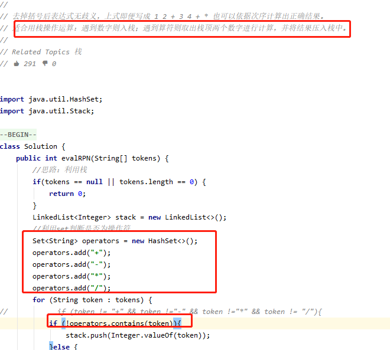
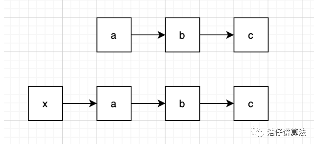

## 算法

#### 数组

leetcode 350

1.hash表映射

2.双指针

```java
Arrays.sort(数组);
Arrays.copyOfRange(数组，起始位置，终止位置)
```

​		

### 链表成环问题

给定一个链表：

1. 判断链表是否有环。
2. 如果链表有环，请找出环入口。
3. 计算环的大小。

#### 思路：快慢指针

​		快指针和慢指针同时从链表的头结点出发。在接下来的每一次循环中，快指针往前走两步，慢指针往前走一步。如果这个链表没有环，那么快指针最终指向NULL指针；如果这个链表有环，那么快指针最终和慢指针相遇。

​		把整个链表看成一个圈，加上一段绳子 把绳子绕在圈上,这样绳子部分每个节点都有一个对应的圆圈上的位置。 让两个指针开始走。第一次快慢指针相遇的时候，肯定是在原点。如果单纯考虑圆圈位置的话。 相遇之后，在这个绳子起点再放一个慢指针开始走。这时候这个慢指针和原来的慢指针的圆圈位置始终是同步的，但是一个是在绳子上，一个是在圈上。当他俩终于相遇的时候，肯定是在绳子接圈的那个位置上。

​		如何求环大小。这个相对简单，在证明链表是否有环的过程中，快慢指针第一次相遇。此后，快指针继续按一次两步的速度走，慢指针按一次一步的速度走，并设置一个计数器count = 0，每走一次加1,。当快慢指针再次相遇时，快指针刚好比慢指针多走了R步，而计数器count == R。2n - n 等于R（n为步数）。【**计算了环大小**】

###### [【链表】【证明】快慢指针判断链表有环、寻找环入口、计算环大小的原理](https://blog.csdn.net/donghuaan/article/details/78988987?utm_medium=distribute.pc_relevant_t0.none-task-blog-BlogCommendFromMachineLearnPai2-1.control&depth_1-utm_source=distribute.pc_relevant_t0.none-task-blog-BlogCommendFromMachineLearnPai2-1.control)


leetCode [70. 爬楼梯](https://leetcode-cn.com/problems/climbing-stairs/)

1. 带记忆的递归（使用数组dp[n]，记住对应的值，避免大量递归影响性能）

2. 滚动数组思想

   


#### [Java异或详解](https://www.cnblogs.com/gshao/p/9975349.html)

　**异或是一种基于二进制的位运算，用符号XOR或者 ^ 表示，其运算法则是对运算符两侧数的每一个二进制位，同值取0，异值取1。**

**性质**
　　　　**1、交换律**
　　　　**2、结合律（即(a^b)^c == a^(b^c)）**
　　　　**3、对于任何数x，都有x^x=0，x^0=x**
　　　　**4、自反性 A XOR B XOR B = A XOR 0 = A**

 例如，所有的程序教科书都会向初学者指出，要交换两个变量的值，必须要引入一个中间变量。但如果使用异或，就可以节约一个变量的存储空间： 设有A,B两个变量，存储的值分别为a，b，则以下三行表达式将互换他们的值 表达式 （值） ：**
**

```
A = A ^ B 
B = B ^ A 
A = A ^ B 
```

　　**例：**

　　　　**int a = 10, b = 5；**

　　　　**a = a ^ b;**

　　　　**b = a ^ b;**

　　　　**a = a ^ b;**

 **类似地，该运算还可以应用在加密，数据传输，校验等等许多领域。**


### 位运算概览

| 符号 | 描述 | 运算规则                                                     |
| ---- | ---- | ------------------------------------------------------------ |
| &    | 与   | 两个位都为1时，结果才为1                                     |
| \|   | 或   | 两个位都为0时，结果才为0                                     |
| ^    | 异或 | 两个位相同为0，相异为1                                       |
| ~    | 取反 | 0变1，1变0                                                   |
| <<   | 左移 | 各二进位全部左移若干位，高位丢弃，低位补0                    |
| >>   | 右移 | 各二进位全部右移若干位，对无符号数，高位补0，有符号数，各编译器处理方法不一样，有的补符号位（算术右移），有的补0（逻辑右移） |

位运算规则：

对于N为2的幂的数，都有 N&(N-1)=0 

对于任意一个数，将 n 和 n-1 进行 & 运算，我们都可以把 n 中最低位的 1 变成 0

使用位移掩码，判断第i位上是否有值


list转数组  Integer 转 int

```java
list.stream().mapToInt(Integer::valueOf).toArray();
```


利用set可以判断是否包含某些数据、字符等




数字转成字符串

例子：int x = 121 ,判断是否为回文串。

```java
Integer number = Integer.valueOf(x);
String s = number.toString();    //121的字符串
```


### 树的先序遍历，中序遍历，后序遍历

DLR--前序遍历（根在前，从左往右，一棵树的根永远在左子树前面，左子树又永远在右子树前面 ）

LDR--中序遍历（根在中，从左往右，一棵树的左子树永远在根前面，根永远在右子树前面）

LRD--后序遍历（根在后，从左往右，一棵树的左子树永远在右子树前面，右子树永远在根前面）


```java
private void  inorderTraversal(TreeNode root){
    if (root == null){
        return;
    }
    //先序遍历
    System.out.printIn(root.val);//操作
    inorderTraversal(root.left);
    inorderTraversal(root.right);
}
```


```java
private void  inorderTraversal(TreeNode root){
    if (root == null){
        return;
    }
    //中序遍历
    inorderTraversal(root.left);
    System.out.printIn(root.val);//操作
    inorderTraversal(root.right);
}
```


```java
private void  inorderTraversal(TreeNode root){
    if (root == null){
        return;
    }
    //后序遍历
    inorderTraversal(root.left);
    inorderTraversal(root.right);
    System.out.printIn(root.val); //操作
}
```


### 树的层次遍历


```java
public static void levelPrint(Node root){
        if(root == null)
        {
            return ;
        }
    	//使用队列进行层次遍历
        LinkedList<Node> queue = new LinkedList<Node>();
        Node current = null;
        queue.offer(root);//将根节点入队
        while(!queue.isEmpty())
        {
            current = queue.poll();//出队队头元素并访问
            System.out.println(current.val);
            if(current.left != null)//如果当前节点的左节点不为空入队
            {
                queue.offer(current.left);
            }
            if(current.right != null)//如果当前节点的右节点不为空，把右节点入队
            {
                queue.offer(current.right);
            }
        }
 
    }
```


### 单调栈


### 链表

链表的题目中，十道有九道会用到**哨兵节点**，所以我们先讲一下什么是哨兵节点。

哨兵节点，其实就是一个**附加在原链表最前面用来简化边界条件的附加节点，它的值域不存储任何东西，只是为了操作方便而引入。**

比如原链表为a->b->c，则加了哨兵节点的链表即为x->a->b>c，如下图：




a = a.next  跳到下一个节点

a.next = a.next.next  ,跳过下一个节点

a.next.next = a;        a.next = null;    反转节点 a指向b,变成b指向a


查找链表倒数第k个可以使用双指针，right指针先走k步，left指针再一起走。


快速排序的基本思想是

> 1、先从数列中取出一个数作为基准数

> 2、分区过程，将比这个数大的数全放到它的右边，小于或等于它的数全放到它的左边

> 3、再对左右区间重复第二步，直到各区间只有一个数

概括来说为 **挖坑填数**+**分治法**


### 二分查找

- **初始条件：left = 0, right = length-1**
- **终止：left > right**
- **向左查找：right = mid-1**
- **向右查找：left = mid +1**

```java
//JAVA 
public int binarySearch(int[] array, int des) {
    int low = 0, high = array.length - 1;
    while (low <= high) { 
        int mid = low + (high - low) / 2;
        if (des == array[mid]) { 
            return mid;
        } else if (des < array[mid]) {
            high = mid - 1;
        } else {
            low = mid + 1;
        }
    }
    return -1;
}
```


#### 02|如何抓住重点，系统高效地学习数据结构与算法？

**什么是数据结构？什么是算法？**

数据结构就是数据的存储结构；算法就是操作数据的方法。


**20 个最常用的、最基础数据结构与算法**

10 个数据结构：**数组、链表、栈、队列、散列表、二叉树、堆、跳表、图、Trie 树；**

10 个算法：**递归、排序、二分查找、搜索、哈希算法、贪心算法、分治算法、回溯算法、动态规划、字符串匹配算法**

掌握了这些基础的数据结构和算法，再学更加复杂的数据结构和算法，就会非常容易、非常快。 在学习数据结构和算法的过程中，你也要注意，不要只是死记硬背，不要为了学习而学习，而是要学习它的“来历”“自身的特点”“适合解决的问题”以及“实际的应用场景”。对于每一种数据结构或算法，我都会从这几个 方面进行详细讲解。只要你掌握了我每节课里讲的内容，就能在开发中灵活应用。 学习数据结构和算法的过程，是非常好的思维训练的过程，所以，千万不要被动地记忆，要多辩证地思考，多问为什么。如果你一直这么坚持做，你会发现，等你学完之后，写代码的时候就会不由自主地考虑到很多性 能方面的事情，时间复杂度、空间复杂度非常高的垃圾代码出现的次数就会越来越少。你的编程内功就真正得到了修炼。


### 03 04|复杂度分析

事后统计法：运行代码，通过统计，监控，得到算法执行的时间和占用的内存。

事后统计法的局限性：

1、测试结果依赖于测试环境。

I9 cpu 和I3 cpu运算速度的不同，导致代码执行的快慢也不同。
2、测试结果受到数据规模的影响很大。

对于同一个排序算法，待排序数据的有序度不一样，对于执行时间就有很大的区别；测试数据的规模大小，也会影响算法的性能，小规模的数据培训，插入可能反而比快速排序要快。


**所以，我们需要一个不用具体的测试数据来测试，就可以粗略地估计算法的执行效率的方法。这就是我们今天要讲的时间、空间复杂度分析方法。** 

**大O复杂度表示法**：从cpu角度来看，每行代码都执行类似的操作：读数据-运算-写数据，尽管每行代码对应cpu执行个数，时间都不一样，但是做粗略运算，每行代码时间近似看做相等，计作unit_time。

总的时间复杂度  T(n) =  (2n² + 2n + 3) * unit_time。类似于高数求极限 所以T(n) = O(n²)。

时间复杂度分析的三个实用的方法：

**1、只关心循环次数最多的一段代码**      //类似于高数求极限 当n->∞，求T(n)

**2、加法法则:总时间复杂度等于量级最大的那段复杂度。**


代码分为三个部分，sum_1 ,sum_2,sum_3，第一段代码虽然执行了100次，但是仍然是常量执行时间，与n的规模无关。第二段第三段为O(n)和O(n²)  。还是求高数中极限的问题 。当n->∞,lim T(n)  = O(n²)

**3、乘法法则：嵌套代码的复杂度等于内外代码复杂度的乘积。**

几种常见时间复杂度分析：


对于复杂度量级可以粗略分为两类：多项式量级和非多项式量级。非多项式用绿色波浪标注。把时间复杂度为非多项式量级的算法称作NP(Non-Deterministic polynomial)非确定多项式问题。当数据规模 n 越来越大时，非多项式量级算法的执行时间会急剧增加，求解时间会无限增长。
常见的多项式量级:

1、O(1)：代码执行时间不随着n的增大而增大，都称作常数量级的时间复杂度。

2、O(logn)、O(nlogn)

int i = 1;
while(i <= n)
{
    i = i *2 ;
}
变量i的值从1开始取，每循环一次乘以2，取值过程为一个等比数列：


当第x次，恰好大于n，所以x = log2n，时间复杂度O(log2n)

但是实际上，不管是以几为底( i = i * 3 ;//以三为底, i = i * 10 ;//以十为底)，都可以把所有对数阶时间复杂度记作O(logn)

因为对数之间是可以相互转换的，log3n等于log3 2 * log 2 n 所以相差一个常量 C = log 3 2 ，可以忽略。所以在对数阶时间复杂度表达里面，忽略对数的“底”，统一记作O(log n)，**所谓O(nlogn) 就是把时间复杂度O(logn)的代码执行n次，如归并排序和快速排序。**

3、O(m+n) 、 O(m * n)

int cal(int m, int n) {
    int sum_1 = 0;
    int i = 1;
    for (; i < m; ++i) {
        sum_1 = sum_1 + i;
    }
    int sum_2 = 0;
    int j = 1;
    for (; j < n; ++j) {
        sum_2 = sum_2 + j;
    }
    return sum_1 + sum_2;
}
**m和n是两个数据规模，无法事先评估m和n的大小，所以上述代码时间复杂度O(m + n)**。


#### 空间复杂度分析 

我们常见的空间复杂度就是O(1)、O(n)、O(n2 )，像O(logn)、O(nlogn)这样的对数阶复杂度平时都用不到。而且，空间复杂度分析比时间复杂度分析要简单很多。

 

**时间复杂度全称：渐进时间复杂度，表示算法的执行时间和数据规模之间的增长关系。**

**空间复杂度全称：渐进空间复杂度，表示算法的存储空间与数据规模之间的增长关系。**

