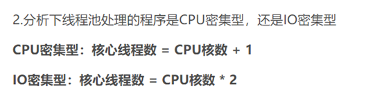

## 线程池

#### 为什么要使用线程池

在实际使用中，线程是很占用系统资源的，如果对线程管理不善很容易导致系统问题。因此，在大多数并发框架中都会使用**线程池**来管理线程，使用线程池管理线程主要有如下好处：

1. **降低资源消耗**。通过复用已存在的线程和降低线程关闭的次数来尽可能降低系统性能损耗；
2. **提升系统响应速度**。通过复用线程，省去创建线程的过程，因此整体上提升了系统的响应速度；
3. **提高线程的可管理性**。线程是稀缺资源，如果无限制的创建，不仅会消耗系统资源，还会降低系统的稳定性，因此，需要使用线程池来管理线程。

## 线程池详解

### 线程池的创建

创建线程池主要是**ThreadPoolExecutor**类来完成，ThreadPoolExecutor的有许多重载的构造方法，通过参数最多的构造方法来理解创建线程池有哪些需要配置的参数。ThreadPoolExecutor的构造方法为：

```java
ThreadPoolExecutor(int corePoolSize,
                              int maximumPoolSize,
                              long keepAliveTime,
                              TimeUnit unit,
                              BlockingQueue<Runnable> workQueue,
                              ThreadFactory threadFactory,
                              RejectedExecutionHandler handler)
```

下面对参数进行说明：

1. corePoolSize：表示核心线程池的大小。当提交一个任务时，如果当前核心线程池的线程个数没有达到corePoolSize，**即使当前核心线程池有空闲的线程**，也会创建新的线程来执行所提交的任务。如果当前核心线程池的线程个数已经达到了corePoolSize，则不再重新创建线程。如果调用了`prestartCoreThread()`或者 `prestartAllCoreThreads()`，线程池创建的时候所有的核心线程都会被创建并且启动。

2. maximumPoolSize：表示线程池能创建线程的最大个数。如果当阻塞队列已满时，并且当前线程池线程个数没有超过maximumPoolSize的话，就会创建新的线程来执行任务。

3. keepAliveTime：空闲线程存活时间。如果当前线程池的线程个数已经超过了corePoolSize，并且线程空闲时间超过了keepAliveTime的话，就会将这些空闲线程销毁，这样可以尽可能降低系统资源消耗。

4. unit：时间单位。为keepAliveTime指定时间单位。

5. workQueue：阻塞队列。用于保存任务的阻塞队列，关于阻塞队列[可以看这篇文章](https://blog.csdn.net/ThinkWon/article/details/102508901)。可以使用**ArrayBlockingQueue, LinkedBlockingQueue, SynchronousQueue, PriorityBlockingQueue**。

6. threadFactory：创建线程的工厂类。可以通过指定线程工厂为每个创建出来的线程设置更有意义的名字，如果出现并发问题，也方便查找问题原因。

7. handler：饱和策略。当线程池的阻塞队列已满和指定的线程都已经开启，说明当前线程池已经处于饱和状态了，那么就需要采用一种策略来处理这种情况。采用的策略有这几种：

   1. AbortPolicy： 直接拒绝所提交的任务，并抛出**RejectedExecutionException**异常；

   2. CallerRunsPolicy：只用调用者所在的线程来执行任务；

   3. DiscardPolicy：不处理直接丢弃掉任务；

   4. DiscardOldestPolicy：丢弃掉阻塞队列中存放时间最久的任务，执行当前任务

      

ThreadPoolExecutor的execute方法执行逻辑请见注释。下图为ThreadPoolExecutor的execute方法的执行示意图：


execute方法执行逻辑有这样几种情况：

1. 如果当前运行的线程少于corePoolSize，则会创建新的线程来执行新的任务；
2. 如果运行的线程个数等于或者大于corePoolSize，则会将提交的任务存放到阻塞队列workQueue中；
3. 如果当前workQueue队列已满的话，则会创建新的线程来执行任务；
4. 如果线程个数已经超过了maximumPoolSize，则会使用饱和策略RejectedExecutionHandler来进行处理。

需要注意的是，线程池的设计思想就是使用了**核心线程池corePoolSize，阻塞队列workQueue和线程池线程最大个数maximumPoolSize**，这样的缓存策略来处理任务，实际上这样的设计思想在需要框架中都会使用。

### 线程池的关闭

关闭线程池，可以通过`shutdown`和`shutdownNow`这两个方法。它们的原理都是遍历线程池中所有的线程，然后依次中断线程。`shutdown`和`shutdownNow`还是有不一样的地方：

1. `shutdownNow`首先将线程池的状态设置为**STOP**，然后尝试**停止所有的正在执行和未执行任务**的线程，并返回等待执行任务的列表；
2. `shutdown`只是将线程池的状态设置为**SHUTDOWN**状态，然后中断所有没有正在执行任务的线程

可以看出**shutdown方法会将正在执行的任务继续执行完，而shutdownNow会直接中断正在执行的任务**。调用了这两个方法的任意一个，`isShutdown`方法都会返回true，当所有的线程都关闭成功，才表示线程池成功关闭，这时调用`isTerminated`方法才会返回true。

### 线程池的工作原理

当一个并发任务提交给线程池，线程池分配线程去执行任务的过程如下图所示：


从图可以看出，线程池执行所提交的任务过程主要有这样几个阶段：

1. 先判断线程池中**核心线程池**所有的线程是否都在执行任务。如果不是，则新创建一个线程执行刚提交的任务，否则，核心线程池中所有的线程都在执行任务，则进入第2步；
2. 判断当前**阻塞队列**是否已满，如果未满，则将提交的任务放置在阻塞队列中；否则，则进入第3步；
3. 判断**线程池中所有的线程**是否都在执行任务，如果没有，则创建一个新的线程来执行任务，否则，则交给饱和策略进行处理

### 线程池阻塞队列

**作用**：用来存储等待执行的任务

ArrayBlockingQueue：一个用数组实现的有界阻塞队列，按照先入先出(FIFO)的原则对元素进行排序。
不保证线程公平访问队列，使用较少

PriorityBlockingQueue：支持优先级的无界阻塞队列，使用较少

LinkedBlockingQueue：一个用链表实现的有界阻塞队列，队列默认和最长长度为Integer.MAX_VALUE。
队列按照先入先出的原则对元素进行排序，使用较多

- 吞吐量通常要高于 ArrayBlockingQueue
- Executors.newFixedThreadPool() 使用了这个队列

SynchronousQueue：不储存元素(无容量)的阻塞队列，每个put操作必须等待一个take操作，
否则不能继续添加元素。支持公平访问队列，常用于生产者，消费者模型，吞吐量较高，使用较多

- 每个插入操作必须等到另一个线程调用移除操作，否则插入操作一直处于阻塞状态
- 吞吐量通常要高于 LinkedBlockingQueue
- Executors.newCachedThreadPool使用了这个队列

### 线程池的饱和策略

**定义**：当队列和线程池都满了，说明线程池处于饱和状态，必须采取一种策略处理新提交的任务。

**常见策略**

AbortPolicy：中断策略，直接抛出异常

CallerRunsPolicy：调用者运行策略，让调用者所在线程来运行策略

DiscardOldestPolicy：舍弃最旧任务策略，丢弃队列中最旧的任务，然后重试任务的提交执行( execute() )

DiscardPolicy：舍弃策略，不处理，直接丢弃

自定义策略

## 如何合理配置线程池参数？

要想合理的配置线程池，就必须首先分析任务特性，可以从以下几个角度来进行分析：

1. 任务的性质：CPU密集型任务，IO密集型任务和混合型任务。
2. 任务的优先级：高，中和低。
3. 任务的执行时间：长，中和短。
4. 任务的依赖性：是否依赖其他系统资源，如数据库连接。

任务性质不同的任务可以用不同规模的线程池分开处理。

阻塞队列**最好是使用有界队列**，如果采用无界队列的话，一旦任务积压在阻塞队列中的话就会占用过多的内存资源，甚至会使得系统崩溃。

当然具体合理线程池值大小，需要结合系统实际情况，在大量的尝试下比较才能得出，以上只是前人总结的规律。

**最佳线程数目** = （（线程等待时间+线程CPU时间）/线程CPU时间 ）* CPU数目

比如平均每个线程CPU运行时间为0.5s，而线程等待时间（非CPU运行时间，比如IO）为1.5s，CPU核心数为8，那么根据上面这个公式估算得到：((0.5+1.5)/0.5)*8=32。这个公式进一步转化为：

**最佳线程数目** = （线程等待时间与线程CPU时间之比 + 1）* CPU数目

**可以得出一个结论**：
线程等待时间所占比例越高，需要越多线程。线程CPU时间所占比例越高，需要越少线程。

 


Java通过**Executors工厂类提供四种线程池**，分别为：

1. **newCachedThreadPool** ：创建一个可缓存线程池，如果线程池长度超过处理需要，可灵活回收空闲线程，若无可回收，否则新建线程。（线程最大并发数不可控制）
2. **newFixedThreadPool**：创建一个固定大小的线程池，可控制线程最大并发数，超出的线程会在队列中等待。
3. **newScheduledThreadPool** ： 创建一个定时线程池，支持定时及周期性任务执行。
4. **newSingleThreadExecutor** ：创建一个单线程化的线程池，它只会用唯一的工作线程来执行任务，保证所有任务按照指定顺序(FIFO, LIFO, 优先级)执行。

**SingleThreadExecutor 用于串行执行任务的场景，每个任务必须按顺序执行，不需要并发执行**。

**FixedThreadPool 用于负载比较重的服务器，为了资源的合理利用，需要限制当前线程数量**。

**CachedThreadPool 用于并发执行大量短期的小任务，或者是负载较轻的服务器**。CachedThreadPool 没有核心线程，非核心线程数无上限，也就是全部使用外包，但是每个外包空闲的时间只有 60 秒，超过后就会被回收。                              

**ScheduledThreadPoolExecutor 用于需要多个后台线程执行周期任务，同时需要限制线程数量的场景**。


ExecutorService 提供了两种提交任务的方法：

- execute()：提交不需要返回值的任务
- submit()：提交需要返回值的任务

  

#### Executors和ThreaPoolExecutor创建线程池的区别

Executors 各个方法的弊端：

1. newFixedThreadPool 和 newSingleThreadExecutor:
   主要问题是堆积的请求处理队列可能会耗费非常大的内存，甚至 OOM。
2. newCachedThreadPool 和 newScheduledThreadPool:
   主要问题是线程数最大数是 Integer.MAX_VALUE，可能会创建数量非常多的线程，甚至 OOM。

ThreaPoolExecutor

1. 创建线程池方式只有一种，就是走它的构造函数，参数自己指定


#### 线程工厂

为什么使用线程池的时候，线程因异常被中断却没有抛出任何信息呢？还有平时如果是在 main 函数里面的异常也会被抛出来，而不是像线程池这样被吞掉。如果子线程抛出了异常，线程池会如何进行处理呢？

> 我提交任务到线程池的方式是: `threadPoolExecutor.submit(Runnbale task);` ，后面了解到使用 execute() 方式提交任务会把异常日志给打出来，这里研究一下为什么使用 submit 提交任务，在任务中的异常会被“吞掉”。

在 FutureTask 对象的 run() 方法中，该任务抛出的异常被捕获，然后在setException(ex); 方法中，抛出的异常会被放到 outcome 对象中，这个对象就是 submit() 方法会返回的 FutureTask 对象执行 get() 方法得到的结果。

但是在线程池中，并没有获取执行子线程的结果，所以异常也就没有被抛出来，即被“吞掉”了。

这就是线程池的 submit() 方法提交任务没有异常抛出的原因。

#### 线程池自定义异常处理方法

在定义 ThreadFactory 的时候调用`setUncaughtExceptionHandler`方法，自定义异常处理方法。 例如：

```java
ThreadFactory namedThreadFactory = new ThreadFactoryBuilder()
                .setNameFormat("judge-pool-%d")
                .setUncaughtExceptionHandler((thread, throwable)-> logger.error("ThreadPool {} got exception", thread,throwable))
                .build();
```

这样，对于线程池中每条线程抛出的异常都会打下 error 日志，就不会看不到了。


实践：


阻塞队列无限长，可能导致OOM


**核心线程数是0，没有阻塞队列**




## Q&A


Q:如何实现**「一旦队列满载，生产者应该阻塞，直到消费者消费任务。」** ？https://juejin.cn/post/7042173639604568072#heading-4

A:

其实我们使用线程池的也是一个**「生产者-消费者」**消费模型，其也使用阻塞队列。

那为什么线程池在队列满载的时候，不发生阻塞？

这是因为线程池内部使用 **offer** 方法，这个方法在队列满载的时候**「不会发生阻塞」**，而是直接返回 。

那我们有没有办法在线程池队列满载的时候，阻塞主线程添加任务？

其实是可以的，我们自定义线程池拒绝策略，当队列满时改为调用 **BlockingQueue.put** 来实现生产者的阻塞。

```java
RejectedExecutionHandler rejectedExecutionHandler = new RejectedExecutionHandler() {
    @Override
    public void rejectedExecution(Runnable r, ThreadPoolExecutor executor) {
        if (!executor.isShutdown()) {
            try {
                executor.getQueue().put(r);
            } catch (InterruptedException e) {
                // should not be interrupted
            }
        }

    }
};
```

这样一旦线程池满载，主线程将会被阻塞。

使用这种方式之后，我们可以直接使用上面提到的多线程导入的代码。

```java
ExecutorService executorService = new ThreadPoolExecutor(
        5,
        10,
        60,
        TimeUnit.MINUTES,
        new ArrayBlockingQueue<>(100),
        new ThreadFactoryBuilder().setNameFormat("test-%d").build(),
        (r, executor) -> {
            if (!executor.isShutdown()) {
                try {
                   // 主线程将会被阻塞
                    executor.getQueue().put(r);
                } catch (InterruptedException e) {
                    // should not be interrupted
                }
            }

        });
File file = new File("文件路径");

try (LineIterator iterator = IOUtils.lineIterator(new FileInputStream(file), "UTF-8")) {
    while (iterator.hasNext()) {
        String line = iterator.nextLine();
        executorService.submit(() -> convertToDB(line));
    }
}    
```

