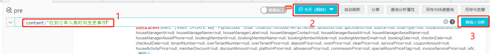
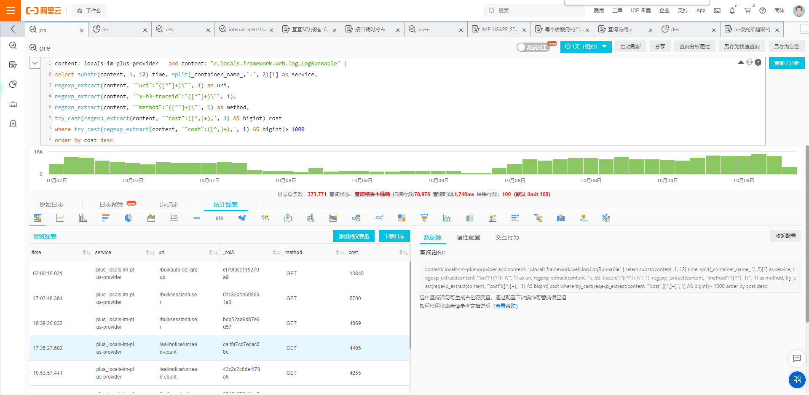

## 阿里云日志服务查询笔记


#### 分词规则

遇到分词符号会进行分词，分词符为英文符号及特殊字符

|       内容        |          分词符           |
| :---------------: | :-----------------------: |
| \_container_name_ | , '";=()[]{}?@&<>/:\n\t\r |
|      content      | , '";=()[]{}?@&<>/:\n\t\r |


### 普通查询

通过关键词，选择时间，进行搜索

例子：




### 统计查询

目的：帮助快速学习使用统计查询日志服务

快速入门： 学习函数 --> 理解例子 -->  动手写例子


#### 常用函数

**regexp_extract** ： 

语法：regexp_extract(x, regular expression, n)

说明：正则式函数，提取目标字符串中符合正则表达式的子串，然后返回与目标捕获组匹配的第一个子串。

示例：`regexp_extract(content, '"uri":"([^"]+)\"', 1)`


**substr**：

语法：substr(x,start,length)

说明：字符串函数，返回字符串中指定位置的子串，并指定子串长度。

示例：` substr(content, 1, 12) `


**split**:

语法：

说明：将对应文本按切割符号进行切割，序号从1开始

示例：` split(_container_name_,'.', 2)[1] `


**try_cast**:

语法：try_cast(x as type)

说明：类型转换函数,转换x的数据类型。使用try_cast函数转换数据类型时，如果某个值转换失败，该值返回NULL，并跳过该值继续处理。

示例：`  try_cast(regexp_extract(content, '"cost":([^,]+),', 1) AS bigint) `


更多可查帮助文档：

https://www.aliyun.com/search?spm=5176.21213303.J_6704733920.4.2a753edagbieRC&k=&scene=helpdoc&page=1


#### 例子

**可魔改成自己需要的统计方式**

```
// 查询 locals-im-plus-provider 服务接口消耗时间大于1000毫秒的接口详情

content: locals-im-plus-provider   and content: "c.locals.framework.web.log.LogRunnable" | 
select substr(content, 1, 12) time, split(_container_name_,'.', 2)[1] as service, 
regexp_extract(content, '"uri":"([^"]+)\"', 1) as uri, 
regexp_extract(content, '"x-b3-traceid":"([^"]+)\"', 1) as traceid,
regexp_extract(content, '"method":"([^"]+)\"', 1) as method,
try_cast(regexp_extract(content, '"cost":([^,]+),', 1) AS bigint) cost 
where try_cast(regexp_extract(content, '"cost":([^,]+),', 1) AS bigint)> 1000 
order by cost desc


// 查询 "/bull/message/send" 接口的 traceId 和 cost , 按cost进行倒叙排序截取100条

content: "/bull/message/send" | 
SELECT  regexp_extract(content, '"x-b3-traceid":"([^"]+)\"', 1) as traceId,
cast( regexp_extract(content, '"cost":(\d+)', 1) as bigint ) cost 
order by cost desc LIMIT  100


// 查询 locals-im-plus-provider 服务所有接口的 接口次数 和 响应时间 

content: locals-im-plus-provider  and content: "c.locals.framework.web.log.LogRunnable" | 
select split(_container_name_,'.', 2)[1] as service, 
regexp_extract(content, '"uri":"([^"]+)\"', 1) as uri, 
regexp_extract(content, '"method":"([^"]+)\"', 1) as method, 
count(1) as count,
max(try_cast(regexp_extract(content, '"cost":([^,]+),', 1) AS bigint)) as maxCost,
min(try_cast(regexp_extract(content, '"cost":([^,]+),', 1) AS bigint)) as minCost, 
round(avg(try_cast(regexp_extract(content, '"cost":([^,]+),', 1) AS bigint)),2) as avgCost 
group by 1,2,3 order by maxCost desc


// 查询 locals-im-plus-provider 服务器每分钟的内存使用情况

content: locals-im-plus-provider  and 
content: 5dc0f20a7a6c1dd44deda7c3 | 
select time, json_extract(json, '$.host') as host,
max(cast(json_extract(json, '$.usedMemory') as double)/cast(json_extract(json, '$.maxMemory') as double)) as rate 
from (select json_parse(substr(content, position('{' IN content))) as json, substr(content, 1, 5) AS time from log) 
group by time, host order by time desc


```


