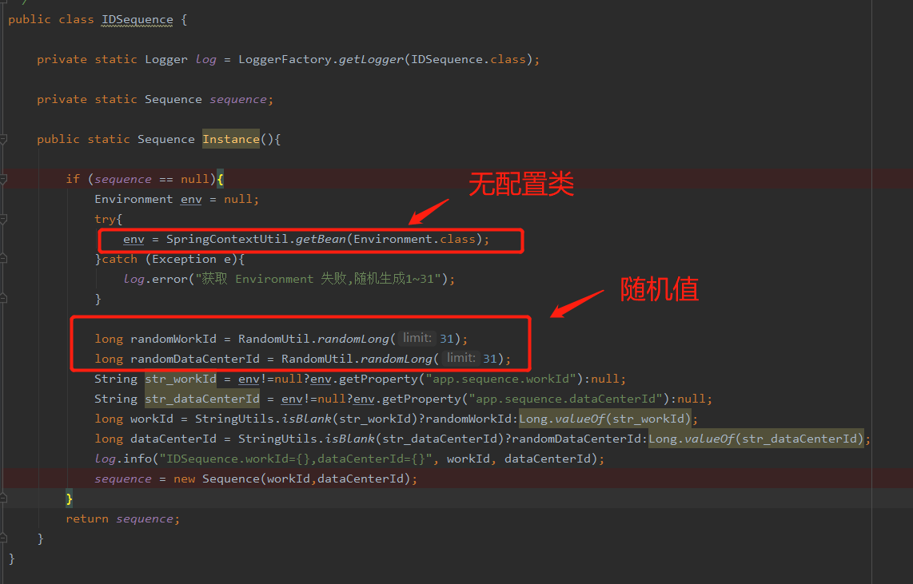
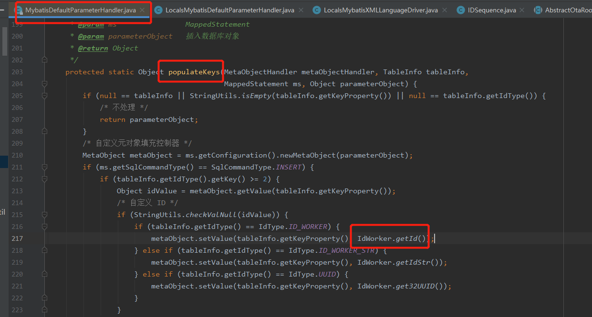
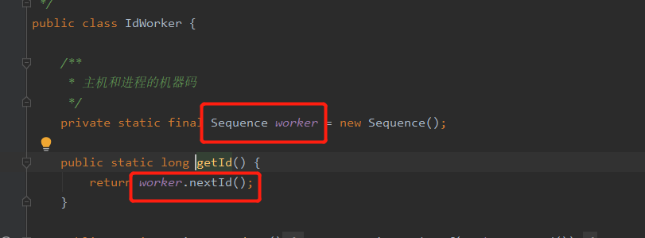
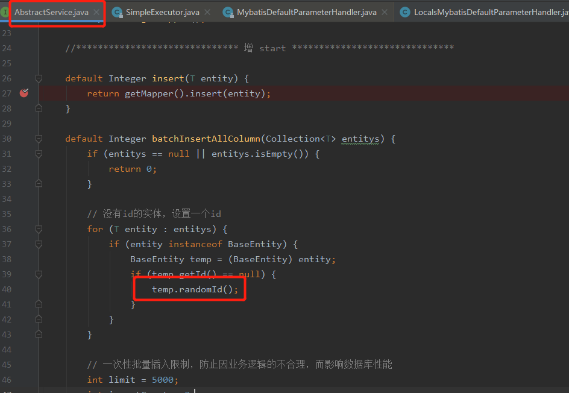
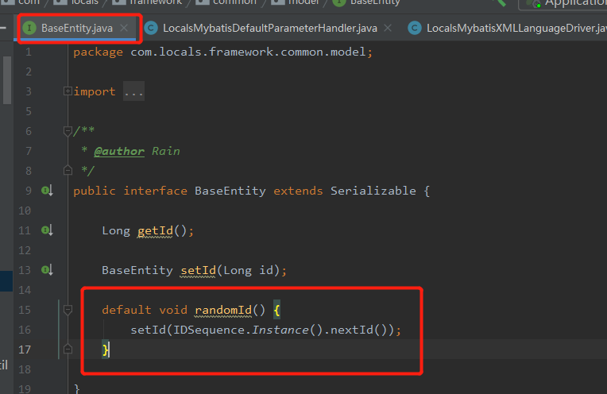
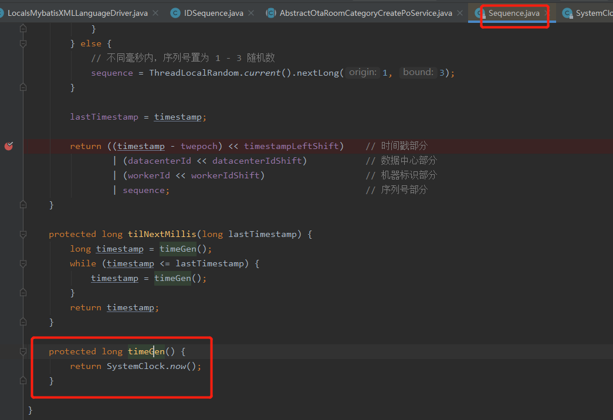
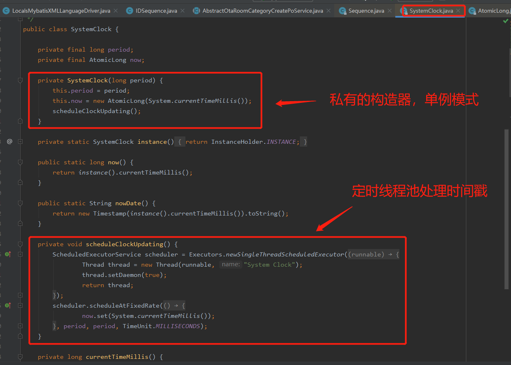
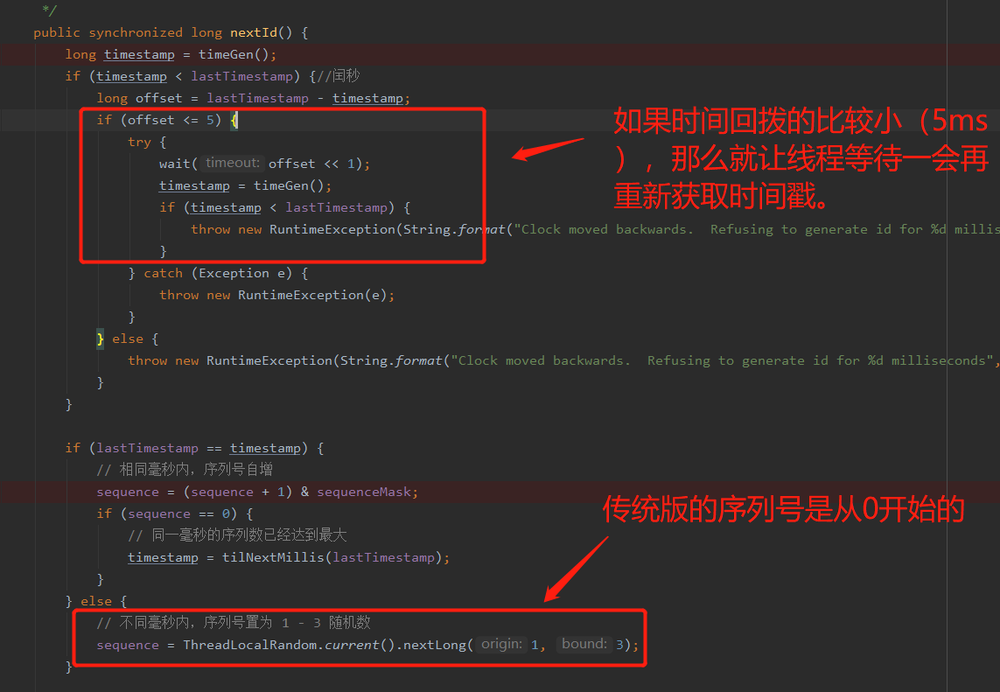
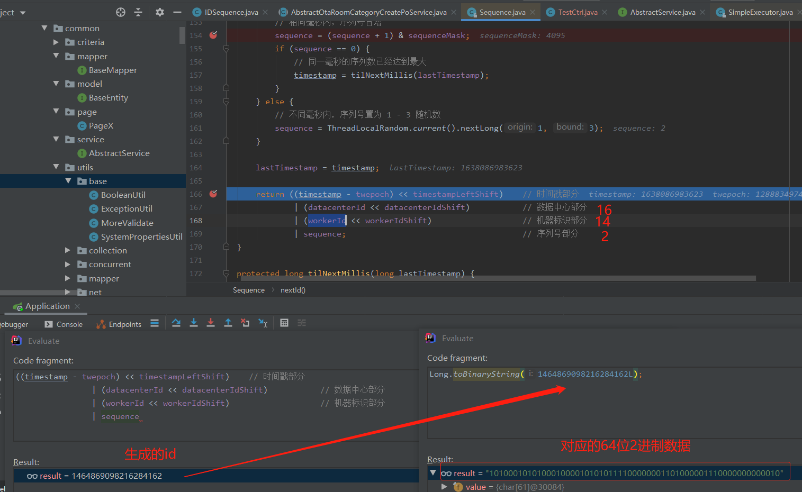

## 雪花算法（SnowFlake）的学习与探索


1. 什么是雪花算法
2. 雪花算法的原理
3. 雪花算法的源码
4. 我们项目上有用到雪花算法吗？我们是怎么使用的？
5. mybatisplus版雪花算法与原始雪花算法的区别
6. ID生成实践
7. 雪花算法存在的问题


### 什么是雪花算法

雪花算法是 Twitter 开源的在分布式环境下的一种分布式id生成算法。

雪花算法可以在分布式环境下保证：

1.生成的id按时间趋势递增 

2.在系统内不会产生重复id


### 雪花算法的原理

雪花算法其核心思想就是：利用 时间戳+机器码+递增序列 组成一个64bit的Long类型id。

以图为例：

64位由 **1个标识位 + 41位的时间戳 + 10位WorkerID（5位datacenterId + 5位machineId） + 12位序列** 组成。

标识位：**1bit-标识位**，不使用，因为二进制中最高位是符号位，1表示负数，0表示正数。生成的id一般都是用整数，所以最高位固定为0。

时间戳：**41bit-时间戳**，用来记录时间戳，毫秒级。

WorkerID：**10bit-工作机器id**，用来记录工作机器id。其中5位为数据中心id(可以理解为机器库房id)，5位为机器id（可以理解为不同实例的id）。（ps:最多1023个实例）

序列号：**12bit-序列号**，用来记录同毫秒内产生的不同id。12位（bit）可以表示的最大正整数是，支持1毫秒产生4095个自增序列id。


### 雪花算法的源码

在mybatisPlus中，有一个雪花算法的实现：com.baomidou.mybatisplus.toolkit.Sequence

可以通过debug观察整个雪花算法生成id的过程。


以下是网上找到的雪花算法源码注释版。

```java
 
public class IdWorker {
 
	//因为二进制里第一个 bit 为如果是 1，那么都是负数，但是我们生成的 id 都是正数，所以第一个 bit 统一都是 0。
 
	//机器ID  2进制5位  32位减掉1位 31个
	private long workerId;
	//机房ID 2进制5位  32位减掉1位 31个
	private long datacenterId;
	//代表一毫秒内生成的多个id的最新序号  12位 4096 -1 = 4095 个
	private long sequence;
	//设置一个时间初始值    2^41 - 1   差不多可以用69年
	private long twepoch = 1585644268888L;
	//5位的机器id
	private long workerIdBits = 5L;
	//5位的机房id
	private long datacenterIdBits = 5L;
	//每毫秒内产生的id数 2 的 12次方
	private long sequenceBits = 12L;
	// 这个是二进制运算，就是5 bit最多只能有31个数字，也就是说机器id最多只能是32以内
	private long maxWorkerId = -1L ^ (-1L << workerIdBits);
	// 这个是一个意思，就是5 bit最多只能有31个数字，机房id最多只能是32以内
	private long maxDatacenterId = -1L ^ (-1L << datacenterIdBits);
 
	private long workerIdShift = sequenceBits;
	private long datacenterIdShift = sequenceBits + workerIdBits;
	private long timestampLeftShift = sequenceBits + workerIdBits + datacenterIdBits;
	private long sequenceMask = -1L ^ (-1L << sequenceBits);
	//记录产生时间毫秒数，判断是否是同1毫秒
	private long lastTimestamp = -1L;
	public long getWorkerId(){
		return workerId;
	}
	public long getDatacenterId() {
		return datacenterId;
	}
	public long getTimestamp() {
		return System.currentTimeMillis();
	}
 
 
 
	public IdWorker(long workerId, long datacenterId, long sequence) {
 
		// 检查机房id和机器id是否超过31 不能小于0
		if (workerId > maxWorkerId || workerId < 0) {
			throw new IllegalArgumentException(
					String.format("worker Id can't be greater than %d or less than 0",maxWorkerId));
		}
 
		if (datacenterId > maxDatacenterId || datacenterId < 0) {
 
			throw new IllegalArgumentException(
					String.format("datacenter Id can't be greater than %d or less than 0",maxDatacenterId));
		}
		this.workerId = workerId;
		this.datacenterId = datacenterId;
		this.sequence = sequence;
	}
 
	// 这个是核心方法，通过调用nextId()方法，让当前这台机器上的snowflake算法程序生成一个全局唯一的id
	public synchronized long nextId() {
		// 这儿就是获取当前时间戳，单位是毫秒
		long timestamp = timeGen();
		if (timestamp < lastTimestamp) {
 
			System.err.printf(
					"clock is moving backwards. Rejecting requests until %d.", lastTimestamp);
			throw new RuntimeException(
					String.format("Clock moved backwards. Refusing to generate id for %d milliseconds",
							lastTimestamp - timestamp));
		}
 
		// 下面是说假设在同一个毫秒内，又发送了一个请求生成一个id
		// 这个时候就得把seqence序号给递增1，最多就是4096
		if (lastTimestamp == timestamp) {
 
			// 这个意思是说一个毫秒内最多只能有4096个数字，无论你传递多少进来，
			//这个位运算保证始终就是在4096这个范围内，避免你自己传递个sequence超过了4096这个范围
			sequence = (sequence + 1) & sequenceMask;
			//当某一毫秒的时间，产生的id数 超过4095，系统会进入等待，直到下一毫秒，系统继续产生ID
			if (sequence == 0) {
				timestamp = tilNextMillis(lastTimestamp);
			}
 
		} else {
			sequence = 0;
		}
		// 这儿记录一下最近一次生成id的时间戳，单位是毫秒
		lastTimestamp = timestamp;
		// 这儿就是最核心的二进制位运算操作，生成一个64bit的id
		// 先将当前时间戳左移，放到41 bit那儿；将机房id左移放到5 bit那儿；将机器id左移放到5 bit那儿；将序号放最后12 bit
		// 最后拼接起来成一个64 bit的二进制数字，转换成10进制就是个long型
		return ((timestamp - twepoch) << timestampLeftShift) |
				(datacenterId << datacenterIdShift) |
				(workerId << workerIdShift) | sequence;
	}
 
	/**
	 * 当某一毫秒的时间，产生的id数 超过4095，系统会进入等待，直到下一毫秒，系统继续产生ID
	 * @param lastTimestamp
	 * @return
	 */
	private long tilNextMillis(long lastTimestamp) {
 
		long timestamp = timeGen();
 
		while (timestamp <= lastTimestamp) {
			timestamp = timeGen();
		}
		return timestamp;
	}
	//获取当前时间戳
	private long timeGen(){
		return System.currentTimeMillis();
	}
 
	/**
	 *  main 测试类
	 * @param args
	 */
	public static void main(String[] args) {
		System.out.println(1&4596);
		System.out.println(2&4596);
		System.out.println(6&4596);
		System.out.println(6&4596);
		System.out.println(6&4596);
		System.out.println(6&4596);
//		IdWorker worker = new IdWorker(1,1,1);
//		for (int i = 0; i < 22; i++) {
//			System.out.println(worker.nextId());
//		}
	}
}
```


### 我们项目上有用到雪花算法吗？我们是怎么使用的？

首先先说结论：有用到雪花算法，通过使用mybatisPlus的 com.baomidou.mybatisplus.toolkit.Sequence类中的nextId()进行id生成。


首先在 **IDSequence** 类中随机生成 randomDataCenterId 和 randomWorkId 组成 10位bit的WorkerID，然后通过实例化Sequence类，调用Sequence类的nextId进行创建。




#### 公司使用雪花的方式

##### insert插入






##### batchInsert批量插入






### mybatisPlus版雪花算法与原始雪花算法的区别

#### 1.首先是在获取时间方面

传统大部分都是通过 System.currentTimeMillis() 获取当前时间戳，而mybatisPlus版本只在SystemClock对象实例化的时候获取了一次System.currentTimeMillis() ，然后开启了一个定时任务线程池去维护时间戳。**思想有点类似于设计模式中的享元模式，使对象中存储的时间戳能够复用，减少了访问系统时间的次数，在高并发的情况下提升了性能。**（System.currentTimeMillis() 之所以慢是因为去跟系统打了一次交道）






#### 2.nextId()方法中的小区别




### ID生成实践

为什么是64位的ID存到数据库却变成了19位的bigint数字？

64位是二进制数据，存进去的时候展示的是19位十进制的数据。




### 雪花算法存在的问题

#### 1.时钟偏斜问题（Clock Skew）

当获取系统时间，机器时间回拨，则可能会造成ID重复。我们知道普通的计算机系统时钟并不能保证长久的一致性，可能发生时钟回拨等问题，这就会导致时间戳不准确，进而产生重复ID。


#### 2.时间数据位数限制

Snowfake的方案由于时间数据位数的限制，存在与2038年问题相似的理论极限。虽然目前的系统设计考虑数十年后的问题还太早，但是还是有可能存在的。


#### 3.机器id上限

如果机器过多，可能会导致10bit的工作机器id不够用。